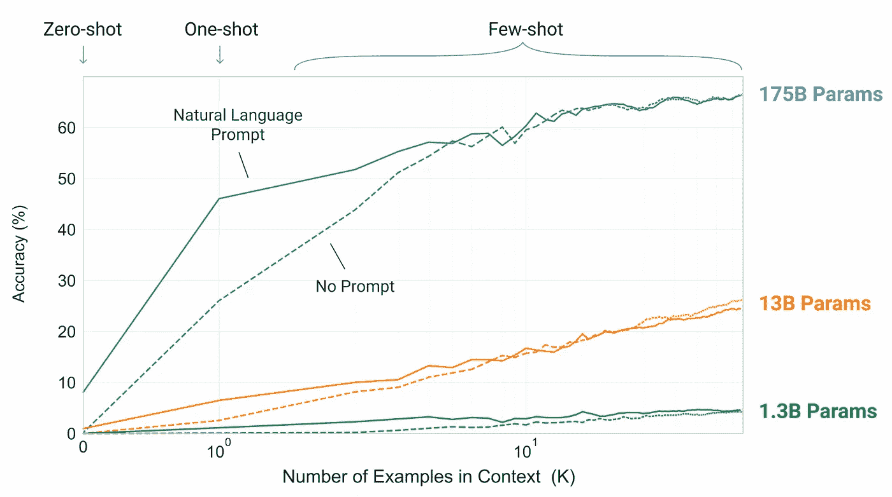
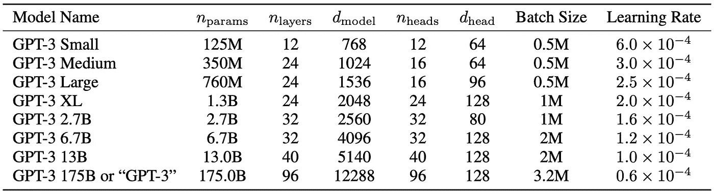
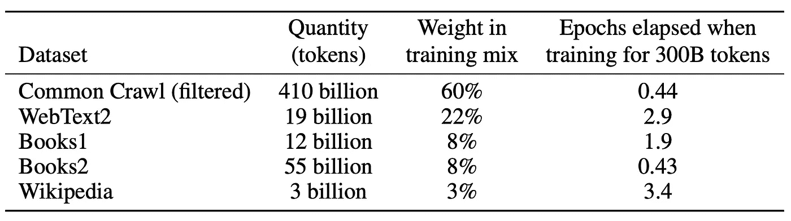
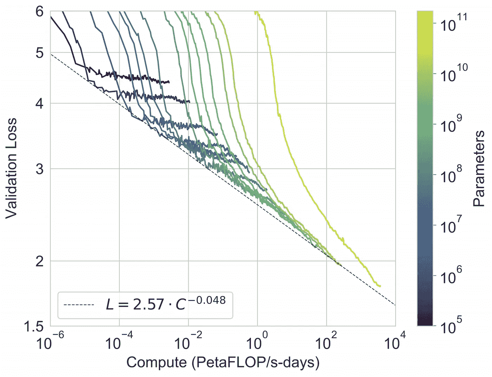
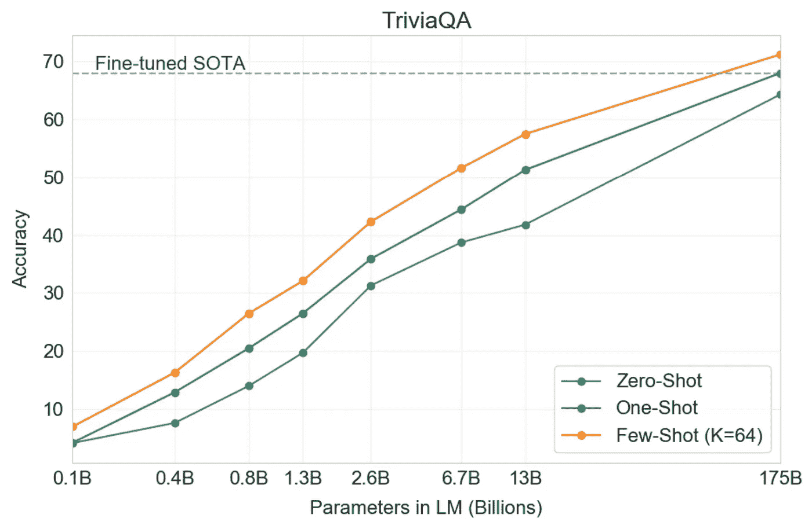
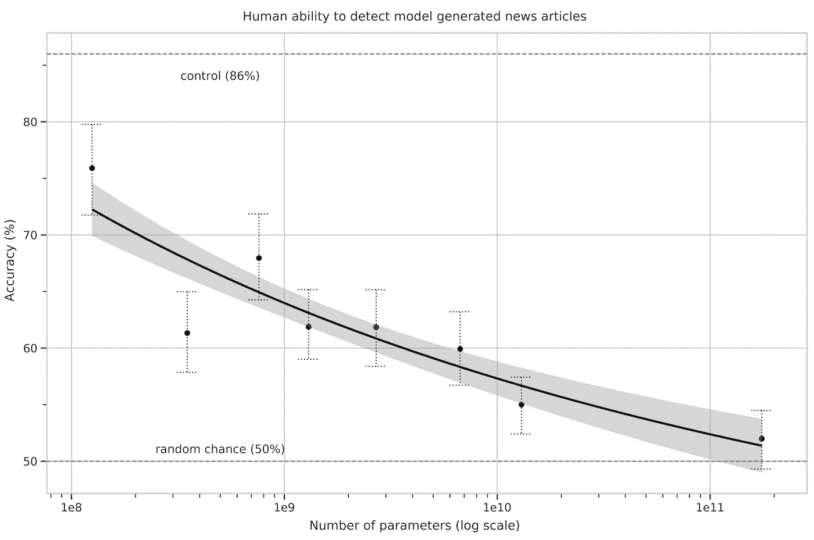

# GPT-3，深度学习和自然语言处理的一大步

> 原文：<https://towardsdatascience.com/gpt-3-for-the-people-2cdd003d9a89?source=collection_archive---------29----------------------->

## 使用大量数据训练一个足够大的语言模型就能产生智能吗？OpenAI 试图这样做，使用了 1750 亿个参数。

由 [geralt](https://pixabay.com/users/geralt-9301/) 通过 [pixabay](https://pixabay.com/illustrations/letters-school-learn-alphabet-abc-3704026/) 拍摄的照片

几天前，OpenAI 宣布了他们语言模型(LM)的新继任者——[GPT-3](https://arxiv.org/abs/2005.14165)。这是迄今为止训练的最大模型，有 1750 亿个参数。虽然训练这种大型模型有其优点，但阅读 72 页的大部分内容可能会令人厌倦。在这篇博文中，我将强调我发现熟悉 LMs 的人感兴趣的部分，他们只是想知道(大部分)这项工作的要点。

# 语言模型中有什么？

> *“模型能够在零镜头设置中执行的任务的多样性表明，被训练来最大化充分变化的文本语料库的可能性的高容量模型开始学习如何在不需要明确监督的情况下执行惊人数量的任务”*

这是 GPT-2 附带文件的摘录。GPT 3 号在这条道路上又迈出了一步。

更具体地说，作者指出了使用特定任务数据集进行微调的缺点。

*   获取这些数据集很困难。
*   微调允许模型利用伪相关性，这会导致不良的超出分布性能。
*   自然语言中的简短指令通常足以让人类理解给定的任务。这种适应性是 NLP 系统的期望属性。

作者选择的路线是“情境学习”——给模型一个任务说明(提示)和/或几个任务演示作为前缀，将其引向潜在空间中与给定任务相关的子空间。例如，翻译看起来像“问:什么是{语句} A 的{语言}翻译:{翻译}”。

这是基于这样的假设，即模型在训练时开发了一套广泛的技能和模式识别能力，然后在推理时使用这些能力来快速适应或识别所需的任务。

众所周知，低复杂度与下游任务的性能相关，因此人们可以希望更大的模型将产生更好的上下文功能。事实上，这是正确的，如下图所示，测试了一个简单的任务，要求模型从单词中删除随机符号:

较大的模型越来越有效地利用上下文信息。

上下文中示例的数量在 10 到 100 之间变化，因为这通常是模型的上下文大小 2048 所允许的。当例子数量很少时，提示(任务说明)起着重要的作用。

作者测试了许多众所周知的基准，但是首先，让我们检查一下模型规范。

# 举重

GPT-3 由类似于 GPT-2 的基于变换器的架构组成，包括其中描述的修改的初始化、预归一化和可逆令牌化，除了它在变换器的层中使用交替的密集和局部带状稀疏注意模式，类似于稀疏变换器。

作者训练了几个模型大小，从 1.25 亿个参数到 1，750 亿个参数，以便测量模型大小和基准性能之间的相关性。

# 给我看你的数据，我就给你看你的未来

作者采取了三个步骤来提高数据集的平均质量:

*   他们根据与一系列高质量参考语料库的相似性，下载并过滤了一个版本的 CommonCrawl。
*   他们执行模糊重复数据删除，以防止冗余并保持保留验证集的完整性。
*   他们将已知的高质量语料库添加到训练组合中。

用于训练 GPT-3 的数据集。

# 给我看看数字

在下图中，我们可以看到 LMs 的[幂定律](https://arxiv.org/abs/2001.08361)仍然成立:

借助计算平滑扩展性能。

为了测试预训练验证损失是否与下游任务性能相关，作者评估了已知 NLP 基准的详尽列表，方法是在上下文中输入来自训练集的 K 个示例，以评估来自测试集的示例。在这篇文章中，他们详细介绍了所有的基准，但是在这里，我只选择描述一个小例子:

## 语言建模

虽然由于训练数据中的包含而被迫跳过许多语言建模困惑相关的数据集，但 PTB 由于早于现代互联网而避开了这个问题，并且 GPT-3 设定了新的 SOTA。

## 兰巴达

在这项任务中，模型必须预测给定句子的最后一个单词。最近有人提出，在这个困难的基准上，LMs 的持续扩展正在产生收益递减。然而，GPT-3 在零射击设置方面达到了 76%的精度——比前一代 SOTA 提高了 8%。

在少数镜头设置中，任务可以被框定为完形填空任务(填空)，使模型更容易理解只需要一个单词。这产生了 86.4%的准确度。

## 闭卷问答

在这项任务中，GPT-3 优于 SOTA，后者不仅对任务进行微调，而且使用信息检索组件来检索可能包含答案的文本片段。这表明 LMs 随着能力的增加而不断吸收知识。

GPT 3 号在特里维亚卡的表现。

## 超强力胶水

GPT-3 在一些需要比较两个句子的任务中显得很弱，包括确定一个单词在两个句子中的用法是否相同，一个句子是否是另一个句子的意译，或者一个句子是否暗示另一个句子。

## 新闻文章生成

作者要求人类评估者区分人类和机器生成的新闻文章。随着模型大小的增加，尽管每篇新闻文章的时间投入增加了，参与者得到的准确度分数却降低了。这支持了较大的模型产生难以区分的新闻文章的发现。

随着模型规模的增加，人们识别新闻文章是否是模型生成的能力下降。

# 学校里有大量的记忆

从互联网规模的数据集准确检测测试污染是一个新的研究领域，没有既定的最佳实践。随着模型容量的增加，记忆的风险也会增加。总的来说，作者删除了与测试集重叠的文档。然而，由于一个 bug，这个过程有了剩余。他们试图评估损失，看起来这个模型不会记忆，而且(大部分)结果是有效的。

(我自己的注意:也许是时候在整个 ML 领域进行更严格的测试了，就像其他领域的惯例一样。)

# 限制

虽然 GPT-3 在质量上比它的前身更好，但它的文本合成能力仍然存在我们从其他 LMs 中熟悉的弱点，例如重复，足够长的段落中的连贯损失和矛盾。

此外，GPT 3 号在一些任务中惨败。这可能是由于选择使用自回归 LM，而不是合并双向信息(类似于 Bert)。虽然自回归 LMs 的上下文学习更简单，但双向模型在微调后更擅长下游任务。最后，在 GPT-3 的规模上训练一个双向模型，和/或试图使双向模型与少量学习一起工作，是未来研究的一个有希望的方向。

一个更基本的限制是，自回归(和双向)模型可能最终会遇到(或可能已经遇到)预训练目标的限制。让任务变得更好，例如，理解什么是最重要的预测(如实体)，可能对模型有益。将模型建立在其他领域的经验，如视频或现实世界的物理交互，也可能会移动指针。

预训练任务不是最佳的一个证据是样本效率:GPT-3 在预训练期间看到的文本比一个人一生中看到的文本多得多。提高训练前样本效率是未来工作的一个重要方向，可能来自于物理世界的基础以提供额外的信息，或者来自于算法的改进。

此外，对于自我监督的目标，任务规范依赖于将期望的任务强制转化为预测问题，而最终，有用的语言系统(例如虚拟助手)可能更好地被认为是采取目标导向的行动，而不仅仅是进行预测。

另一个限制，或者至少是不确定性，与 GPT-3 中的少镜头学习相关联，是不明确的，即少镜头学习是否实际上在推理时“从零开始”学习新任务，或者它是否只是识别和确定它在训练中学习的任务。

最后但同样重要的是，模型的大小带来了实际的不便。蒸馏是一个有趣的方向，还没有在这个规模上尝试过。

*这个帖子最初是我在 anotherdatum.com***发的。**