# GPT-3:只是另一个语言模型，但是更大

> 原文：<https://towardsdatascience.com/gpt-3-just-another-language-model-but-bigger-1add6e9277fa?source=collection_archive---------35----------------------->

## 理解 GPT-3 研究论文

GPT-3 在很短的时间内接管了 NLP 世界。证明了增加参数个数会提高模型精度的理论。

Sam Altman 的推文，公共领域


由作者在 [befunky](https://www.befunky.com/create/designer/) 上创建

# 什么是语言模型？

[语言模型](https://en.wikipedia.org/wiki/Language_model)试图预测给定 m 个单词的下一个单词。它将概率分配给下一个单词，使句子更有可能。

# 什么是 GPT-3？

它是 GPT-2 语言模型的继承者，具有最多的待训练参数。OpenAI 创建了 GPT-3 模型，它证明了语言模型的大小与准确度成正比，因此，我们越增加模型的大小，准确度越高。

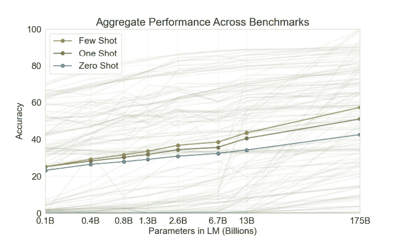

参考: [GPT-3 研究论文](https://arxiv.org/pdf/2005.14165.pdf)，公共领域

正如我们从图表中看到的，语言模型数量的增加成比例地提高了准确性。因此，可以通过向模型添加更多的参数来获得更高的精度。

[GPT-3](https://arxiv.org/pdf/2005.14165.pdf) 是目前最大的语言模型，拥有 1750 亿个参数，比拥有 170 亿个参数的图灵-NLG 模型大 10 倍。

在这个博客中，我们将浏览 [GPT-3](https://arxiv.org/pdf/2005.14165.pdf) 的研究论文，并推断为什么它只是另一种语言模型，为什么它不能被称为可以模仿任何水平的人类的模型。这是目前最好的语言模型，但不是能够理解和学习人类语言的模型。

# 测试模型的设置:

*   **少镜头(FS)** 指的是很少的例子与任务描述一起给出给模型。因此，不是为特定任务提供完整的数据集，而是给模型提供描述以及一些 k 示例，然后向模型提出问题。k 示例在 10 到 100 的范围内，并且不允许模型基于该示例进行任何权重改变。优点是该模型不需要大的数据集来学习特定的任务，但是精度仍然不能与最新的任务特定模型相比。

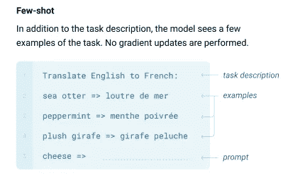

少数镜头设置示例|参考: [GPT-3 研究论文](https://arxiv.org/pdf/2005.14165.pdf)，公共领域

*   **单镜头(OS)** 类似于 k 等于 1 的少镜头。所以模型只需要理解基于一个例子的任务。这种学习方式类似于人类的学习方式。这一次也不允许模特改变体重。

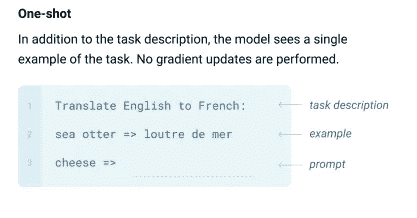

一次性设置示例|参考: [GPT-3 研究论文](https://arxiv.org/pdf/2005.14165.pdf)，公共领域

*   **零拍(ZS)**k 值为零。没有向模型提供示例。模型需要从任务描述中理解模型需要做什么。

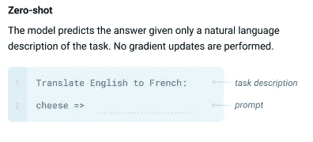

零射击设置示例|参考: [GPT-3 研究论文](https://arxiv.org/pdf/2005.14165.pdf)，公共领域

该模型的准确性与最新的任务特定模型(也称为微调模型)进行了比较。这种模型的缺点是他们需要庞大的特定任务数据集来进行训练。这种类型的模型是特定于任务的，在其他任务上表现不佳。

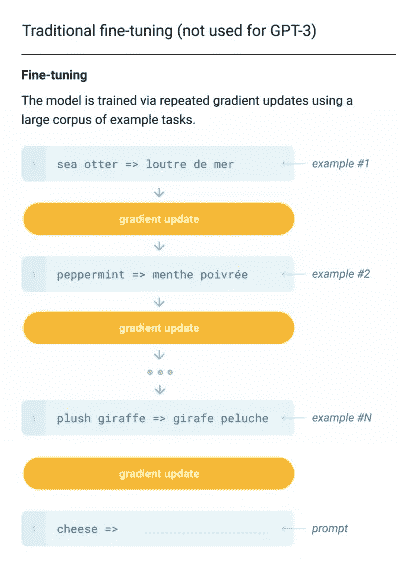

微调模型|参考: [GPT-3 研究论文](https://arxiv.org/pdf/2005.14165.pdf)，公共领域

# 训练数据集

GPT 3 号使用的数据集非常庞大，几乎包含了互联网上的所有内容。对训练数据集进行了模糊搜索，以删除与测试和验证数据集相关的任何内容，这将有助于提供更准确的结果。他们通过合并各种数据集和爬行创建了这个数据集。

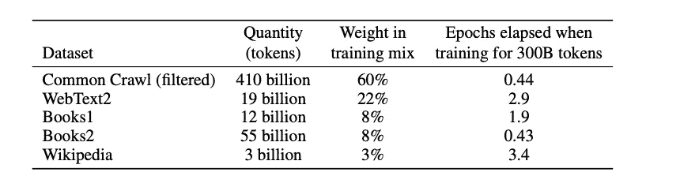

GPT-3 使用的数据集|参考: [GPT-3 研究论文](https://arxiv.org/pdf/2005.14165.pdf)，公共领域

# 培训过程

他们使用梯度噪声标度来找出要使用的正确批量。架构与 GPT-2 相似，但稍有改动。

# 结果

在各种自然语言任务和各种数据集上评估了 GPT-3。

## 语言建模、完形填空和完成任务

## [λ](https://arxiv.org/pdf/1606.06031.pdf)数据集

```
Context: “Yes, I thought I was going to lose the baby.” “I was scared too,” he stated, sincerity flooding his eyes. “You were ?” “Yes, of course. Why do you even ask?” “This baby wasn’t exactly planned for.” Target sentence: “Do you honestly think that I would want you to have a _______ ?” Target word: miscarriage
```

在这个[数据集](https://arxiv.org/pdf/1606.06031.pdf)中，上下文被给出，然后句子被给出给模型，空白需要由模型完成。单词的选择应该基于给定的上下文，而不是过去的知识模型。这个数据集证明了模型能够理解上下文，并在此基础上提供答案。

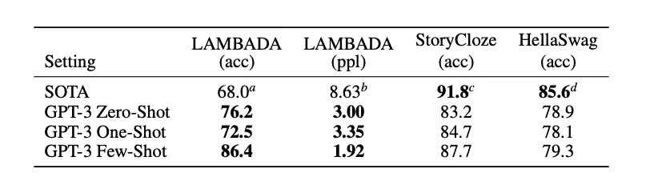

GPT-3 在兰巴达数据集上的准确性|参考: [GPT-3 研究论文](https://arxiv.org/pdf/2005.14165.pdf)，公共领域

正如我们所看到的，在这个数据集上，GPT-3 的所有设置都超过了 SOTA 的精度。GPT-3 的单发精度低于零发精度。我们可以暗示，GPT-3 用任何一个例子都比用一个例子预测得更准确。*GPT-3 可能通过训练集获得了数据集的知识，并且在少击方法中，模型可以更准确地知道使用哪个权重。因为当你在谷歌上搜索* `*Yes, of course. Why do you even ask?"This baby wasn't planned for.”*` *的时候，你可以找到各种链接来回答这个问题。*

## [HellaSwag](https://arxiv.org/pdf/1905.07830.pdf) 数据集

```
A woman is outside with a bucket and a dog. The dog is running around trying to avoid a bath. She … A. rinses the bucket off with soap and blow dry the dog’s head. 
B. uses a hose to keep it from getting soapy. 
C. gets the dog wet, then it runs away again. 
D. gets into a bath tub with the dog.
```

这些是选择题，其中模型需要选择最合适的选项。该数据集用于测试模型的常识。GPT-3 FS 达到了 79.3%的精度，比 SOTA 低 6%，后者是经过微调的多任务模型。

## [故事完形填空](https://www.cs.rochester.edu/~nasrinm/files/Papers/lsdsem17-shared-task.pdf)数据集

```
**Context**: Sammy’s coffee grinder was broken. He needed something to crush up his coffee beans. He put his coffee beans in a plastic bag. He tried crushing them with a hammer. **Right Ending**: It worked for Sammy. **Wrong Ending**: Sammy was not that much into coffee.
```

这些数据集也用于常识测试。在这种情况下，模型被赋予上下文，并且模型必须从提供的两个选项中预测正确的结局。GPT-3 FS 已达到 87.7%的精度，远低于 SOTA，但在 GPT-3 ZS 显示了 10%的巨大改进。

## 闭卷问答

开卷问答应用于搜索引擎中，搜索引擎可以搜索相关信息并从中提取答案。在`closed book`中，不允许模型进行搜索，也没有提供任何上下文或摘录来了解模型实际上在询问什么。

[**TriviaQA**](https://homes.cs.washington.edu/~eunsol/papers/acl17jcwz.pdf)

这个数据集是基于事实的，也就是说答案是事实，而不是依赖于任何上下文。因此，我们可以说，这个数据集测试了模型的记忆，因为 GPT-3 也是在维基百科文本上训练的。

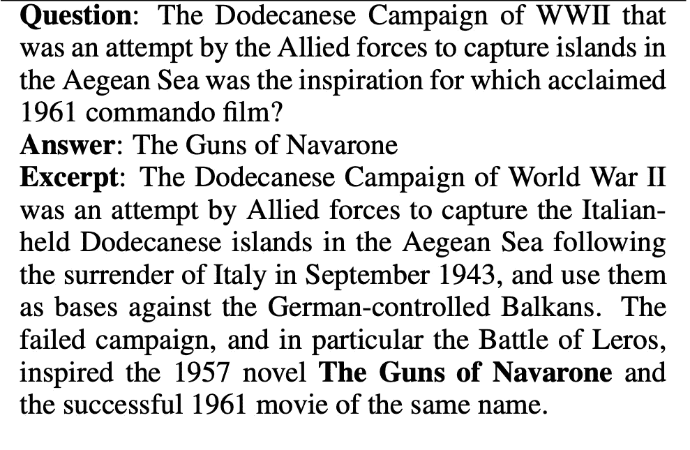

TriviaQA 示例|参考: [TriviaQA 研究论文](https://homes.cs.washington.edu/~eunsol/papers/acl17jcwz.pdf)，公共领域

模型被提问，并期望得到基于事实的答案。摘录仅供我们参考，不提供给模型。也允许多个答案，例如，如果答案是姓名比尔盖茨，答案可以是比尔，盖茨，比尔盖茨，微软创始人比尔盖茨。

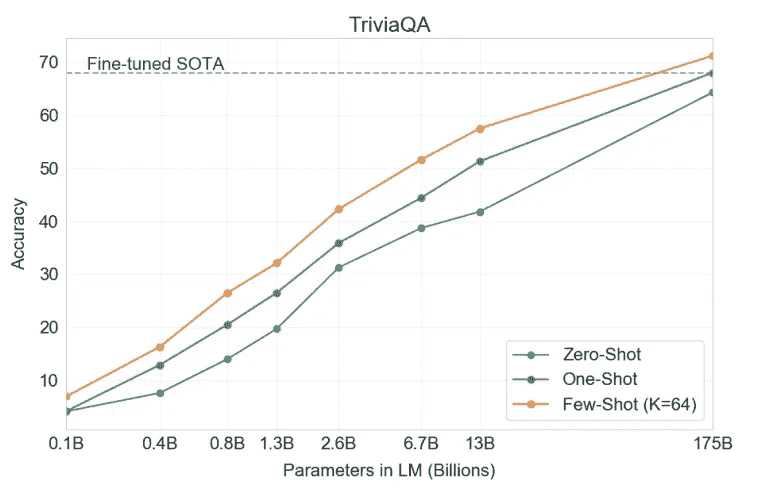

TriviaQA 准确性|参考: [GPT-3 研究论文](https://arxiv.org/pdf/2005.14165.pdf)，公共领域

我们可以看到，GPT-3 已经超过了微调开放图书 SOTA。因此，我们可以说，GPT-3 是更有效的信息检索引擎的事实。

[**WebQuestions**](https://arxiv.org/pdf/1607.06275.pdf)**(WebQA)**

这个数据集类似于 TriviaQA，但是这个数据集是由真实世界中的真实用户提出的真实世界的问题组成的。因此，它在真实世界场景中测试模型。

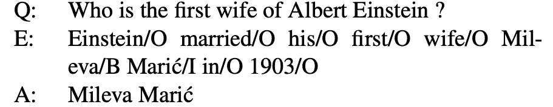

WebQA 实例|参考: [WebQA 研究论文](https://arxiv.org/pdf/1607.06275.pdf)，公共领域

GPT-3 FS 与微调过的 SOTA 型号具有相似的精度。

[**自然题**](https://storage.googleapis.com/pub-tools-public-publication-data/pdf/1f7b46b5378d757553d3e92ead36bda2e4254244.pdf) **(NQs)**

该数据集由 Google 提供，用于在现实世界中测试问答模型。所有的问题都是用户在谷歌搜索上搜索出来的。在模型中，试图从维基百科页面中预测可能包含问题答案的段落。模型还预测了这个问题的精确答案。但是短答案必须出现在所选段落中，也称为长答案。

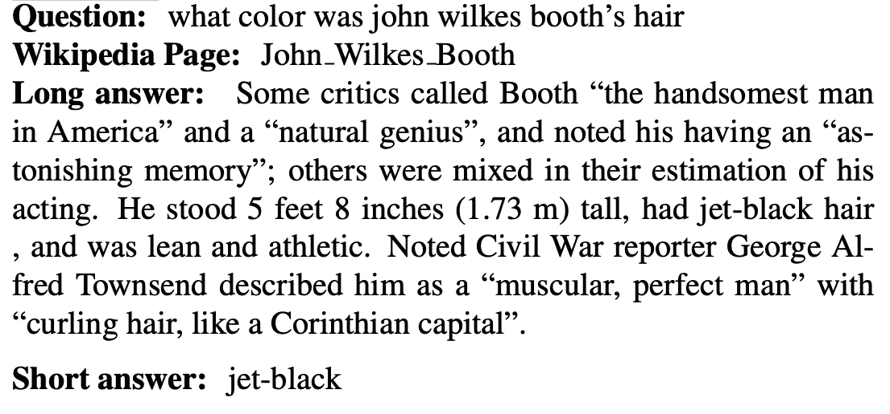

自然题例|参考: [NQs 研究论文](https://storage.googleapis.com/pub-tools-public-publication-data/pdf/1f7b46b5378d757553d3e92ead36bda2e4254244.pdf)，公共领域

GPT-3 FS 设置的精度比[微调过的](http://web.stanford.edu/class/archive/cs/cs224n/cs224n.1194/reports/custom/15791880.pdf) SOTA 低 29.9%。这个数据集测试了模型保留维基百科信息的极限。

> 通过这种测试，我们可以说，模型越大，可以保留的信息就越多，因此准确度就越高。

## 翻译

GPT-3 在语言翻译方面的准确性令人惊讶。因为训练集的 93%的单词是英语。所以，这个模型会更偏向于英语而不是其他语言。GPT-3 是 GPT-2 的升级版，测试了除英语之外的法语、德语和罗马尼亚语的机器翻译。

机器翻译任务的模型效率是用 [BLEU](https://en.wikipedia.org/wiki/BLEU) 来衡量的，而不是准确性。我们改天会调查它。

[BLEU](https://www.aclweb.org/anthology/P02-1040.pdf) 在 6 个语言对上计算:

1.  英语到法语(英语→法语)
2.  法语到英语(法语→英语)
3.  英语到德语(英语→德语)
4.  德语到英语(德→恩)
5.  英语到罗马尼亚语(En→Ro)
6.  罗马尼亚语到英语(Ro→En)

训练数据集具有大约 92.5%的英语单词、1.8%的法语单词、1.5%的德语单词和 0.16%的罗马尼亚语单词。

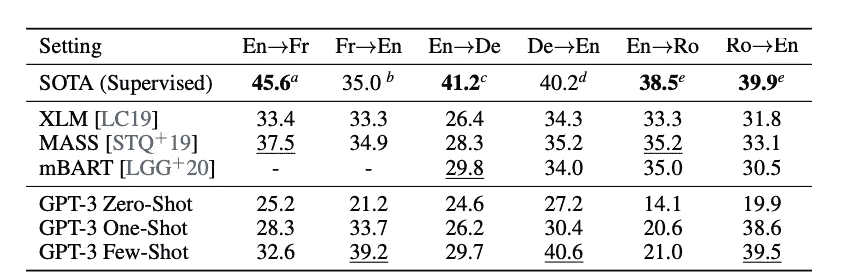

6 种语言对的 BLEU 评分|参考: [GPT-3 研究论文](https://arxiv.org/pdf/2005.14165.pdf)，公共领域

我们可以看到，在将任何文本翻译成英语时，GPT-3 模型几乎比 SOTA 模型更好。

**零拍示例:**

```
Q: What is the {language} translation of {sentence} A: {translation}.
```

正如我们所看到的，只有描述文本与句子和目标语言一起被提供给模型。

**单镜头和少镜头示例:**

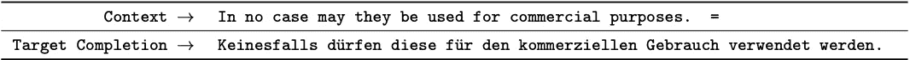

一次性和少量学习的格式|参考: [GPT-3 研究论文](https://arxiv.org/pdf/2005.14165.pdf)，公共领域

对于少数镜头，在提问之前，给模型提供了大约 64 个例子。

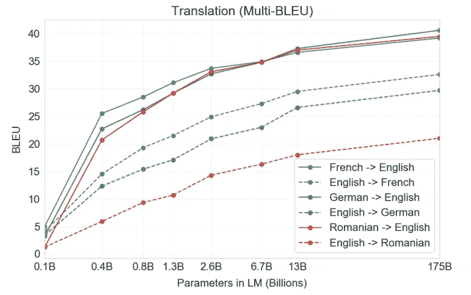

少数镜头 BLEU 评分|参考: [GPT-3 研究论文](https://arxiv.org/pdf/2005.14165.pdf)，公共领域

正如我们可以看到的，随着数据的增加，模型的 BLEU 分数增加。英语->法语的分数大于英语->德语，德语大于英语->罗马尼亚语，并且与数据集中每种语言的单词百分比成比例。

## Winograd 风格的任务

这类任务包括确定句子中使用的代词是什么样的。这个代词对计算机来说是模糊的，但对人类来说却是明确的。部分评估方法用于评估，您可以在此处阅读[。](https://arxiv.org/pdf/1811.01778.pdf)

```
"**sentence**": "The city councilmen refused the demonstrators a permit because [they] feared violence.", "**answer1**": "The demonstrators"
"**answer0**": "The city councilmen""**sentence_switched**": "The demonstrators refused the city councilmen a permit because [they] feared violence."
```

句子的答案必须是`answer1`，但是一旦我们转换句子，答案也应该变成`answer0`

[**威诺格拉**](https://aaai.org/ocs/index.php/KR/KR12/paper/view/4492) **数据集**

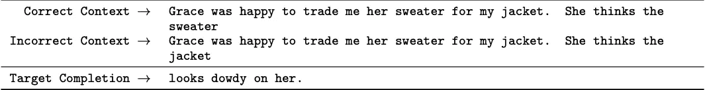

Winograd 示例|参考: [GPT-3 研究论文](https://arxiv.org/pdf/2005.14165.pdf)，公共领域

GPT 3 号在这个数据集上的表现低于 SOTA。在训练数据集中也发现了一些测试集的例子。

[**wino grande**](https://arxiv.org/pdf/1907.10641.pdf)**数据集**

该数据集类似于 winograde 数据集，但更高级、更困难。

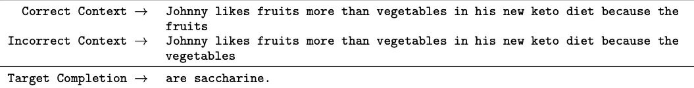

Winogrande 数据集|参考: [GPT-3 研究论文](https://arxiv.org/pdf/2005.14165.pdf)，公共领域

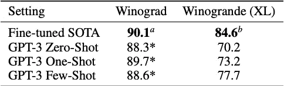

GPT-3 在 Winograde 式任务上的准确性|参考: [GPT-3 研究论文](https://arxiv.org/pdf/2005.14165.pdf)，公共领域

## 常识推理

该测试旨在测试模型如何将常识应用到现实世界的问题中。例如，如果我们问人类几点了？人类会回应当前时间，如下午 5:30，而不是解释时间的概念。我们用常识来检验这个模型是否能回答这样的问题。以前的所有任务大多依赖于数据和概率，而不是模型实际理解内部概念的程度。在这里，我们测试模型理解人类语言的程度。

[**PhysicalQA**](https://arxiv.org/pdf/1911.11641.pdf) **数据集**

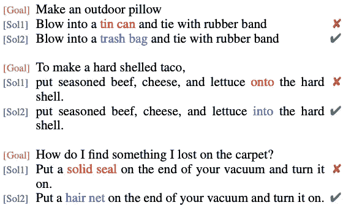

PIQA 范例|参考: [PhysicalQA 研究论文](https://arxiv.org/pdf/1911.11641.pdf)，公共领域

对于所有类型的调优，GPT-3 在这个数据集上以很小的优势击败了 SOTA。但是由于可能的数据污染，对这一结果的信心不大。

> 我们的分析将 PIQA 标记为潜在的数据污染问题(尽管隐藏了测试标签)，因此我们保守地用星号标记结果。

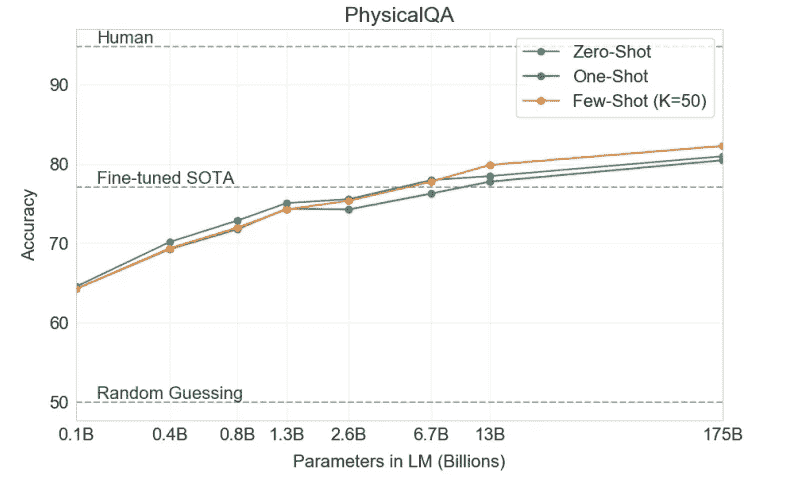

GPT-3 在 PIQA 数据集上的表现|参考: [GPT-3 研究论文](https://arxiv.org/pdf/2005.14165.pdf)，公共领域

[**AI2 推理挑战数据集(ARC)**](https://arxiv.org/pdf/1803.05457.pdf)

该数据集由 3 至 9 年级的多项选择题组成。数据集分为几个部分:1 .简易版 2。挑战版。挑战集由基于检索的算法错误回答的问题组成。

GPT-3 在这个数据集上的性能远远低于由 UnifiedQA 实现的 SOTA。

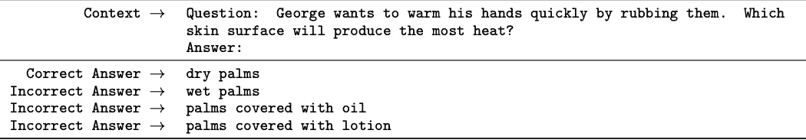

ARC 挑战集示例|参考: [GPT-3 研究论文](https://arxiv.org/pdf/2005.14165.pdf)，公共领域

[**OpenBookQA**](https://arxiv.org/pdf/1809.02789.pdf)**数据集**

这个数据集类似于开卷测试，问题的答案是事实和常识的结合。

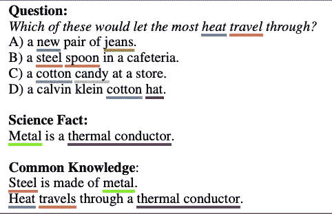

OpenBookQA 实例|参考: [OpenBookQA 研究论文](https://arxiv.org/pdf/1809.02789.pdf)，公共领域

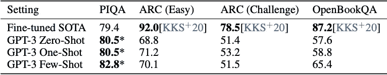

GPT-3 常识推理任务中的准确性|参考: [GPT-3 研究论文](https://arxiv.org/pdf/2005.14165.pdf)，公共领域

由于 GPT-3 是在互联网上出现的所有文本上训练的，所以回答 GPT-3 是否应用常识来回答这个问题是一个好问题，而不仅仅是检索训练数据集中某处可用的信息。

## 阅读理解

在这里，我们测试模型理解文章和根据文章中提供的信息回答问题的能力。

[**CoQA 数据集**](https://stanfordnlp.github.io/coqa/)

在这个数据集中，提供了段落，所提的问题基于人类之间的对话。

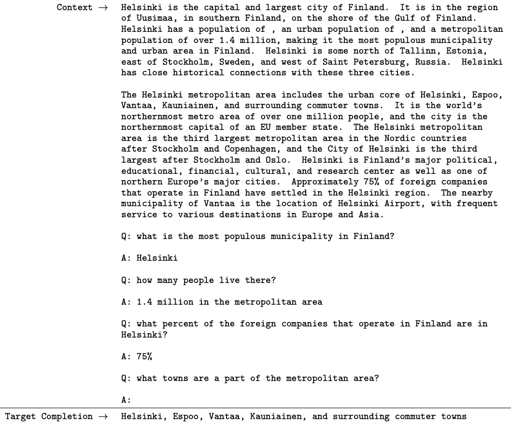

少量调整的 CoQA 示例|参考: [GPT-3 研究论文](https://arxiv.org/pdf/2005.14165.pdf)，公共领域

[**QuAC 数据集**](https://quac.ai/)

这个数据集非常有趣，因为学生并没有看到文章，而是问了一些问题，这些问题由老师来回答。学生问基本问题，教师回答一些额外的上下文，学生再问另一个问题。如果老师不能回答太多的问题，或者如果学生没有问任何相关的问题，互动就结束了。

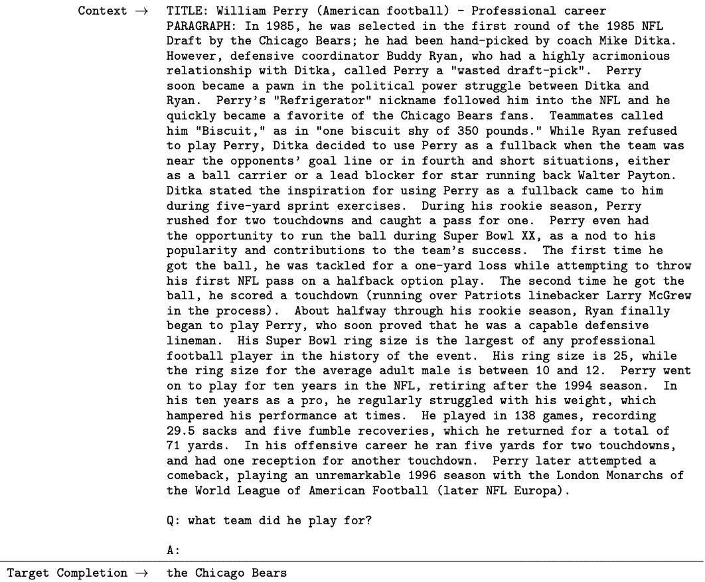

QuAC 数据集示例|参考: [GPT-3 研究论文](https://arxiv.org/pdf/2005.14165.pdf)，公共领域

[删除数据集](https://allennlp.org/drop)

在此数据集中，模型必须解析问题中的引用，可能是对多个输入位置的引用，并对它们执行离散操作，如加法、计数或排序。

```
**Passage**: Although the movement initially gathered some 60,000    adherents, the subsequent establishment of the Bulgarian Exarchate reduced their number by some 75%.**Question**: How many adherents were left after the establishment of the Bulgarian Exarchate?**Correct Answer**: 15,000
```

正如我们在这里看到的，模型需要理解文章和问题，以便正确地回答它，它还应该对它执行一些操作，而不仅仅是检索信息。

[**小队 2.0 数据集**](https://rajpurkar.github.io/SQuAD-explorer/)

除了在文章中有答案的问题，在文章中没有答案的问题也被提出。对于文章中没有答案的问题，该模型不会给出答案。

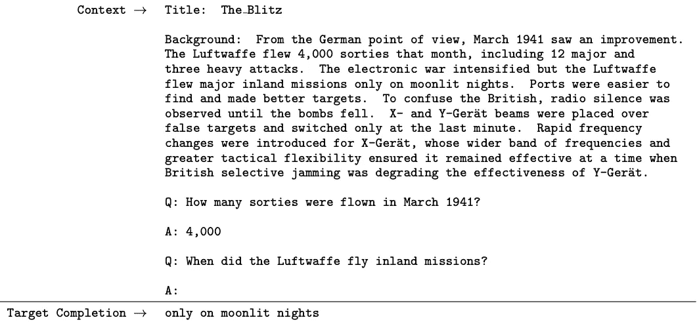

SQuAD 2.0 示例|参考: [GPT-3 研究论文](https://arxiv.org/pdf/2005.14165.pdf)，公共领域

[**种族数据集**](https://www.aclweb.org/anthology/D17-1082/)

这个数据集由 12 到 18 岁的中国学生参加的初中和高中英语考试的短文组成，旨在评估学生的推理能力。数据集分为两部分:1 .RACE-m 数据集由中学 2 的段落组成。RACE-h 数据集由高中的段落组成。

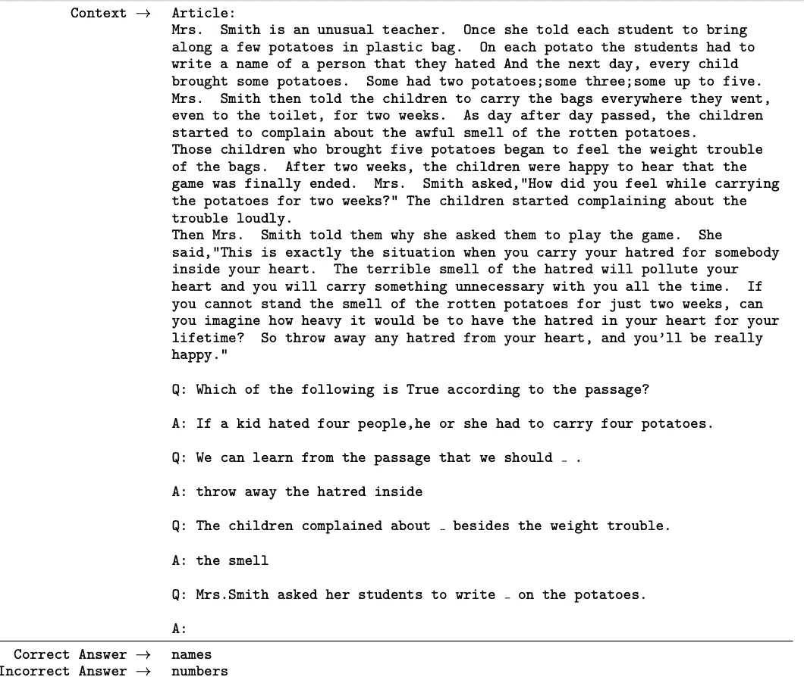

RACE-m 示例|参考: [GPT-3 研究论文](https://arxiv.org/pdf/2005.14165.pdf)，公共领域

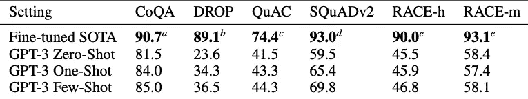

GPT-3 对阅读理解的准确性|参考: [GPT-3 研究论文](https://arxiv.org/pdf/2005.14165.pdf)，公共领域

## [强力胶水](https://super.gluebenchmark.com/)

它可以被认为是所有能够执行多种语言建模任务的 NLP 模型的标准化测试。它根据模型在不同任务中的表现给出单一结果。由于结果是单一值，因此很容易在相同的规模上比较不同的模型。

该基准测试包括以下任务:

1.  问题回答
2.  自然语言推理(NLI)
3.  [共指消解(coref。)](https://demo.allennlp.org/coreference-resolution)
4.  [词义消歧(WSD)](http://www.scholarpedia.org/article/Word_sense_disambiguation)

使用的数据集:

1.  [BoolQ](https://arxiv.org/abs/1905.10044)
2.  [承诺银行](https://github.com/mcdm/CommitmentBank)
3.  科帕
4.  [MultiRC](https://github.com/CogComp/multirc)
5.  [记录](https://sheng-z.github.io/ReCoRD-explorer/)
6.  [RTE](https://aclweb.org/aclwiki/Textual_Entailment_Resource_Pool) (使用 RTE1、RTE2、RTE3 和 RTE5)
7.  [WiC](https://pilehvar.github.io/wic/)
8.  [WSC](https://aaai.org/ocs/index.php/KR/KR12/paper/view/4492)

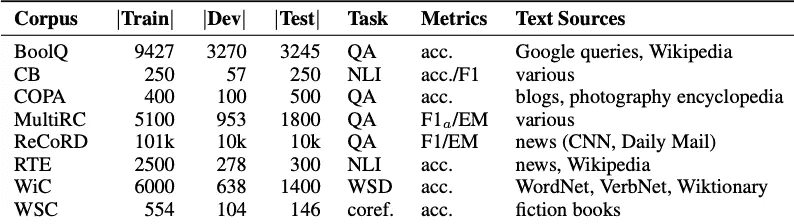

强力胶基准|参考:[强力胶研究论文](https://super.gluebenchmark.com/)，公共领域

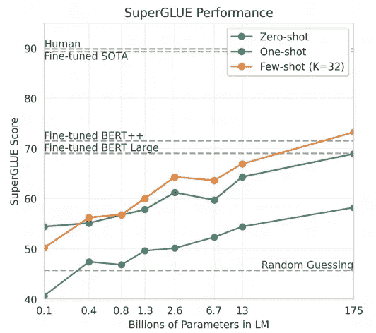

GPT-3 在强力胶上的表现|参考: [GPT-3 研究论文](https://arxiv.org/pdf/2005.14165.pdf)，公共领域

对于 GPT-3，在上下文中使用了 32 个例子。

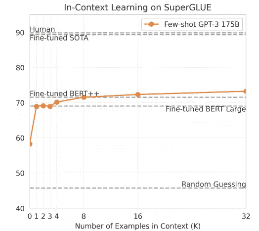

GPT-3 FS 强力胶基准测试示例|参考: [GPT-3 研究论文](https://arxiv.org/pdf/2005.14165.pdf)，公共领域

正如我们可以看到更多的例子，GPT-3 的准确性增加，但在非常小的数量。当在上下文中给出 8 个例子时，GPT-3 FS 超过了微调的 BERT-Large。

## 自然语言推理(NLI)

在这种类型的任务中，模型决定两个句子之间的关系。这是一个分类问题，模型将第二个句子分为三类:1。支持第一句 2。与第一句相矛盾。中立的

RTE 数据集用于在 NLI 任务上测试模型。与 RTE 一起，更难对抗的 NLI (ANLI)被用于测试 GPT-3 模型。在[安立](https://adversarialnli.com/#) GPT-3 的表现略好于随机机遇，但远低于 SOTA。

[安力](https://arxiv.org/pdf/1910.14599.pdf)根据难度分为三组:第一轮、第二轮、第三轮。

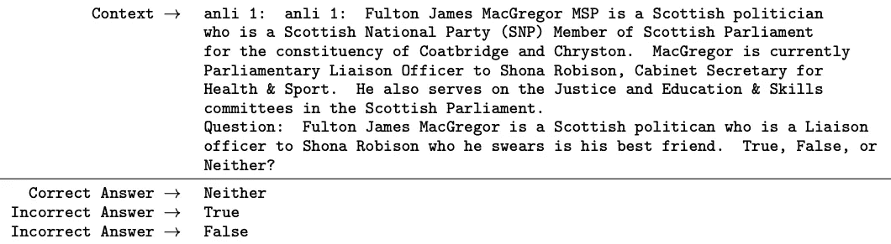

安理 R1 举例|参考: [GPT-3 研究论文](https://arxiv.org/pdf/2005.14165.pdf)，公共领域

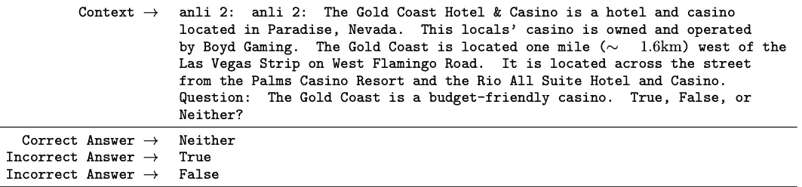

安理 R2 举例|参考: [GPT-3 研究论文](https://arxiv.org/pdf/2005.14165.pdf)，公共领域

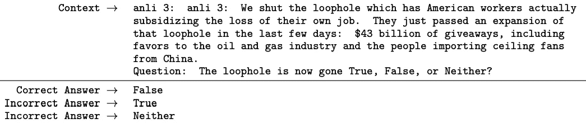

安立 R3 举例|参考: [GPT-3 研究论文](https://arxiv.org/pdf/2005.14165.pdf)，公共领域

# 综合和定性任务

在这项测试中，GPT-3 执行各种综合任务，如算术运算，重新排列和解读单词中的字母，解决 SAT 式的类比问题，在句子中使用新单词，纠正英语语法，以及生成新闻文章。

## 算术

在这个测试中，GPT-3 执行算术运算的能力得到了检验。各种算术运算，如加法，减法和乘法测试。

算术问题包括以下类型:

1.  两位数加法(2D+)
2.  两位数减法(2D-)
3.  3 位数加法(3D+)
4.  3 位数减法(3D-)
5.  4 位数加法(4D+)
6.  4 位数减法(4D-)
7.  5 位数加法(5D+)
8.  5 位数减法(5D-)
9.  两位数乘法(2Dx)
10.  一位数复合(1DC)

与其他类型的设置相比，该模型在少拍设置中表现更好。而且，随着位数的增加，精度会大大降低。GPT-3 在这一系列上比小型号有了巨大的飞跃。

```
Examples of the questions asked to GPT-3:Q: What is 17 minus 14?
Q: What is (2 * 4) * 6?
Q: What is 95 times 45?
Q: What is 98 plus 45?
```

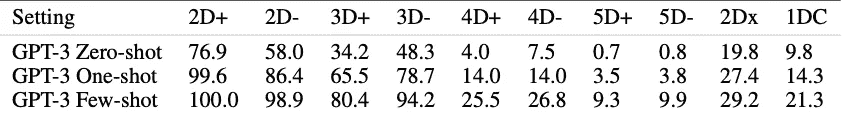

GPT-3 关于算术运算的准确性|参考: [GPT-3 研究论文](https://arxiv.org/pdf/2005.14165.pdf)，公共领域

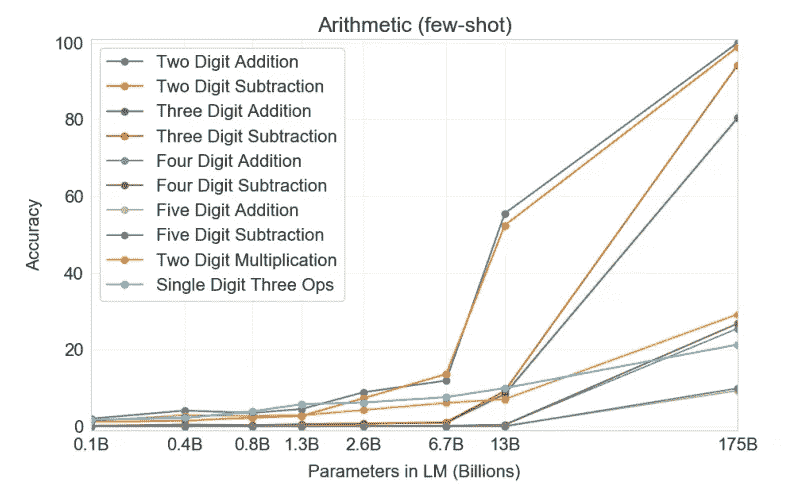

GPT-3 FS 结果|参考:GPT-3 研究论文

随着数字的增加，模型的精度呈指数下降。和复合方程等复杂运算越多，模型性能越差。

*该模型可能已经记住了较小的数字算术运算，因为它们在互联网上比大数字更常见。在训练集中搜索“< NUM1 > + < NUM2 > =”和“< NUM1 > - < NUM2 > =”，对于测试用例只找到 0.8%和 0.1%的匹配。但是，训练集可能具有“四十二+二十三等于六十五”或“四十二加二十三等于六十五”类型的等式，并且模型可能已经将整数和运算映射到该串。*

根据错误的结果检查该模型，发现当操作包括进位时，该模型工作不正确。

## 单词打乱和操作任务

在这种情况下，对单词进行各种操作，并将其作为模型的输入。模型需要预测原始单词。

该任务包括 5 种类型的任务:

1.  **循环单词(CL)** 中的字母——循环单词的字母，并要求模型找到原始单词。

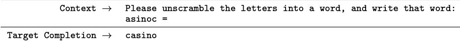

循环信函示例|参考: [GPT-3 研究论文](https://arxiv.org/pdf/2005.14165.pdf)，公共领域

2.**除第一个和最后一个字符之外的所有字符的变位词(A1)** —除了第一个和最后一个字母之外，单词的所有字母都被打乱。模型需要输出原始单词。

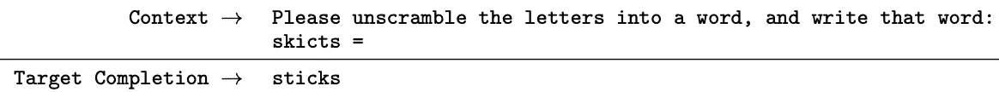

A1 字谜示例|参考: [GPT-3 研究论文](https://arxiv.org/pdf/2005.14165.pdf)，公共领域

3.**除了前两个和后两个字符之外的所有字符的变位词(A2)** —除了前两个和后两个字母之外，单词的所有字母都被打乱。该模型需要输出原始单词。

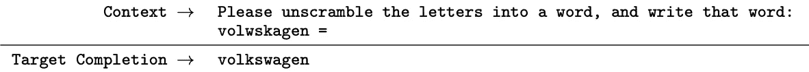

A2 字谜示例|参考: [GPT-3 研究论文](https://arxiv.org/pdf/2005.14165.pdf)，公共领域

4.**单词中的随机插入(R1)** —在字母之间插入随机标点或空格，模型需要预测原始单词。

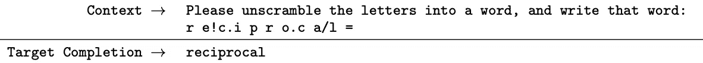

随机插入(R1)示例|参考: [GPT-3 研究论文](https://arxiv.org/pdf/2005.14165.pdf)，公共领域

5.**反向单词(RW)** —单词反向拼写，模型需要预测原始单词。

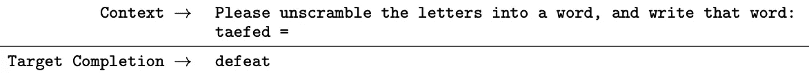

反向单词(RW)示例|参考: [GPT-3 研究论文](https://arxiv.org/pdf/2005.14165.pdf)，公共领域

该模型在零触发设置中表现不佳，在单触发设置中表现一般。该模型给出了 100 个少镜头设置的例子，表现相当好。

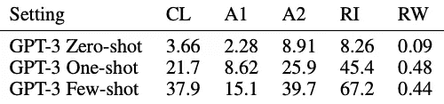

解读任务的准确性|参考: [GPT-3 研究论文](https://arxiv.org/pdf/2005.14165.pdf)，公共领域

## [SAT 类比](https://arxiv.org/pdf/cs/0309035.pdf)

在这种情况下，模型需要回答基于类比的问题。这道题是高考 SAT 中问的。随机猜测的准确率是 20%，而大学生的平均分是 57%。GPT-3 少数几次设置实现了 65.2%的准确性，一次设置实现了 59.1%的准确性，远高于学生的平均水平。零炮设置的准确率为 53.7%。对于少拍设置，给出的示例数量为 20 个。

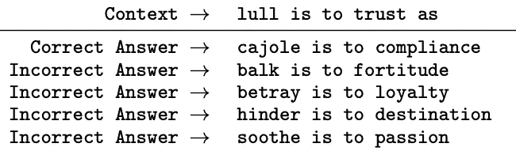

SAT 类比示例|参考: [GPT-3 研究论文](https://arxiv.org/pdf/2005.14165.pdf)，公共领域

## 新闻文章生成

在这个模型中，提供了标题和副标题，它需要用它们来写一篇 200 字左右的文章。该模型只在少数镜头设置上进行了测试，因为模型无法理解它是否需要写一篇文章或需要作为后续推文进行响应。

将 GPT-3 的性能与故意制造次品的控制模型进行了比较。人被用来区分物品是人做的还是模型做的。人类以 86%的准确度准确地检测到文章是由控制模型生成的。但是随着模型大小的增加，人类能够以 52%的准确度检测到文章是由模型生成的。

被该模型检测到的大多数文章包含错误的事实信息，或者有重复的句子和不寻常的措辞。

该模型也在具有 500 个单词的文章上进行测试，但是人类仍然只能区分 52%的人类文章。


由 GPT-3 生成的文章被检测到只有 12%的准确性|参考: [GPT-3 研究论文](https://arxiv.org/pdf/2005.14165.pdf)，公共领域

当你用谷歌搜索上述文章中的任何一句话时，你会找到一些有着相似句子的不同主题的文章。很有可能，GPT-3 在整个互联网上接受的训练可能只是用不到 500 个字总结了相关主题的所有文章。而不是生成文章，它可能只是合并不同文章的各种句子，从而使文章类似于人类。如果我们提供非常独特的标题，我们将知道 GPT-3 是否能生成文章。

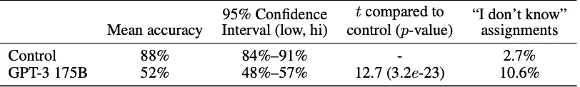

人类检测文章 500 字的准确率是人类写的还是模型写的|参考: [GPT-3 研究论文](https://arxiv.org/pdf/2005.14165.pdf)，公共领域

## 学习和使用新单词

在这种情况下，测试模型在定义单词一次后是否可以在句子中使用该单词。

因此，为了测试这个任务的模型，单词定义被给定一次，所以一次性设置，但是提供了每个单词定义的例子，因此，关于任务描述的少量设置。

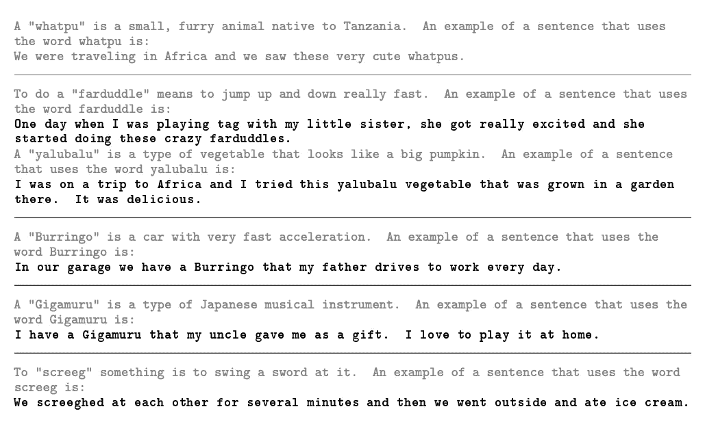

GPT 新协议中定义和使用新词的示例|参考:GPT 新协议研究论文

这些单词是人类造的，因此，模特事先对此一无所知。我们可以看到模型使用定义的单词生成了所有符合逻辑的句子。

## 纠正英语语法

测试该模型是否能够预测错误的语法并能够用正确的语法修改句子。该模型在少拍设置上进行了测试。

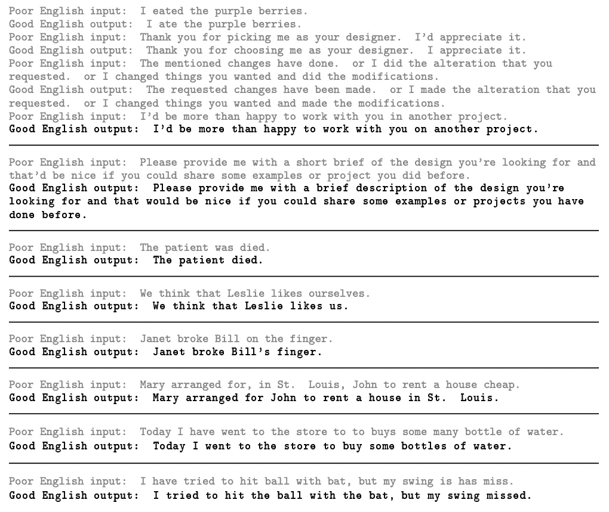

纠正英语语法|参考: [GPT-3 研究论文](https://arxiv.org/pdf/2005.14165.pdf)，公共领域

正如我们所看到的，该模型是在非常基本的语法上进行测试的，而不是在复杂的语法上，如子句。很高兴看到模型在如此糟糕的语法上的表现，因为即使对人类来说，这也是一项复杂的任务。

# 测量和防止基准记忆

由于训练数据集是通过爬取互联网生成的，因此训练数据集可能包含各种测试集示例。如果发生这种情况，那么模型在各种任务上报告的准确性的置信度可能是不可靠的。

在训练数据集中搜索测试集示例，如果两个集中的 N 个单词相似，则认为文档匹配。n 等于每组单词中第 5 个百分位数的示例长度。较小的 N 值会导致大量不符合逻辑的匹配。因此，N 的最小值保持为 8，最大值保持为 13。根据最小长度匹配 n 个单词或整个句子。如果找到匹配，则该示例被认为是脏的，否则是干净的示例。

在 clean 数据集上对 GPT-3 进行了各种任务的测试，并将精确度与原始分数进行了比较。如果精度几乎匹配，则意味着即使存在污染也不会影响模型精度。如果准确度低于原始分数，则意味着污染夸大了结果。

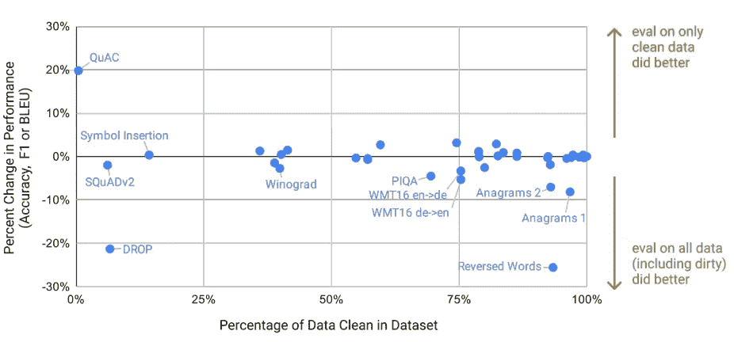

基准污染分析|参考: [GPT-3 研究论文](https://arxiv.org/pdf/2005.14165.pdf)，公共领域

对于数据集 QuAC，数据集内存在 0%的干净数据，但精度仍正向变化 20%，这肯定意味着它有问题。他们发现大约 90%的数据集被污染。但是，经过进一步的分析推断，训练集只包括段落，而不包括问题和答案。

GPT-3 有各种局限性，在文本合成等领域仍有改进的机会。GPT-3 是基于训练数据集，因此，不能认为它自己的。如果大多数人对性别、种族、宗教有偏见，那么这个模型也会代表这些偏见。更多的限制和偏见，你可以在这里阅读。[麻省理工科技评论](https://www.technologyreview.com/2020/08/22/1007539/gpt3-openai-language-generator-artificial-intelligence-ai-opinion/)也发表了一篇关于 GPT-3 局限性的博客。

GPT-3 模型只是预测下一个单词应该出现。它不理解上下文，也不理解单词的实际含义。该模型缺乏逻辑推理和常识推理。模型输出可以通过调整数据集来改变。

这条推文显示了 GPT 的偏见-3 |推文由脸书公共领域副总裁 Jerome Pesenti 发布

以下是您了解 GPT-3 更多信息的重要资源:

[](/you-can-understand-gpt-3-with-these-youtube-videos-6a30887c928b) [## 你可以通过这些 YouTube 视频了解 GPT 3

### 通过这些 YouTube 视频，在不到 3 分钟的时间内对 GPT 3 号有一个初步的了解

towardsdatascience.com](/you-can-understand-gpt-3-with-these-youtube-videos-6a30887c928b) [](https://analyticsindiamag.com/top-free-resources-to-learn-gpt-3/) [## 了解 GPT-3 -分析杂志的顶级免费资源

### 随着开放人工智能发布其前卫的预训练语言模型——GPT-3 突然成为了…

analyticsindiamag.com](https://analyticsindiamag.com/top-free-resources-to-learn-gpt-3/) 

感谢您的阅读，祝您有美好的一天。

**斜体文字仅为个人观点*