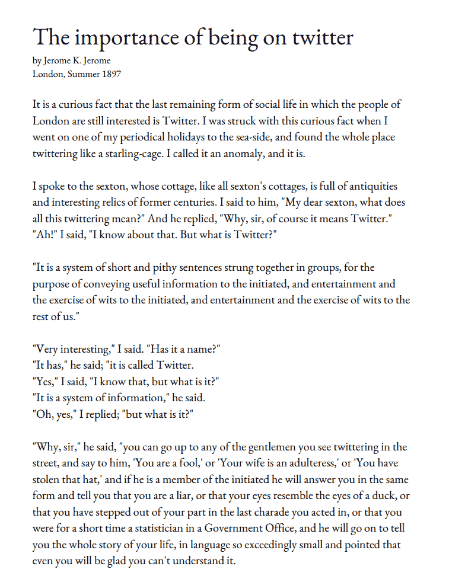

# GPT-3，OpenAI 的革命

> 原文：<https://towardsdatascience.com/gpt-3-openais-revolution-f549bf3d4b25?source=collection_archive---------43----------------------->

来源:[弗洛里安·克劳尔](https://unsplash.com/@florianklauer?utm_source=medium&utm_medium=referral)

## 研究有史以来最强大的语言模型的含义

[OpenAI](https://openai.com/) 是目前人工智能领域的明显领导者之一，它无疑引领着自然语言系统。其文本生成算法 GPT 显示出一种生成类似人类文本的神奇能力，彻底改变了文本生成领域。它的最新版本 GPT-3 现在能够超越这一点，不仅能够写出连贯的段落，还能根据规范生成代码等等。

GPT 基本上是一个自动完成。然而，它不只是像流行的消息应用程序那样建议下一个单词。根据最初的提示，GPT 能够写出连贯、冗长的文本段落。

生成的内容与人类编写的内容如此接近，以至于人们一直在讨论这个工具是否太强大而不能交给人。

你自己看看:

来源:马里奥·克林格曼([@卡西蒙多](http://twitter.com/quasimondo))

文本是在只植入标题、作者姓名和第一个“它”之后生成的。

但这并没有停止。

这个人使用 GPT-3 从一系列规范中生成 React 代码。

[另一位用户](https://www.notion.so/Cover-Letter-Generator-8ac55d1145dc4243ae0dc97345e3661f)创建了一封求职信来申请工作。

> 很明显，GPT-3 非常好，但这意味着什么呢？

# 1.假新闻

与任何强大的工具一样，对它的使用决定了它的影响，而这种影响的范围非常大。一方面，像 GPT-3 这样的工具可以用来生成文本，以支持许多领域的业务，例如将法律术语转换成简单的英语。但是，很明显，它也可以用来生成误导性内容，具体来说就是**假新闻**。

GPT-3 可用于有计划地产生误导性信息，例如通过向其提供分裂性和不真实的提示，如种族指控、性别歧视或暴力言论。这可能导致比 2016 年选举更严重的结果，在 2016 年选举中，假新闻进一步分化了大众观点。能够通过算法生成假新闻可能会打开潘多拉魔盒。

# 2.乔布斯

另一个重要但不太明显的影响是对工作的影响。像 GPT-3 这样的工具可以导致许多工作变得过时，包括记者，作家和编剧，等等。然而，影响远不止于此。

从规范中直接生成代码的能力可能会让软件工程师变得多余，至少就我们现在所知是这样。软件工程可能会成为一项非常不同的工作，人们不用自己编写代码，而是用简单的英语编写规范、算法和功能，然后让像 GPT-3 这样的模型生成代码。

# 3.偏见

GPT-3 非常强大，因为它经过了数十亿个例子的训练，拥有数十亿个参数。然而，一个模型的好坏取决于它所训练的数据。如果一个模型是在坏数据上训练的，它的表现会很差。

由此可见，如果一个模型在有偏差的数据上被训练，它将学习这样的**偏差**。GPT 3 号也是如此。这种模式已经被证明，当遇到困难的话题时，会产生攻击性的、性别歧视的和种族主义的文本。

这是因为它是用来自多个来源的文本训练的，这些文本可以包含具有现有偏见的人的观点。让这样的模型不受限制地自由生成文本可能会通过传播偏见和助长分裂来助长观点的激进化和两极分化。

# 摘要

OpenAI 的 GPT-3 模型是一场真正的革命。该工具不仅能够预测文本，还能在冗长的段落中生成文本，保持连贯的“思想”流。然而，这样一个强大的工具如果用在错误的人手中，也可能成为一种武器。如果不加控制，这样的系统可能会对假新闻、就业和偏见的传播产生巨大影响。

*要阅读更多类似的文章，请关注我的* [*Twitter*](https://twitter.com/jayzuccarelli) *，*[*LinkedIn*](https://www.linkedin.com/in/ezuccarelli)*或我的* [*网站*](https://eugeniozuccarelli.com/) *。*