# GPT-3 引物

> 原文：<https://towardsdatascience.com/gpt-3-primer-67bc2d821a00?source=collection_archive---------18----------------------->

## 了解 OpenAI 的前沿语言模型

GPT-3 可能是计算量最大的机器学习模型。神经网络的 1750 亿个参数使其比之前最大的语言模型大了大约十倍([图灵 NLG](https://www.microsoft.com/en-us/research/blog/turing-nlg-a-17-billion-parameter-language-model-by-microsoft/) ，170 亿个参数，由微软于 2020 年 2 月发布)。GPT-3 训练所用的 430GB 文本广泛取自互联网，并辅以书籍中的文本。该模型通过查看之前出现的一定数量的文本(最多约 2000 个单词)并预测下一个单词来生成新文本。

用户通过提供提示与模型进行交互。OpenAI(创造 GPT 3 号的组织)的聊天机器人式交互的一个示例提示是“以下是与人工智能助手的对话。这位助理乐于助人、富有创造力、聪明且非常友好”。除了提供提示，用户还可以指定某些参数，比如输出应该有多长，单词重复的可能性有多大，或者输出的随机性。

# **它能做什么？**

GPT-3 在几乎所有标准的自然语言处理基准上都表现出了合理的熟练程度，包括在其中一些基准上的最先进的性能。基准测试包括一些挑战，例如使用一段上下文来预测相关句子的最后一个单词，以及确定语法上模糊但上下文中明确的代词指的是哪个名词。其他基准包括语言之间的翻译和回答一般知识问题。这种熟练程度是在没有大多数尖端模型使用的特定任务微调的情况下实现的。GPT-3 能够进行微调，进一步的微调几乎肯定会改善该模型在每个特定基准上的结果(代价是在微调任务之外的性能更差)。

OpenAI 还在一些非标准任务上测试了 GPT-3:

**生成新闻文章**

大约 80 人的样本被要求区分真实的文章和由 GPT-3 生成的最后 200 个单词的文章。参与者无法可靠地区分真实的文章和 GPT-3 完成的文章(参与者正确地分类了他们看到的 52%的文章，50%在 95%的置信区间内)。当模型生成的文本量增加到 500 个单词时，参与者没有提高他们的准确性(准确性保持在 52%)。

**SAT 类比**

当被要求完成 SAT 类比问题时，该模型正确回答的问题比普通大学申请人多 14%。

**算术**

下图显示了当系统提示几个数学问题并要求回答其中一个问题时，模型的准确性。我提到的 GPT-3 模型的结果在最右边(175B)。OpenAI 创建了几个版本的模型，以测试不同模型大小之间的性能差异。较大的模型显示出显著的改进。

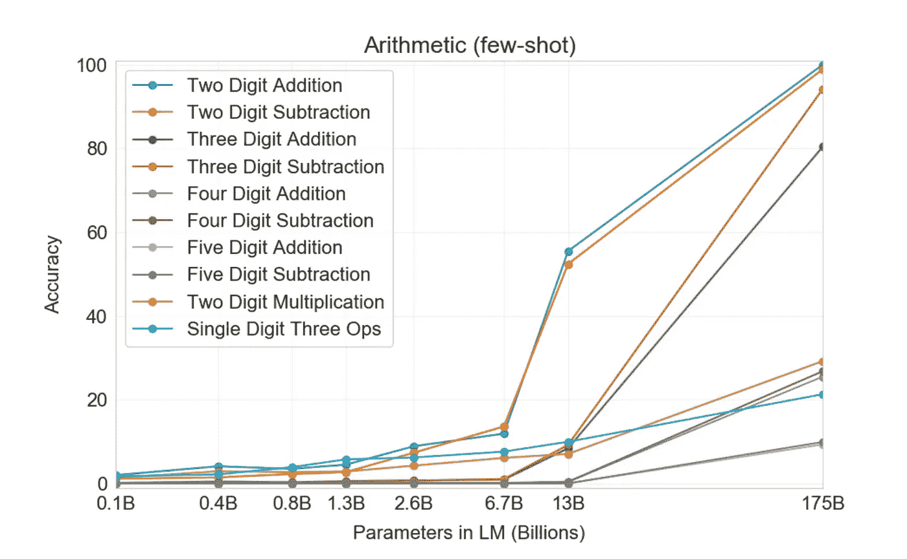

(图表来自 [GPT-3 论文](https://arxiv.org/pdf/2005.14165.pdf))

总体而言，该模型能够可靠地成功回答两位数的加法和减法问题。对于所有其他类型的问题，该模型不能始终给出正确的答案，但明显优于机会。

度量是一回事，但是感受模型功能的最好方法是查看输出。许多人正在展示 GPT-3 的潜在使用案例。以下是一些亮点:

**用 JavaScript 创建布局(** [**视频此处**](https://twitter.com/sharifshameem/status/1282676454690451457?s=20) **)**

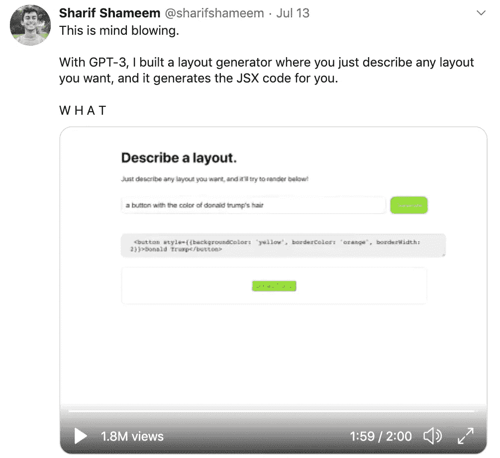

**在 Python 中创建 API(**[**视频此处**](https://twitter.com/SamanyouGarg/status/1295039749221097472?ref_src=twsrc%5Etfw%7Ctwcamp%5Etweetembed%7Ctwterm%5E1295039749221097472%7Ctwgr%5E&ref_url=https%3A%2F%2Fwww.scotthuston.com%2F2020-08-16-GPT-3_primer%2F) **)**

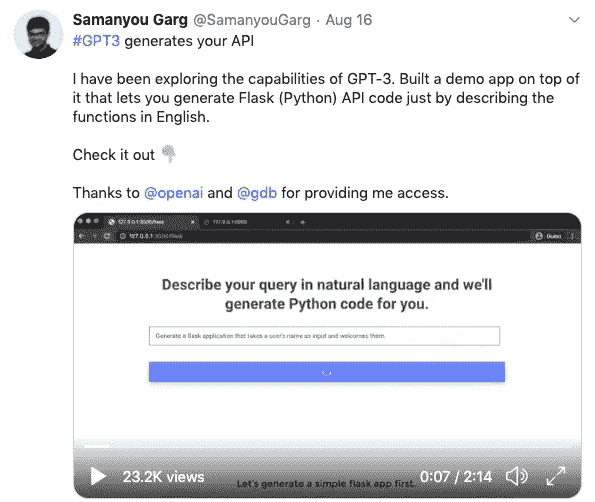

**在 Python 中创建函数(** [**视频此处**](https://beta.openai.com/?app=productivity&example=4_4_0) **)**

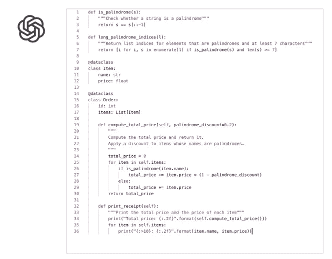

**总结一个二年级学生的 NDA(**[**视频此处**](https://vimeo.com/427957683/10634d1706) **)**

[**像律师一样写作**](https://twitter.com/f_j_j_/status/1283349995144359937?s=20)

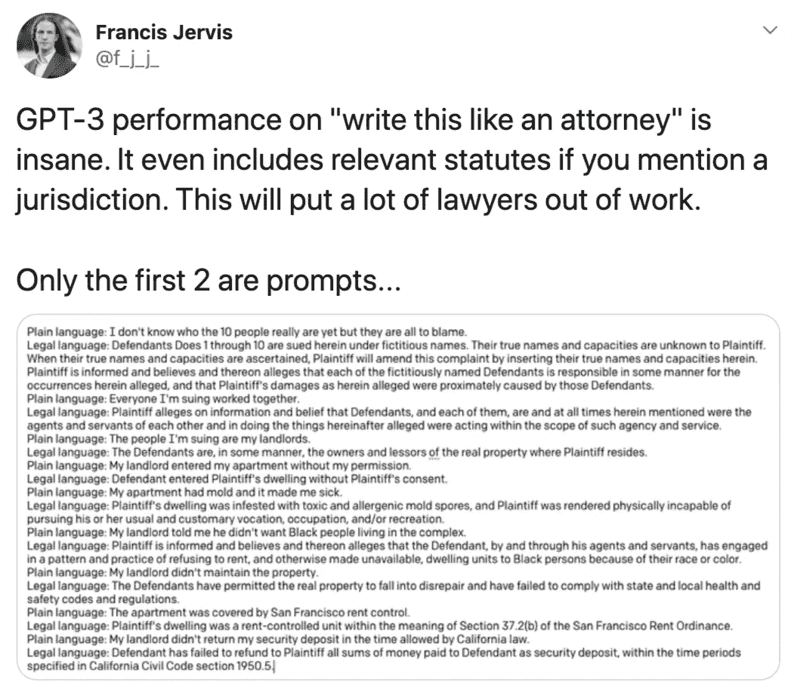

**“搜索引擎”……其实并不搜索(** [**视频此处)**](https://twitter.com/paraschopra/status/1284801028676653060?s=20)

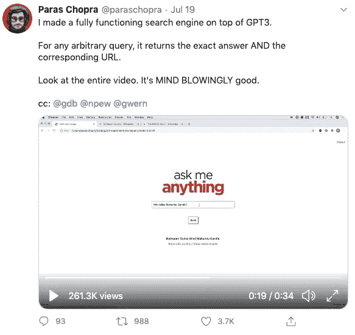

[**写诗**](https://openai-public.s3-us-west-2.amazonaws.com/beta/looped/poetry.mp4)

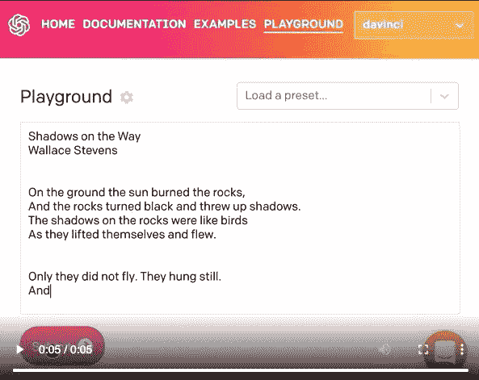

**更多项目链接** [**此处**](https://github.com/elyase/awesome-gpt3)

当然，仅凭几个精选的例子很难判断这个模型。展示令人印象深刻的能力似乎相对容易。生成足够好的可靠结果以用于某种生产设置(即作为客服机器人)是一个非常不同的故事。很可能该模型在有人类参与的系统中最有用(可能会生成一个建议的响应供人类批准或编辑)，或者在不需要持续良好结果的应用程序中最有用(例如生成像 [AI Dungeon](https://play.aidungeon.io/) 这样有趣的虚构故事)。

# **我如何使用它？**

这款车型将通过 [API](https://beta.openai.com/) 发售。OpenAI 目前有一个 API 的私人测试版，你可以在这里注册。该 API 的定价信息尚未公布，但我们知道从该模型生成 100 页内容的电力成本只有几分钱。为了收回创建模型的初始成本，每生成 100 个页面使用 API 的成本在 0.50 美元到 5 美元之间似乎是合理的，但这很难说。

或者，你可以通过 [AI 地牢](https://play.aidungeon.io/)进入模型。注意 AI 地牢的自由层使用的是 GPT 2 生成的文本，而不是 GPT 3。为了使用 GPT-3，你需要注册付费版本(尽管前 7 天是免费的)。注册后，你需要改变设置，使用“龙”模型(又名 GPT-3)，而不是“狮鹫”模型(又名 GPT-2)。付费版本还包括一个自定义提示选项(“场景”)，这意味着你不需要使用标准的故事提示。

# **这里有什么新内容？**

首先，该模型的广泛功能超出了公开可用的范围。很难预测人们将能够利用该模型做出什么，但很可能该模型将以新的方式使用，并在已经使用语言模型的领域改善结果。

除了该模型的实际新用途之外，这项研究还有一些有趣的收获:

**型号越大越好**

也许最重要的一点是，较大的模型继续表现更好。在 GPT-3 之前，研究人员已经观察到模型大小和性能之间的幂律关系。他们发现，在模型训练期间使用额外的计算能力回报递减，但对于更昂贵的模型，性能仍有显著提高。尽管趋势是在较低的计算水平上，但对于这种趋势可以外推多远仍有一些争论。在 GPT-3 之后，仍然不清楚这种趋势的极限在哪里，但我们还没有达到它们。尽管 GPT-3 比之前最大的型号大十倍，但它的性能是之前观察到的趋势所预期的。

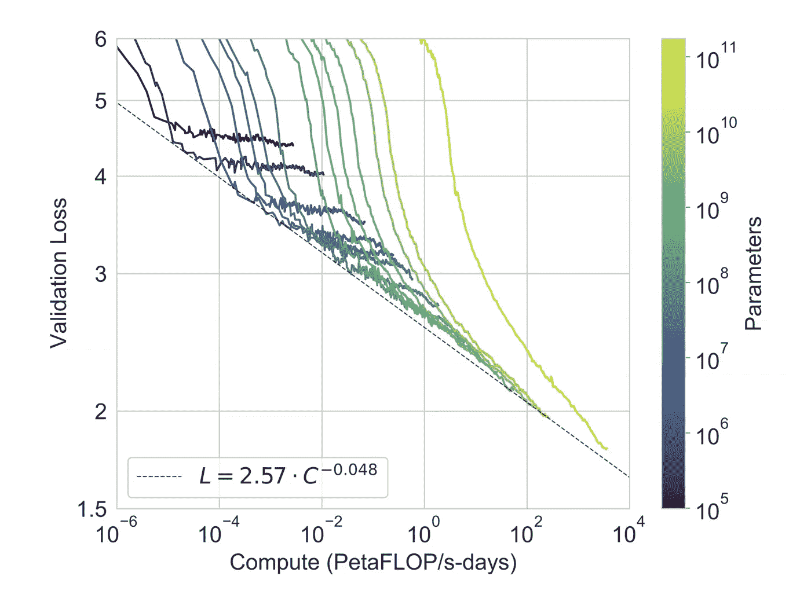

(图表来自 [GPT-3 论文](https://arxiv.org/pdf/2005.14165.pdf))

上图显示了一系列模型大小和计算开销的模型性能(越低越好)。GPT-3 是黄线，虚线代表的幂律似乎在 OpenAI 测试的所有模型尺寸上都成立。

对于 OpenAI 训练 GPT-3 的成本有多种估计。[一个估价](https://lambdalabs.com/blog/demystifying-gpt-3/)说是 460 万美元。[另一个](https://venturebeat.com/2020/06/01/ai-machine-learning-openai-gpt-3-size-isnt-everything/)说是 1200 万美元。两者都不包括研究人员报酬。不管真数，外卖不变。鉴于其潜在的应用，GPT-3 的生产成本非常低廉，更大的型号很可能会随之而来。2008 年，谷歌在食品上的花费比 OpenAI 刚刚花在创建一个具有商业应用的艺术语言模型上的花费要多得多。如果这个方向被认为足够有前途的话，有足够的资金来推动更大的模型。在 GPT-3 之后，很难反对更大的模型明显更有效。资金不是创建更强大模型的唯一限制。训练这种模型需要大量的新工程，但 OpenAI 不是唯一有能力完成这一任务的组织。

**元学习**

事实上，GPT-3 有能力做算术，而它测试的特定问题中只有极少数可能在训练数据中，这意味着该模型实际上正在学习如何做数学运算。该论文的作者进一步支持了这一观点，他们指出，“对错误答案的检查表明，该模型经常犯错误，例如没有携带‘1’，这表明它实际上是在尝试执行相关的计算，而不是记忆表格”。GPT-3 还正确回答了大约 20%的个位数组合运算(例如，9 *(7+5))——这个比率比随机概率好得多。值得注意的是，一个被简单训练来预测文本中下一个单词的模型似乎正在学习如何做数学，以便更好地预测下一个单词。这些结果提出了一个问题，即在更大的范围内，模型可能会获得什么样的新能力。例如，一个足够强大的语言模型可以阅读数千篇科学论文，并使用这些数据成功预测新实验的结果吗？

**少数镜头学习**

大多数大型、公开可用的机器学习系统采用的方法是对某种一般化数据进行大量训练，然后对特定领域数据的模型进行微调。GPT-3 通过用 OpenAI 所谓的“少量学习”取代微调步骤，展示了在许多领域的熟练程度。少量学习就是简单地向模型展示一些成功的例子，告诉它你希望它在模型给出的提示中做什么。例如，让模型成功回答常识性问题的提示可能是这样的，最后一个问题是您希望 GPT-3 回答的问题。

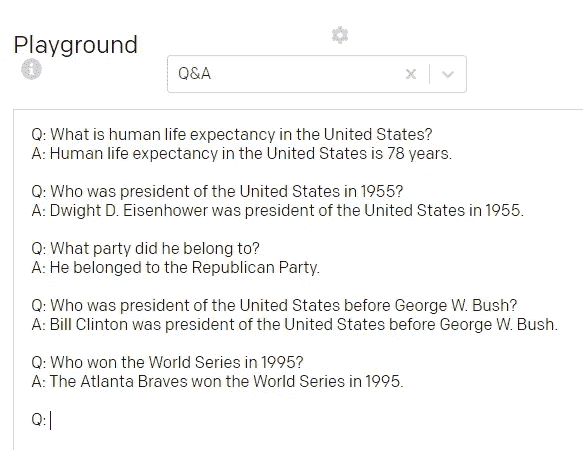

[本帖](/gpt-3-creative-potential-of-nlp-d5ccae16c1ab)的 API 截图

也可以通过提供没有示例(“零触发”)或有一个示例(“一触发”)的提示来使用该模型，但是该模型看到的示例越多，通常表现越好。

少量学习方法有几个好处:

*   首先，少量学习可能会使机器学习更容易实现。愿意输入如上所示的提示的人比拥有微调模型的技术知识的人多得多。
*   第二，以这种方式提示模型可以使机器学习模型能够用于获取微调所需的大量结构化训练数据不可行的领域。
*   最后，少量学习使模型更加灵活。对于典型的微调方法，底层模型权重实际上是针对特定任务而改变的，因此微调牺牲了可概括的性能，以获得模型的特定应用程序的更好性能。相比之下，使用少量学习方法的模型不会改变底层模型。

如下图所示，模型越大，少量学习效果越好。少量学习不仅仅是对机器学习的当前状态进行微调的可行替代方案，它将继续在更大的未来模型中变得更有效。少量多次学习的效率不断提高，再加上模型规模不断扩大带来的直接性能提升，很可能会导致使用少量多次学习的大型模型的趋势。

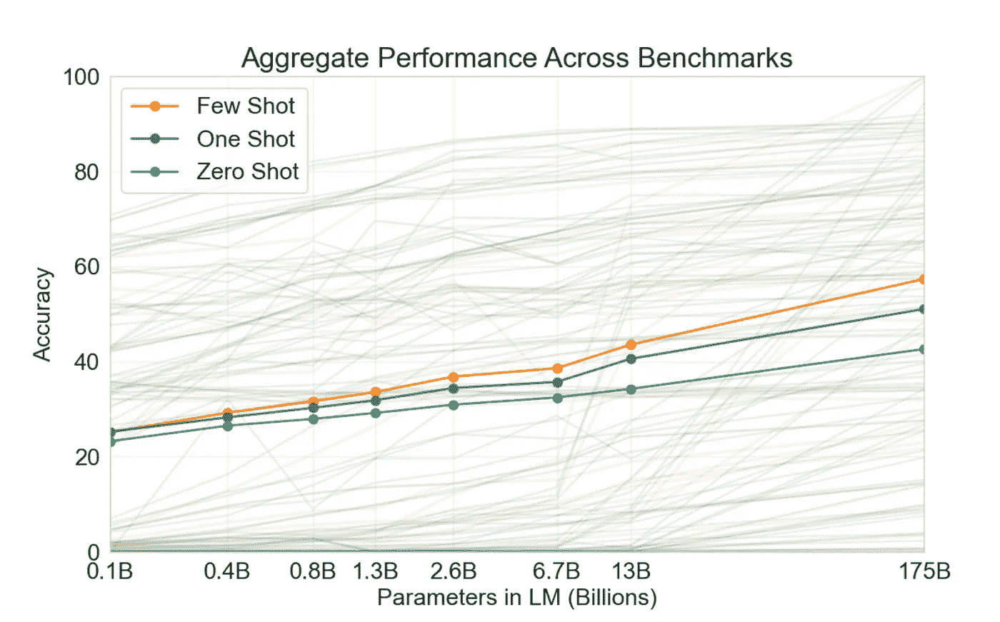

图表来自 [GPT-3 论文](https://arxiv.org/pdf/2005.14165.pdf)

# 语言模型能有多强大？

[open ai 的这篇论文](https://arxiv.org/pdf/2001.08361.pdf)研究了语言模型的缩放问题。研究人员将模型性能视为模型大小、训练数据量和用于训练模型的计算能力的函数。他们发现了一种幂律关系，在这种关系中，更可靠地扩展输入会带来更好的性能。虽然这篇论文是在 GPT-3 之前写的，但是新的模型与他们发现的关系是一致的，即使它的规模比他们能够测试的要大得多。研究人员推断这一趋势，以找到一个模型(使用最佳输入比例)将达到类似语言模型的理论最高性能的点——所有信息都已从文本中提取出来的点。在到达那个点之前，这种模式完全有可能因为不可预见的原因而被打破。然而，如果这一趋势保持不变，研究人员估计，一个具有约 1 万亿个参数、在 1 万亿个令牌(约 1.4 万亿字节)上训练并使用约 10，000 petaflop/s-day 计算(pg)的模型将达到最高性能。17).

该论文警告说，“数值是高度不确定的，根据幂律拟合的指数的精确值，在两个方向上变化一个数量级。最明显的解释是，我们的比例定律在我们到达这一点时或之前就失效了，这在计算和模型大小方面仍有许多数量级的差距”。那是在 GPT-3 之前写的，GPT-3 现在在一个数量级之内。该论文中的公式预测 10，000 petaflop/s-day 计算的训练损失为 1.75，而 GPT-3 论文中的更新公式预测训练损失为 1.65。在用来自 GPT-3 的最新数据更新趋势线后，理论上的最佳语言模型似乎比之前的论文(和这里的数字)显示的更可实现。

值得注意的是，假设趋势没有被打破，它可能低估了未来的表现。这种关系并不能解释训练技术的未来改进。OpenAI 已经使用一致的过程来训练他们的 GPT 模型的各种版本，但是其他研究人员继续改进类似模型的训练过程。GPT-3 没有接受过尖端的训练。

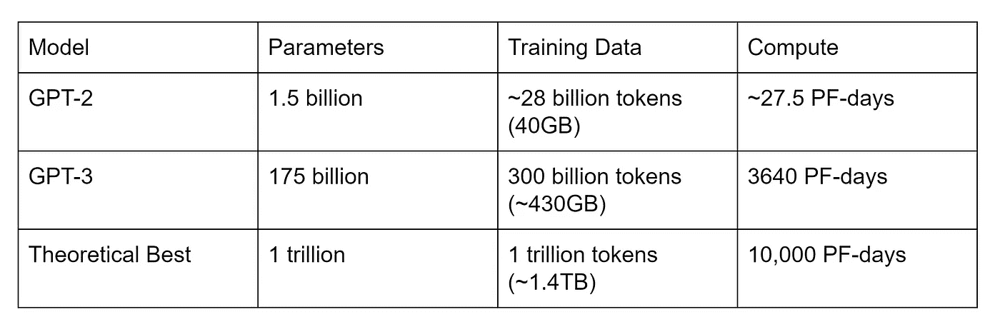

数据来自 [GPT 三号论文](https://arxiv.org/pdf/2005.14165.pdf)、 [GPT 二号论文](https://cdn.openai.com/better-language-models/language_models_are_unsupervised_multitask_learners.pdf)、[定标论文](https://arxiv.org/pdf/2001.08361.pdf)

如果下一代模型能像 GPT 3 号那样扩展，它将远远超过迄今为止观察到的幂律理论预测的最佳模型。如果趋势打破，我们将获得关于当前方法局限性的重要信息。如果这一趋势不打破，我们将生活在一个非常不同的世界。

## 进一步探索:

[GPT-3 论文](https://arxiv.org/pdf/2005.14165.pdf)

[OpenAI blogpost](https://openai.com/blog/openai-api/)

[格温的帖子](https://www.gwern.net/newsletter/2020/05#gpt-3)

[Lambda 实验室帖子](https://lambdalabs.com/blog/demystifying-gpt-3/)

[Lambda Labs 汇总汇总其他内容](https://lambdalabs.com/blog/gpt-3/)

[好概述](https://minimaxir.com/2020/07/gpt3-expectations/)

[Slatestarcodex 帖子](https://slatestarcodex.com/2020/06/10/the-obligatory-gpt-3-post/)

[分析扩展未来模型的潜在限制](https://www.lesswrong.com/posts/N6vZEnCn6A95Xn39p/are-we-in-an-ai-overhang)

[使用示例，以及关于 API 参数的详细信息](/gpt-3-creative-potential-of-nlp-d5ccae16c1ab)

[计算机文件视频](https://www.youtube.com/watch?v=_8yVOC4ciXc)

[收集更多演示和文章](https://github.com/elyase/awesome-gpt3)