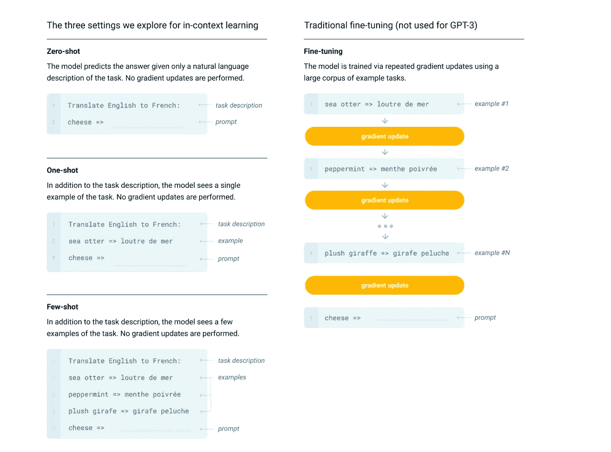
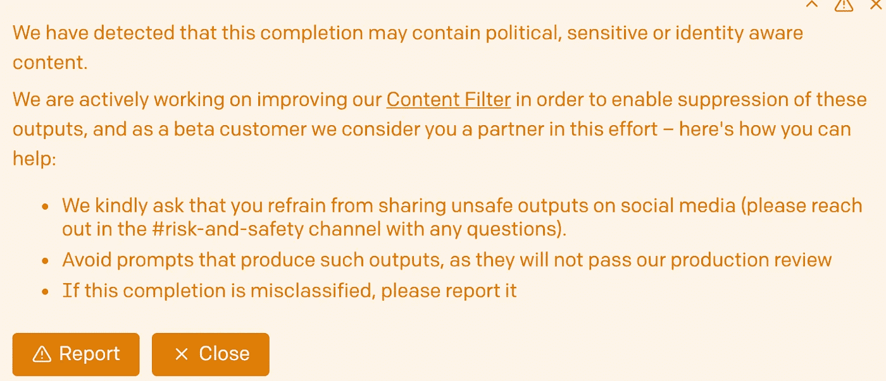

# GPT 3:好的，坏的和丑陋的

> 原文：<https://towardsdatascience.com/gpt-3-the-good-the-bad-and-the-ugly-5e2e5b7f0f66?source=collection_archive---------22----------------------->

## [意见](https://towardsdatascience.com/tagged/opinion)

## 大型语言模型会改变我们开发 NLP 应用的方式吗？

由 [Raphael Schaller](https://unsplash.com/@raphaelphotoch?utm_source=unsplash&utm_medium=referral&utm_content=creditCopyText) 在 [Unsplash](https://unsplash.com/s/photos/letters?utm_source=unsplash&utm_medium=referral&utm_content=creditCopyText) 上拍摄的照片

如果你关注最新的人工智能新闻，你可能会遇到 OpenAI 发布的最新语言模型(LM)的几个令人惊叹的应用: [GPT-3](https://beta.openai.com/) 。这个 LM 可以支持的应用从[回答问题](https://lacker.io/ai/2020/07/06/giving-gpt-3-a-turing-test.html)到[生成 Python 代码](https://www.youtube.com/watch?v=z8K07a2EIcE)。用例列表每天都在增长。查看以下 youtube 视频: [GPT-3 演示和解释](https://www.youtube.com/watch?v=8psgEDhT1MM)， [14 个很酷的 GPT-3 应用](https://www.youtube.com/watch?v=G6Z_S6hs29s)和 [14 个更多的 GPT-3 应用](https://www.youtube.com/watch?v=cpWEXQkpBFQ)。

GPT 3 目前处于测试阶段，只有少数人可以访问，但将于 10 月 1 日向所有人开放。OpenAI 对传播炒作和展示酷应用程序的惊人样本非常感兴趣。截至 2020 年 9 月 22 日，他们的策略显然奏效了。在写这篇博文的时候，[微软宣布他们获得了该语言模型的专有权。OpenAI 可能会继续通过 API 许可对 LM 的访问，但微软的收购让 OpenAI 获得了 460 万美元的投资回报率——这是训练这一大型 LM 的估计成本。](https://bdtechtalks.com/2020/09/24/microsoft-openai-gpt-3-license/)

因为 OpenAI 在他们的营销中非常成功，招募了许多人来发布有趣的例子，严格来说，这些例子只是功能的轶事证据，人们应该带着一些怀疑来看待当前的炒作。人们很可能只会发布例子来证实他们的偏见，即机器在新的水平上“理解”语言。与此同时，当你的提示是“三个穆斯林”时，会自动产生负面的例子，如种族主义故事，这将在下面进一步讨论，应该引起对潜在弊大于利的关注。

在我更详细地讨论“好、坏、丑”之前，让我们简单回顾一下 GPT-3 的主要贡献是什么。OpenAI 去年发布了一个名为 GPT-2 的早期版本。这项技术从那时起就没有改变过。基本上是巨大的数据量导致了现在具有 1750 亿个参数的 LM，相比之下，当前使用的 LM 例如具有 110 亿个参数的 T5。在训练了大量从“互联网”爬取的模型数据后，作者能够表明该系统能够在各种 NLP 任务(例如，问题回答、机器翻译)中达到甚至击败最先进的系统。然而，最令人印象深刻的是，该系统从未接受过任务训练，并且能够在没有、只有一个或几个例子的情况下实现合理的性能(即，无镜头/单镜头/少镜头学习)。

上下文学习和微调之间的比较(来源:【https://arxiv.org/abs/2005.14165】T2)

GPT-3 论文中的图表说明了如何通过少量的例子告诉 GPT-3 如何完成一项任务，这与通过向其提供大量例子来微调深度学习模型的传统方法形成了对比(…)。此外，微调还需要您提前定义解决方案空间(即标签的数量)，并且您必须确保您的训练数据中有足够的示例，以便机器可以学习如何区分不同的类别。当使用 GPT-3 时，所有这些都是不需要的(只要在馈送给登月舱的数据中有足够的任务数据)。

# **好人**

GPT-3 在许多自然语言处理任务中表现出令人印象深刻的结果，如问题回答(QA)、生成代码(或其他形式语言/编辑辅助)和(虚构)故事生成。这些应用已经显示出令人印象深刻的结果，并且很可能被结合到已经存在的系统中，显示出对当前技术水平的改进

例如，GPT-3 论文显示了各种 QA 任务(如 TriviaQA)的令人印象深刻的结果。很有希望的是，少击学习通常显示出比一击或零击学习更好的结果，这表明使用更多标记的例子，LM 可能改进得更多。

这些应用程序可能会从 GPT-3 中获益最多:

*   改进问题回答(如果用作复杂 QA 系统的附加组件)。
*   支持创建内容(正如我们已经看到的自动建议)。文档的起草助手，查询建议都是想到的应用。
*   轻松获得深度学习技术将允许在没有大量训练数据的情况下创建强大的应用程序。

特别是，最后一点可能会导致这样的假设，即不需要太多的技术知识就可以轻松地创建应用程序。使用 GPT-3 操场将允许每个人探索概念，这些概念可以通过零或少量的学习来快速测试。下面的例子展示了只有两个例子的人如何得到诸如“什么是……的元素？”这样的问题的答案我在网上寻找前两个问题的答案，第三个问题的答案是由系统生成的。如果没有这两个例子，系统的答案太短且不具信息性，但仅仅两个例子就将其置于“正确”的路径上(**粗体**是我的输入，正常字体是 GPT-3 的延续):

**问:非法侵入的要素是什么？**

**答:非法侵入是对他人专有财产占有权的侵犯。这是对他人财产的直接非法干涉。一般来说，非法侵入的主要要素是非法侵入或入侵财产、侵入的意图、暴力以及对物主造成的伤害。**

**问:欺诈的要素是什么？**

**答:在美国，普通法通常确定了确立欺诈所需的九个要素:(1)对事实的陈述；(2)虚假性；(3)其重要性；(4)陈述人知道其虚假或不知道其真实；(5)陈述人的意图，即该人应当以合理预期的方式行事。(6)受害方不知道其虚假性；(7)受害方对其真相的信赖；(8)受害方依此享有的权利；(9)受害方的结果伤害和直接伤害。**

**问:民事阴谋的要素是什么？**

(1)两个或两个以上的人之间的协议；(2)一方或多方为达到共谋目的的公开行为；(3)受害方因共谋而遭受的损害。

虽然这些答案听起来非常令人印象深刻(至少对我这个非律师来说)，但是人们应该意识到在没有任何进一步保护的情况下使用 LM 可能带来的风险。

# 坏事

测试 GPT-3 的质量保证任务之一是关注事实准确性的 [NaturalQS](https://www.mitpressjournals.org/doi/full/10.1162/tacl_a_00276) 。GPT-3 在这项任务中表现不佳，而在琐事问题上却获得了高分。这种行为令人不安，因为它似乎表明，在互联网上经常找到的问题答案对更有可能被作为正确答案给出。但是从一个文本例子中回答一个复杂问题所需的文本理解显然超出了 LM 的能力。然而，如果答案听起来很权威，并且是用正确的英语写的，人类可能不会那么容易发现错误的答案。

事实上，人类越来越难区分机器写的新闻和人类写的文章。GPT-3 论文中报道的一项实验表明，人类很难识别机器生成的新闻。LM 越大，人类正确识别机器编写的新闻的问题就越多，对于最大版本的 GPT-3 (175B 参数),这个决定基本上是抛硬币。

使用未经过滤的 LM 的另一个风险是答案缺少基础。即使生成的句子可能提供正确的答案，也没有办法支持这个陈述。例如，语言模型仅仅基于单词的频率，而不是基于对法令和判例法的深刻理解。T2 最近的一篇学术论文由[艾米丽·本德](http://faculty.washington.edu/ebender/)和[亚历山大·柯勒](http://www.coli.uni-saarland.de/~koller/)提供了类似的批评，指出语言的*意思*不能从 LMs 学习。

加里·马库斯和厄内斯特·戴维斯在最近的《麻省理工科技评论》文章中对 GPT-3 进行了更具毁灭性的指责。他们表明，该模型不理解它正在通过复杂情况的各种延续产生什么，这需要社会/生物/物理或其他类型的推理(同样，正常字体是 GPT-3 的延续) :

> 你给自己倒了一杯蔓越莓汁，但又心不在焉地倒了大约一茶匙葡萄汁进去。看起来还行。你试着闻闻，但是你得了重感冒，所以你什么也闻不到。你很渴。 *所以你喝吧。*
> 
> 你现在已经死了。

不知何故，GPT-3 认为葡萄汁是有毒的，尽管互联网上提供了许多含有蔓越莓和葡萄成分的饮料配方。此外，这种饮料可能致命的结论不知从何而来。马库斯和戴维斯总结说，GPT-3“是一个流利的废话连篇者，但即使有 1750 亿个参数和 450 千兆字节的输入数据，它也不是一个可靠的世界解释者。”

除了这些风险之外，LM 模型只对语言生成有效，可能是作为一个答案或一个虚构的文本。另一方面，其他的 NLP 任务在 GPT-3 的帮助下就不那么容易解决了。典型的任务，如命名实体提取(即，标记字符串是公司名还是人名)或文本分类任务对 LM 来说更具挑战性。

# 丑陋的

众所周知，聊天机器人等 NLP 应用程序有时很难控制，最终可能会出现一个喷出种族主义或性别歧视评论的程序，正如微软在 2016 年发布聊天机器人 Tay 时不得不吸取的教训。值得称赞的是，OpenAi 从一开始就解决了这个问题，他们识别出了带有警告的有毒或简单的政治内容。我们需要看到他们将如何控制那些可能只是偶然(或有意)产生种族主义或性别歧视语言的应用程序。

beta.openai.com[游乐场发出警告](https://beta.openai.com/playground)(图片由作者提供)

其他测试用户也很快指出，用“三个穆斯林”提示 GPT-3 经常会导致他们被描述为恐怖分子或罪犯文本。我自己的实验证实了这种偏见，我也发现了一种相似的倾向，即当我向其他宗教团体或民族推荐 LM 时，会以一种刻板的方式描绘他们。

去偏置 LM 是社区中一个活跃的研究主题，我希望在这个领域看到更多的活动。OpenAI 显然意识到了这一点，他们在使用条款上花了很多时间，研究他们的 API 应该和不应该如何使用。

# 结论

尽管 GPT-3 可能会产生限制和有毒文本，我相信这个 LM 是一个迷人的新工具，可能会引发对需要生成语言的 NLP 任务的改进。结合其他技术和各自的安全措施，它将进一步推动我们可以用于我们产品的人工智能能力。人们也可能想出这种技术的新应用，只是还没有人真正想到。将法律术语翻译成简单明了的英语可能只是这项技术将激发的进一步创新的开始。