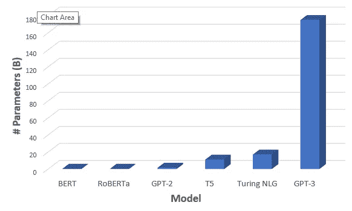
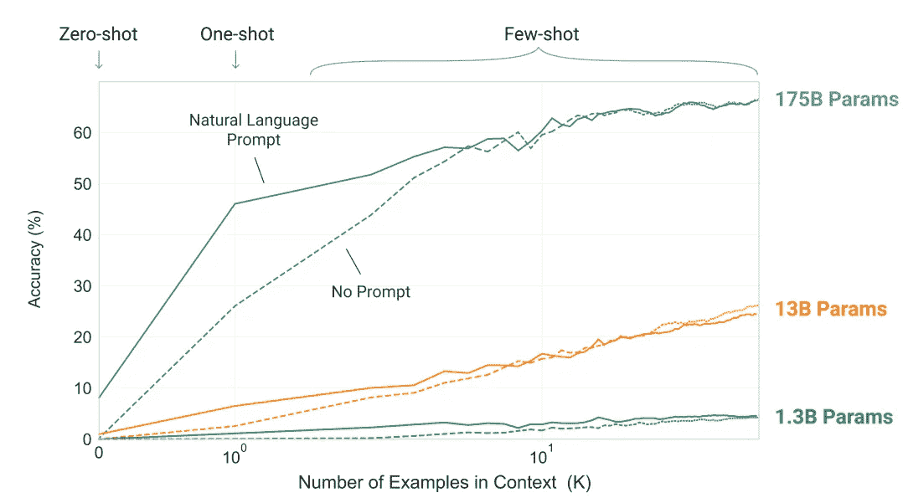
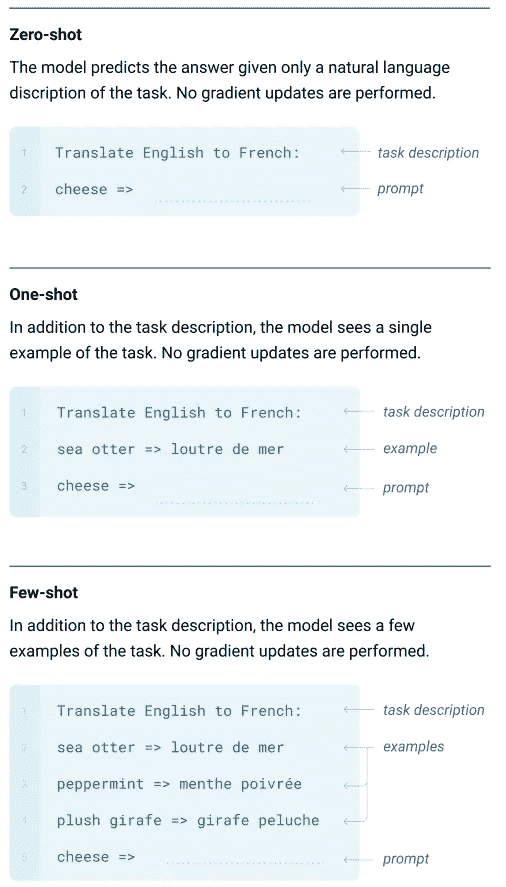

# GPT-3:来自 OpenAI 的新的强大语言模型

> 原文：<https://towardsdatascience.com/gpt-3-the-new-mighty-language-model-from-openai-a74ff35346fc?source=collection_archive---------7----------------------->

## 用 175B 参数将深度学习推向极限

# 介绍

[OpenAI](https://openai.com/) 最近[发布了其新的强大*语言模型* GPT-3 的](https://arxiv.org/abs/2005.14165)预印本。它是其前身 GPT-2 的更大更好的版本。事实上，由于有接近 175B 的可训练参数，GPT-3 在尺寸上比其他任何东西都要大得多。这里是最近流行的预训练 NLP 模型的一些参数的比较，GPT-3 明显突出。

# 有什么新鲜事？

在 Bert 成功之后，NLP 领域越来越多地朝着创建*预训练* *语言模型*的方向发展，这些语言模型在巨大的文本语料库上进行训练(以无监督的方式)，随后使用更小的特定任务数据集在特定任务上进行微调，例如翻译、问题回答等。

虽然这种类型的*迁移学习*消除了使用特定于任务的模型架构的需要，但您仍然需要特定于任务的数据集，这很难收集，以实现良好的性能。

相比之下，人类以一种非常不同的方式学习，并且有能力根据很少的例子来学习一项新的任务。GPT-3 旨在解决这一特定的痛点，即它是一个任务不可知的模型，它需要零到非常有限的例子来做得很好，并在许多 NLP 任务上实现接近艺术状态的性能

# 术语

在我们深入探讨之前，定义一些常用术语可能是有用的:

*   **NPL 任务:**这些是与人类语言有关的任务，例如语言翻译、文本分类(例如情感提取)、阅读理解、命名实体识别(例如识别文本中的人、位置、公司名称)
*   语言模型:这些模型可以预测给定的一组单词中最有可能出现的下一个单词(以及它们的概率)。事实证明，这种类型的模型对许多其他任务也是有用的，尽管它们可能是在普通的下一个单词预测上训练的
*   **零个/一个/几个镜头学习:**指的是模特通过观看一项新任务的零个/一个/几个例子来学习该任务的能力
*   **迁移学习:**指的是深度学习中的概念，其中你为一项任务(例如图像中的对象检测)训练一个模型，但为其他一些不同的任务(例如评估 MRI 扫描)利用和建立该模型的能力。在计算机视觉取得巨大成功后，它现在在 NLP 中很流行。
*   **Transformer Models** :深度学习模型系列，主要用于 NLP，它构成了当今大多数最先进的 NLP 架构的基本构建模块。你可以在我之前的[博客](/recent-advancements-in-nlp-2-2-df2ee75e189)中读到更多关于*变形金刚*的内容

# 方法

该模型是使用 *Transformer* 、 *Attention* 等标准概念，并使用典型的*普通爬虫、维基百科、书籍*和一些额外的数据源构建的。很多东西——预训练、模型、数据都类似于 GPT 新协议，但所有东西(模型大小、数据大小、训练时间)都要大得多。事实上，它巨大的体积是这款车型的最大优势。

下图显示了作为模型参数数量函数的各种零/一/少量发射任务的精度优势，很明显，由于尺寸按比例放大，获得了较大的收益。

资料来源:报纸

模型中使用的大部分东西都非常巨大——例如 96 *注意*层，3.2M 的*批量*，175B *参数*——它们与过去的任何东西都不一样。就参数数量而言，该模型比下一个最接近的模型(微软图灵 NLG，17B 参数)大 10 倍

使用 GPT-3 模型执行各种任务时，无需进行梯度/参数更新(微调)。人们可以使用自然语言与模型进行交互，并且/或者提供一些您正在尝试执行的任务的示例，模型就会执行这些任务！

资料来源:报纸

# 这一切意味着什么？

除了不需要特定于任务的模型架构之外，不需要大型定制的特定于任务的数据集的概念是朝着使前沿 NLP 更易访问的方向迈出的一大步。

虽然 GPT-3 在许多 NLP 任务上表现出色，例如单词预测、常识推理，但它并不是在所有事情上都做得一样好。例如，它在文本合成、一些阅读理解任务等方面表现不佳。除此之外，它还受到数据中的[偏差](/can-ai-algorithms-be-biased-6ab05f499ed6)的影响，这可能导致模型生成刻板的或有偏见的内容。因此，这里还有更多工作要做。

除此之外，GPT-3 的巨大体积使它几乎不为任何人所知，除了世界上少数几家公司和研究实验室。根据作者的说法，该模型非常通用，包含特定任务不需要的非常广泛的技能，并且可能有使用*概念创建更小、更易管理的特定任务模型的范围。*

*看到这个东西在未来如何发展会很令人兴奋。*