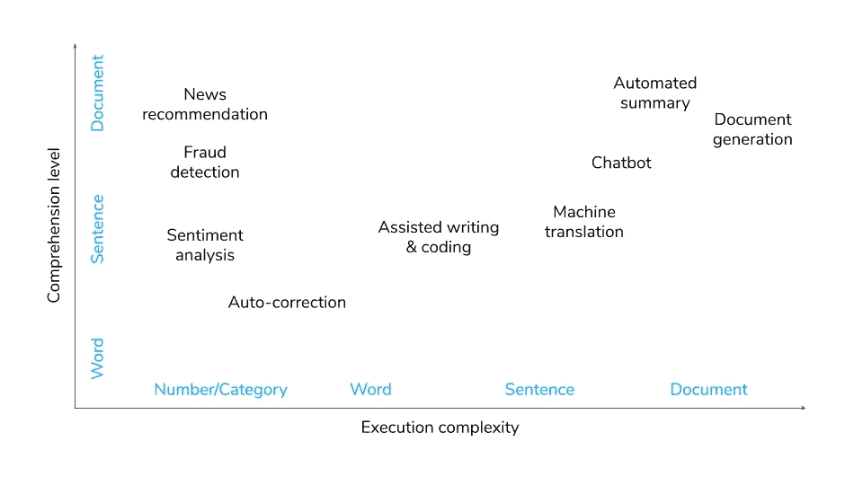
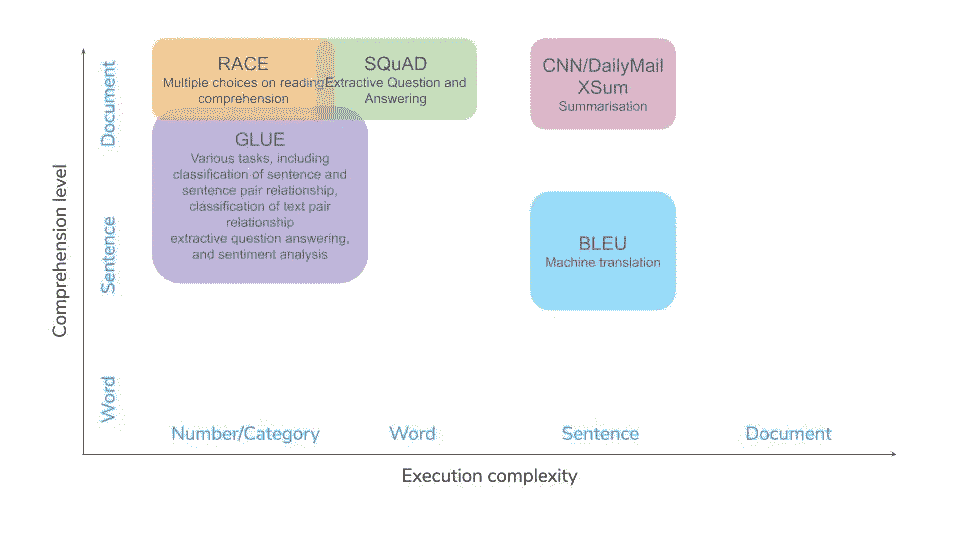
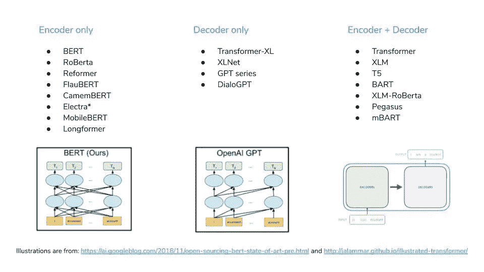
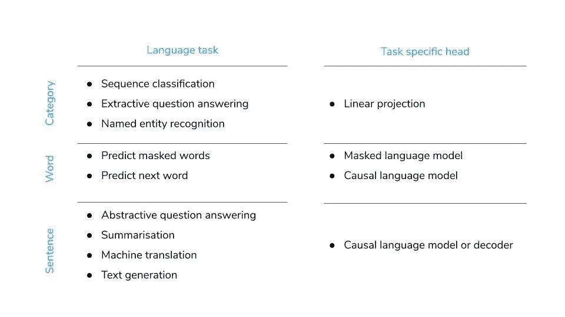
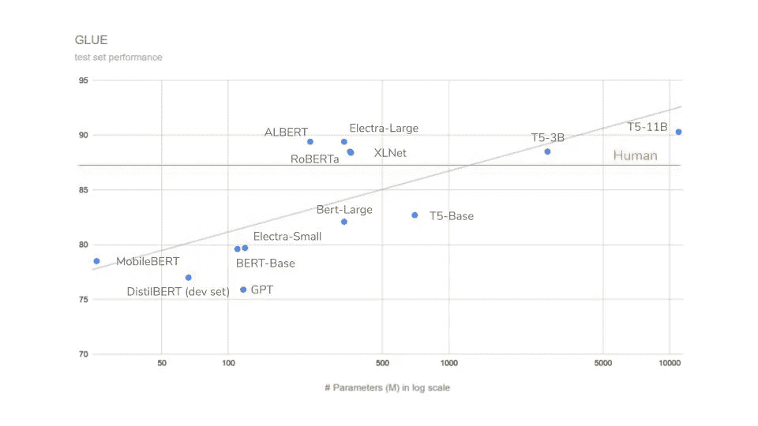
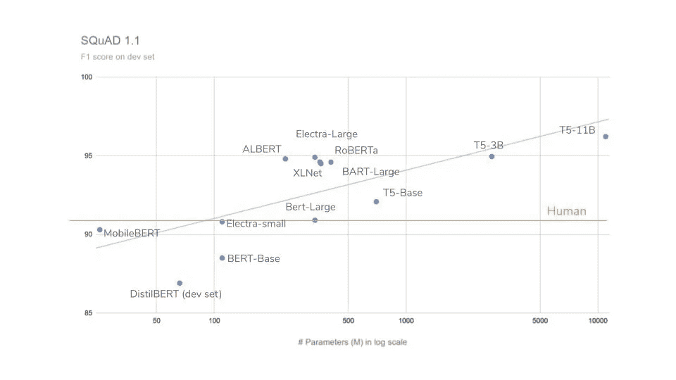
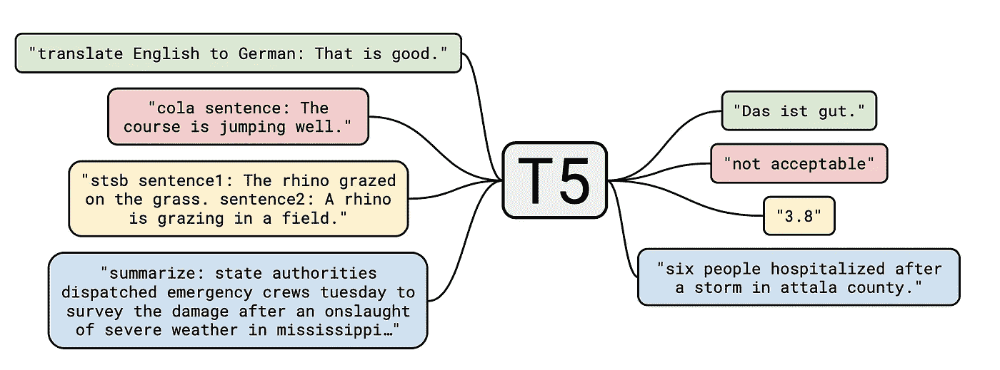
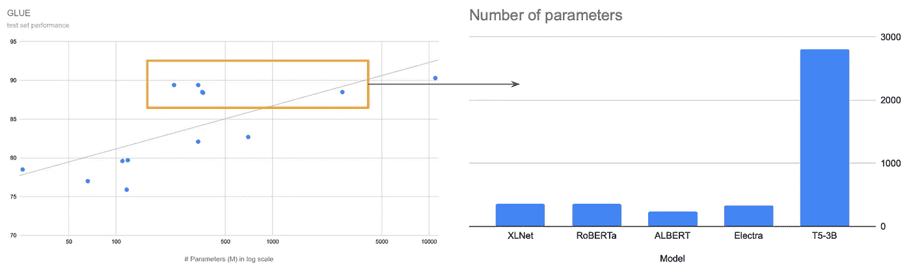

# GPT 3，变形金刚和自然语言处理的野生世界

> 原文：<https://towardsdatascience.com/gpt-3-transformers-and-the-wild-world-of-nlp-9993d8bb1314?source=collection_archive---------14----------------------->


兰亭集序 Image from: [https://zh.wikipedia.org/wiki/%E8%98%AD%E4%BA%AD%E9%9B%86%E5%BA%8F](https://zh.wikipedia.org/wiki/%E8%98%AD%E4%BA%AD%E9%9B%86%E5%BA%8F)

# 介绍

科技世界充满了迷人的恶魔。时不时地，我们会对一个新的发展感到敬畏，而不是没有一丝恐惧。OpenAI 最近开发的自然语言处理(NLP)模型 GPT-3 正是这样一种生物。《卫报》发表了一整篇由 GPT 3 号生成的文章。虽然没有真正达到《卫报》的标准，但这篇文章令人信服地连贯起来，而且可能很像人类。权衡潜在的影响，OpenAI 决定只向少数选定的合作伙伴开放 API 访问。一个可以理解的选择，有人可能会说:我们还不想释放恶魔。

GPT-3 确实是深度学习 NLP 模型家族中最新也可以说是最强大的成员，包括作为其超级明星的**变形金刚** (2017)、**伯特** (2018)、 **GPT 系列** (2018、2019、2020)和 **T5** (2019)。在此基础上，研究团体提出了许多变化和改进，在许多 NLP 基准任务上接近甚至超过了人类的表现。

与此同时，**Huggingface.co**和**艾伦人工智能研究所**已经做了一项伟大的工作，将不同的模型打包在一起，降低了实际应用的门槛。突然，感觉所有最酷的厨房小工具(目前除了 GPT-3)都在等着你调制最美味的食物。自然问题来了，用什么，煮什么？

作为一个 NLP 和深度学习爱好者，我一直在做我的小研究。我认为，写一篇小文章来回顾不同的变形金刚(又名厨房小工具)会很有趣，根据它们的特点将它们与趋势用例(又名食谱)相匹配。为了增加一点咨询的氛围，我将从一个简单的框架开始，帮助我们进行推理。但是如果你已经了解这个领域，并且绝对讨厌框架，可以直接进入**技术部分**(第 2 部分)。如果你只是想要一个要点摘要，或者好奇“机器”能写得多好，请往下看**最后的话**(第 3 部分)。

*【和往常一样，所有幻灯片都可以直接找到* [***这里***](https://docs.google.com/presentation/d/e/2PACX-1vRzCqfKCppd00Mgaj_lQoqZqzJHlk14TJ67xjKYnj5xOpzpHtF1gDZA9uEmvbvMjoBVV8TnQjOInwOC/pub?start=false&loop=false&delayms=3000)

# *第一部分。NLP 用例的简单框架*

*NLP 的目标是构建系统(机器、算法)来理解语言并执行与语言相关的任务。由于语言在我们的社会中起着如此重要的作用，自然语言处理的应用领域似乎是无限的。从网上购物到报税，我们不断地阅读文本并采取后续行动。一个完美的 NLP 机器人，让我们称他为内特，将能够像人类一样理解和采取行动。要做到这一点，内特需要具备以下能力。*

*   ***感知**:这是内特的耳朵和眼睛。它捕捉现实世界中的声音或图像，并将它们转换成计算机的输入信号(文本)。语音识别和光学字符识别(OCR)方法通常用于这一部分。*
*   ***理解**:这是内特的大脑。这个组件负责提取信息，形成知识。从单词嵌入、LSTM 到变形金刚，深度学习技术近年来得到了发展，以实现更高水平的理解。*
*   ***执行**:这是内特根据自己的理解采取行动和沟通的方式。执行过程可以像做二元选择一样简单，也可以像写论文一样复杂。*

*由于这个概念与 transformer 系列无关，我们将只讨论理解和执行组件。*

## ***1.1 二维用例及任务***

*理解和执行的复杂性将构成我们框架的两个维度。此外，单词、句子和文档将在两个维度上代表复杂性递增的 3 个级别。因此，我们可以在二维散点图上安排一些 NLP 用例，如下所示。自然，位于右上角的任务是最难处理的，可能需要一些深度学习的魔法。*

**

*如果你讨厌模糊的图片，点击 [***这里***](https://docs.google.com/presentation/d/e/2PACX-1vRzCqfKCppd00Mgaj_lQoqZqzJHlk14TJ67xjKYnj5xOpzpHtF1gDZA9uEmvbvMjoBVV8TnQjOInwOC/pub?start=false&loop=false&delayms=3000)**寻找原始幻灯片。***

**在学术界，与“用例”最接近的词是“任务”。经典的语言任务包括情感分析、词性标注(POS)、自然语言推理(NLI)、文本蕴涵识别(RTE)、问答等。每个任务都有自己的目标、基准数据集和评估指标( **PapersWithCode** 有一个很好的总结[这里](https://paperswithcode.com/area/natural-language-processing))。任务有时被集中在一起，以给出模型的一般评估。 [GLUE](https://gluebenchmark.com) 、 [BLEU](http://nlpprogress.com/english/machine_translation.html) 、 [SQuAD](https://rajpurkar.github.io/SQuAD-explorer/) 和 [RACE](http://www.qizhexie.com/data/RACE_leaderboard.html) 都是最受欢迎的，新车型往往以打破这样或那样的测试记录而自豪。**

**为了给你的用例找到一个好的模型，检查模型在最能反映你的用例需求的任务(或者标准化测试)上的表现是很有帮助的。为此，我们的二维散点图可能会再次有所帮助。**

****

**如果你讨厌模糊的图片，点击 [***这里***](https://docs.google.com/presentation/d/e/2PACX-1vRzCqfKCppd00Mgaj_lQoqZqzJHlk14TJ67xjKYnj5xOpzpHtF1gDZA9uEmvbvMjoBVV8TnQjOInwOC/pub?start=false&loop=false&delayms=3000)**寻找原始幻灯片。****

## *****1.2 添加约束*****

***除了简单的 2D 框架，我们不应该忘记现实世界的约束。他们迫使我们通过排除法来缩小小工具的选择范围。一些最常见的是:***

*   *****延迟**:系统需要对最终用户做出快速反应吗？如果是这样的话，你就处于低延迟状态，这需要一个快速的模型，并且很可能会排除 transformer 家族中的一些矮胖的家伙。***
*   ***计算能力:计算能力的问题有时是预算问题，有时是设计选择。但无论如何，在 iPhone 和云 TPU 上运行相同的模型可能不是一个好主意。***
*   *****准确性**:如果期望模型进行医疗诊断，我们应该对误差有极低的容忍度，并且应该总是优先选择更高性能的模型。另一方面，对于新闻推荐者来说，90%和 92%的准确率之间的差异可能根本不是问题。***

## *****1.3 奥卡姆剃刀*****

***这一部分实际上是一个很大的免责声明。尽管它们可能很奇特，但深度学习模型通常不是正确的解决方案。transformer 系列非常适合句子和文档级别的理解。所以，如果你的用例只需要单词级别的理解和执行，你可能不需要变形金刚这种笨重的机器。***

***事实上，对于许多 NLP 用例来说，像 TF-IDF 这样的老派特征工程技术结合随机森林可能已经足够好了。虽然新技术可能会带来精确度的巨大提高，但实际价值影响可能不值得努力改进系统设计或扩大计算能力。对我来说，现实生活中一个伟大的解决方案应该永远是最简单的，满足所有要求的方案。***

***好了，记住这一点，让我们仔细看看变形金刚系列。***

# ***第二部分。大胆尝试更技术性的东西***

***为了保持这篇文章的合理长度，我们将把我们的讨论限制在 Huggingface.co 的包 **transformer** 中提供的模型。Huggingface.co 不仅提供了超过 [20 个架构](https://huggingface.co/transformers/model_summary.html)的源代码，还提供了 90 个[预训练模型](https://huggingface.co/transformers/pretrained_models.html)，还不包括社区贡献。他们还简化了界面，这样你就可以用几行代码测试 GPT-2，或者用一个简短的脚本微调 T5。软件包的稳定性还有待全面测试，但它们无疑为使用不同的 NLP 模型和试验您自己的想法提供了一个很好的起点。(本文不是 Huggingface.co 赞助的，虽然我不会介意……)***

## ***2.1 共同主题***

***深度学习技术已经用于 NLP 有一段时间了，但直到 transformer 的诞生，我们才看到了显著的改进。Jay Alammar 已经写了一系列精彩的文章来说明这些模型是如何工作的。抛开技术细节，我们可以注意到一些可能导致他们成功故事的共同因素:***

*   *****注意力头**:注意力头是 transformer 系列的定义特征之一，自第一篇 Transformer 论文(Vasvani 2017)首次提出以来一直被使用。它提供了一种高度灵活的方法来合并上下文信息(即，单词/令牌如何与句子或文档中的其他单词相链接)，取代了 RNN 和 LSTM 等递归解决方案。***
*   *****迁移学习**:除了翻译，针对特定语言任务的标注数据很少，对于复杂的深度学习模型根本不够用。预训练和微调范例通过允许不同任务之间的知识转移克服了这个问题。例如，利用大量未标记数据的预训练阶段的一般任务，以及使用少量但有目标且有标记的数据的微调阶段的特定任务。还探索了其他类型的知识转移(T5，GPT-3)，并证明非常有益。***
*   *****破坏和重建策略** : BERT 有一个巧妙的想法，用填空练习来预先训练模型，在填空练习中，文本首先通过屏蔽一些单词(记号)来破坏，然后由模型来重建。这个练习促进了所有语言任务的显著进步。从那时起，掩蔽几乎成为一种标准的训练前策略，导致了几个创新的变化(XLNet，RoBerta，BART)。***

## ***2.2 架构***

***在架构方面，transformer 模型非常相似。大多数模型遵循与“开国元勋”之一，最初的变形金刚，伯特和 GPT 相同的架构。它们代表三种基本架构:仅编码器、仅解码器以及两者皆有。***

*   *****Encoder only(BERT):**Encoder 通常是一堆注意力和前馈层，将输入的文本序列编码成上下文化的隐藏状态。为了生成不同输出格式的语言任务，通常会在编码器上添加一个特定于任务的头。例如，一个因果语言模型(CLM，或简称 LM)头来预测下一个单词，或一个前馈(线性)层来产生分类标签。***
*   ***仅解码器(GPT ):在许多方面，带有 CLM 磁头的编码器可以被认为是解码器。解码器不是输出隐藏状态，而是以自动回归的方式生成序列，从而将先前生成的字用作输入来生成下一个字。***
*   *****Both (Transformer)** :当编码器和解码器存在于相同的结构中时，它们之间的区别最有意义，就像在 Transformer 中一样。在编码器-解码器结构中，输入序列首先被“编码”成隐藏状态，然后被“解码”以生成输出序列。编码器和解码器甚至可以共享相同的权重，以提高训练效率。***

******

***如果你讨厌模糊的图片，点击 [***这里***](https://docs.google.com/presentation/d/e/2PACX-1vRzCqfKCppd00Mgaj_lQoqZqzJHlk14TJ67xjKYnj5xOpzpHtF1gDZA9uEmvbvMjoBVV8TnQjOInwOC/pub?start=false&loop=false&delayms=3000)**寻找原始幻灯片。*****

***该模型的架构通常会限制它可以执行的任务类型:编码器(没有任何特定于任务的头)只输出隐藏状态，这些隐藏状态可以作为功能合并到其他模型中。解码器(或编码器+解码器)是为文本生成而创建的，这使它们适合于机器翻译、摘要和抽象问答等任务。特定于任务的标题在输出格式上提供了额外的灵活性，允许对分类相关的任务进行微调。***

******

***如果你讨厌模糊的图片，点击 [***这里***](https://docs.google.com/presentation/d/e/2PACX-1vRzCqfKCppd00Mgaj_lQoqZqzJHlk14TJ67xjKYnj5xOpzpHtF1gDZA9uEmvbvMjoBVV8TnQjOInwOC/pub?start=false&loop=false&delayms=3000)**寻找原始幻灯片。*****

## ***2.3 趋势***

***除了 3 个基本架构之外，还有几个创新的修改，我们稍后会讨论。不过总的来说，我感觉变形金刚方面的研究遵循了几个大趋势。影响最大的显然是:扩大规模。***

*   *****趋势 1:扩大规模*****

***深度学习模型变得越来越大，越来越深入，消耗越来越多的数据和计算能力。变形金刚也不例外。自从 BERT 的无监督预训练释放了数千亿在线数据的力量，训练更大的模型成为可能。最大的 GPT-3 有 1750 亿个参数，是最大的 BERT 的 500 多倍。如果我们将不同模型(GLUE 和 SQuAD 1.1)的性能与它们的参数数量进行比较，我们可以看到一个大致的对数线性趋势。(GPT 系列没有包括在内，因为它们没有针对这些任务进行微调，只能产生平庸的结果，这并不是他们的错。)由于基准数据集中的多样性，更难获得诸如总结或翻译等任务的定量视图。然而，GPT-3 在《卫报》上的文章似乎证明了“越大越聪明”。***

******

***如果你讨厌模糊的图片，点击 [***这里***](https://docs.google.com/presentation/d/e/2PACX-1vRzCqfKCppd00Mgaj_lQoqZqzJHlk14TJ67xjKYnj5xOpzpHtF1gDZA9uEmvbvMjoBVV8TnQjOInwOC/pub?start=false&loop=false&delayms=3000)**寻找原始幻灯片。*****

******

***如果你讨厌模糊的图片，点击 [***这里***](https://docs.google.com/presentation/d/e/2PACX-1vRzCqfKCppd00Mgaj_lQoqZqzJHlk14TJ67xjKYnj5xOpzpHtF1gDZA9uEmvbvMjoBVV8TnQjOInwOC/pub?start=false&loop=false&delayms=3000)**寻找原始幻灯片。*****

*   *****趋势二:无缝转移*****

***第二个趋势是迁移学习的普遍化。这是事情变得更有趣的地方。我们已经提到了预训练+微调范式如何加速了这一领域的研究。然而，不同任务之间的知识转移，或所谓的“多任务”，仍然不明显，主要是不同的任务需要不同的任务特定的头。然而， **T5** 很好地解决了这个问题，它将所有任务重新组织成一个统一的“**文本到文本**格式，从而消除了对特定于任务的架构的需求。使用相同的架构，通过简单地改变数据和损失函数，知识可以在预训练和不同的微调任务之间“平滑地”转移。***

******

***这是谷歌在 T5 发布的论文中的一张图片***

***另一方面，GPT 系列选择了完全不同的方式。事实上，GPT-3 完全拒绝了“微调”的想法，提出了一个假设，即给定足够多的数据和足够多的参数(数量大得离谱)，一个模型根本不需要微调。这意味着不仅架构在不同的任务中保持不变，而且整个模型参数也保持不变。它希望创造一种多面手机器，能够像人类一样理解指定为自然语言的新任务。尽管还没有完全胜利，GPT 3 号已经取得了惊人的成绩。微调的自由知识转移在各种语言任务中或多或少成功地发挥了作用。在实践中，除了少数有权势的人(GAFA)之外，几乎所有人都部署这样一个庞大的模型是很不现实的，更不用说它所引发的整个伦理问题了。但 GPT-3 无疑在人工智能领域创造了自己的时尚。***

> ***对于所有的任务，GPT-3 被应用**，没有任何梯度更新** **或微调**，任务和少数镜头演示纯粹通过与模型的文本交互来指定。GPT-3 在许多 NLP 数据集上实现了**强大的性能**……”***
> 
> ***— [语言模型是一次性学习者](https://arxiv.org/abs/2005.14165)***

*   *****趋势 3:智能效率*****

***在巨人家族中，有少数离群者对效率更感兴趣，并设法用较小的框架取得了良好的结果。他们是生活在受限于有限数据和计算资源(T21)的世界中的实际玩家，就像我们中的许多人一样。***

*****XLNet** 提出了一个很好的解决由注意力面具引起的伯特差异问题的方法，**罗伯塔**调整了面具和训练程序，**巴特**试验了各种面具策略。它们都在不增加模型规模的情况下成功地提高了 BERT 的性能。***

***在另一个方向，创新的方法被创造出来，在不损害性能的情况下缩小模型的大小: **ALBERT** 在参数共享方面走得很激进，**伊莱克特**在 GAN 身上找到了灵感， **MobileBERT** 利用教师的强制力使网络变得又深又细。**重整器**将注意力头的复杂度从 O(N)降低到 O(N *log* N)。这些模型是性能与规模图表上的异常值。它们可能也是最友好的应用程序。***

******

***XLNet、RoBERTa、ALBERT 和伊莱克特以小得多的架构实现了与 T5–3B 不相上下的性能。如果你讨厌模糊的图片，点击 [***这里***](https://docs.google.com/presentation/d/e/2PACX-1vRzCqfKCppd00Mgaj_lQoqZqzJHlk14TJ67xjKYnj5xOpzpHtF1gDZA9uEmvbvMjoBVV8TnQjOInwOC/pub?start=false&loop=false&delayms=3000)**寻找原始幻灯片。*****

*   *****趋势四:专家们*****

***最后一个趋势很可能不是趋势。它们是为了特殊目的而修改和调整的 BERT、GPT 或 Transformer:**long former**和 **Transformer-XL** 专注于冗长的文档， **CamemBERT** 和 **FlauBERT** 无疑具有法语根源， **Ctrl** 在文本生成方面提供更多控制， **DialoGPT** 旨在成为您健谈的朋友， **Pegasus** 为摘要而生像在任何其他领域一样，专家们在他们的领域里大放异彩，而且很可能只在他们自己的领域里。因此，找到最佳匹配对我们来说至关重要。***

## ***2.4 实践资源***

***Huggingface.co 提供的变形金刚套装非常容易使用。[管道 API](https://huggingface.co/transformers/quicktour.html) 提供了一个简单的高级接口来应用预定义的任务，实际上只有 3 行代码。***

```
***from transformers import pipeline
classifier = pipeline('sentiment-analysis')
classifier('We are very happy to show you the 🤗 Transformers library.')***
```

***您还可以找到更多关于预培训或微调不同型号的[笔记本示例](https://huggingface.co/transformers/notebooks.html)。***

***除了 Huggingface.co，我还在以下地方找到了非常有用的资料。***

*   ***[艾伦人工智能研究所](https://allennlp.org)***
*   ***[纸张编码](https://paperswithcode.com)***
*   ***杰·阿拉玛***
*   ***[OpenAI](https://openai.com)***

***不过平心而论，**arXiv.org**和 **Github** 大概还是最好的。***

# ***第三部分。最后的话***

***这篇文章比我预想的要长得多，写这篇文章花费的时间也比我预期的要多。如果你已经设法到达这里，感谢你杰出的耐心。***

***每次当我读一篇长文章时，我总是梦想得到它的要点摘要。懒惰可能是研究的最大动机之一。在后见之下，也许让 T5 为我总结二十多篇论文会更方便。为了弥补失去的机会，下面是**T5-large**(110 亿参数)给出的总结。你觉得这样够好了吗？***

```
***GPT-3 is the latest and arguably the most powerful member of a family of deep learning NLP models . the model has been developed by openAI, but only API access is available for pre-selected partners . sam saunders: "it feels like all the coolest kitchen gadgets" are just waiting for you to concoct the finest meal .a perfect NLP robot, let's call him Nate, would be able to understand and take actions like a human-being . to make that happen, Nate needs to have several components . word, sentence and document represents 3 levels of increasing complexities in reading (comprehension) and writing (execution)a great solution in real life should always be the simplest one that satisfies all the requirements . the transformer family provides powerful tools to solve sentence and document level comprehension tasks . if your use case only requires word level comprehension and execution, chances are you may not need the heavy machinery of transformer .transformer provides the source code of more than 21 architectures and 90 pre-trained models . attention head is one of the defining features of the transformer family . the pre-train and fine-tuning paradigm allows knowledge transfer between different tasks .transformer models follow the same architecture as one of the "founding fathers", the original transformer, BERT and GPT . the distinction between encoder and decoder makes most sense when they both exist in the same structure, as in transformer . encoders are usually a stack of attention and feed-forward layers, which encode the input text sequence into contextualised hidden states . a task specific head is often added on top of the encoder .transformers models are becoming larger and deeper, consuming ever more data and computation power . the largest GPT-3 has 175 billion parameters, which is more than 500 times the largest BERT . in practice, it would be quite unrealistic for almost everyone except the powerful few to deploy such a gigantic model .a few outliers are more interested in efficiency, and managed to achieve good results with smaller frames . the last trend is probably not a trend. they are the BERTs, GPTs or Transformers that have been modified and tweaked for a special purpose .pipeline API provides a simple high-level interface to apply pre-defined tasks . pipeline classifier = pipeline('sentiment-analysis') classifier('We are very happy to show you the  Transformers library')***
```

***脚本:***

```
***from transformers import pipelinesummarizer = pipeline("summarization", model="t5-large", tokenizer="t5-large", framework="pt")with open('nlp_article.txt', 'r') as file:
    article = file.read()paragraphs = article.split(r"*****")
len(paragraphs)paragraphs = [par for par in paragraphs if len(par.split(" ")) >= 10][len(par.split(" ")) for par in paragraphs]results = summarizer(paragraphs, min_length=5, max_length=100)for x in results:
    print(x["summary_text"] + "\n")***
```