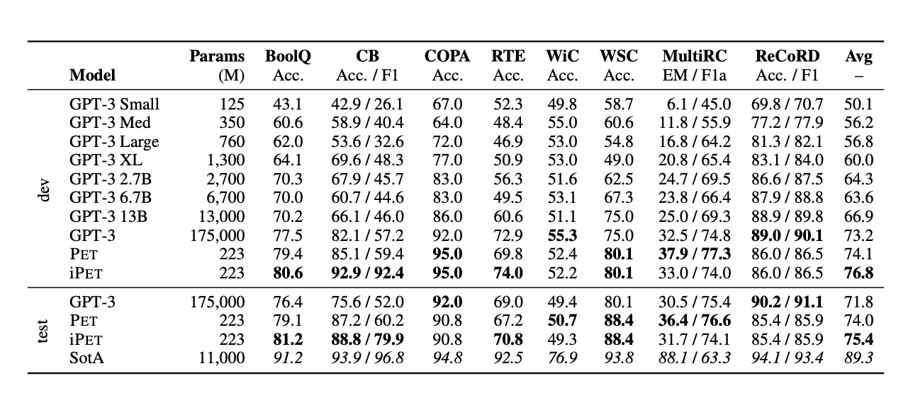

# GPT-3 vs 宠物:不大但很美

> 原文：<https://towardsdatascience.com/gpt-3-vs-pet-not-big-but-beautiful-7a73d17af981?source=collection_archive---------31----------------------->

简约之美(作者图片)

## 模式开发训练导论

# 庞大语言模型的压倒性世界

自从迁移学习在自然语言处理中出现以来，为了使越来越复杂的语言任务成为可能，已经出现了越来越大的模型。

但是模型越复杂，它需要训练的时间和数据就越多。最新的 GPT-3 模型在大多数自然语言任务中取得了最先进的结果，但它有近 1750 亿个参数要训练，并且需要**年**来训练！

## 那么有没有解决的办法呢？

Timo Schick 和 Hinrich Schutze 提出了一种集合掩蔽语言模型训练[方法](https://arxiv.org/pdf/2009.07118.pdf)，这种方法已经被证明与 Open AI 革命性的 GPT-3 模型一样有效，但只需要 GPT-3 所需参数的 0.1%！很精致，不是吗？

但是他们是如何实现这一惊人壮举的呢？
他们使用一种叫做模式开发训练的方法，将大多数 NLP 任务建模为一组固定的问题模式，并在这些模式上训练多个掩蔽语言模型。这使得他们能够使用更小、相对更弱的语言模型来建立一个集合，这是一个非常强的语言模型。

# 介绍模式开发

如果你曾经有过语言包容性考试的经历(雅思、托福、GRE 或 GMAT，或任何有语言部分的考试)，你一定遇到过这样的问题:句子中有空格，给出了四种可能的单词选择，从中可以填充空格。这种测试被称为完形填空。

Schick 和 Schutze 以完形填空的形式模拟 NLP 任务，允许一组屏蔽语言模型预测能够有意义地填补空白的前 **k** 个可能的单词/标记。

原始的基于 PET 的模型只能预测单个单词(每个输入记录只能预测一个单词)。然而，作者通过修改 PET 方法来预测多个表征，克服了这一限制。

原文：<https://arxiv.org/pdf/2009.07118.pdf>

## 成对动词

对于像 GPT-3 这样的庞大模型，该模型通过给出 32 个任务的例子来微调特定的任务。这个过程被称为“引发”。

在 PET 中，选择了另一种微调方法:创建模式描述符对。

我将使用论文中对核心思想的描述，并解释其工作原理:

“设 M 是一个屏蔽语言模型(MLM)，T 是它的词汇，而∈ T 是屏蔽令牌。”
文中举了一个单 MLM 的例子。这个想法可以扩展到用户希望在他们的系综中使用的任何数量的 MLM。与所讨论的任务相关联的词汇被认为是 T(这是您的输入/训练文本数据中的唯一单词集)。被屏蔽的令牌由-。由于宠物已经被修改为包含不止一个面具，该模型被认为根据用户的要求有 **k** 个面具。

**对于一些至少包含 k 个掩码的 z ∈ T_*和令牌 t ∈ T，我们用 q_k_M(t | z)表示 M 在 z 中第 k 个掩码位置赋给 T 的概率；** **应用 softmax 前的模型逻辑用 s_k_M(t | z)表示。z 表示完形填空格式的输入记录，它至少由 k 个掩码组成。对于任务词汇表中的每个标记 t，屏蔽语言模型 M 分配给输入记录 z 中第 k 个屏蔽位置的标记的概率由 q_k_M(t|z)给出。M 对应的 logit(指数函数)由 s_k_M(t|z)给出。**

一组输入(在图中用 x 表示；输入集合由 X 表示)需要被映射到相应的输出(在图示中由 y 表示；输出组用 Y 表示)。为了完成这项任务，需要一组模式描述器。每个模式描述符对由以下部分组成:
模式 **P** :将 X 中的输入映射到 T_*中包含单个掩码的完形填空问题
描述符 **v** :将 Y 中的每个输出映射到 T 中的单个标记。这些标记中的每一个都代表它们在模式 **P** 中的特定于任务的含义。

这些含义将描述者与模式联系起来。

**PET 的核心思想是从 v(y)在 P(x)中的屏蔽位置成为“正确”令牌的概率，推导出 y 成为 x 的正确输出的概率。** 现在我们正在使用模式(代表输入)和动词(代表输出)，我们需要使用某个动词输出对于给定模式是正确的概率，来获得给定输入的正确输出(条件概率模型)。

为了完成一个单一的任务，对一个单一的屏蔽语言模型进行 PET 就是这样做的。

用有限的数据集(32 个例子)很难对上述模型进行微调。因此，不是使用单个语言模型，而是在一个未标记的数据集上使用一个 **n** 语言模型的集合(软标记取决于输出的概率分布)。常规监督分类器使用这种软标记数据来微调 PET 模型。

图片来自原纸:[https://arxiv.org/pdf/2009.07118.pdf](https://arxiv.org/pdf/2009.07118.pdf)

## **插图:**

**应用 PVP p = (P，v)识别文本蕴涵:**

一个输入 x = (x1，x2)转换成完形填空题 P(x)；这里 x 是一个问题和一个答案，分解成一个问题 x1，一个面具，一个答案 x2。动词化器输出需要预测屏蔽位置 v(y)中的标记。基于预测的令牌，将推断出输出(y)。如图所示，y 有两个选择:包含和不包含(“not _ impertisement”)。每个 y 的 q_p(y | x)是从 v(y)成为屏蔽位置的合理选择的概率中导出的。具有最高概率的 y 值将被加到输入 x 上

这就是 PET 的工作原理。

# 与 GPT 3 号的性能比较

作者(Schick 和 Schutze)使用强力胶作为基准，比较了 PET 和 GPT-3 的性能。选择了一系列语言任务:BoolQ，CB，COPA，RTE，WiC，WSC，MultiRC 和 ReCoRD。由于 GPT-3 已经在一个巨大的数据集上进行训练，为了消除它对 PET 的优势(创造一个公平的竞争环境)，他们创建了一个新的 32 个例子的训练数据集。

此外，他们创建了 FewGLUE 数据集，它基本上是每个任务的 20，000 个未标记示例的集合。这个数据集用于训练模型。

下表摘自论文，定量比较了 GPT-3 和 PET:

图片形式原文：<https://arxiv.org/pdf/2009.07118.pdf>

这篇论文本身相当全面，讨论了如何端到端地应用 PET 的思想，还描述了 PET 的迭代风格及其优点。关于如何定制模型的更多实验和细节，请参考参考资料中提到的论文和 git 库。

# 结论

这项研究已经证明，语言模型不一定是人类语言才有效。探索句型可以在语言任务中带来同样有效的表现，而不需要那么多的参数。

# **参考**

[https://arxiv.org/pdf/2009.07118.pdf](https://arxiv.org/pdf/2009.07118.pdf)T12[https://github.com/timoschick/pet](https://github.com/timoschick/pet)