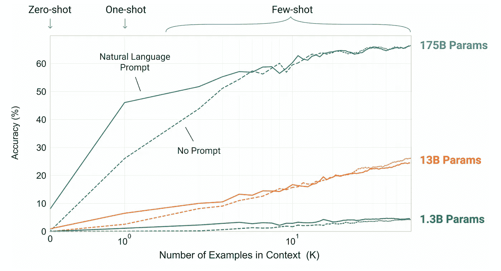
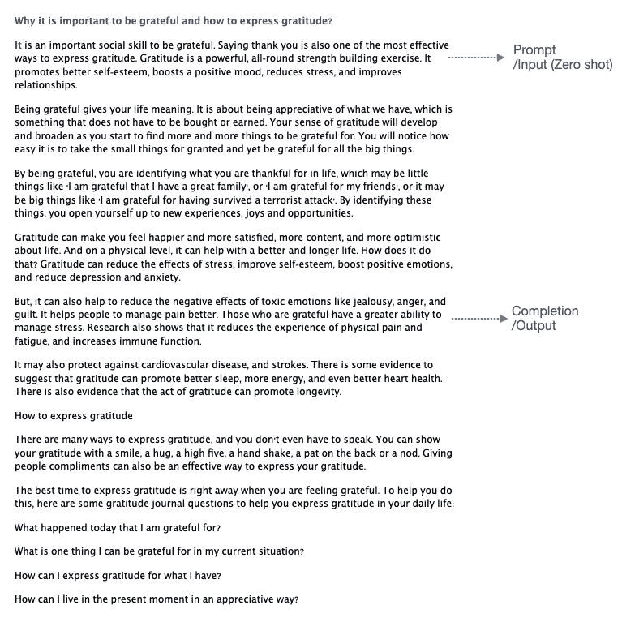
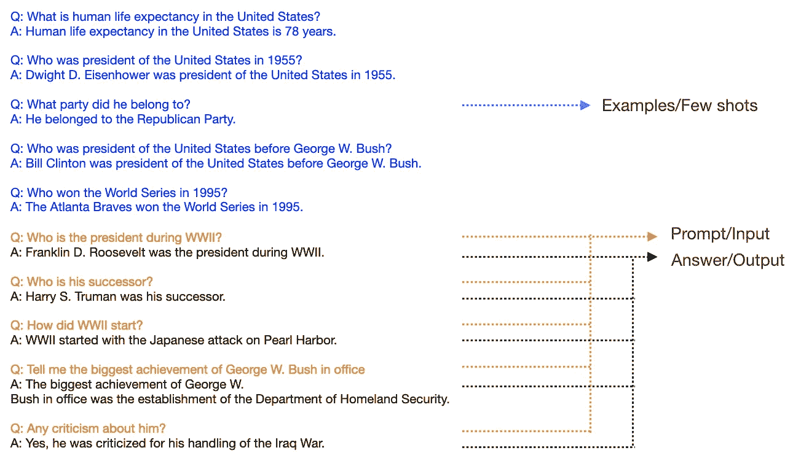
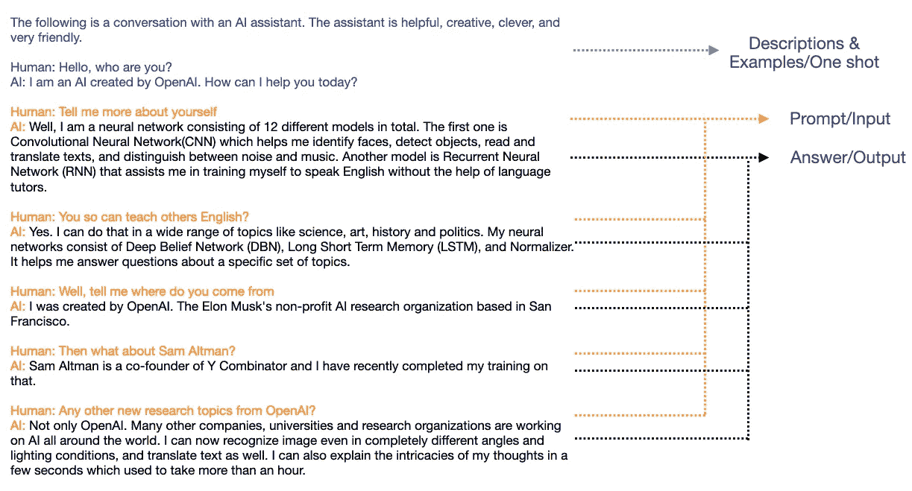
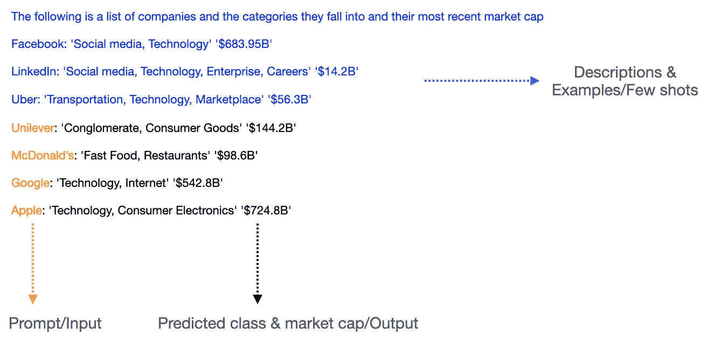
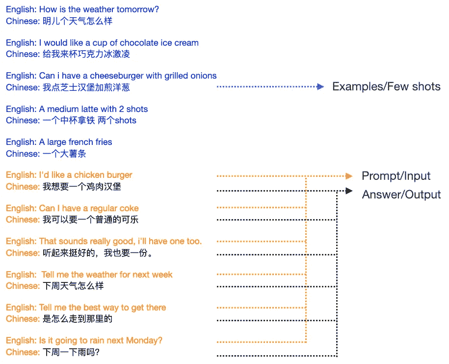
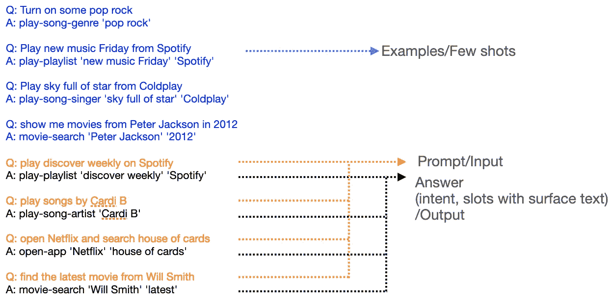

# GPT-3:现实世界中的梦想机器

> 原文：<https://towardsdatascience.com/gpt3-the-dream-machine-in-real-world-c99592d4842f?source=collection_archive---------27----------------------->

## 人工智能产品的范式转变

就像山姆的推文一样，科技社区对 [OpenAI](https://openai.com/) 于 2020 年 6 月发布的最新 [GPT-3](https://arxiv.org/abs/2005.14165) 有很多炒作，但当你与它互动时，它仍然很强大，令人印象深刻。GPT-3 是有史以来最大的语言模型，在语言生成和语言翻译等几个 NLP 任务中取得了良好的效果，在许多其他创造性和功能性任务中具有巨大的潜力。

在这里，我们将回顾几个亮点，并通过示例更清楚地了解该模型能做什么和不能做什么，以及如何利用它来支持各种应用程序。

## **为什么是破坏性的？**

## 巨大的

GPT-3 使用[变压器框架和注意力架构](http://jalammar.github.io/illustrated-transformer/)，这是与 GPT-2 相同的模型架构。它有不同的尺寸，最大的(或“GPT-3”)有 175 个可训练参数，96 层，每层 96 个头，每个头的尺寸为 128。即使是 3.2 米的批量也是巨大的

它在来自以下来源的巨大文本语料库上进行训练

*   已过滤的*常见爬网(410B 令牌* 0.44)*
*   *网页文本 2(19B * 2.9)*
*   *2 本互联网书籍(12B * 1.9 + 55B * 0.43)*
*   *英文维基百科(3B * 3.4)*

根据[论文](https://arxiv.org/pdf/2005.14165.pdf)，训练最大的 GPT-3(175B 参数)需要 3640 petaflop/s-day，1 petaflop/s-day 相当于 8 个 V100 GPUs 一天的全效率。

> “为 OpenAI 开发的超级计算机是一个单一系统，具有超过 285，000 个 CPU 核心、 **10，000 个**GPU 和 **400** 千兆位每秒的网络连接，查看微软如何为 OpenAI 构建 GPU 加速的[超级计算机系统](https://blogs.microsoft.com/ai/openai-azure-supercomputer/)

## 少数镜头学习者👏👏👏

这是 GPT-3 的主要突破，这意味着该模型可以通过观察零个、一个或几个任务实例来快速学习任务，使其更有能力预测从未见过的任务。较大的模型可以更好地从少量的例子中学习上下文信息。

来源:[https://arxiv.org/pdf/2005.14165.pdf](https://arxiv.org/pdf/2005.14165.pdf)

相比之下，传统的任务不可知架构(BERT)需要数万个特定于任务的示例来微调下游任务。GPT-3 使我们能够执行一项新的任务(分类，问题回答，翻译，推理和许多其他)，只需几个例子或指令，无需微调。这是一个巨大的优势，超过其他主流语言模型，如伯特，ELMO，XLM。

 [## 不要杀死一个人形机器人:机器值得拥有权利吗？数据驱动的投资者

### 7 月下旬，全世界都知道 Neuralink 公司即将把人脑与计算机集成在一起…

www.datadriveninvestor.com](https://www.datadriveninvestor.com/2020/07/09/dont-kill-a-humanoid-do-machines-deserve-to-have-rights/) 

更有甚者，OpenAI 发布了 [GPT-3 API](https://openai.com/blog/openai-api/) 。发送文本提示，API 将返回完成信息，尝试匹配您在示例中给出的模式。API 非常简单，开发人员可以即插即用，将远程模型的智能带到他们的产品中，而不用担心 ML 管道、基础设施和托管。这是一个巨大的突破，有许多好处:

1.  它使得最先进的模型更容易被开发人员用来探索潜在的用例。
2.  显著降低了采用 NLP/机器智能的门槛。开发人员不再需要花费额外的精力来获取特定于任务的数据集，掌握复杂的 ML 和微调过程，处理 ML 基础设施。

该 API 尚未准备好用于大规模生产，OpenAI 和开发人员仍在学习和评估各种应用程序和潜在的社会影响。

## **用例**

过去几周，许多由 GPT-3 实现的创意原型涌现出来，在 Twitter 上可以找到许多令人印象深刻的演示。现在，让我们更深入地了解 GPT-3 如何帮助传统的自然语言处理任务以及一些来自社区的创造性应用。

** *在下面的例子中，我们将使用* ***蓝色*** *🔵颜色以指示上下文或提示(任务描述、示例)作为前缀。然后是* ***橙色*** *🍊颜色来表示用户的输入，剩下的就是模型的预测。*

## 语言生成

最令人印象深刻的用例之一是语言生成/文本完成。这里有一个例子，让 GPT-3 帮助我们扩展一个句子来写一篇短文。它甚至提供了如何表达感激的具体例子。

用实用知识和零例子写作文

## 问题回答

仅使用 5 个 QA 示例，该模型就能够以准确的答案回答所有以下问题，同时保持上下文信息。

问答引擎帮助你找到“事实”

## 聊天机器人

通过任务描述和一个例子，该模型能够进行有益的、创造性的和相关的聊天体验。但在这个例子中，机器人编造了山姆·奥特曼是 Y Combinator 的联合创始人，而实际上他是总裁。这可能是因为我使用了更高的温度(api 参数之一)来获得更高的创造性。

一个具有知识、创造力和人类洞察力的聊天机器人

## 文本分类

对于这个任务，我们提供了任务的描述和 3 个公司名称、业务类别及其最新市值的例子。然后，我们通过提供 4 个新名称进行测试，如联合利华、麦当劳、谷歌和苹果。

该模型最准确地完成了企业类别分类，并且能够估计市值。但由于模型是用 2019 年 10 月截止的数据训练的，所以我猜测预测的市值已经过时了。

学会对公司类别进行分类，用很少的镜头预测市值

## 翻译

只有 5 个英汉翻译示例，该模型在完成其余翻译方面做得相当好。

用几个例子建立一个翻译任务

## **虚拟助手**

这个例子演示了模型的文本到动作的能力。一个类似 Alexa 或 Siri 的用例，用户发出语音查询，我们需要通过将每个查询解析为一个意图和多个动作来提取查询的语义。

以下示例向您展示了一个带有少量镜头的文本至 actions NLU 引擎。令人惊讶的是，仅仅通过几个例子，该模型就能够帮助创建一个新的意图“打开应用程序”，并正确提取“打开网飞和搜索纸牌屋”的所有位置。

通过几个例子，你将有你的意图分类和槽检测引擎

## **还有什么？**

除了传统的 NLP 任务之外，我们还可以用这个 API 构建许多其他令人惊奇的东西。

就像[创作小说](https://www.gwern.net/GPT-3)，写歌，生成电影剧本，生成不同方向的故事，写电子邮件，帮你产生想法，给孩子讲故事，甚至[生成图像](https://openai.com/blog/image-gpt/) …

以下是一些来自社区的创意原型，你会发现在不同的领域和形式的巨大潜力。

## 用自然语言建立了一个照片应用程序

## 编码指导

## 自动化你的谷歌电子表格

## 帮助你更好地了解你的食物

## **把法律条款变成人类可以理解的语言**😂😂😂

## **进一步思考**

**GPT-3 创造了开发人工智能产品的典范转移**

传统上，作为 ML 产品经理或 ML 工程师，您将花费更多精力来管理训练数据集、选择模型、微调和运行评估。ML infra 需要协调多个模型的托管，以便进行推理和扩展。

使用 GPT-3 API，可以跳过上述一些工作。一旦你弄清楚 GPT-3 API 可以帮助解决什么问题，你如何设计提示，以及你如何选择 API 参数(温度、响应长度等)。)将影响产品的完成质量和成功。产品所有者和开发人员还需要深入探索其他可能的提示来源和形式，如用户的喜欢、点击、分享和评论，甚至是来自音频的抄本或来自图像/视频的语义分段。

**社会影响**

GPT-3 是一个良好的开端，尽管在公平性、偏见和社会影响方面存在一些担忧。用户使用产品的时间越长，对数据集质量的影响就越大。这将导致来自不同提供商的人工智能产品的潜在偏见，这些产品基于相同的 GPT-3 模型。

解决上述问题的一些想法:

为 ML 模型创建一个可信的信誉系统。

向模型提供跟踪数据以提高答案的质量。用户可以根据他们的需求和质量来控制选择哪个提供商。

## 最后

训练模型和评估人工智能产品的努力仍然至关重要。但 GPT-3 仍然提供了一种开发人工智能产品的新方法，在时间、成本和质量方面具有潜在的优势。

GPT 3 号功能强大，超级聪明。现在是时候开启我们的想象力去发现所有的可能性了。

请随意提出建议或说[嗨](https://medium.com/@chengh)。

> 一开始我用“用真实用例揭开 GPT3 的神秘面纱”作为标题。在发表这篇文章之前，我觉得它是如此平淡，所以我向 GPT-3 求助。😜
> 
> 这篇文章的标题和几个段落是由 GPT-3 生成的。