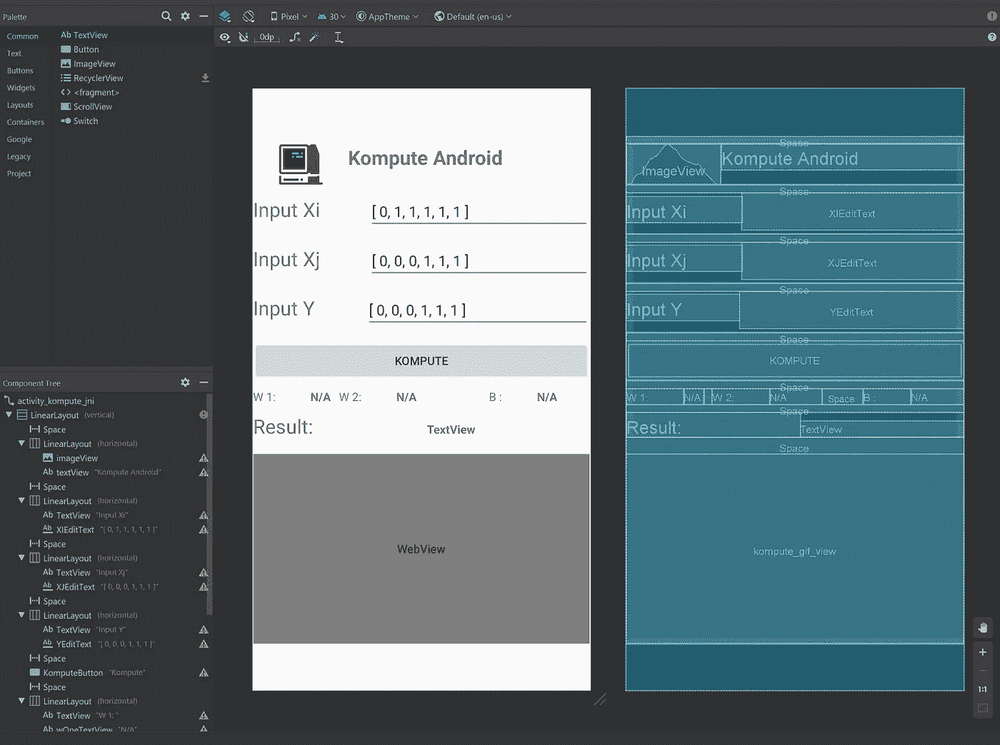

# 使用 GPU 加速您的移动应用程序使用 Android NDK、Vulkan 和 Kompute 加速机器学习

> 原文：<https://towardsdatascience.com/gpu-accelerated-machine-learning-in-your-mobile-applications-using-the-android-ndk-vulkan-kompute-1e9da37b7617?source=collection_archive---------33----------------------->

## 一个手把手的教程，教你如何利用你的手机 GPU 加速数据处理和机器学习。您将学习如何使用原生开发工具包(NDK)、Kompute 框架和 Vulkan SDK 构建一个简单的 Android 应用程序。

安卓 NDK 中的 Kompute(图片由作者提供)

如今，一些智能手机配备了笔记本电脑级别的硬件——携带高达 16GB 的 RAM、高速多核 CPU 和能够在 4k 显示器上渲染高性能复杂图形应用的 GPU。

作者图片

随着移动硬件[不断改进](https://www.mobilemarketer.com/news/mobile-games-sparked-60-of-2019-global-game-revenue-study-finds/569658/) e，挖掘这种能力——特别是 GPU 处理能力——对于设备上的数据处理能力变得越来越重要。最近，围绕[边缘计算](https://en.wikipedia.org/wiki/Edge_computing)、[联合架构](https://en.wikipedia.org/wiki/Federated_architecture)、[移动深度学习](https://arxiv.org/abs/1910.06663)等，这已经开启了令人兴奋的机遇。

本文提供了一个技术深度，向您展示了如何利用移动跨供应商 GPU 的强大功能。您将学习如何使用 [**Android 原生开发套件**](https://developer.android.com/ndk) 和 [**Kompute 框架**](https://github.com/EthicalML/vulkan-kompute) 为 Android 设备编写 GPU 优化代码。最终结果将是在 Android Studio 中创建的移动应用程序，它能够使用我们将从头开始编写的 GPU 加速机器学习模型，以及允许用户向模型发送输入的用户界面。

Android Studio 在模拟器中运行项目(图片由作者提供)

除了编程经验之外，不需要任何背景知识**，但是如果你对参考的底层 AI / GPU 计算概念感兴趣，我们建议查看我们以前的文章，“移动设备中的[机器学习&跨厂商 GPU 使用 Kompute & Vulkan](/machine-learning-and-data-processing-in-the-gpu-with-vulkan-kompute-c9350e5e5d3a) 变得简单”。**

你可以在 **资源库的 [**示例文件夹中找到完整的代码。**](https://github.com/EthicalML/vulkan-kompute/tree/master/examples/android/android-simple)**

# Android 本地开发套件(NDK)

安卓 NDK 图(图片由作者提供)

[原生开发套件(NDK)](https://developer.android.com/ndk) 是 Android 解决方案之一，旨在解决移动应用不断增长的计算需求。NDK 框架使开发人员能够编写低级、高效的 C 和 C++代码，这些代码可以通过流行的 [**Java 本地接口**](https://en.wikipedia.org/wiki/Java_Native_Interface) 绑定与 Java/Kotlin 应用程序代码进行互操作。

这种工具使移动应用程序开发人员不仅可以编写高效的代码，还可以利用现有的用 C++编写的优化框架进行高级数据处理或机器学习。

# 进入 Kompute & Vulkan SDK

与 Khronos 成员一起玩“瓦尔多在哪里”(图片由 Vincent Hindriksen 通过 [StreamHPC](https://streamhpc.com/blog/2017-05-04/what-is-khronos-as-of-today/) 提供)

Vulkan 是由 Khronos Group 领导的一个开源项目，Khronos Group 是一个由几家科技公司组成的联盟，致力于定义和推进移动和桌面媒体(和计算)技术的开放标准。

大量高调(和新)的框架已经采用 Vulkan 作为他们的核心 GPU 处理 SDK。Android NDK 的主文档页面有一个完整的章节 [**专门介绍 Vulkan**](https://developer.android.com/ndk/guides/graphics) ，以及展示如何在 Android 移动设备中使用它的实例。

正如您所想象的，Vulkan SDK 提供了对 GPU 的非常低级的访问，这允许非常专业的优化。这对于数据处理和 GPU 开发人员来说是一笔巨大的财富——主要缺点是冗长，需要 500–2000 多行代码才能获得编写应用程序逻辑所需的基本样板文件。这可能导致昂贵的开发周期和错误，从而导致更大的问题。这是我们启动 Kompute 项目的主要动机之一。

[**Kompute**](https://github.com/axsaucedo/vulkan-kompute#vulkan-kompute) 是一个构建在 Vulkan SDK 之上的框架，它抽象了大量所需的样板代码，引入了展示 Vulkan 计算能力的最佳实践。Kompute 是 GPU 计算框架，我们将在本教程中使用它来构建我们的移动 Android 应用程序中的机器学习模块。

Kompute [文档](https://ethicalml.github.io/vulkan-kompute/)(图片由作者提供)

# 移动开发中的机器学习

在本帖中，我们将基于我们在“[移动设备中的机器学习&跨厂商 GPU 使用 Kompute & Vulkan](/machine-learning-and-data-processing-in-the-gpu-with-vulkan-kompute-c9350e5e5d3a) ”文章中创建的机器学习用例。我们不会像在那篇文章中那样详细地讨论基础概念，但是我们仍然会在这一节中介绍所需的高级直觉。

首先，我们需要一个允许我们公开机器学习逻辑的接口，这主要需要两个功能:

1.  `train(…)` —允许机器学习模型学习从提供的输入预测输出的功能
2.  `predict(...)` —预测未知实例输出的函数。

这可以在下图中概述的两个工作流程中看到。

数据科学流程(图片由作者提供)

特别是在应用程序开发中，这也将是机器学习工作流的一种常见模式，无论是预测性还是解释性建模用例。这通常包括利用用户在直接(或间接)与应用程序交互时生成的数据。这些数据可以作为机器学习模型的训练特征。新模型的训练可以通过数据科学家执行的手动“离线”工作流来执行，或者通过自动触发再训练模型来执行。

# Android Studio 项目概述

项目文件结构(图片由作者提供)

我们将从提供 Android Studio 项目中核心组件的高级概述开始，包括 Kompute C++绑定、Android 用户界面、Kotlin 中的应用程序逻辑构建以及所需的构建文件。如果你对某个领域感兴趣，你可以跳到下面相应的部分。

您需要确保安装了 [**Android Studio**](https://developer.android.com/studio) ，还需要安装[**Android NDK**](https://developer.android.com/ndk/guides#download-ndk)——其余的依赖项将在 IDE 中打开项目时自动安装和配置。

现在您已经安装了所有的东西，您可以导入项目了。为此，你首先要克隆 [**完整的 Kompute 库**](https://github.com/EthicalML/vulkan-kompute) 并导入`examples/android/android-simple/`下的 Android Studio 项目。现在，您应该能够看到项目加载和配置构建。一旦它打开，你就可以在模拟器或你自己的安卓手机上运行它。这个项目在 Pixel 2 模拟器和三星 Galaxy 手机上进行了测试。

最终的 GPU 加速 Kompute 应用程序(图片由作者提供)

当您加载项目时，您会注意到文件结构中的以下关键组件，我们将在下面的部分中进一步详细分析这些组件:

*   **Android SDK 应用**—Android UI、资产资源、构建文件和 Kotlin/Java 组件，提供与 UI 和 C++ Kompute ML 绑定交互的相关应用逻辑。
*   **安卓 NDK Kompute ML 模块** —通过安卓 NDK 配置的用于 GPU 加速处理的 Kompute ML C++代码和绑定。

# Android SDK 应用程序

本节涵盖了 Android SDK Java/Kotlin 和用户界面组件，这些组件将直观地展示高级业务逻辑如何与本地 C++ JNI 绑定进行交互。

用户界面主要由输入文本框和显示文本标签组成，使用户能够与 GPU 加速 ML 处理 C++内核进行交互(如下图所示)。如果你对所使用的视图很好奇，你可以在你的 Android Studio 项目中查看，或者直接打开`[activity_kompute_jni.xml](https://github.com/EthicalML/vulkan-kompute/blob/v0.3.2/examples/android/android-simple/app/src/main/res/layout/activity_kompute_jni.xml)` [文件](https://github.com/EthicalML/vulkan-kompute/blob/v0.3.2/examples/android/android-simple/app/src/main/res/layout/activity_kompute_jni.xml)。

我们的移动应用程序的核心可以在`[KomputeJni.kt](https://github.com/EthicalML/vulkan-kompute/blob/v0.3.2/examples/android/android-simple/app/src/main/java/com/ethicalml/kompute/KomputeJni.kt)` [文件](https://github.com/EthicalML/vulkan-kompute/blob/v0.3.2/examples/android/android-simple/app/src/main/java/com/ethicalml/kompute/KomputeJni.kt)内的`app/src/main/java/com/ethicalml/kompute`文件夹中找到。这个 Kotlin 文件包含我们的 Android 应用程序的主要业务逻辑。

如果我们在下面的代码块中查看该类的简化版本，我们会注意到以下要点:

*   `fun onCreate(…)` —此函数在 Android 活动初始化时调用(当应用程序加载时)
*   `fun KomputeButtonOnClick(…)` —当主“KOMPUTE”按钮被按下时，该函数被触发，并使用用户界面文本框中的数据触发 C++ Jni 绑定函数。
*   `external fun initVulkan(): Boolean` —该函数是 C++ JNI 函数之一，将被绑定到 Vulkan 初始化 C++函数。
*   `external fun kompute(...): FloatArray` —这是 C++ JNI 函数，它将训练 ML 模型并对提供的输入运行推理，返回推理结果。
*   `external fun komputeParams(...): FloatArray` —训练模型并返回学习参数`weight 1`、`weight 2`和`bias`的 C++ JNI 函数。
*   `companion object { ...("kompute-jni") }` —这是您将为 C++输出共享库指定的名称，该库将包含带有所有相关绑定函数的已编译 C++源代码。

您还会注意到，`external fun`函数没有任何定义——这是因为定义是在 C++ JNI 函数绑定中提供的，这将在 [**C++ JNI 绑定部分**](http://jni) 中介绍。

现在，为了更详细地介绍每个函数，我们从`onCreate`函数开始。这个函数负责初始化应用程序中所有相关的组件。这包括:

*   `val binding` —这是允许我们访问 UI 中所有文本框和元素的主要对象。
*   这是我们第一次调用 C++ JNI 函数，它主要负责初始化 Vulkan。如果成功，它返回`true`，我们在一个`android.widget.Toast`弹出窗口中显示相应的成功消息——否则显示一个错误。

接下来我们有`KomputeButtonOnClick(...)`功能。当用户按下应用程序中的`“KOMPUTE”`按钮时，该功能被触发。该函数的主要目的是从 UI 中的输入文本框中检索输入，然后使用输入数据通过 JNI C++绑定执行 ML 训练/推理步骤，最后在 UI 文本标签中显示结果输出。更详细地说:

*   `val <elementname> = findViewById<EditText>(R.id.<elementname>)` —这是创建变量的步骤的格式，该变量包含相应的输入文本框。在这种情况下,`<elementname>`是我们正在交互的元素的名称。
*   `xi, xj and y`—`FloatArray`元素从相应输入框中的文本创建，然后用于 ML 模型处理。
*   `val out = kompute(xi, xj, y)` —这里我们运行 C++ JNI 绑定函数`kompute`，它通过我们在 C++中创建的 KomputeModelML 类训练和处理数据。
*   `val params = komputeParams(xi, xj, y)` —这里我们运行 C++ JNI 绑定函数，该函数训练并返回 Kompute 机器学习模型的学习参数。
*   `<elementname>.text = <value>` —遵循此格式的行基本上会覆盖 UI 中的文本标签以显示输出。

最后几个函数只被显式设置为绑定到 C++ JNI 绑定的外部函数。此外,`companion object`部分提供了共享库的名称，该共享库将包含本活动中引用的各个绑定。

您可以在资源库中的`[KomputeJni.kt](https://github.com/EthicalML/vulkan-kompute/blob/v0.3.2/examples/android/android-simple/app/src/main/java/com/ethicalml/kompute/KomputeJni.kt)`文件[中找到完整的文件。](https://github.com/EthicalML/vulkan-kompute/blob/v0.3.2/examples/android/android-simple/app/src/main/java/com/ethicalml/kompute/KomputeJni.kt)

# 安卓 NDK Kompute ML 模块

本节涵盖了 **Android NDK Kompute ML 模块**文件，其中包括构建系统，以及使用 [**Kompute 框架**](https://github.com/EthicalML/vulkan-kompute) 的 C++源代码。

Kompute [建筑设计](https://ethicalml.github.io/vulkan-kompute/overview/reference.html)(图片由作者提供)

我们将使用 Kompute 的核心组件，如附图所示。也就是说，我们将使用 Kompute Tensors 在 GPU 中加载相关数据，使用相应的 Kompute 操作处理它，并使用 Kompute 序列和 Kompute 管理器协调它。我们不会详细讨论 Kompute 架构，但是如果你想了解更多的底层概念，你可以查看关于底层实现的更详细的文章。

Android NDK 绑定模块中的核心组件包括:

*   **JNI 绑定函数** —可以从 Java/Kotlin Android SDK 应用代码中调用的原生函数。
*   **KomputeModelML 类** —公开 Kompute GPU 加速 ML 模型逻辑的类。
*   **CMake 构建文件** —负责编译和链接所有相关库的 C++构建文件。

## JNI 结合函数

在这种情况下，JNI 绑定通过`[KomputeJniNative.cpp](https://github.com/EthicalML/vulkan-kompute/blob/v0.3.2/examples/android/android-simple/app/src/main/cpp/KomputeJniNative.cpp)` [文件](https://github.com/EthicalML/vulkan-kompute/blob/v0.3.2/examples/android/android-simple/app/src/main/cpp/KomputeJniNative.cpp)提供。下面是这个类的框架——为了简单起见，函数代码逻辑已经被编辑过了，下面会有更详细的解释。

JNI 绑定函数必须匹配 Java/Kotlin 代码中定义的类函数。该函数的格式为:

*   `Java_<modulepath>_<class>_<functionname>(env, thiz, ...params)`

在我们的例子中，这个类在`com.ethicalml.kompute`模块中，在类`KomputeJni`和它各自的函数中——下面的函数名称将反映这个结构。

再深入一层，我们现在可以浏览文件的每个部分。从导入开始，我们可以看到下面的导入以及概述其核心功能的注释。

在 Android 应用程序中，我们实际上需要手动初始化 Vulkan 动态库(这是在 Android 之外通常不会做的事情)。之所以需要这样做，是因为 Vulkan 库实际上并没有链接到 Android 手机中。Android 避免进行任何链接的原因是为了向后兼容，主要是为了确保如果在旧手机中找不到 Vulkan 库，应用程序不会崩溃。

这意味着我们需要在 C++代码中手动找到这个库，如果找到了，就将每个函数链接到它各自的内存地址指针，这样我们的 C++框架就可以使用它了。幸运的是，这是 Kompute 自动做的事情，我们不会在本文中涉及细节，因为它本身可能需要一篇文章，但如果你感兴趣，你可以在 [**这篇文章**](https://marcelbraghetto.github.io/a-simple-triangle/2019/06/16/part-17/) 中阅读更多关于它的内容，你可以看到 Kompute 如何使用`[vk_ndk_wrapper_include](https://github.com/EthicalML/vulkan-kompute/tree/45ddfe524b9ed63c5fe1fc33773c8f93a18e2fac/vk_ndk_wrapper_include)` [文件](https://github.com/EthicalML/vulkan-kompute/tree/45ddfe524b9ed63c5fe1fc33773c8f93a18e2fac/vk_ndk_wrapper_include)在 [Core.hpp 头文件](https://github.com/EthicalML/vulkan-kompute/blob/45ddfe524b9ed63c5fe1fc33773c8f93a18e2fac/src/include/kompute/Core.hpp#L5)中动态导入 Vulkan。

下面您可以看到公开了`initVulkan`逻辑— `Java_com_ethicalml_kompute_KomputeJni_initVulkan(...)`的函数的实现。你可以在这个函数中看到我们运行`InitVulkan()`直到 Vulkan 库成功初始化，或者如果达到最大重试次数则失败。

一旦 Vulkan 被初始化，就可以调用剩余的函数。第一个是`kompute`函数，它负责训练模型和运行推理请求。该函数接收输入 Xi 和 Xj 值，以及模型将从中学习的预期预测值。然后，它将返回把 Xi 和 Xj 视为看不见的数据的预测。函数基本上会调用`KomputeModelML`类的`train`函数和`predict`函数。

最后剩下的将会暴露给 Java/Kotlin 代码的 JNI 函数是`komputeParams`函数，它负责返回机器学习模型学习的参数，即`weight 1`、`weight 2`和`bias`参数。

唯一剩下的函数是我们在 JNI 逻辑中使用的效用函数——即`[jfloatArrayToVector](https://github.com/EthicalML/vulkan-kompute/blob/45ddfe524b9ed63c5fe1fc33773c8f93a18e2fac/examples/android/android-simple/app/src/main/cpp/KomputeJniNative.cpp#L32)`和`[vectorToJFloatArray](https://github.com/EthicalML/vulkan-kompute/blob/45ddfe524b9ed63c5fe1fc33773c8f93a18e2fac/examples/android/android-simple/app/src/main/cpp/KomputeJniNative.cpp#L41)` —这些函数是不言自明的，所以我们将让感兴趣的读者在源代码中进一步探索。

## KomputeModelML 类

既然我们已经介绍了绑定到 Kotlin / Java 类的关键函数，我们可以介绍包含 Kompute GPU 加速逻辑的`KomputeModelML` C++类。

KomputeModelML 类的头文件如下所示，它包含以下关键组件:

*   `#include "kompute/Kompute.hpp”` —包含我们将在这个项目中使用的所有 Kompute 依赖项的头
*   `void train(...)`-使用逻辑回归模型的 GPU 本机代码来训练机器学习模型。它接受输入数组`X`，以及包含预期输出的数组`y`。
*   `std::vector<float> predict(...)`—执行推理请求。在这种实现中，它不使用 GPU 代码，因为通常在推理端通过并行化获得的性能收益较少。然而，如果并行处理多个输入，仍有预期的性能增益(此功能允许)。
*   `std::vector<float> get_params()`—以`[ <weight_1>, <weight_2>, <bias> ]`的格式返回包含学习参数的数组。
*   `static std::string LR_SHADER`—[着色器代码，将在 GPU](https://en.wikipedia.org/wiki/OpenGL_Shading_Language) 内部作为机器码执行。Kompute 允许我们传递包含代码的字符串，但是对于生产部署，可以将着色器转换为二进制文件，也可以使用可用的实用程序转换为头文件。

如果您对完整的实现感兴趣，您可以在[资源库](https://github.com/EthicalML/vulkan-kompute/tree/v0.3.2/examples/android/android-simple)中找到所有文件。此外，如果你对这些技术的理论和潜在的基本概念感兴趣，这将在我们之前的文章中全面介绍。

## CMake 生成文件

`[**CMakeLists.txt**](https://github.com/EthicalML/vulkan-kompute/blob/v0.3.2/examples/android/android-simple/app/src/main/cpp/CMakeLists.txt)` [**构建文件**](https://github.com/EthicalML/vulkan-kompute/blob/v0.3.2/examples/android/android-simple/app/src/main/cpp/CMakeLists.txt) 是 Android NDK 工作流程中非常重要的组件。如果您希望将 Kompute 添加到您自己的项目中，这一部分变得尤为重要。cmake 文件很小，所以我们将分别介绍每一行。

首先，我们需要确保 Kompute 库是可用的。通常你会运行 Kompute 构建的`INSTALL` 目标来使用/导入各自的库。然而，在这种情况下，我们需要确保 Kompute 是为正确的 Android CPU 架构构建的——我们最简单的选择是添加主存储库作为构建的一部分，这意味着 Kompute 也将为正确的移动架构构建。如果你想把它包含在你的项目中，你只需要确保路径是相对于 Kompute 克隆文件夹的。

我们现在将变量 VK_ANDROID_INCLUDE_DIR 设置为 vulkan include 目录。这包含了 Vulkan 需要的所有包含文件——为了完整起见，Kompute 使用了`vulkan.h`头文件和`vulkan.hpp` C++头文件。

我们现在能够添加 Java/Kotlin Android Studio 项目将使用的库，在本例中是共享库`**kompute-jni**`。

我们现在能够添加所有相关的`include`目录。这包括我们上面定义的`VK_ANDROID_INCLUDE_DIR`，以及包含 Android `log.h`的`VK_ANDROID_COMMON_DIR`。`single_include`包含来自 Kompute 的`kompute/Kompute.hpp`报头。最后，我们需要导入 Kompute 动态库包装器`vk_ndk_wrapper_include`，这是动态导入 Vulkan 库所必需的。这背后的逻辑本身可以成为一系列文章，所以我们不会深入这个兔子洞，但如果你感兴趣，你可以在 [**这篇文章**](https://marcelbraghetto.github.io/a-simple-triangle/2019/06/16/part-17/) 中阅读更多内容，你可以看到 Kompute 如何动态导入[**Vulkan**](https://github.com/EthicalML/vulkan-kompute/blob/45ddfe524b9ed63c5fe1fc33773c8f93a18e2fac/src/include/kompute/Core.hpp#L5)。

为了编译这个项目，我们需要确保设置了`VK_USE_PLATFORM_ANDROID_KHR`，因为这是启用 Android 配置的原因。对于这个项目，我们也用`KOMPUTE_DISABLE_VK_DEBUG_LAYERS.`禁用 Vulkan 调试层

最后，我们能够将相关的库链接到我们的`kompute-jni`共享库目标。这包括:

*   `kompute` —这是在 Kompute 构建中创建的库。
*   `kompute_vk_ndk_wrapper` —这个库也是由 Kompute build 创建的，包含动态加载和包装 Vulkan 库的代码。
*   `log` —这是 Android 日志库，Kompute 需要它来覆盖日志记录。
*   `android` —这是 Android 项目使用的 Android 库。

就这样——您现在可以运行应用程序了，它将执行完整的构建。然后你应该能够在你的 Android Studio 模拟器中或者你的物理手机中看到 Kompute 应用程序，在那里你将能够触发你的设备上 GPU 的处理。

Android Studio 在模拟器中运行项目(图片由作者提供)

# 下一步是什么？

恭喜你，你一路走到了最后！虽然这篇文章涵盖了广泛的主题，但是也有大量的概念被浏览过。其中包括底层 Android 开发工作流、Vulkan 概念、GPU 计算基础、机器学习最佳实践以及更高级的 Kompute 概念。幸运的是，网上有资源可以扩展你在这些方面的知识。以下是我推荐的一些进一步阅读的链接:

*   "[利用 Kompute 简化移动设备中的机器学习&跨供应商 GPU&Vulkan](/machine-learning-and-data-processing-in-the-gpu-with-vulkan-kompute-c9350e5e5d3a)文章，深入探讨理论和概念
*   “[使用 Kompute](/parallelizing-heavy-gpu-workloads-via-multi-queue-operations-50a38b15a1dc) 通过多队列并发并行化 GPU 密集型工作负载”采用更先进的 Kompute 概念
*   [Kompute 文档](https://axsaucedo.github.io/vulkan-kompute/)了解更多细节和更多示例
*   [机器学习工程师时事通讯](https://ethical.institute/mle.html)如果你想了解关于机器学习的最新文章
*   [Android NDK 入门文档](https://developer.android.com/ndk/guides)如果您想深入了解本地开发套件
*   [令人敬畏的生产机器学习](https://github.com/EthicalML/awesome-production-machine-learning/)开源工具列表，用于部署、监控、版本化和扩展您的机器学习
*   [FastAI 的编码人员 ML 课程简介](https://www.fast.ai/2018/09/26/ml-launch/)进一步学习机器学习概念
*   [Vulkan SDK 教程](https://vulkan-tutorial.com/)深入了解底层 Vulkan 组件