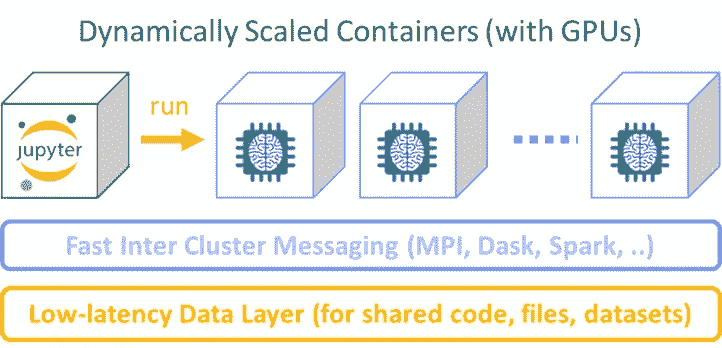
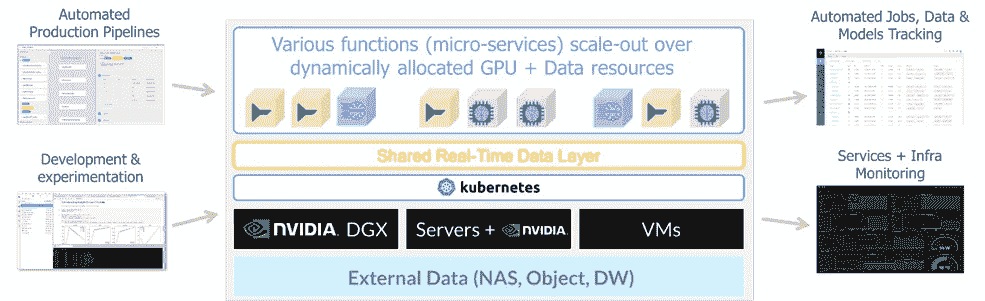
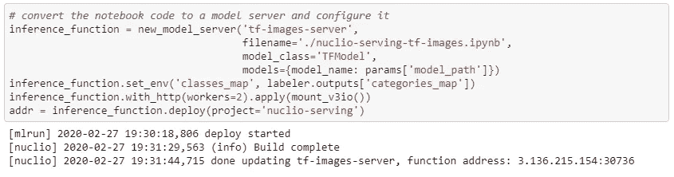
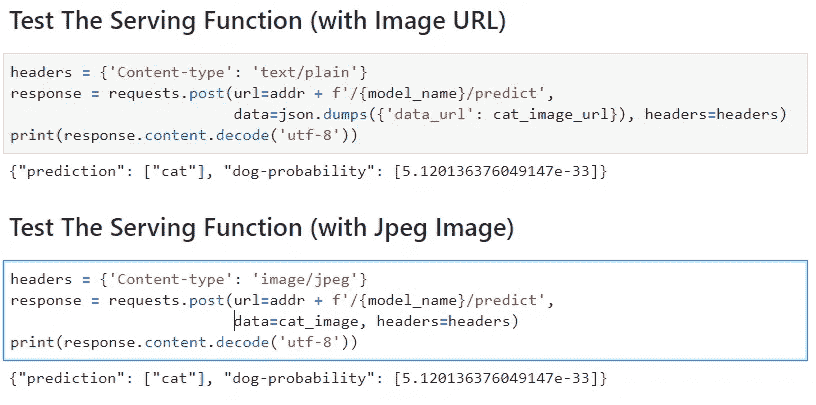
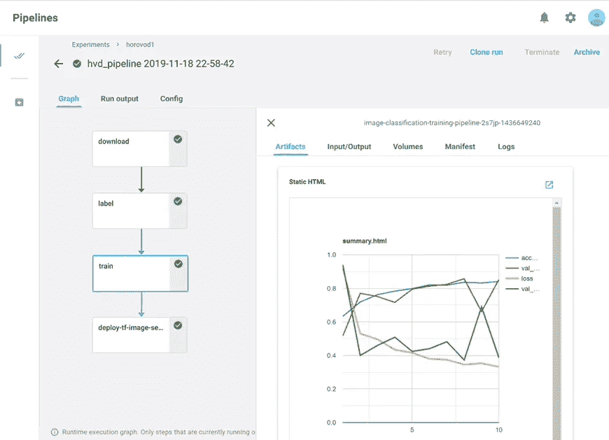

# KubeFlow 上的 GPU 即服务:快速、可扩展且高效的 ML

> 原文：<https://towardsdatascience.com/gpu-as-a-service-on-kubeflow-fast-scalable-and-efficient-ml-c5783b95d192?source=collection_archive---------17----------------------->

机器学习(ML)和深度学习(DL)涉及计算和数据密集型任务。为了最大限度地提高我们的模型准确性，我们希望在更大的数据集上进行训练，评估各种算法，并为每个算法尝试不同的参数(超参数调整)。

随着我们的数据集和模型复杂性的增加，我们等待工作完成所需的时间也在增加，导致我们的时间使用效率低下。我们最终运行更少的迭代和测试，或者在更小的数据集上工作。

NVIDIA GPUs 是加速我们数据科学工作的伟大工具。当涉及深度学习工作负载时，它们是显而易见的选择，并且比 CPU 提供更好的 ROI。随着像 [RAPIDS](https://developer.nvidia.com/rapids) 这样的新发展，NVIDIA 正在高效地处理数据分析和机器学习工作负载(如 XGBoost)(阅读我之前帖子中的详细信息:[Python Pandas in Extreme Performance](/python-pandas-at-extreme-performance-912912b1047c))。例如，读取 Json 数据、聚合其指标并写回压缩(Parquet)文件的分析任务在 GPU 上运行 1.4 秒，而在 CPU 上运行 43.4 秒(快了 30 倍！).

# 挑战:共享 GPU

CPU 长期以来一直支持虚拟化(虚拟机管理程序)、虚拟内存和 IO 管理等技术。我们可以在相同的 CPU 上运行许多不同的工作负载、虚拟机和容器，同时确保最大程度的隔离。我们可以使用各种集群技术在多个 CPU 和系统之间扩展计算，并使用调度程序将计算动态分配给任务。

另一方面，GPU 必须分配给特定的虚拟机或容器。这就导致了效率低下。当 GPU 密集型任务完成时，GPU 将保持空闲。例如，如果我们将笔记本服务器与 GPU 相关联，每当任务不运行时，我们就会浪费 GPU 资源——例如当我们编写或调试代码时，或者当我们去吃午饭时。这是一个问题，尤其是当配备 GPU 的服务器更加昂贵的时候。

存在一些将单个 GPU 划分为更小的虚拟 GPU 的解决方案，但这并没有解决问题，因为我们获得的(大部分是空闲的)片段太小或内存太少，无法运行我们的任务，并且鉴于很难在同一 GPU 上的任务之间隔离内存，我们可能会遇到许多潜在的故障。

# 解决方案:动态 GPU 分配和横向扩展

用户正在寻找的解决方案是，可以利用多个 GPU 来完成一项任务(因此可以更快地完成)，并在任务持续期间分配 GPU。这可以通过将容器与编排、集群和共享数据层相结合来实现。

假设我们在 Jupyter 笔记本或 IDE 中编写了一些代码(例如 PyCharm)。我们可以在本地执行它，但当我们需要扩展时，我们打开旋钮，它在分布式集群上的运行速度会快 10 到 100 倍。那不是很好吗？我们能实现这样的梦想吗？是的，我们可以，我将在本文的后面向您展示一个演示。

为了实现这一点，我们需要能够在运行时将代码和库打包并克隆到多个动态调度的容器中。我们需要所有这些容器共享相同的数据，并实现任务分配/并行机制，如下图所示。



动态 GPU/CPU 分配(图片由作者提供)

一个名为 [MLRun](https://github.com/mlrun/mlrun) 的新开源 ML 编排框架允许我们定义“无服务器”ML 功能，这些功能由代码、配置、包和基础设施依赖项(如 CPU、GPU、内存、存储等)组成。).这些“无服务器”功能可以在我们的笔记本电脑中本地运行，或者在一个或多个容器上运行，这些容器是在任务期间动态创建的(如果需要，也可以驻留更长时间)，客户端/笔记本电脑和容器可以通过低延迟共享数据平面(即虚拟化为一个逻辑系统)共享相同的代码和数据。

MLRun 建立在 [Kubernetes](https://kubernetes.io/) 和 [KubeFlow](https://www.kubeflow.org/) 之上，它使用 Kubernetes API 来创建和管理资源。它利用 [KubeFlow](https://www.kubeflow.org/) 定制资源(CRD)无缝运行水平扩展工作负载(如 [Nuclio functions](https://github.com/nuclio/nuclio) 、Spark、Dask、horo VOD……)，KubeFlow SDK 将任务附加到存储卷和机密等资源，以及 KubeFlow 管道创建多步执行图(DAG)。

通过 [MLRun](https://github.com/mlrun/mlrun) 执行的每个本地或远程任务都由 MLRun 服务控制器跟踪，所有输入、输出、日志和工件都存储在版本化数据库中，可以使用简单的 UI、SDK 或 REST API 调用浏览，即内置的作业和工件管理。MLRun 函数可以链接起来形成一个管道，它们支持超参数和 AutoML 任务，Git 集成，项目打包，但这些是不同帖子的主题，[在这里阅读更多内容](https://github.com/mlrun/mlrun)。



GPU 即服务堆栈(图片由作者提供)

# 示例:使用 Keras 和 TensorFlow 的分布式影像分类

在我们的示例中，我们有一个基于著名的猫和狗 TensorFlow 用例的 4 步管道:

1.  数据摄取功能—从 S3 自动气象站加载图像档案
2.  数据标记功能—将图像标记为狗或猫
3.  分布式训练功能—使用 TensorFlow/Keras 和 Horovod 来训练我们的模型
4.  部署交互式模型服务功能

你可以看到完整的 MLRun 项目和笔记本 [](https://github.com/mlrun/demos/tree/master/image_classification) [来源这里](https://github.com/mlrun/demo-image-classification)，我们将重点放在第 3 和第 4 步。要做到这一点，你需要使用 Kubernetes，并在其上运行少量开源服务(Jupyter、KubeFlow Pipelines、KubeFlow MpiJob、Nuclio、MLRun)和共享文件系统访问，或者你可以要求使用那些预集成的 [Iguazio](https://www.iguazio.com/) 云试用版。

我们的代码可以在本地运行(参见笔记本中的第 1 步和第 2 步)，要在具有 GPU 的集群上运行分布式训练，我们只需将我们的函数定义为 MPIJob 类(使用 MPI 和 Horovod 来分发我们的 TensorFlow 逻辑)，我们指定代码的链接、容器映像(或者 MLRun 可以为我们构建映像)、所需的容器数量、GPU 数量(每个容器)， 并将其附加到文件挂载(我们应用 [iguazio](https://www.iguazio.com/) 低延迟 v3io 结构挂载，但其他 K8s 共享文件卷驱动程序或对象存储解决方案也可以)。

一旦我们定义了函数对象，我们需要做的就是用一堆参数、输入(数据集或文件)运行它，并指定输出工件的默认位置(例如，训练好的模型文件)。

```
mprun = trainer.run(name='train', params=params, artifact_path='/User/mlrun/data', inputs=inputs, watch=**True**)
```

请注意，在本例中，我们不需要移动代码或数据，我们在笔记本和 worker 容器中使用相同的低延迟共享文件系统挂载这一事实意味着我们可以在 Jupyter 中修改代码并重新运行我们的作业(所有作业容器都将看到新的 Py 文件更改)，并且所有作业结果都将在 Jupyter 文件浏览器或 MLRun UI 中即时查看。

除了交互查看作业进度(watch=True)之外，run 对象(mprun)还保存运行的所有信息，包括指向输出工件、日志、状态等的指针。我们可以使用 MLRun 基于 web 的 UI 来跟踪我们的工作进度，比较实验结果或访问版本化的工件。

我们用”。save()"为了将我们的函数对象序列化和版本化到数据库中，我们可以稍后在不同的笔记本或 CI/CD 管道中检索这个函数对象(不需要在笔记本和团队之间复制代码和配置)。

如果我们想要将生成的模型部署为一个交互式的无服务器函数，我们所需要的就是将“model”和“category_map”输出提供给一个“serving”函数，并将其部署到我们的测试集群中。

MLRun 编排自动扩展 [Nuclio 功能](https://github.com/nuclio/nuclio)速度超快，可以是有状态的(支持 GPU 附件、共享文件挂载、状态缓存、流等。)，函数将自动伸缩以适应工作负载，如果请求在几分钟内没有到达，函数将伸缩到零(不消耗任何资源)。在这个例子中，我们使用“nuclio-serving”函数(承载标准 [KFServing](https://github.com/kubeflow/kfserving) 模型类的 nuclio 函数)，正如您在下面看到的，只需要一个命令(deploy)就可以使它作为一个活动的无服务器函数运行。



现在我们有了一个正在运行的推理函数，我们可以使用简单的 HTTP 请求测试端点，在有效负载中有一个 url，甚至是一个二进制图像。



# 使用 KubeFlow 管道的端到端工作流程

既然我们已经手动测试了管道的每一步，我们可能希望自动化这个过程，并可能按照给定的时间表运行它，或者由一个事件触发(例如 Git 推送)。下一步是定义一个 [KubeFlow 管道](https://www.kubeflow.org/docs/pipelines/overview/pipelines-overview/)图(DAG ),它将 4 个步骤链接成一个序列并运行该图。

[MLRun](https://github.com/mlrun/mlrun) 函数可以用一个简单的方法转换成 [KubeFlow 管道](https://www.kubeflow.org/docs/pipelines/overview/pipelines-overview/)步骤。as_step())，并指定如何将步骤输出馈入其他步骤输入，查看完整的笔记本[示例在这里](https://github.com/mlrun/demo-image-classification/blob/master/load_project.ipynb)，下面的代码演示了图形 DSL。

MLRun 项目可以有多个工作流，它们可以通过单个命令启动，也可以由各种事件触发，如 Git push 或 HTTP REST 调用。

一旦我们运行我们的管道，我们可以使用 KubeFlow 跟踪它的进展，MLRun 将自动在 KubeFlow UI 中注册指标、输入、输出和工件，而无需编写一行额外的代码(我想你应该先尝试在没有 MLRun 的情况下这样做，以便欣赏它😊).



KubeFlow 输出(图片由作者提供)

对于更基本的项目示例，您可以查看 MLRun [Iris XGBoost 项目](https://github.com/mlrun/demo-xgb-project)，其他演示可以在 [MLRun 演示资源库](https://github.com/mlrun/demos)中找到，并且您可以查看 [MLRun 自述文件](https://github.com/mlrun/mlrun/blob/master/README.md)和示例以获得教程和简单示例。

# 摘要

本文展示了如何有效利用计算资源来大规模运行数据科学工作，但更重要的是，我展示了如何简化和自动化数据科学开发，从而实现更高的生产率和更快的上市时间。如果您有其他问题，请联系我。

请查看 11 月 KubeCon NA 的“我的 GPU 即服务”演示和现场演示。

亚龙