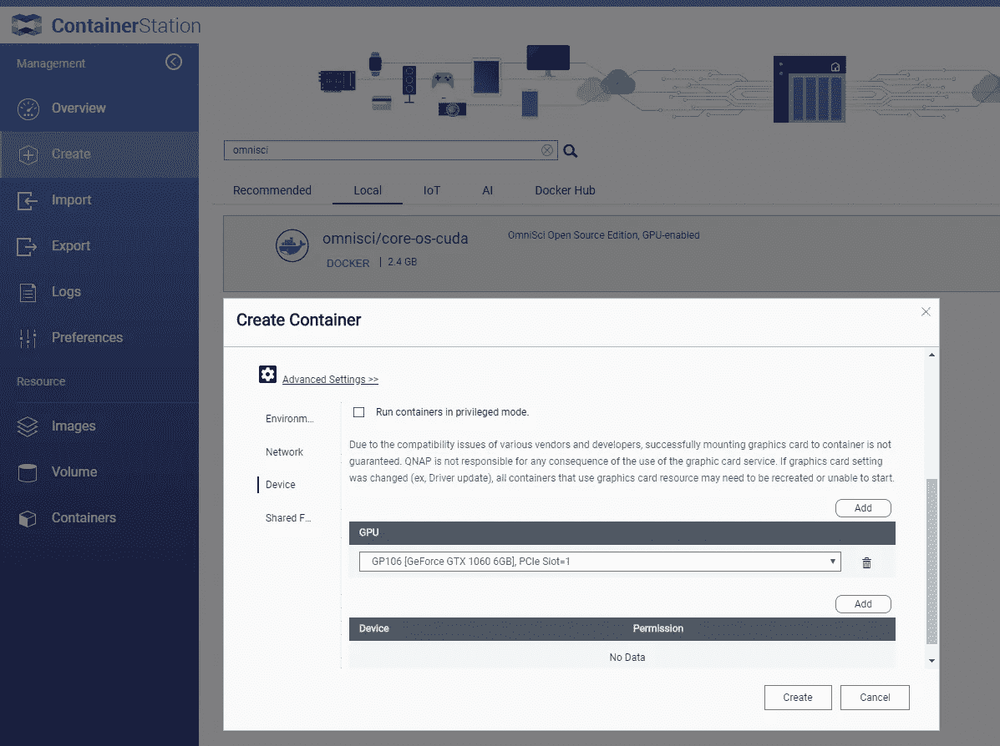

# 使用 OmniSci(开源)的 GPU 地理空间—实验失败

> 原文：<https://towardsdatascience.com/gpu-geospatial-with-omnisci-open-source-experimental-failures-c559cc9d7bc3?source=collection_archive---------28----------------------->

## GPU 数据库使地理空间工作流更快吗？是的(但也不总是像本文讨论的那样)…

我最近一直在尝试不同的方法，看看是否有一些方法不需要向大型云提供商支付数百或数千美元来进行数据科学研究。有了我可信赖的 QNAP NAS 和一个基本的消费级 GPU，我已经在各种工具上尝试了多个用例。

> 参见上一篇文章:[使用比集群更快的 GPU 将 CSV 转换为 ORC/Parquet](/gpu-datascience-converting-csv-to-parquet-orc-faster-cheaper-than-using-a-cluster-c4b20d969009)

今天我正在试用 OmniSci(【https://www.omnisci.com/】T2)，这是一个支持地理空间功能的 GPU 支持的数据库，我的计划是创建一个简单的实验来测试它——不幸的是，事情并没有那么顺利！

# 设置/安装

QNAP 的容器站基本上是 docker 的 UI。首先，我只需在 docker 注册表中搜索 OmniSci，然后单击“创建”。我将 GPU 附加到 docker 容器上，这就是大部分内容。

由于我使用的是开源版本，所以没有太多的 UI，所以我 SSH 到我的 QNAP，并使用 *docker exec -ti* 连接到 docker 容器，开始加载一些数据

# 正在加载数据…

你说加载数据？多么古老的学校。

到了这个时候，我已经感到相当厌烦了。与 Redshift 非常相似，如果您希望看到这个数据库引擎的好处，您必须将数据加载到其中。

我使用了其他测试中使用的相同数据集，我创建了一个 DDL 语句来创建一个表，然后使用 COPY 命令来获取我的拉斯维加斯数据集

将数据加载到 OmniSci

这是我第一次失望，我已经有一段时间没有真正地将数据加载到“数据库”中了(BigQuery 除外)——更喜欢直接在 ORC 或 Parquet 之类的列文件上工作。

该过程在 **53 分钟后结束(从 SATA 驱动器加载)**

# 第一个基本查询

OmniSci 首先要求我通过发出 ***\gpu*** 将会话切换到 GPU 模式

好的，首先让我们检查一下数据是否都已正确加载，让我们运行一些计数查询，然后让我们尝试一些真正的地理空间内容。

像往常一样，任何新的数据库引擎都有相当多的尝试和错误，有些事情不能像预期的那样工作，而其他字段需要我不知道的特定数据类型。此外，至少可以说，有许多武断的限制虽然不是交易破坏者，但却是一种烦恼:

用 SQL 表达的 Braindump

***所用时间:未知——我无法完成(我给了 3 个小时)***

## 值得注意的一点是:我看不到任何 GPU 活动

容器将最大限度地利用其 CPU，但 GPU 将坐在那里什么也不做——我假设这是因为它试图在 GPU 和 CPU 之间来回传递信息，或者只是试图在 CPU 上计划一切。

我通过“解释选择”验证了查询规划器正在使用 GPU，但不幸的是，要么这个数据库平台需要比我目前拥有的更好的硬件，要么还有其他事情正在发生。
不管怎样，看起来不像是*实际上是*在处理任何事情。我将联系 OmniSci 团队，看看是否有什么我能做的。

# 结论

我不确定这里的问题是什么——也许我的查询对于这个平台来说效率不高，也许对表进行连接比我目前使用的方法更好。如果我尝试一下，可以让它工作，我会更新文章。

当我有时间的时候，我也可能会通过他们在云服务上的免费试用重新审视这一点，但坦率地说，如果它甚至不能在我公认的疲惫的 GPU 上处理多边形地理空间计数中的一些基本点，那么我认为它真的无法与其他已经在传统上管理它的解决方案竞争。

> 寻找 GPU 地理空间解决方案的努力仍在继续…

