# Grad-CAM

> 原文：<https://towardsdatascience.com/grad-cam-2f0c6f3807fe?source=collection_archive---------36----------------------->

## 来自深层网络的视觉解释


修改自 Grad-CAM 论文的图 1 和图 20

Grad-CAM 是一种用于可视化卷积神经网络模型的流行技术。Grad-CAM 是特定于类别的，这意味着它可以为图像中出现的每个类别生成单独的可视化图像:


根据 Grad-CAM 论文图 1 修改的猫和狗 Grad-CAM 可视化示例

Grad-CAM 可用于弱监督定位，*即*使用仅在完整图像标签而非显式位置注释上训练的模型来确定特定对象的位置。

Grad-CAM 还可以用于弱监督分割，其中模型预测属于特定对象的所有像素，而不需要像素级标签进行训练:

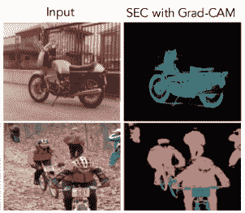

Grad-CAM 论文图 4 的一部分显示了通过使用 Grad-CAM 热图作为名为 [SEC(种子、扩展、约束)](https://arxiv.org/abs/1603.06098)的方法的种子而获得的预测摩托车和人分割遮罩

最后，Grad-CAM 可用于更好地了解模型，例如通过提供对模型故障模式的洞察:

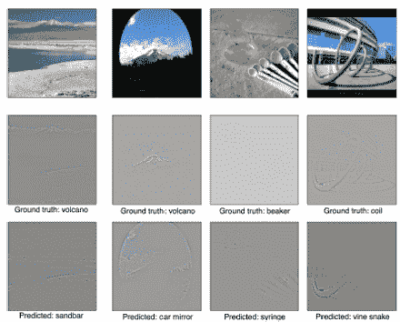

Grad-CAM 论文的图 6 显示了模型故障示例以及 Grad-CAM 可视化，说明了模型做出错误预测的原因。

这篇文章的主要参考是 Grad-CAM 论文的扩展版本: [Selvaraju 等人的“Grad-CAM:通过基于梯度的定位从深度网络进行可视化解释”国际计算机视觉杂志 2019。](https://arxiv.org/abs/1610.02391)

Grad-CAM 论文的先前版本发表在 2017 年国际计算机视觉大会(ICCV)上。

# **2021 年更新**

虽然 Grad-CAM 的论文被引用了几千次，但最近的工作[展示了 Grad-CAM 的一个严重问题:有时，Grad-CAM 会突出显示图像中模型实际上没有用于预测的区域。这意味着 Grad-CAM 是一种不可靠的模型解释方法。HiResCAM 是一种新的解释方法，可以证明它保证只突出显示模型使用的位置。HiResCAM 的灵感来自 Grad-CAM，所以如果你理解 Grad-CAM，那么](https://arxiv.org/abs/2011.08891)[理解 HiResCAM 如何工作](https://arxiv.org/abs/2011.08891)就很简单了。

# **Grad-CAM 作为事后关注**

Grad-CAM 是一种事后注意力的形式，这意味着它是一种用于产生热图的方法，该热图在训练完成且参数固定后应用于已经训练的神经网络。这与可训练的注意力是不同的，可训练的注意力包括学习如何在训练期间通过学习特定的参数来产生注意力图(热图)。关于事后*与*可训练注意力的更深入讨论，见[这篇文章](https://glassboxmedicine.com/2019/08/10/learn-to-pay-attention-trainable-visual-attention-in-cnns/)。

# **Grad-CAM 作为 CAM 的推广**

Grad-CAM 不需要特定的 CNN 架构。Grad-CAM 是 CAM(类激活映射)的一种推广，是一种需要使用特定架构的方法。

CAM 需要一个将全局平均池(GAP)应用于最终卷积要素图的架构，然后是一个产生预测的全连接层:

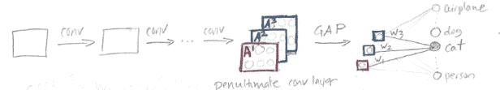

在上面的草图中，正方形 A1(红色)、A2(绿色)和 A3(蓝色)代表 CNN 最后一个卷积层产生的特征图。为了使用 Grad-CAM 所基于的 CAM 方法，我们首先取每个特征图的平均值，以产生每个图的单个数字。在这个例子中，我们有 3 个特征地图，因此有 3 个数字；这 3 个数字在草图中显示为彩色小方块。然后，我们对这 3 个数字应用全连接层，以获得分类决策。对于输出类“cat”，预测将基于 3 个权重(w1、w2 和 w3)。为了制作“猫”的 CAM 热图，我们使用最终全连接层的“猫”权重对特征图进行加权求和:


注意，特征图的数量不一定是三个——它可以是任意的 *k* 。关于 CAM 如何工作的更详细的解释，请参见[这篇文章](https://glassboxmedicine.com/2019/06/11/cnn-heat-maps-class-activation-mapping-cam/)。理解 CAM 对于理解 Grad-CAM 非常重要，因为这两种方法密切相关。

Grad-CAM 开发的部分动机是想出一种类似 CAM 的方法，不限制 CNN 架构。

# Grad-CAM 概述

Grad-CAM 背后的基本思想与 CAM 背后的基本思想相同:我们希望利用通过卷积层保存的空间信息，以便了解输入图像的哪些部分对于分类决策是重要的。

与 CAM 类似，Grad-CAM 使用 CNN 最后一个卷积层产生的特征图。Grad-CAM 的作者认为，“我们可以预期最后的卷积层在高级语义和详细的空间信息之间具有最佳的折衷。”

以下是显示与 Grad-CAM 相关的神经网络模型部分的示意图:

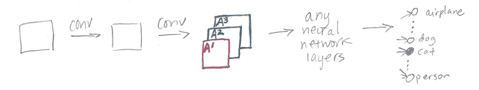

CNN 由一些卷积层组成(在草图中显示为“conv”)。最终卷积层生成的特征图显示为 A1、A2 和 A3，与 CAM 草图中的相同。

此时，对于 CAM，我们需要进行全局平均池化，然后是完全连接的层。对于 Grad-CAM，我们可以做任何事情——例如，多个完全连接的层——在草图中显示为“任何神经网络层”。唯一的要求是我们在 A1、A2 和 A3 之后插入的层必须是可微的，这样我们就可以得到一个梯度。最后，我们有飞机、狗、猫、人等的分类输出。

CAM 和 Grad-CAM 之间的区别在于如何对特征图 A1、A2 和 A3 进行加权以生成最终热图。在 CAM 中，我们使用取自网络最后一个全连接层的权重对这些特征地图进行加权。在 Grad-CAM 中，我们使用基于梯度计算的“alpha 值”对特征图进行加权。因此，Grad-CAM 不需要特定的架构，因为我们可以通过任何一种我们想要的神经网络层来计算梯度。Grad-CAM 中的“Grad”代表“梯度”

Grad-CAM 的输出是一个“区分类别的定位图”，*即*一个热点图，其中热点部分对应于一个特定类别:


如果有 10 个可能的输出类，那么对于特定的输入图像，您可以制作 10 个不同的 Grad-CAM 热图，每个类一个热图。

# **Grad-CAM 详情**

首先，做一点注释:


换句话说，在应用 softmax 将原始分数转换成概率之前，y^c 是类 *c* 的神经网络的原始输出。

Grad-CAM 应用于已完成训练的神经网络。神经网络的权重是固定的。我们将一幅图像输入网络，为选定的感兴趣类别计算该图像的 Grad-CAM 热图。

Grad-CAM 有三个步骤:

## 步骤 1:计算梯度

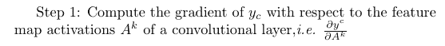

在该步骤中计算的梯度的特定值取决于选择的输入图像，因为输入图像决定了特征图 A^k 以及产生的最终类别分数 y^c。

对于 2D 输入图像，此渐变是 3D 的，与特征地图具有相同的形状。高度 *v* 和宽度 *u* 、*即*各有 *k* 个特征图，这些特征图统称为形状 *k，v，u* 。这意味着在步骤 1 中计算的梯度也将是形状[ *k，v，u* ]。

在下面的草图中， *k* =3 所以有三张 *u* x *v* 特征图和三张 *u* x *v* 渐变:

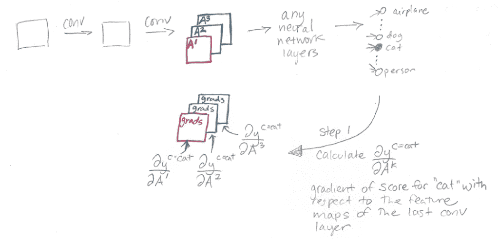

## 步骤 2:通过平均梯度计算阿尔法值

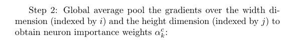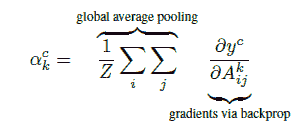

在这一步，我们计算阿尔法值。类别 *c* 和特征地图 *k* 的 alpha 值将在下一步中用作应用于特征地图 A^k.的权重(在 CAM 中，应用于特征地图 A^k 的权重是最终完全连接层中的权重 w_k。)

回想一下，我们的渐变有形状[ *k，v，u* ]。我们对高度 *v* 和宽度 *u* 进行合并，因此我们最终得到的是形状为[ *k，1，1* 的东西，或者简单点说，就是[ *k* 】。这些是我们的 kα值。

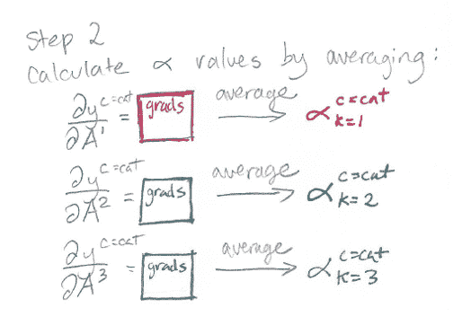

## 步骤 3:计算最终 Grad-CAM 热图

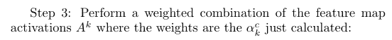

现在我们有了 alpha 值，我们使用每个 alpha 值作为相应特征图的权重，并计算特征图的加权和作为最终的 Grad-CAM 热图。然后我们应用一个 ReLU 操作，只强调正值，把所有负值都变成 0。

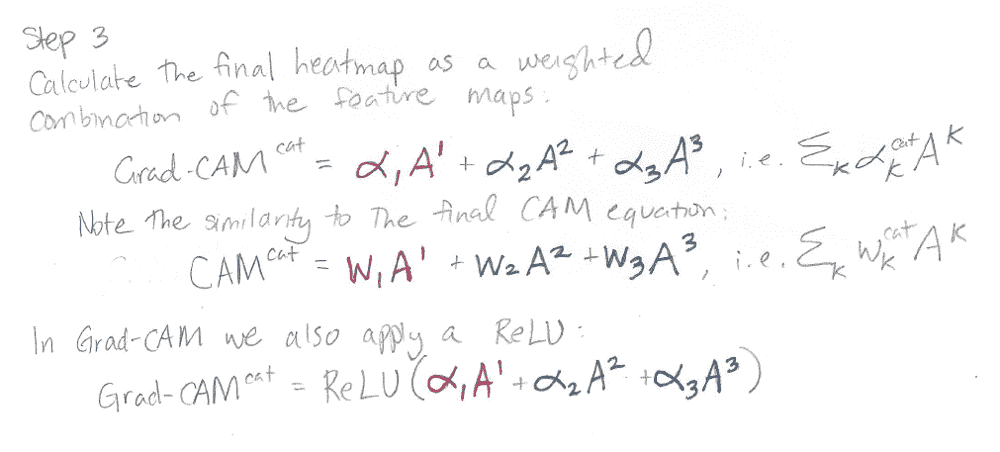

# Grad-CAM 热图不会太小吗？

Grad-CAM 热图的大小为 *u* x *v* ，这是最终卷积特征图的大小:

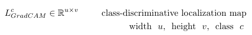

你可能想知道这有什么意义，因为在大多数 CNN 中，最终的卷积特征在宽度和高度上都比原始输入图像小得多。

事实证明，如果 *u* x *v* Grad-CAM 热图比原始输入图像尺寸小很多，也没关系。我们需要做的就是在最终可视化之前，对微小的 *u* x *v* 热图进行上采样，以匹配原始图像的大小。

例如，这是一个 12 x 12 的小热图:

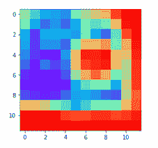

现在，这是使用 Python 包 cv2 向上采样到 420 x 420 的相同热图:

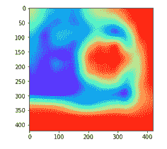

将原始小的低分辨率热图可视化并将其转换为大的高分辨率热图的代码如下:

```
import cv2 
import matplotlib 
import matplotlib.pyplot as plt small_heatmap = CalculateGradCAM(class='cat') plt.imshow(small_heatmap, cmap='rainbow') #Upsample the small_heatmap into a big_heatmap with cv2: 
big_heatmap = cv2.resize(small_heatmap, dsize=(420, 420), 
                         interpolation=cv2.INTER_CUBIC) plt.imshow(big_heatmap, cmap='rainbow')
```

# **Grad-CAM 实施**

Grad-CAM 的 Pytorch 实现可从[这里](https://github.com/jacobgil/pytorch-grad-cam/blob/master/README.md)获得。

# **更多 Grad-CAM 示例**

Grad-CAM 已经应用于许多研究领域，在医学图像中尤其流行。这里有几个例子:

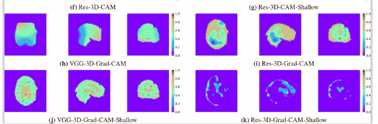

[杨等，“深度三维卷积神经网络对阿尔茨海默病分类的可视化解释”](https://www.ncbi.nlm.nih.gov/pmc/articles/PMC6371279/#!po=62.5000)

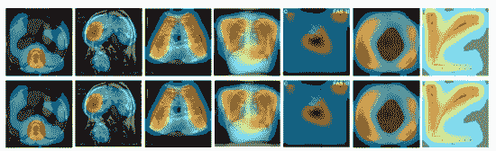

上面一排是摄像头，下面一排是摄像头。 [Kim 等人，“医学图像形态分类中卷积神经网络预测的视觉解释。”](https://www.mdpi.com/2075-4418/9/2/38/htm)

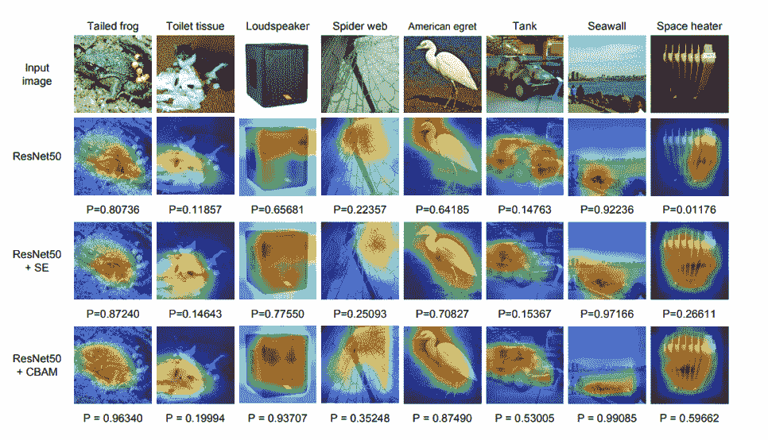

伍等人的 Grad-CAM 可视化。“CBAM:卷积块注意模块。”本文是一个可训练的注意力机制(CBAM)与可视化的事后注意力机制(Grad-CAM)相结合的例子。

# **2021 年确定 Grad-CAM 的主要问题**

虽然 Grad-CAM 应该能够解释模型用于预测的图像区域，但事实证明 Grad-CAM 并不能保证做到这一点！简而言之，由于梯度平均步骤，Grad-CAM 的热图不能反映模型的计算，因此可以突出显示不用于预测的无关区域。解决方案是 HiResCAM，这是一种解释方法，它避免了 Grad-CAM 的梯度平均步骤，而是使用原始梯度和特征图之间的元素乘积。HiResCAM 实现了与 Grad-CAM 相同的所有目的，其好处是 HiResCAM 可以保证只突出显示模型使用的区域，对于任何以一个完全连接的层结束的 CNN。把 Grad-CAM 代码改成 HiResCAM 代码只需要几秒钟。关于为什么 Grad-CAM 有时会失败，以及 HiResCAM 解决方案如何工作的更多细节，请参见[这篇论文](https://arxiv.org/abs/2011.08891)。

# **制导 Grad-CAM 的问题**

作为另一个需要注意的问题，Grad-CAM 论文提到了 Grad-CAM 的一个变种，称为“Guided Grad-CAM”，它将 Grad-CAM 与另一种称为“guided backpropagation”的 CNN 热图可视化技术相结合。我在[这篇文章](https://glassboxmedicine.com/2019/10/12/guided-grad-cam-is-broken-sanity-checks-for-saliency-maps/)和[这篇文章](https://glassboxmedicine.com/2019/10/06/cnn-heat-maps-gradients-vs-deconvnets-vs-guided-backpropagation/)中讨论了引导反向传播。简短的总结是，Adebayo 等人(T13)和 Nie 等人(T15)最近的工作表明，引导反向传播正在执行部分图像恢复，并像边缘检测器一样工作，而不是提供对训练模型的洞察。因此，最好不要使用导向反向传播，由此引申，这意味着最好不要使用导向 Grad-CAM。

# **总结**

*   Grad-CAM 是一种流行的技术，用于根据特定的输入图像、经过训练的 CNN 和选定的感兴趣的类别来创建特定类别的热图。
*   Grad-CAM 与 CAM 关系密切。
*   Grad-CAM 可以在任何 CNN 架构上计算，只要层是可区分的。
*   Grad-CAM 已经用于弱监督定位和弱监督分割。
*   最近的工作发现了 Grad-CAM 的一个基本问题:有时 Grad-CAM 会突出显示模型实际上没有使用的区域。因此，对于模型解释，应使用 [HiResCAM](https://arxiv.org/abs/2011.08891) 代替 Grad-CAM。

*原载于 2020 年 5 月 29 日*[](https://glassboxmedicine.com/2020/05/29/grad-cam-visual-explanations-from-deep-networks/)**。**