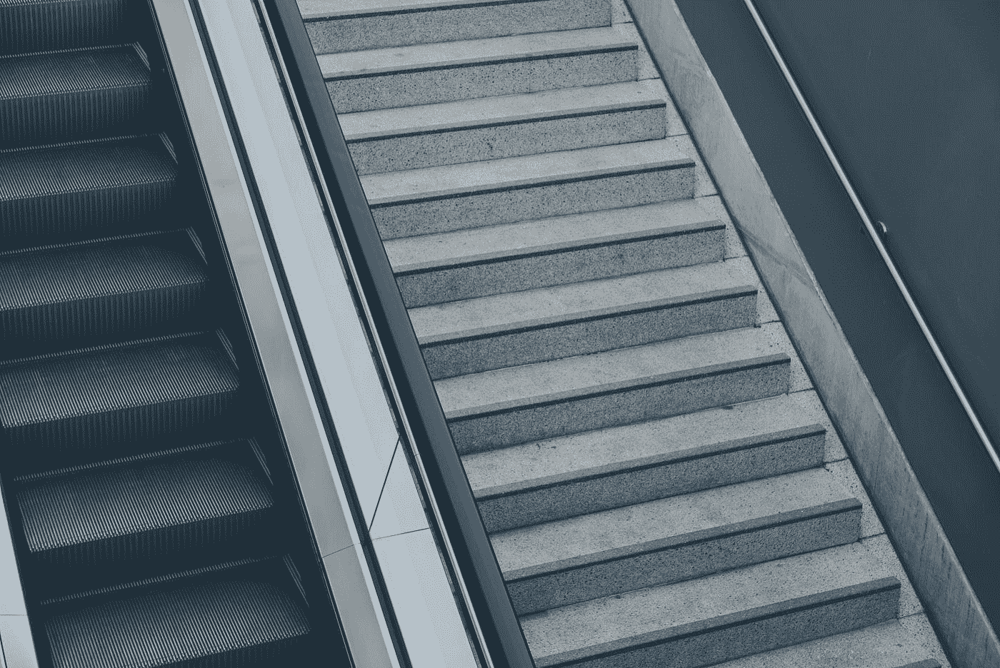
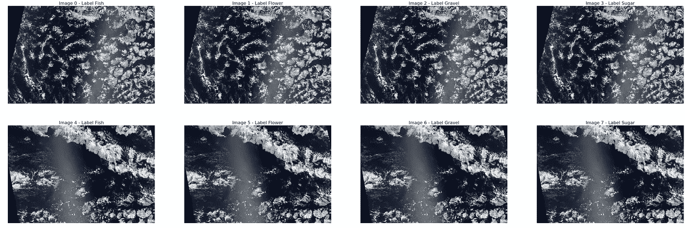

# 梯度积累:克服深度学习中的记忆限制

> 原文：<https://towardsdatascience.com/gradient-accumulation-overcoming-memory-constraints-in-deep-learning-36d411252d01?source=collection_archive---------21----------------------->



丹尼尔·冯·阿彭在 [Unsplash](https://unsplash.com?utm_source=medium&utm_medium=referral) 上的照片

让我们诚实一点。没有 GPU 的深度学习是一个很头疼的问题！是的，Google Colab 和 Kaggle 是存在的，但是生活和工作并不总是训练一个整洁和酷的 MNIST 分类器。

***简介***

对于训练最先进的或 SOTA 模型，GPU 是一个很大的必要性。即使我们能够获得一个，也有内存限制的问题。每当我们抛出一个大批量进行训练时，我们或多或少都习惯于看到 OOM(内存不足)错误。当我们谈到最先进的计算机视觉算法时，这个问题就更加明显了。自 VGG 时代甚至是 18 世纪以来，我们走过的路程要长得多。像 UNet、ResNet-152、RCNN、Mask-RCNN 这样的现代更深层次的体系结构是极其内存密集型的。因此，在训练更深层次的模型时，我们很有可能会耗尽内存。

这是在 PyTorch 中运行模型时出现的 OOM 错误。

```
RuntimeError: CUDA out of memory. Tried to allocate 44.00 MiB (GPU 0; 10.76 GiB total capacity; 9.46 GiB already allocated; 30.94 MiB free; 9.87 GiB reserved in total by PyTorch)
```

每当遇到 OOM 错误时，从业者通常会立即采取两种解决方案。

1.  减少批量
2.  缩小图像尺寸

在超过 90%的情况下，这两种解决方案已经足够了。所以你想问的问题是:为什么剩下的 5%需要别的东西。为了回答这个问题，让我们看看下面的图片。



来自[迪米特里·奥利维拉](https://www.kaggle.com/dimitreoliveira)的卡格尔笔记本

来自 Kaggle 比赛， [*从卫星图像中理解云*](https://www.kaggle.com/c/understanding_cloud_organization/overview) 。任务是正确分割不同类型的云。这些图像分辨率非常高，1400 x 2100。你也可以理解，在这种情况下，过多地减少图像尺寸会产生非常负面的影响，因为微小的图案和纹理是这里要学习的重要特征。因此，唯一的其他选择是减少批量大小。

***渐变下降***

作为复习，如果您碰巧记得梯度下降，或者在我们的例子中特别是小批量梯度下降，您会记得我们不是在整个数据集上计算损失和最终梯度，而是在较小的批量上进行操作。除了帮助我们将数据放入内存之外，它还帮助我们更快地收敛，因为参数在每次小批量后都会更新。但是当批量变得太小时会发生什么呢？粗略估计，在 11GB 的 GPU 中，可能有 4 个这样的图像可以放入单个批次中，所计算的损失和梯度将不会准确地代表整个数据集。因此，模型收敛速度会慢很多，或者更糟，根本不收敛。

***渐变积累***

梯度累积背后的想法非常简单。*它在每个小批量后计算损耗和梯度，但它不是更新模型参数，而是等待并累积连续批量的梯度。*然后在指定数量的批次之后基于累积梯度最终更新参数。它与具有更高数量图像的小批量具有相同的目的。

> 例如:如果您以 5 个步长和 4 个图像的批量运行梯度累积，它与以 20 个图像的批量运行的目的几乎相同。

***实现***

在 ***PyTorch*** 上编码渐变累积部分也简单得离谱。您需要做的只是存储每批的损耗，然后仅在您选择的一组批数之后更新模型参数。

我们保持`optimizer.step()`,它更新`accumulation_steps`批数的参数。此外，同时调用`model.zero_grad()`来重置累积的渐变。

对于***keras/tensor flow***来说，做同样的事情要稍微棘手一点。你可以在网上找到人们写的不同版本。这是由 [@alexeydevederkin](https://github.com/alexeydevederkin) 写的其中一篇。

*注意:由于 keras 的培训过程缺乏模块化，它比 pytorch 代码更长更复杂。*

还有尺寸更小的纯张量流代码。你会很容易找到的。

对于计算量较少的爱好者，甚至是打算使用图像而不缩小图像的从业者来说，梯度累积是一个很好的工具。无论你是哪一个，它总是你军械库中的一个便利的诡计。

[](/3-things-you-need-to-know-before-you-train-test-split-869dfabb7e50) [## 训练前你需要知道的 3 件事——试分裂

### 这很可能是您在任何数据科学教程中遇到的第一步。很有可能你一直在做…

towardsdatascience.com](/3-things-you-need-to-know-before-you-train-test-split-869dfabb7e50) [](/assessing-the-impact-of-the-coronavirus-lockdown-on-our-environment-through-data-2905535da51e) [## 通过数据评估冠状病毒封锁对我们环境的影响。

### 封锁及其对我们环境的影响。

towardsdatascience.com](/assessing-the-impact-of-the-coronavirus-lockdown-on-our-environment-through-data-2905535da51e)