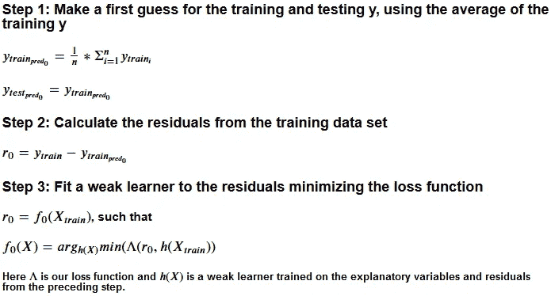
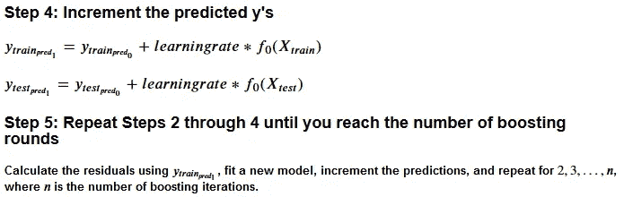
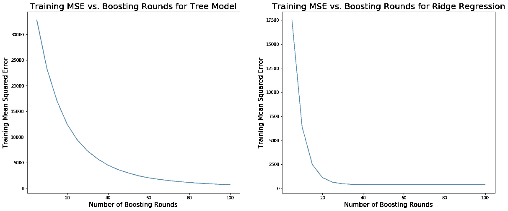
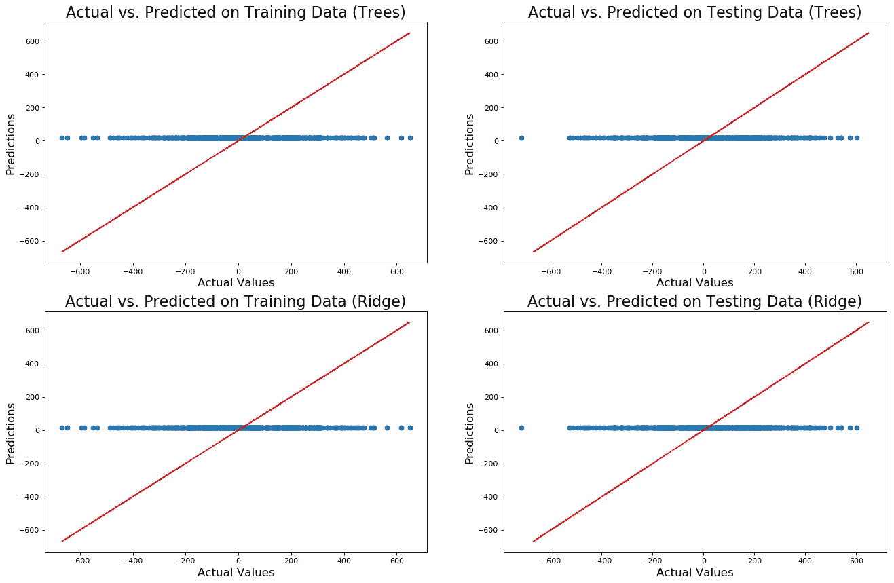
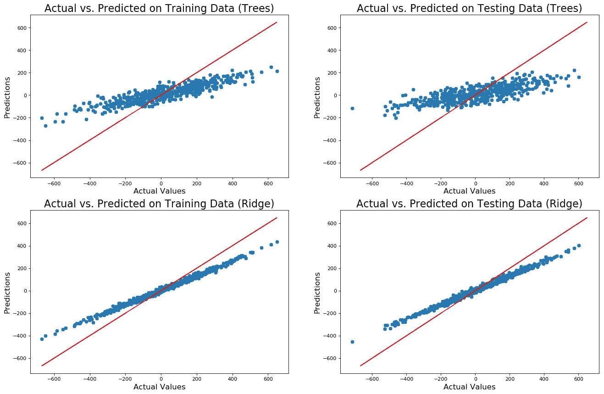
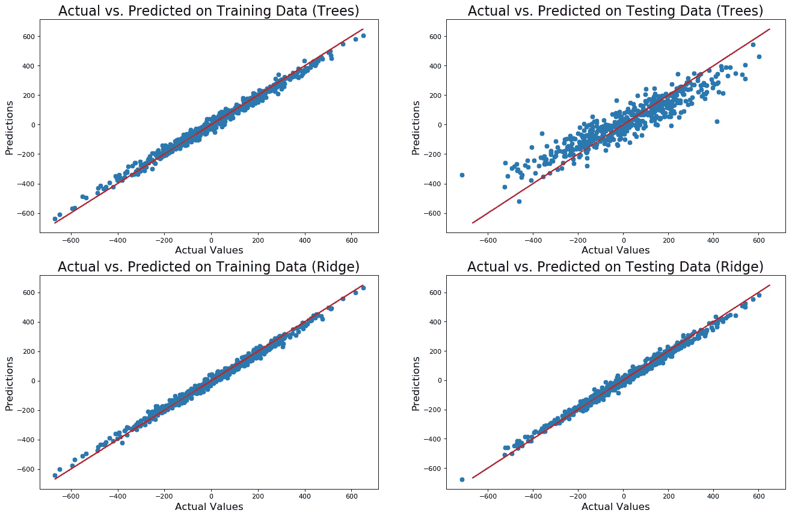
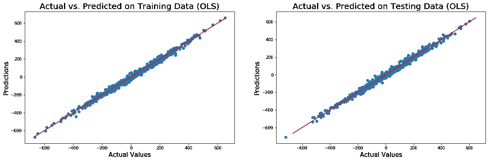
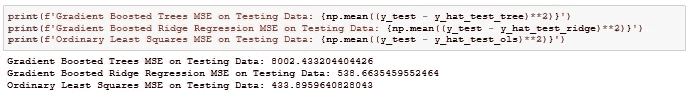
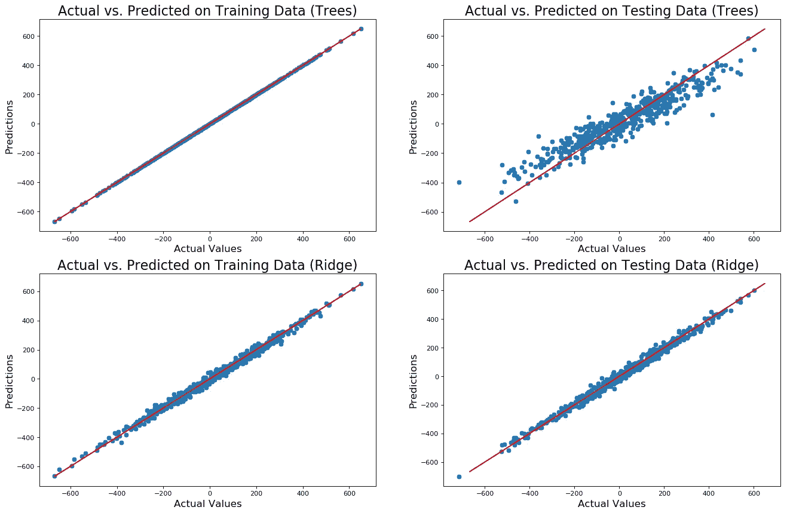
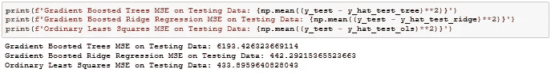

# 几乎从零开始的梯度提升

> 原文：<https://towardsdatascience.com/gradient-boosting-from-almost-scratch-c3ed0db2ffdb?source=collection_archive---------31----------------------->

## 通过 Python 实现理解强大的机器学习算法

在过去的一个月里，我一直在慢慢地从头开始学习 Joel Grus 的《数据科学》第二版，我非常喜欢构建简单版本的机器学习算法。我总是通过实践学得更好，这本书符合这种学习风格。不幸的是，它没有实现梯度推进的一章。虽然我通读了陈天齐的伟大的[幻灯片](https://homes.cs.washington.edu/~tqchen/data/pdf/BoostedTree.pdf)，我想我会通过自己实现一个简单版本的渐变增强来获得更好的理解。

梯度推进是一种相对简单的算法。它的工作原理是训练弱模型(最常见的是[推车](https://en.wikipedia.org/wiki/Decision_tree_learning))，这些弱模型来自前一次迭代的残差。通过将预测残差乘以 0 到 1 之间的学习率与先前的预测相加来生成新的预测。学习率防止模型向实际值迈出太大的一步并超过它们。小的学习率需要更长的时间收敛到最佳状态。找到合适的是一个平衡的行为。

我强烈推荐陈天齐的[幻灯片](https://homes.cs.washington.edu/~tqchen/data/pdf/BoostedTree.pdf)更彻底的处理渐变提升，或者看一下 [XGBoost](https://xgboost.readthedocs.io/en/latest/index.html) 的文档，这是他惊人的渐变提升包。

我说梯度推进几乎从零开始；我使用 scikit-learn 的模型作为我的弱学习器，并使用 numpy 用于某些数学函数及其数组结构。

梯度推进算法是这样的:



我使用的第一个模型是 scikit-learn 的回归树。因此，潜在损失函数是均方误差、弗里德曼调整的均方误差和平均绝对误差。它们每个都包含正则化项，这对我来说是幸运的。scikit-learn 的[文档](https://scikit-learn.org/stable/modules/generated/sklearn.tree.DecisionTreeRegressor.html)中包含了对每一个更全面的解释。

另外，我用的是他们的[岭回归模型](https://scikit-learn.org/stable/modules/generated/sklearn.linear_model.RidgeCV.html)，它的损失函数是误差平方和+系数的 l2 范数乘以一个惩罚系数。你可以在大多数线性模型或机器学习教科书中了解更多信息，或者去[这里](https://en.wikipedia.org/wiki/Tikhonov_regularization)。

我用来实现 boosting 算法的代码如下。整篇笔记的链接会在文章的底部提供，作为继续阅读的激励。

```
import typing
import numpy as npdef GradBoost(model,
              X_test: np.array,          # testing independent vars
              X_train: np.array,         # training independent vars
              y_train: np.array,         # training dependent var
              boosting_rounds: int = 100,# number of boosting rounds
              learning_rate: float = 0.1,# learning rate
              verbose: bool = True       # shows progress bar
              ) -> np.array: 
    '''
    Takes in a model and performs gradient boosting using it.
    '''
    import numpy as np

    # initalize guess of our training target variable using the mean
    y_hat_train = np.repeat(np.mean(y_train), len(y_train))

    # initialize out of sample prediction with training mean
    y_hat_train_test = np.repeat(np.mean(y_train), len(X_test)) # calculate the training residuals fusing the first guess
    pseudo_resids = y_train - y_hat_train

    # performs gradient boosting with a tqdm progress bar
    if verbose: from tqdm import tqdm # iterates through the boosting round
        for _ in tqdm(range(0, boosting_rounds)): # fit the model to the pseudo residuals
            model = model.fit(X_train, pseudo_resids) # increment y_hat_train with the predicted resids*lr
            y_hat_train += learning_rate * model.predict(X_train)  

            # increment the predicted test y as well
            y_hat_train_test += (learning_rate *   
                                 model.predict(X_test)) # calculate the pseudo resids for next round
            pseudo_resids = y_train - y_hat_train # performs gradient boosting without a progress bar        
    else: # iterates through the boosting round
        for _ in range(0, boosting_rounds): # fit the model to the pseudo residuals
            model = model.fit(X_train, pseudo_resids) # increment the y_hat_train with the pseudo resids*lr
            y_hat_train += learning_rate * model.predict(X_train)

            # increment the predicted test y as well
            y_hat_train_test += (learning_rate * 
                                 model.predict(X_test)) # calculate the pseudo resids for next round
            pseudo_resids = y_train - y_hat_train # return a tuple of the training y_hat and the test y_hat
    return y_hat_train, y_hat_train_test
```

现在让我们生成一些测试数据，看看这个函数是否有效。我选择模拟数据，所以我知道一些自变量和目标变量之间有关系。我用 scikit-learn 的 make_regression 函数生成了 1000 个观察值，有 20 个自变量，其中四分之三实际上包含有用的信息。然后，我将数据分成训练和测试数据集。

```
from sklearn.datasets import make_regressionX, y = make_regression(n_samples=1000, 
                       n_features=20, 
                       n_informative=15, 
                       n_targets=1, 
                       bias=0.0, 
                       noise=20,
                       shuffle=True,
                       random_state=13)X_train = X[0:int(len(X) / 2)]
y_train = y[0:int(len(X) / 2)]X_test = X[int(len(X) / 2):]
y_test = y[int(len(X) / 2):]
```

当使用梯度推进时，太少的迭代导致欠拟合模型，太多的迭代导致过拟合模型。在我们进行预测之前，了解训练均方差如何随着更多的提升迭代而演变是有帮助的，因此我们可以尝试并拟合一个校准良好的模型。

当实际尝试解决一个实际问题时，您将使用网格搜索和 k-folds 交叉验证来确定推进回合的数量以及其他参数。为了便于演示，我做了一些更简单的事情。我只是绘制了 5 到 100 轮的训练均方误差与助推轮数的关系，步长为 5，并选择了半任意截止值。

该实现中的回归树深度为 3，损失函数被指定为正则化均方误差。岭回归使用三重交叉验证在{0.01，0.1，1，10}中的每一步选择最佳 l2 范数惩罚系数。两种模型的学习率都设置为 0.1。



训练 MSE vs 助推回合

当使用树作为我们的弱学习器时，均方误差快速下降，直到它在 30 次提升迭代左右达到拐点。在那之后，当它接近 100 轮的时候，它慢慢地向下倾斜。当使用岭回归模型时，训练均方误差猛跌，直到 20 轮，并且在 30 轮之后才真正稳定下来。我们将使用 100 作为使用树的提升迭代次数，30 用于岭回归提升模型。但是首先，让我们看看 0 次和 10 次提升迭代的结果。



第 0 轮助推时的预测 y 值与实际 y 值

在上面的图中，红线是预测值等于实际值的地方，代表完美的预测。测试数据越接近这条线，我们的模型就越准确。如果训练预测是紧密拟合的，但是测试预测到处都是，则模型与训练数据过度拟合。

在 0 轮助推的情况下，我们只是猜测平均值。正如你所料，这个天真的“模型”不符合数据。让我们看看 10 轮助推后事情会如何发展。



10 轮助推时的预测 y 值与实际 y 值

在第 10 轮，每个模型的预测开始向完美的预测线旋转。这一过程随着学习速度的提高而加快，但也有可能超过标准。对于使用岭回归作为弱学习器的模型，预测云要紧密得多。这可能是因为我们生成的数据包含线性关系，而岭回归是线性模型。现在我想是时候做我们最后的预测和比较了。



100 轮增强树的预测 y 值与实际 y 值，以及 30 轮增强岭回归的预测 y 值与实际 y 值

在 100 次迭代时，我们的提升树模型是不错的，但是它在测试数据集中的表现差于目标变量的平均值。看起来也有点过合身。尽管如此，它还是比 10 回合模型更适合。我们以岭回归作为弱学习者的模型更适合。同样，这可能是由于模拟数据中的线性结构。说到线性结构，让我们看看这些模型与简单的多元线性回归相比如何。



多元线性回归的预测 y 值与实际 y 值

该图表明多元线性回归是我们的最佳拟合模型。让我们检查测试集的均方误差以确保正确。



多元线性回归胜出！让这成为可视化和调查你的数据的一个提醒。在用算法解决问题之前，请始终仔细考虑形成数据结构的数据生成过程。或者不要。这是你的生活。

让我们看看更多的提升回合会发生什么，比方说 1000 个提升树和 100 个提升岭回归。



增强树的 1000 轮增强和增强岭回归的 100 轮增强时的预测 y 值与实际 y 值

增强的树显然过度拟合了训练数据，但是来自增强的岭回归的结果相当好。同样，数据中的关系是线性的。让我们看看新的均方误差。



在 100 轮提升时，提升岭回归的表现接近多元线性回归，多元线性回归代表真实的模型(加上几个应被忽略的噪声变量)。事实证明，有时候用算法解决问题是有效的。尽管如此，最好还是了解你的数据。

我希望这篇文章能让你更好地了解最强大的机器学习技术之一的内幕(抱歉，这是陈词滥调)。现在，您可以一边去喝咖啡，一边思考您的计算机正在做什么，等待您的网格搜索完成。

你可以在这里得到我的代码并使用它。

点击查看这篇文章基于[的 Jupyter 笔记本。](https://github.com/jkclem/GradBoost/blob/master/example/GradBoost%20Notebook.ipynb)

你可以在这里找到更多我的文章。