# 梯度集中化

> 原文：<https://towardsdatascience.com/gradient-centralization-bdb333a53bcd?source=collection_archive---------44----------------------->

## 如何通过添加一行代码，在您的 DNN 模型中实现更高效的训练和更好的正则化

图片由来自[皮克斯拜](https://pixabay.com/?utm_source=link-attribution&utm_medium=referral&utm_campaign=image&utm_content=3087585)的[扬·瓦塞克](https://pixabay.com/users/JESHOOTS-com-264599/?utm_source=link-attribution&utm_medium=referral&utm_campaign=image&utm_content=3087585)拍摄

一篇最近发表的[论文](https://arxiv.org/pdf/2004.01461.pdf)提出了一个简单的答案:梯度中心化，一种新的优化技术，可以很容易地集成到你已经使用的基于梯度的优化算法中。这是广泛使用的批处理规范化的一个很好的替代方案。你所需要做的就是集中你的梯度向量，使它们的平均值为零！

在这里，我将探索所提出的方法的理论细节。实用的方法将在我的下一篇文章中讨论。

# 一行代码背后的数学原理

## 注释

让我们来介绍一下符号:

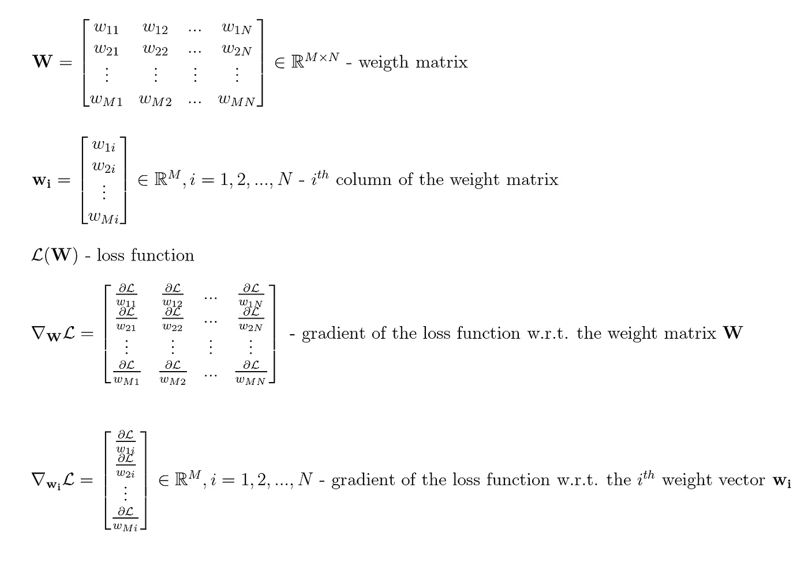

## 梯度集中操作

GC 操作定义如下:从梯度矩阵的每一列中，我们减去该列的平均值。例如，如果梯度矩阵如下所示:

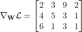

转换后，它将看起来像这样:

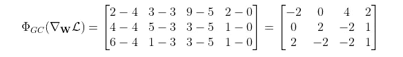

因为各个列的平均值是 4，3，5，0。

换句话说，我们将损失函数的每个梯度 w.r.t .转换为权重向量，使得其平均值等于零。我们可以用一种奇特的符号来表示它:

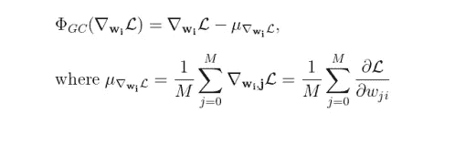

GC 算符的向量公式

如果你想让它看起来更高级，你可以引入一个很酷的 **P** 操作符并使用矩阵公式:

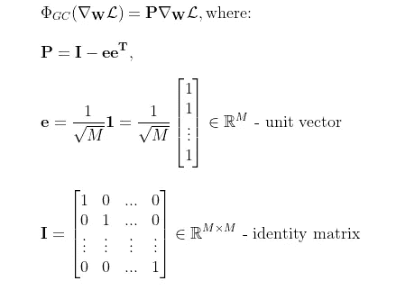

GC 算符的矩阵公式

通过直接矩阵乘法，您可以很容易地检查上述等式是否成立:

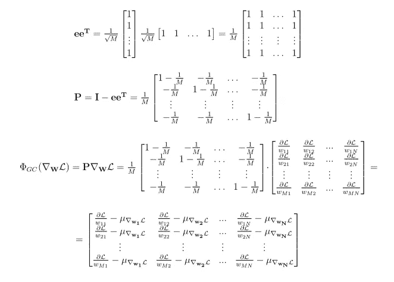

所以实际上从每一列中，我们减去这一列的平均值。

## 几何解释

现在，这个符号的目标不是让简单的事情变得更加晦涩，而是揭示整个过程的优雅的几何解释。如果你懂一点代数，你可能已经看到原始梯度通过使用投影算子 **P** 被投影到权重空间中的某个超平面上。

**投影算子**

为了确保我们在同一页上，让我们看一个简单的例子来回顾一下关于投影算子的一些基本事实——让我们考虑下面的矩阵 **P** 以及当它应用于三维空间中的任何向量 **v** 时会发生什么:

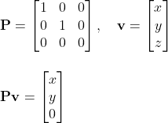

三维空间中的投影运算符示例

如你所见， **v** 失去了它的 *z* 分量——换句话说，它被**投影到 **XY** 平面上:**

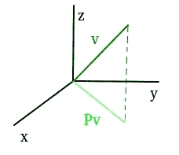

投影可视化

如果再次应用投影操作符会发生什么？什么都没有，向量不能让*更多的*投影到 **XY** 平面。这是投影运算符的定义属性之一:

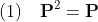

如果投影是**正交的**，则必须满足另一个条件:

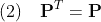

如果矢量 **e** 垂直于投影平面，那么它也垂直于任何矢量 **v** 到该平面的投影:

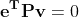

例如，对于我们前面的投影到 **XY** 平面的例子，我们可以看到任何垂直矢量 **e** 都满足上面的等式:

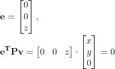

**作为投影的 GC**

现在，如果你检查前面定义的 GC 运算符 **P** 的上述条件(1)和(2)，你会得出结论:它是一个正交投影。

此外，您可以检查:

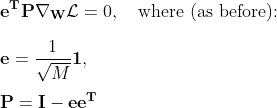

这意味着 **e** 是梯度被投影到其上的超平面的法向量。

如果我们采用由权重空间中的向量 **w** 表示的任何旧权重，并且通过损失函数的投影梯度(而不是梯度本身)来校正它，我们将获得以下新的权重向量**w’**:

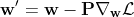

这导致:

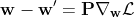

将转置的法向量 **e** 应用于上述等式的两侧会导致:

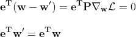

这意味着对于在连续训练迭代(0，1，2，…，t)中计算的权重，以下为真:

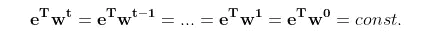

因此，优化问题可以写成:

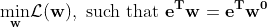

用文章作者的话说，这意味着

> GC 可以看作是一种具有约束损失函数的投影梯度下降法。

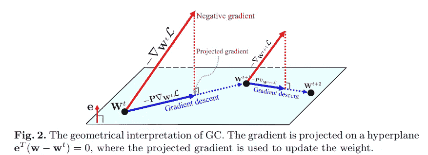

来源:https://arxiv.org/pdf/2004.01461.pdf

## 这如何导致正规化？

对权重向量的这种约束调整了 **w** 的解空间，导致**训练模型**更好的泛化能力。

除了正则化权重空间之外，所提出的方法还正则化输出特征空间。给定输入向量 **x** ，步骤 *t* 中的输出激活被计算为:

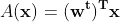

让我们考虑一个输入向量**x’**，它与 **x** 的区别仅在于恒定的强度变化 *γ* :

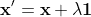

可以看出(详情请查阅原文章的附录):

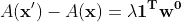

因此，通过选择小的初始权重，我们可以确保输出激活对输入特征的强度变化不敏感。

该文章还提到，所提出的技术通过优化景观平滑和梯度爆炸抑制来加速训练过程，但我不会在这里讨论这些。

在下一篇文章[中，我将展示如何实际使用所提出的技术。](https://medium.com/@tomelisse/gradient-centralization-in-keras-9e4e34a8b895)