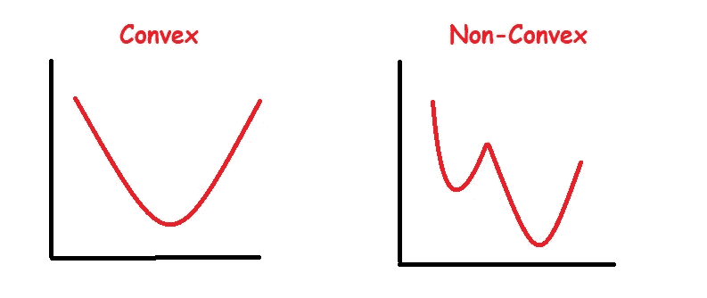
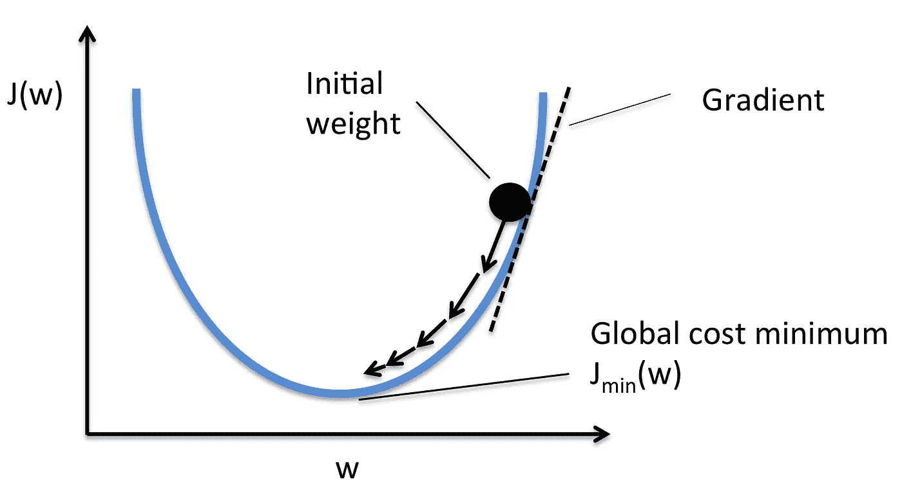
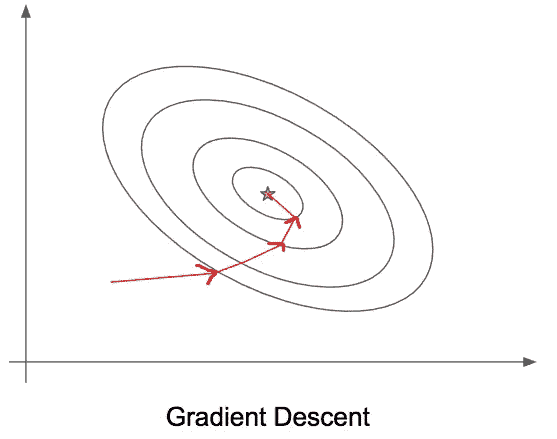
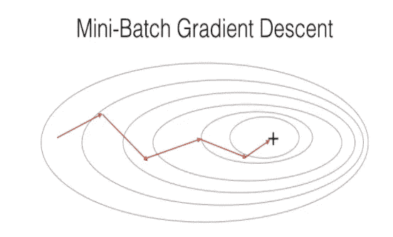
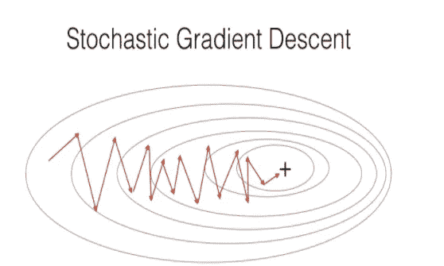

# 梯度下降

> 原文：<https://towardsdatascience.com/gradient-descent-811efcc9f1d5?source=collection_archive---------13----------------------->

## 机器学习中梯度下降的不同变体的利弊

伊内斯·Á·阿尔瓦雷斯·德兹在 [Unsplash](https://unsplash.com/?utm_source=medium&utm_medium=referral) 上拍摄的照片

# 介绍

梯度下降是一阶迭代优化算法，其中优化通常在机器学习中是指最小化由预测模型的参数参数化的成本函数 J(w)。此外，一阶意味着梯度下降在执行参数更新时仅考虑一阶导数。

> *无论发生什么，在你的机器学习或深度学习旅程中的某一点，你都会听说一种叫做梯度下降的东西。对于许多机器学习算法来说，这是一个至关重要的问题，我强烈建议从业者不要将它视为黑盒。*

为了最小化成本函数，我们的目标是找到全局最小值，如果目标函数是[凸的](https://en.wikipedia.org/wiki/Convex_function)，这是非常可行的。然而，在诸如深度学习任务的许多场景中，我们的目标函数往往是非凸的，因此找到目标函数的最低可能值被高度认为是合适的解决方案。

**图 1:凸函数和非凸函数示例。**

为了找到函数的局部最小值，我们采取与函数在当前点的梯度的负值成比例的步骤(来源:[维基百科](https://en.wikipedia.org/wiki/Gradient_descent))。坦率地说，我们从目标函数上的一个随机点开始，向负方向朝着全局/局部最小值移动。

图 2:最小化 J(w)的例子；(来源: [MLextend](http://rasbt.github.io/mlxtend/user_guide/general_concepts/gradient-optimization/) )

可以对梯度下降进行许多不同的调整，以使其在不同的情况下更有效地运行；对梯度下降的每种适应都有其利弊，我们将在下面分享:

# 批量梯度下降

批量梯度下降指的是每次迭代中所有观测值的总和。换句话说，批处理梯度下降为批处理中的每个观测值计算误差(记住这是完整的训练数据)，并且仅在评估了所有观测值之后才更新预测模型——更专业的说法是“*批处理梯度下降在每个时段*的末尾执行参数更新”(一个时段指的是通过整个训练数据的一次迭代)。

图 3:批次梯度下降接近并收敛于全局最小值的 2d 表示。

**优点**

*   比随机梯度下降更稳定的收敛性和误差梯度
*   享受矢量化的优势
*   朝着最小值采取更直接的路径
*   计算效率高，因为在一个时期运行之后需要更新

**缺点**

*   可以收敛于局部极小值和鞍点
*   学习速度较慢，因为只有在我们完成所有观察后才进行更新

# 小批量梯度下降

如果批量梯度下降在每次迭代中对所有观察值求和，则小批量梯度下降在每次迭代中对较少数量的样品(样品的小批量)求和-这种变体减少了梯度的方差，因为我们在每次更新时对指定数量的样品(取决于小批量大小)求和。

> **注意**:这种梯度下降的变化通常是深度学习实践者推荐的技术，但我们必须考虑到有一个额外的超参数，即“批量大小”

图 4:接近最小值的小批量梯度的二维表示；(来源:[https://engmrk.com/mini-batch-gd/](https://engmrk.com/mini-batch-gd/))

**优点**

*   收敛比随机梯度下降更稳定
*   计算效率高
*   快速学习，因为我们执行更多的更新

**缺点**

*   我们必须配置小批量超参数

# 随机梯度下降

随机梯度下降对单个观察值的误差进行求和，并对每个观察值的模型进行更新——这与将小批量的数量设置为等于 *m* 相同，其中 *m* 是观察值的数量。

图 5:接近最小值的小批量梯度的二维表示；(来源:[https://engmrk.com/mini-batch-gd/](https://engmrk.com/mini-batch-gd/))

**赞成者**

*   网络只处理单个观测值，因此更容易存储
*   在大型数据集上，可能(很可能)比批量梯度下降更快地达到最小值附近(并开始振荡)
*   频繁的更新产生了大量的振荡，这有助于摆脱局部最小值。

**缺点**

*   由于频繁更新，可能会偏离错误的方向
*   失去矢量化的优势，因为我们每次处理一个观察值
*   由于一次使用所有资源来处理一个训练样本，频繁的更新在计算上是昂贵的

# 包裹

优化是机器学习和深度学习的主要部分。许多机器学习算法采用的一个简单且非常流行的优化过程称为梯度下降，我们可以通过 3 种方式调整梯度下降，以满足我们的需求。

我们继续 LinkedIn 上的对话吧！

 [## Kurtis Pykes -人工智能作家-走向数据科学| LinkedIn

### 在世界上最大的职业社区 LinkedIn 上查看 Kurtis Pykes 的个人资料。Kurtis 有一个工作列在他们的…

www.linkedin.com](https://www.linkedin.com/in/kurtispykes/)