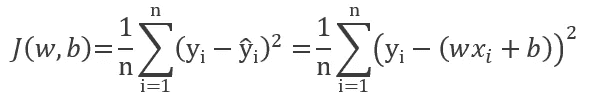
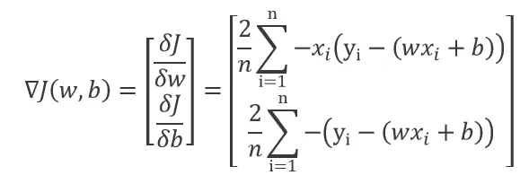
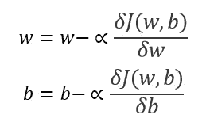
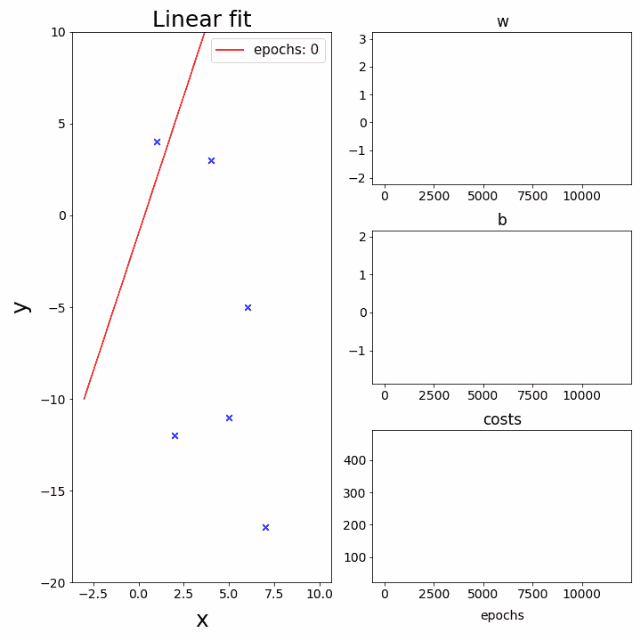
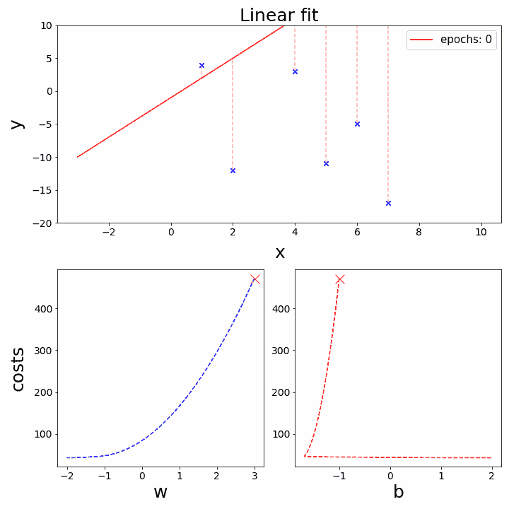
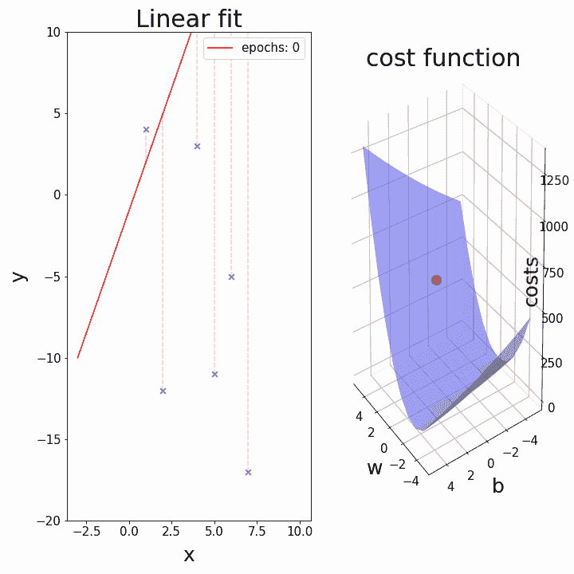

# 渐变下降动画:1。简单线性回归

> 原文：<https://towardsdatascience.com/gradient-descent-animation-1-simple-linear-regression-e49315b24672?source=collection_archive---------11----------------------->

## 这是如何创建可视化梯度下降动画情节系列文章的第一部分。

梯度下降法是当今机器学习中使用最广泛的参数优化算法之一。 [Python 的赛璐珞模块](https://pypi.org/project/celluloid/)使我们能够在梯度下降过程中创建模型参数和成本的生动动画。

在本文中，我示例性地想要使用简单的线性回归来可视化批量梯度下降。我们的目标是建立一个线性回归模型，并在我们制作的一些数据点上对其进行训练。对于每一轮训练(“时期”)，我们打算存储当前的模型参数和成本。最后，我们的目标是用我们存储的值创建一些动画。

## 建立模型

关于如何在培养基上建立和拟合线性回归模型的文章很多。理论上，我们试图为我们的数据找到最佳的拟合直线。数学上，二维空间中的一条直线可以用下面的函数来描述:*y*=*w***x*+*b*，其中 *w* 代表我们这条直线的斜率(或“权重”)，而 *b* 代表我们这条直线的 y 截距(或“偏差”)。给定我们的 *n* 个数据点，有许多方法可以确定 *w* 和 *b* 的最佳值。梯度下降算法旨在最小化观测数据点( *y* )和我们用回归线预测的点( *ŷ* )之间的均方误差。均方差也被称为“成本函数”(或“成本”)，通常表示为 *J* 。

在我们的数据点固定的情况下，成本函数仅取决于参数 *w* 和 *b* 。我们的目标是调整我们的参数，直到成本函数达到最小值。为了大致了解如何调整(减少还是增加)参数，我们引入了成本函数∇的梯度 *J(w，b):*

其中δ *J/* δ *w* 和δ *J/* δ *b* 分别是 *J* 相对于 *w* 和 *b* 的偏导数。通过在当前梯度∇J 的相反方向上不断移动我们的参数，我们可以逐步降低成本 *J* 。我们达到 *J* 的(局部/全局)最小值所采取的步长通常表示为 *α* ，也称为“学习率”。当训练我们的模型时，我们的目标是在每个时期重复以下步骤，直到我们达到收敛:

打个比方，成本函数可以被想象成一些山区地形，从某个起点开始，我们想要下坡，直到我们到达一个山谷。类似地，坡度为我们提供了“多维坡度”，即“上坡”在山体表面的方向。这就是为什么我们打算不断地在梯度的相反方向调整我们的参数。

梯度下降算法可以根据同时使用多少训练数据来计算我们的成本函数的梯度而被细分。在下面的例子中，我们分别为每次更新使用整个数据集，这也被称为批量梯度下降。在 Python 中，我们导入了一些有用的库，并建立了简单的线性回归模型:

然后我们要引入我们的训练数据，定义学习率( *α* =0.001)，初始化我们的起始参数( *w* =3， *b* =-1)，最后训练我们的模型。对于每个时期，我们将参数的更新值、成本和一些特定的预测 y 值存储在列表中。列表项随后被存储在 numpy 数组中，作为我们动画情节的原始数据。

请注意，选择 0.001 这个特别小的学习率是为了防止在梯度下降的第一个时期出现过大的步长。较大的学习速率(例如 *α* =0.1)通常导致需要较少历元的更快的模型收敛。然而，在梯度下降的第一个时期，过大的步长往往会导致不太吸引人的动画，甚至无法收敛。为了确保我们拟合的参数收敛到它们的真实值，我们用 [sklearn 的先天线性回归模型](https://scikit-learn.org/0.20/modules/generated/sklearn.linear_model.LinearRegression.html)来验证我们的结果。

既然我们现在确信我们的梯度下降算法按计划工作，我们可以继续动画。

## 梯度下降动画(简单线性回归):

随着数据点的生成和存储，我们现在可以开始制作一些动画了。例如，我们可以绘制成本函数和参数相对于时期的值，同时绘制相应的回归线:

这些相当基本的曲线揭示了梯度下降的一个非常重要的特征:如果设置正确，在梯度下降的开始，成本迅速下降，参数值显著变化。随着时代的上升，只能观察到成本和参数值的微小变化。因此，绘制我们最初存储的所有值似乎是不利的。虽然主要集中在拟合过程的第一个时期，但我们可以在生成这些资源密集型动画时，在不破坏 Python 的情况下可视化大多数“动作”。在尝试了一些不同的点选择来绘图后，我决定连续利用拟合过程的前 50 个时期，随后仅每第 5 个或第 200 个数据点绘图，直到时期的数量达到 12，000。在下面这段代码中，我们定义了我们想要在我们的图中包含的纪元，并在每个 for 循环后通过快照创建上面的动画。通过调用相机的动画功能，我们可以把我们的快照变成动画。

在我看来，返回正在绘制的 *J* 、 *w* 和 *b* 的最终值是有意义的，这样我们就可以确保我们在动画中粗略地可视化了模型收敛，尽管没有使用我们在拟合过程中存储的所有点。尤其是在 3D 动画中，仅仅通过查看图表有时很难确认前者。

如果我们绘制关于参数 *w* 和 *b* 的成本函数，可以获得更有趣的可视化梯度下降的方式，因为这更接近于 *J* 是 *w* 和 *b* 的函数的实际概念。此外，我们试图在回归线和我们的训练数据之间引入连接线(虚线)来描绘各自的残差。

对我们之前的代码做了一些小的改动，就可以得到上面的动画:

参考前面提到的“山”类比，创建梯度下降的 3D 可视化似乎是可取的。然而，这需要一些初步工作，因为我们必须创建一些在拟合过程中从未遇到过的数据点。换句话说，我们需要在预定义的参数值范围内计算每一对可能的 *w* 和 *b* 的成本，以获得表面图。幸运的是，numpy 有一个名为 [meshgrid](https://numpy.org/doc/stable/reference/generated/numpy.meshgrid.html) 的内置函数，它使我们能够为我们的三维绘图创建坐标网格。

使用下面的代码，我们现在可以在三维空间中可视化梯度下降。

我希望你喜欢这篇文章。如果有任何不清楚的地方，或者你发现了任何错误，请随时发表评论。在下一篇文章中，我将使用多线性回归的例子来处理渐变下降的动画。完整的笔记本可以在我的 [GitHub](https://github.com/BundleOfKent/Animation_SimpleLinReg/blob/master/Animation_SimpleLinReg.ipynb) 上找到。感谢您的关注！

## **参考文献**:

*   [http://fa . bianp . net/teaching/2018/eecs 227 at/gradient _ descent . html](http://fa.bianp.net/teaching/2018/eecs227at/gradient_descent.html)
*   [https://machine learning mastery . com/gentle-introduction-mini-batch-gradient-descent-configure-batch-size/](https://machinelearningmastery.com/gentle-introduction-mini-batch-gradient-descent-configure-batch-size/)