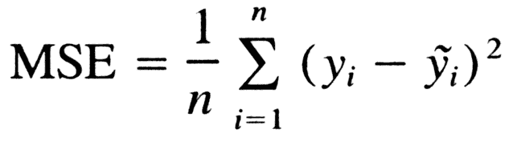
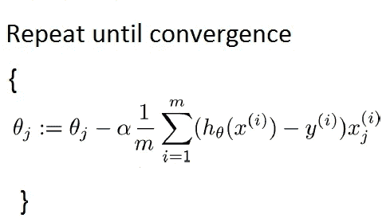
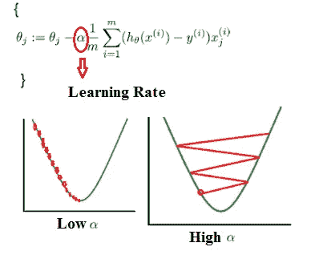
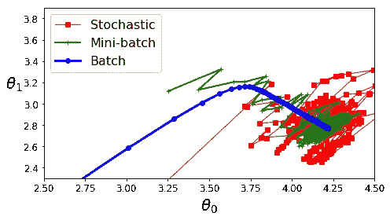
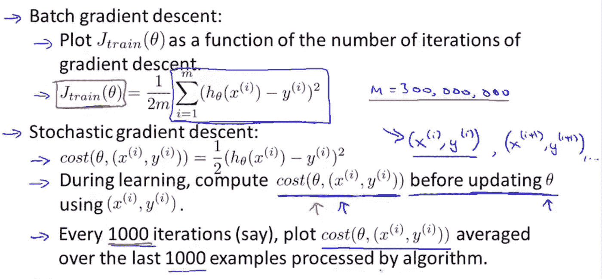
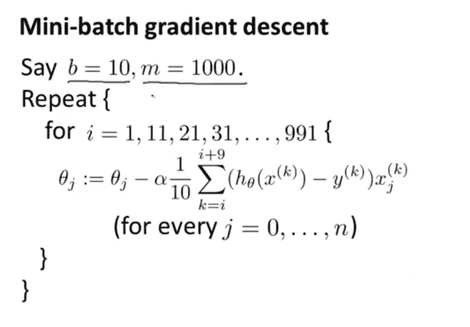
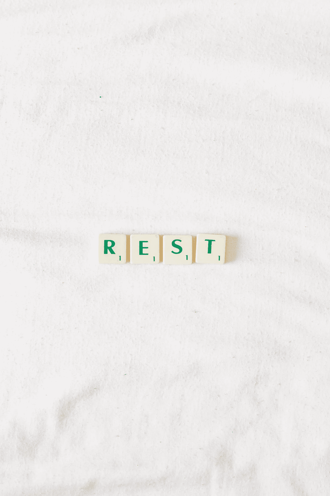

# 梯度下降，在 Python，第 1 部分:麻烦的理论中有清楚的解释

> 原文：<https://towardsdatascience.com/gradient-descent-clearly-explained-in-python-part-1-the-troubling-theory-49a7fa2c4c06?source=collection_archive---------40----------------------->

当你第一次进入机器学习和数据科学领域时，你肯定会遇到的第一件事就是梯度下降。但问题是，到底什么是梯度下降**？它是做什么的？是一回事，还是梯度下降有不同版本？到本文结束时，你将能够回答所有这些问题。**

图片来自[维基百科](https://en.wikipedia.org/wiki/Gradient_descent)

到本文结束时，您将(希望)拥有:

1.  了解什么是梯度下降实际上**是**和它做什么。
2.  了解梯度下降的不同“味道”。

在第二部分中，我们将从头开始编写我们在本文中学到的所有内容。所以，敬请关注！

***事不宜迟，我们开始吧！***

由 [Wander Labs](https://unsplash.com/@wanderlabs?utm_source=unsplash&utm_medium=referral&utm_content=creditCopyText) 在 [Unsplash](https://unsplash.com/s/photos/begin?utm_source=unsplash&utm_medium=referral&utm_content=creditCopyText) 上拍摄的照片

# 直观理解梯度下降

现在，在我开始抛出令人困惑的希腊符号之前(不幸的是我会在某个时候抛出，但请耐心等待)，我想让您从广义上直观地了解它到底是做什么的。

现在，想象你在一座山顶上，你想找到最快的*方式从山顶下来。因此，使用普通逻辑，可以如下处理该问题:*

1.  *环顾四周，看看下降的最佳方向是什么。*
2.  *朝那个方向迈出一步。*
3.  *重复这个过程，直到你到达底部。*

**

*照片由 [Gavin Spear](https://unsplash.com/@rustyspear11?utm_source=unsplash&utm_medium=referral&utm_content=creditCopyText) 在 [Unsplash](https://unsplash.com/s/photos/standing-on-mountain?utm_source=unsplash&utm_medium=referral&utm_content=creditCopyText) 上拍摄*

***注意**:这个类比中需要记住的两个重要因素是:*

1.  ***步长** : *步长应该有多大/多小？**
2.  ***重复** : *这个过程我要重复多少次？**

*现在，记住这个类比，让我们来看看技术！*

# *成本函数*

*现在，在我们进入文章的主要数学之前，让我们简单地谈论一下成本函数。一个*成本函数*本质上是一个衡量你的模型表现如何的函数。我的意思是，线索就在名字里:它测量你的模型预测的损失。一些类型的成本函数包括:*

1.  *均方误差*
2.  *绝对平均误差*
3.  *交叉熵*
4.  *均方根误差*

*例如，均方误差的算法如下:*

**

*照片由 Richie Ng 拍摄*

*如果你曾经参加过 Kaggle 比赛，这些通常被称为*评估指标。*通常，损失越低，您的型号性能越好。因此，举例来说，如果你预测房价并使用*均方差*，而你的成本是 25000 美元，这意味着你的模型表现不佳，因为它产生了 25000 美元的预测误差。*

*回到我们的类比，如果你想象有一个 U 形曲线而不是一座山，有一个成本函数而不是一个人，初始成本值可能是 25，500。梯度下降的目的是将该成本最小化到 0( *全局最小值*)或更小的值(*局部最小值)。**

# *数学上理解梯度下降*

**快速提示:如果你想跳过这一部分，请便。但我向你保证，一旦你明白了，就不难理解了。我将给出一个非常高的梯度下降的数学概述，所以不要担心不能理解一切！**

*梯度下降的正式定义如下:*

**梯度下降是一种优化算法，用于寻找函数的最小值。它是通过得到一条线的负斜率的偏导数来计算的。**

*老实说，那句话相当含糊，所以让我们用数学来分解它。梯度下降的数学表示如下:*

**

*照片由 Richie Ng 拍摄*

*是的，我知道乍一看这看起来像一些复杂的爱因斯坦华夫饼，但请耐心听我说。现在，让我们理解一些符号:*

**θj* :这是你的参数向量中的一个参数，或者系数。本质上是你的价值乘以什么，你在优化什么。*

**α* 这控制了步长。在机器学习行话中，它通常被称为*学习率。**

*m:数据集中训练样本的数量*

**h(x)* :您对数值的预测*

**y* :实际值*

**x(i)j* :这是指第 *j* 行第 *i* 列的一个 your X 变量。我在这里不会讲太多技术，所以不要太担心，因为 Python 为我们完成了大部分困难的部分。*

*σ:这只是说我们在对将要计算的值求和。*

*:=这意味着我们用将要计算的值替换当前值*

*本质上，这个算法陈述的是:*

*{*

*对于我们试图优化的每个参数，按如下方式更改值:*

1.  *取我们参数的当前值*
2.  *通过得到我们的预测值减去实际值的总和乘以我们的 X 特征并乘以我们的学习率来计算梯度*
3.  *从上面计算的值中减去我们当前的参数值*
4.  *重复一定的次数。*

*}*

***现在，关于学习率和初始参数的一个重要注意事项:***

**

*照片可在 [StackOverflow](https://stackoverflow.com/questions/42332058/gradient-descent-thetas-not-converging) 上找到*

1.  **如果学习率过大，梯度下降将错过局部最小值，并在不同点不受控制地波动**
2.  **如果学习率太小，算法达到最小值的时间太长，会耗尽你电脑的电量。**
3.  **初始参数一般随机设置。这就是(yep)* ***随机初始化*** *。不同的初始化可能导致算法只达到局部最小值而不是全局最小值。**

# *梯度下降的类型*

**

*作者照片*

*上述算法被称为**批量梯度下降。**之所以取这个名字，是因为在每一步，它都会计算整个(*批次*)数据集的梯度。现在，你可能已经猜到了，但在大型数据集上，这是不可行的，因为这种工作所需的时间和计算能力太长了。这让我们想到了梯度下降的另外两种流行“味道”:*

1.  ***随机梯度下降***
2.  ***小批量梯度下降***

# *随机梯度下降*

**

*照片由 Richie Ng 拍摄*

*在这种方法中，不是在数据集的所有上计算梯度，而是在随机选择的训练样本上计算梯度(因此得名“随机”，意思是随机的)。这种方法比批量梯度下降快得多，因为它当时只计算一个示例的梯度，而不是整个数据集。*

*然而，由于其随机性，它并不倾向于遵循平滑的曲线，而是倾向于一直来回跳动。然而，在大型数据集上，它肯定会优于批量梯度下降*

# *小批量梯度下降*

**

*照片由 Richie Ng 拍摄*

*在这种方法中，它不是计算整个数据集或数据集的随机样本的梯度，而是计算数据集的小子集，通常称为*小批量。这也是一个非常强大的算法，因为它提供了速度和准确性，并且不像随机梯度下降那样随机。**

*然而，根据参数的初始化，它有时可能会陷入局部最小值。因此，虽然它可能返回经过优化的良好参数，但它们不是最佳参数。*

*这实质上是梯度下降及其高级实现。现在，我确实把事情简单化了，但是这是一个基础，你可以学习并尝试自己实现它！我肯定会建议浏览互联网，以获得更好的理解！*

*唷！这是很大的收获，坚持到最后做得很好。如果你想要一个更严谨和直观的解释，请查阅以下资源:*

1.  *[逐步梯度下降](https://www.youtube.com/watch?v=sDv4f4s2SB8)通过 Statquest*
2.  *[梯度下降:机器人的人工智能](https://www.youtube.com/watch?v=umAeJ7LMCfU&t=245s)*
3.  *[Andrew NG 的 Coursera 机器学习课程](https://www.coursera.org/learn/machine-learning)*

*如果想对机器学习有一个全面的了解，我强烈建议考最后一门。安德鲁擅长用简单的术语直观地解释复杂的话题。*

*现在，这是一个很大的挑战。因此，与其拼命去想，不如试着休息一下。让你的大脑休息一下，让这个话题沉淀下来。然后，当你觉得神清气爽的时候，再回来试着更好地把握概念！*

**

*照片由[真诚媒体](https://unsplash.com/@sincerelymedia?utm_source=unsplash&utm_medium=referral&utm_content=creditCopyText)在 [Unsplash](https://unsplash.com/s/photos/rest?utm_source=unsplash&utm_medium=referral&utm_content=creditCopyText) 上拍摄*

*非常感谢你阅读这篇文章，我将很快推出第二部分，所以请做好准备，因为真正的乐趣才刚刚开始！*