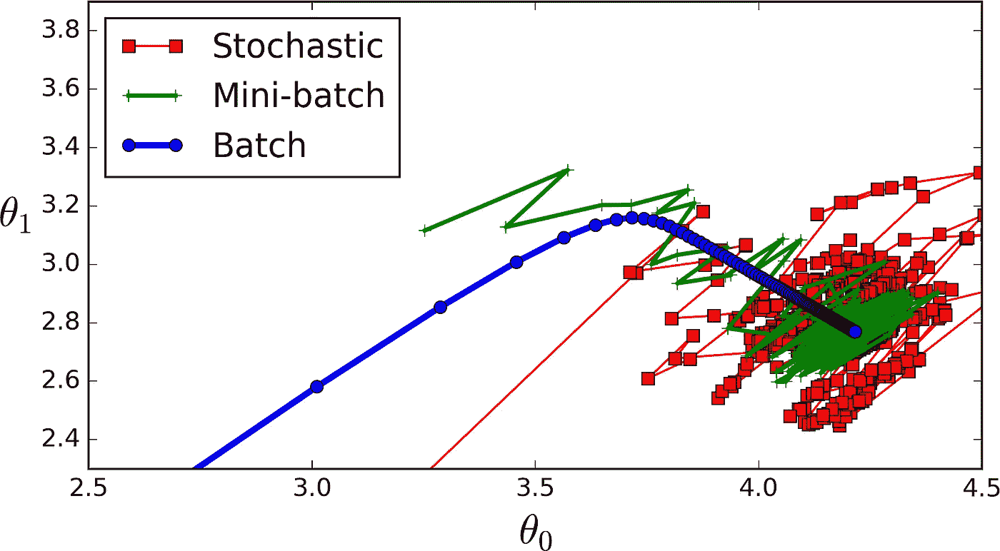
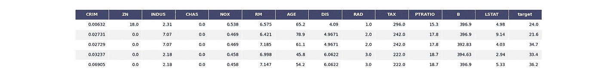
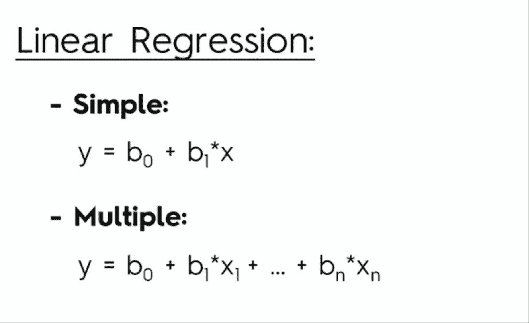
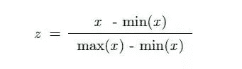
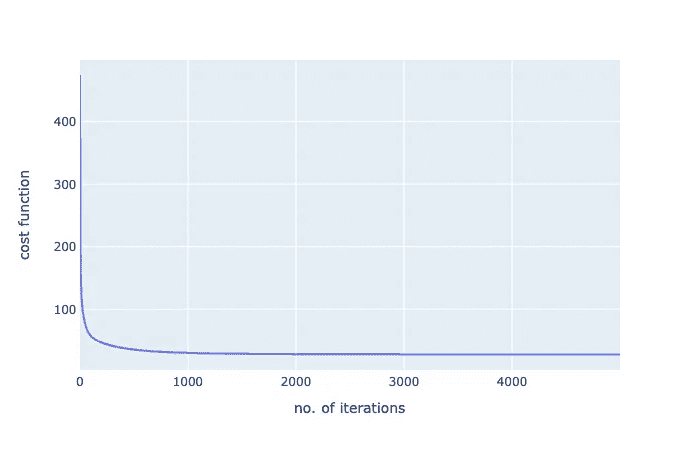
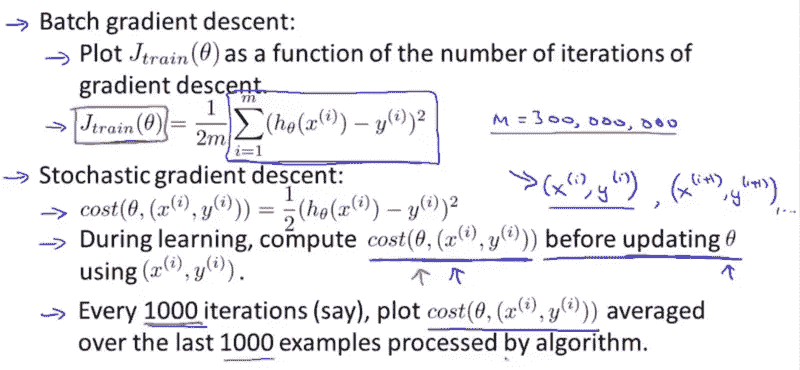
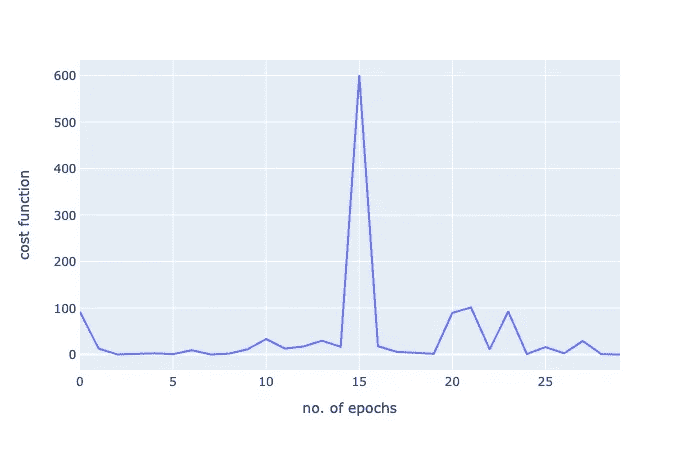
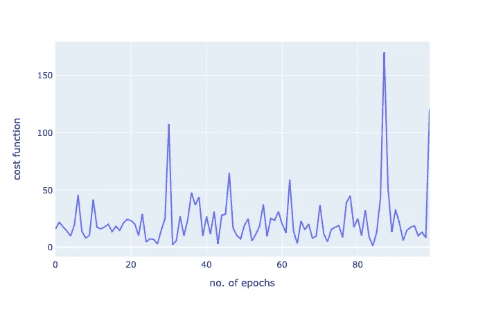

# 梯度下降，在 Python 中有清楚的解释，第 2 部分:引人注目的代码。

> 原文：<https://towardsdatascience.com/gradient-descent-clearly-explained-in-python-part-2-the-compelling-code-c21ee26fbc28?source=collection_archive---------27----------------------->

**注意** : *这是我上一篇文章的后续，这篇文章讨论了梯度下降的理论方面。如果你想了解一下，请点击* [*链接*](/gradient-descent-clearly-explained-in-python-part-1-the-troubling-theory-49a7fa2c4c06?source=your_stories_page-------------------------------------) *。如果你对这个理论不感兴趣，你可以直接加入！*



作者照片

梯度下降是数据科学的基础，无论是深度学习还是机器学习。对梯度下降原理的扎实理解，一定会对你以后的工作有所帮助。

你将真正理解*这些超参数*做什么，*后台发生什么*，以及*你**如何处理你在使用该算法时可能面临的问题，而不是玩弄超参数并希望得到最好的结果。*

*然而，梯度下降并不局限于一种算法。梯度下降的另外两种流行的“味道”(随机和小批量梯度下降)建立在主算法的基础上，并且可能是比普通批量梯度下降更多的算法。因此，我们还必须对这些算法有深入的了解，因为当我们的算法没有达到预期效果时，我们需要了解和分析它们的一些额外的超参数。*

*虽然理论对于牢固理解手头的算法至关重要，但梯度下降的实际编码及其不同的“味道”可能会被证明是一项困难但令人满意的任务。为了完成这项任务，文章的格式如下所示:*

1.  *每种算法的简要概述。*
2.  *算法的代码*
3.  *对代码中不清楚部分的进一步解释*

*我们将使用著名的波士顿住房数据集，它是 scikit-learn 中预先构建的。我们还将从头开始构建一个线性模型，所以请抓紧，因为你即将进入一个全新的世界！*

**

*布拉登·科拉姆在 [Unsplash](https://unsplash.com/s/photos/ready?utm_source=unsplash&utm_medium=referral&utm_content=creditCopyText) 拍摄的照片*

*好的，那么首先让我们做一些基本的导入(通常的东西)。我不打算在这里做 EDA，因为这不是我们这篇文章的真正目的。然而，我将展示一些可视化效果来澄清一些事情。*

```
*import numpy as np
import pandas as pd 
import plotly.express as px
from sklearn.datasets import load_boston
from sklearn.metrics import mean_squared_error*
```

*好了，为了让我们看到数据的样子，我将数据转换成 DataFrame 并显示输出。*

```
*data = load_boston()df = pd.DataFrame(data['data'],columns=data['feature_names'])
df.insert(13,'target',data['target'])
df.head(5)*
```

**

*作者照片*

*嗯，这里没什么特别的，我确信如果你在遇到这个之前做过任何 ML 项目。*

*现在，我们将定义我们的特征(X)和目标(y)。我们还将定义我们的参数向量，命名为 thetas，并将其初始化为零。*

```
*X,y = df.drop('target',axis=1),df['target']thetas = np.zeros(X.shape[1])*
```

# *价值函数*

*回想一下，成本函数是用来衡量模型性能的，也是梯度下降法旨在改进的。我们将使用的成本函数被称为 MSE，或均方误差。公式是这样的:*

**

*照片由 Richie Ng 拍摄*

*好，让我们把它编码出来:*

```
*def cost_function(X,Y,B):
    predictions = np.dot(X,B.T)

    cost = (1/len(Y)) * np.sum((predictions - Y) ** 2)
    return cost*
```

*这里，我们将输入、标签和参数作为输入，并使用线性模型进行预测，获得成本，然后返回。如果第二行让您困惑，请回忆一下线性回归公式:*

**

*因此，我们实际上是在获得我们的每个特征和它们相应的权重之间的点积。如果你仍然不确定我在说什么，看看这个视频。*

*很好，现在让我们测试一下我们的成本函数，看看它是否真的有效。为了做到这一点，我们将使用 scikit-learn 的 mean_squared_error，获得结果，并将其与我们的算法进行比较。*

```
*mean_squared_error(np.dot(X,thetas.T),y)OUT: 592.14691169960474cost_function(X,y,thetas)OUT: 592.14691169960474*
```

*太棒了，我们的成本函数起作用了！*

# *特征缩放*

*特征缩放是对线性模型(线性回归、KNN、SVM)至关重要的预处理技术。本质上，特征被缩小到更小的尺度，并且特征也在一定的范围内。将特征缩放想象成这样:*

1.  *你有一座非常大的建筑*
2.  *您想要保持建筑的**形状**，但是想要将其调整为更小的**比例***

*要素缩放通常用于以下情况:*

1.  *如果算法使用欧几里德距离，那么特征缩放是必需的，因为欧几里德距离对大的量值是敏感的*
2.  *特征缩放也可用于归一化具有大范围值的数据*
3.  *特征缩放还可以提高算法的速度*

*虽然有许多不同的功能缩放方法可用，但我们将使用以下公式构建 MinMaxScaler 的自定义实现:*

**

*作者照片*

*由于上述原因，我们将使用缩放。*

*现在，对于 python 实现:*

```
*X_norm = (X - X.min()) / (X.max() - X.min())
X = X_norm*
```

*这里没什么特别的，我们只是把公式翻译成代码。现在，节目真正开始了:梯度下降！*

**

*照片由[戴恩·托普金](https://unsplash.com/@dtopkin1?utm_source=unsplash&utm_medium=referral&utm_content=creditCopyText)在 [Unsplash](https://unsplash.com/s/photos/begin?utm_source=unsplash&utm_medium=referral&utm_content=creditCopyText) 上拍摄*

# *梯度下降*

**

*照片由 [Gavin Spear](https://unsplash.com/@rustyspear11?utm_source=unsplash&utm_medium=referral&utm_content=creditCopyText) 在 [Unsplash](https://unsplash.com/s/photos/standing-on-mountain?utm_source=unsplash&utm_medium=referral&utm_content=creditCopyText) 上拍摄*

*具体来说，梯度下降是一种优化算法，通过迭代遍历数据并获得偏导数来寻找函数的最小值(在我们的情况下，MSE)。*

*如果这看起来有点复杂，试着想象梯度下降，就好像一个人站在山顶上，他们正试图尽可能快地从山上爬下来，重复地向山的负方向“迈步”,直到他们到达底部。*

*现在，梯度下降有不同的版本，但你最常遇到的是:*

1.  *批量梯度下降*
2.  *随机梯度下降*
3.  *小批量梯度下降*

*我们现在将依次讨论、实施和分析其中的每一项，让我们开始吧！*

# *批量梯度下降*

**

*图片来自[维基百科](https://en.wikipedia.org/wiki/Gradient_descent)*

*批量梯度下降可能是你遇到的第一种梯度下降。现在，我在这篇文章中不是很理论化(你可以参考我的[上一篇](https://medium.com/@vagifaliyev/gradient-descent-clearly-explained-in-python-part-1-the-troubling-theory-49a7fa2c4c06)文章)，但本质上它计算的是**整体(**批次 **)** 数据集上系数的偏导数。这就是为什么你可能已经猜到它在大型数据集上会很慢。*

*然而，关于批量梯度下降的一个很好的想法是，当它达到最小值时，它会自动采取较小的步骤，因此不需要学习计划(我将在后面谈到这一点)。*

**

*作者照片*

*我们的数据集很小，所以我们可以像这样实现批量梯度下降:*

```
*def batch_gradient_descent(X,Y,theta,alpha,iters):
    cost_history = [0] * iters  # initalize our cost history list
    for i in range(iters):         
        prediction = np.dot(X,theta.T)                  
        theta = theta - (alpha/len(Y)) * np.dot(prediction - Y,X)   
        cost_history[i] = cost_function(X,Y,theta)               
    return theta,cost_history*
```

*为了澄清一些术语:*

**alpha* :这是指学习率。*

**iters:* 要运行的迭代次数。*

*太好了，现在让我们看看结果吧！*

```
**batch_theta,batch_history=batch_gradient_descent(X,y,theta,0.05,500)**
```

*好吧，不是很快，但也不是很慢。让我们用新的和改进的参数来直观显示和获得我们的成本:*

```
*cost_function(X,y,batch_theta)OUT: 27.537447130784262*
```

*哇，从 592 到 27！这只是梯度下降威力的一瞥！让我们将迭代次数的成本函数可视化:*

```
*fig = px.line(batch_history,x=range(5000),y=batch_history,labels={'x':'no. of iterations','y':'cost function'})
fig.show()*
```

**

*作者照片*

*好的，看这个图表，我们在大约 100 次迭代后达到一个大的下降，从那里开始，它逐渐下降。*

*因此，总结批量梯度:*

# *赞成的意见*

1.  *有效且具有平滑曲线，当斜率达到全局最小值时会自动降低。*
2.  *最准确且最有可能达到全局最小值*

# *骗局*

1.  *在大型数据集上可能会很慢*
2.  *计算成本高*

# *随机梯度下降*

**

*照片由 Richie Ng 拍摄*

*这里，不是计算整个训练集的偏导数，偏导数的计算只在一个**随机**样本上进行(随机意味着随机)。*

*这很好，因为计算只需要在一个训练样本上进行，而不是整个训练集，这使得它更快，更适合大型数据集。*

*然而，由于其随机性质，随机梯度下降不具有像批量梯度下降那样的平滑曲线，尽管它可能返回良好的参数，但它不能保证达到全局最小值。*

## *学习时间表*

*解决随机梯度下降不能在最小值上稳定的问题的一种方法是使用被称为*学习计划的东西。**

*本质上，这逐渐降低了学习率。因此，学习率最初很大(这有助于避免局部最小值)，并随着接近全局最小值而逐渐降低。但是，您必须小心:*

1.  *如果学习率降低得太快，那么算法可能会卡在局部最小值，或者它可能会在最小值中途冻结。*
2.  *如果学习率降低得太慢，您可能会在最小值附近跳很长时间，仍然得不到最佳参数*

*我们现在将使用基本学习计划实施随机梯度下降:*

```
*t0,t1 = 5,50 # learning schedule hyperparametersdef learning_schedule(t):
    return t0/(t+t1)def stochastic_gradient_descent(X,y,thetas,n_epochs=30):
    c_hist = [0] * n_epochs # Cost history list
    for epoch in range(n_epochs):
        for i in range(len(y)):
            random_index = np.random.randint(len(Y))
            xi = X[random_index:random_index+1]
            yi = y[random_index:random_index+1]

            prediction = xi.dot(thetas)

            gradient = 2 * xi.T.dot(prediction-yi)
            eta = learning_schedule(epoch * len(Y) + i)
            thetas = thetas - eta * gradient
            c_hist[epoch] = cost_function(xi,yi,thetas)
    return thetas,c_hist*
```

*现在让我们运行我们的函数:*

```
*sdg_thetas,sgd_cost_hist = stochastic_gradient_descent(X,Y,theta)*
```

*好的，太好了，它起作用了！现在让我们看看结果:*

```
*cost_function(X,y,sdg_thetas)OUT:
29.833230764634493*
```

*哇！我们从 592 到 29，但是注意:我们只做了 30 次迭代。通过批量梯度下降，我们在 **500 次**迭代后得到了 27 次！这只是随机梯度下降的非凡力量的一瞥。*

*让我们用一个线形图来再次形象化这一点:*

**

*作者照片*

*由于这是一个小数据集，批量梯度下降就足够了，然而这只是显示了随机梯度下降的威力。*

*总结一下随机梯度下降:*

# *优点:*

1.  *与批量梯度下降相比更快*
2.  *更好地处理大型数据集*

# *缺点:*

1.  *很难确定某个最小值*
2.  *并不总是有一个清晰的路径，可以在最小值附近反弹，但永远不会达到最优最小值*

# *小批量梯度下降*

**

*照片由 Richie Ng 拍摄*

*好了，就快到了，只差一个了！现在，在小批量梯度下降中，我们不是计算整个训练集或随机示例的偏导数，而是计算整个训练集的**小子集**的偏导数。*

*这给了我们比批量梯度下降快得多的速度，并且因为它不像随机梯度下降那样随机，所以我们更接近最小值。然而，它容易陷入局部极小值。*

*同样，为了解决陷入局部最小值的问题，我们将在实现中使用一个基本的学习时间表。*

```
*np.random.seed(42) # so we get equal resultst0, t1 = 200, 1000
def learning_schedule(t):
    return t0 / (t + t1)def mini_batch_gradient_descent(X,y,thetas,n_iters=100,batch_size=20):
    t = 0
    c_hist = [0] * n_iters
    for epoch in range(n_iters):
        shuffled_indices = np.random.permutation(len(y))
        X_shuffled = X_scaled[shuffled_indices]
        y_shuffled = y[shuffled_indices]

        for i in range(0,len(Y),batch_size):
            t+=1
            xi = X_shuffled[i:i+batch_size]
            yi = y_shuffled[i:i+batch_size]

            gradient = 2/batch_size * xi.T.dot(xi.dot(thetas) - yi)
            eta = learning_schedule(t)
            thetas = thetas - eta * gradient
            c_hist[epoch] = cost_function(xi,yi,thetas)
    return thetas,c_hist*
```

*让我们运行并获得结果:*

```
*mini_batch_gd_thetas,mini_batch_gd_cost = mini_batch_gradient_descent(X,y,theta)*
```

*以及带有新参数的成本函数:*

```
*cost_function(X,Y,mini_batch_gd_thetas)OUT: 27.509689139167012*
```

*又一次令人惊叹。我们运行了批量梯度下降迭代的 1/5，得到了更好的分数！谈效率！*

*让我们再次绘制出函数:*

**

*作者照片*

*好了，我的梯度下降系列到此结束！我真的希望你喜欢它，并随时询问任何问题或要求任何澄清！*

*现在，我建议你出去休息一下，因为有太多东西要消化了！尽可能地享受你的时间，记住:学习是有趣的，所以每天都要学！*

**

*普里西拉·杜·普里兹在 [Unsplash](https://unsplash.com/s/photos/thank-you?utm_source=unsplash&utm_medium=referral&utm_content=creditCopyText) 上的照片*