# 梯度下降解释

> 原文：<https://towardsdatascience.com/gradient-descent-explained-9b953fc0d2c?source=collection_archive---------6----------------------->

## 梯度下降综合指南

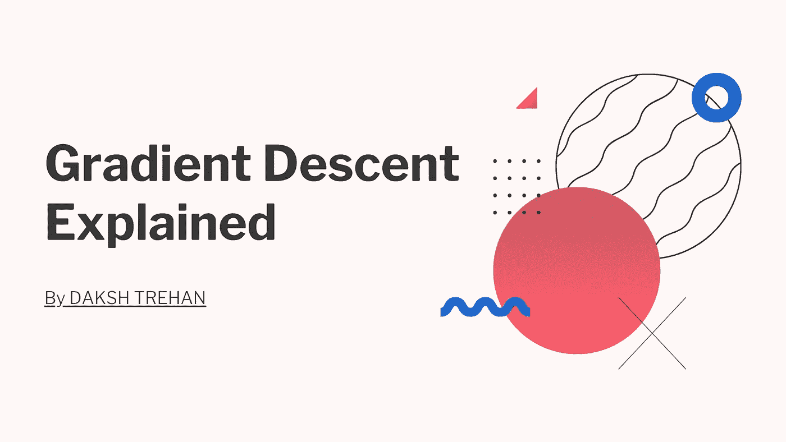

优化是指最小化/最大化由 x 参数化的目标函数 f(x)的任务。在机器/深度学习术语中，它是最小化由模型参数 w ∈ R^d.
参数化的成本/损失函数 J(w)的任务。优化算法(在最小化的情况下)具有以下目标之一:

1.  找到目标函数的全局最小值。如果目标函数是凸的，即任何局部最小值都是全局最小值，这是可行的。
2.  找到目标函数在其邻域内的最低可能值。如果目标函数不像大多数深度学习问题那样是凸的，通常就是这种情况。

# 梯度下降

梯度下降是机器/深度学习算法中使用的优化算法。梯度下降的目标是使用迭代最小化目标凸函数 f(x)。

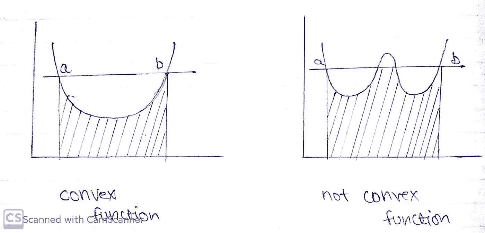

凸函数 v/s 不是凸函数

成本函数的梯度下降。

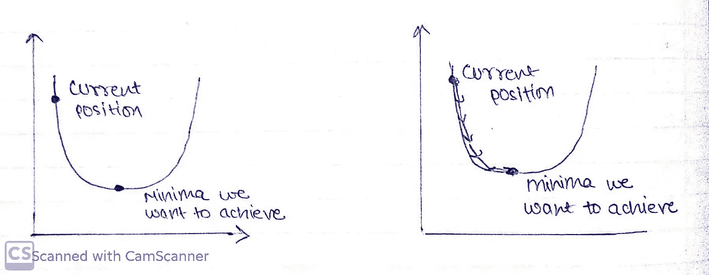

梯度下降背后的直觉

为方便起见，我们来看一个简单的线性模型。

> 误差= Y(预测)-Y(实际)

机器学习模型总是希望最大精度的低误差，为了减少误差，我们将直觉地告诉我们的算法，你正在做一些需要纠正的错误，这将通过梯度下降来完成。

我们需要最小化我们的误差，为了得到指向最小值的指针，我们需要走一些被称为 alpha(学习率)的步骤。

## 实施梯度下降的步骤

1.  随机初始化值。
2.  更新值。

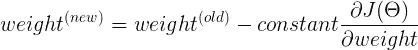

3.重复直到斜率=0

导数是一个来自微积分的术语，计算为图形在特定点的斜率。斜率是通过在该点画一条切线来描述的。所以，如果我们能计算出这条切线，我们就能计算出达到最小值的方向。

学习率一定要明智的选择为:
1。如果太小，那么模型需要一些时间来学习。
2。如果它太大，模型会收敛，因为我们的指针会射出，我们将无法达到最小值。

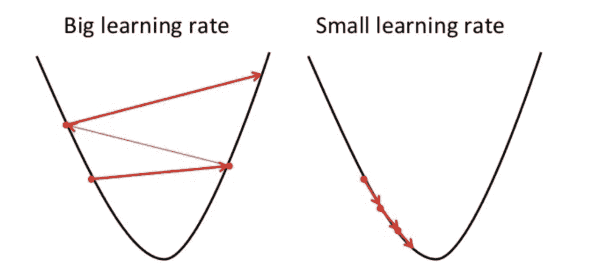

大学习率 v/s 小学习率，[来源](https://algorithmia.com/blog/introduction-to-optimizers)

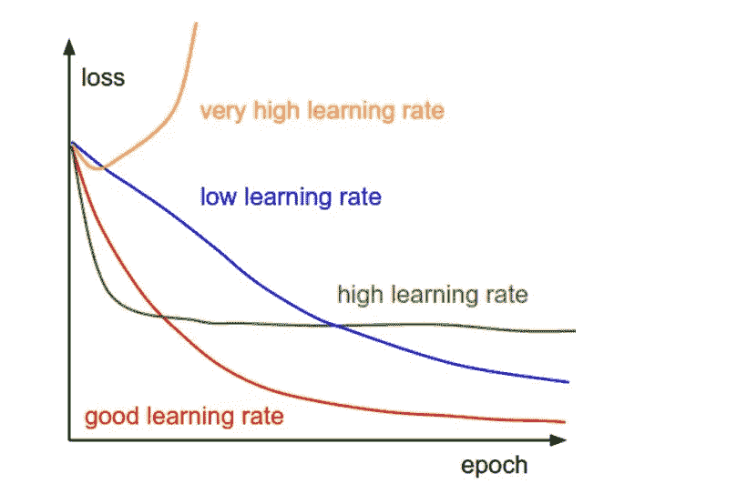

不同学习率的梯度下降，[来源](https://cs231n.github.io/neural-networks-3/)

然而，普通梯度下降法不能保证良好的收敛性，原因如下:

*   选择一个合适的学习速度可能会很麻烦。学习率过低会导致训练缓慢，而学习率过高会导致斜率超调。
*   香草梯度下降面临的另一个关键障碍是它避免陷入局部最小值；这些局部极小值被同样误差的小山包围，这使得香草梯度下降很难逃脱它。

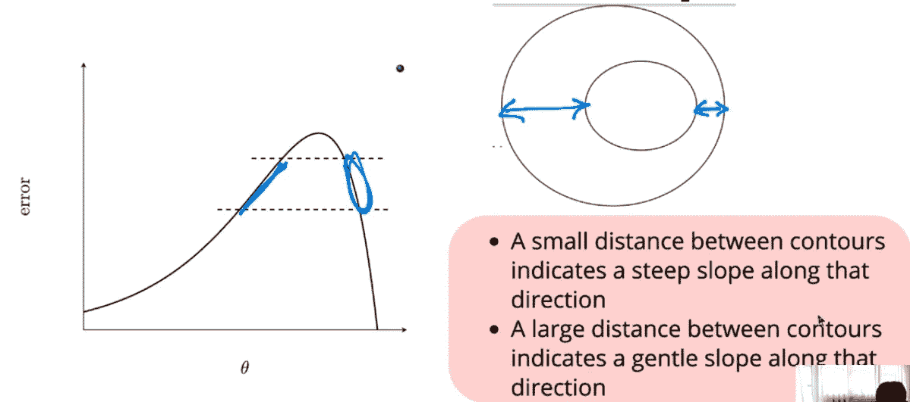

显示曲线平缓和陡峭区域的等高线图，[来源](https://padhai.onefourthlabs.in/courses/dl-feb-2019)

简而言之，我们朝着最小值迈出的每一步都会降低我们的斜率，现在如果我们想象，在曲线的陡峭区域，导数将会很大，因此我们的模型采取的步骤也会很大，但是当我们进入斜率平缓的区域时，导数将会降低，达到最小值的时间也会减少。

## 基于动量的梯度下降

如果我们考虑，简单梯度下降完全仅依赖于计算，即，如果有 10000 个步骤，那么我们的模型将尝试实施简单梯度下降 10000 次，这显然太费时且计算昂贵。

在门外汉的语言中，假设一个人正在走向他的家，但他不知道路，所以他向路人问路，现在我们希望他走一段距离，然后问路，但人在他走的每一步都在问路，这显然更耗时，现在比较简单梯度下降的人和他的目标与最小值。

为了避免普通梯度下降的缺点，我们引入了基于动量的梯度下降，其目标是降低计算时间，这可以在我们引入经验的概念时实现，即使用先前步骤的置信度。

基于动量梯度下降的伪代码；

```
update = learning_rate * gradient
velocity = previous_update * momentum
parameter = parameter + velocity – update
```

以这种方式，我们不是一次又一次地计算新的步骤，而是对衰减进行平均，并且随着衰减增加，其对决策的影响减小，因此越老的步骤对决策的影响越小。
历史越悠久，就要迈出越大的步伐。

即使在平缓区域，基于动量的梯度下降也由于其承受的动量而迈出了大步。

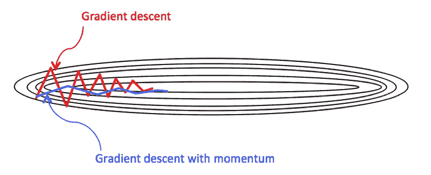

香草梯度下降 v/s 梯度下降带动量，[来源](https://nhannguyen95.github.io/coursera-deep-learning-course-2-week-2/)

但是由于较大的步数，当它由于陡峭的坡度而在最小值附近振荡时，它以更长的距离超过了它的目标，但是尽管有这些障碍，它还是比普通的梯度下降快。

简而言之，假设一个人想要到达 1200 米远的目的地，但他不知道路径，所以他决定每走 250 米就问路，现在如果他问路 5 次，他就已经走了 1250 米，这说明他已经超过了目标，要实现目标，他需要往回走。基于动量的 GD 也是类似的情况，由于经验丰富，我们的模型采取了较大的步骤，这导致了超调，因此错过了目标，但为了达到最小值，模型必须回溯其步骤。

## 内斯特罗夫加速梯度下降法

为了克服基于动量的梯度下降的问题，我们使用 NAG，在这种情况下，我们首先移动，然后计算梯度，这样，如果我们的振荡过冲，那么与基于动量的梯度下降相比，它一定是不重要的。

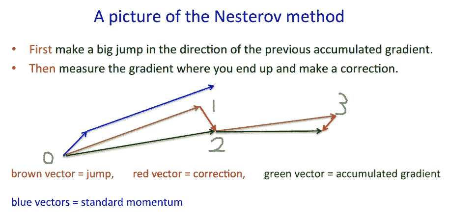

NAG 背后的直觉，[来源](https://stats.stackexchange.com/questions/179915/whats-the-difference-between-momentum-based-gradient-descent-and-nesterovs-acc)

内斯特罗夫加速梯度(NAG)是一种为我们的动量提供历史的方法。我们现在可以通过计算相对于我们现在的参数θ的角度来充分地向前看。

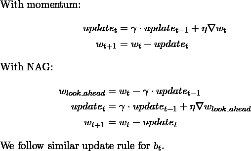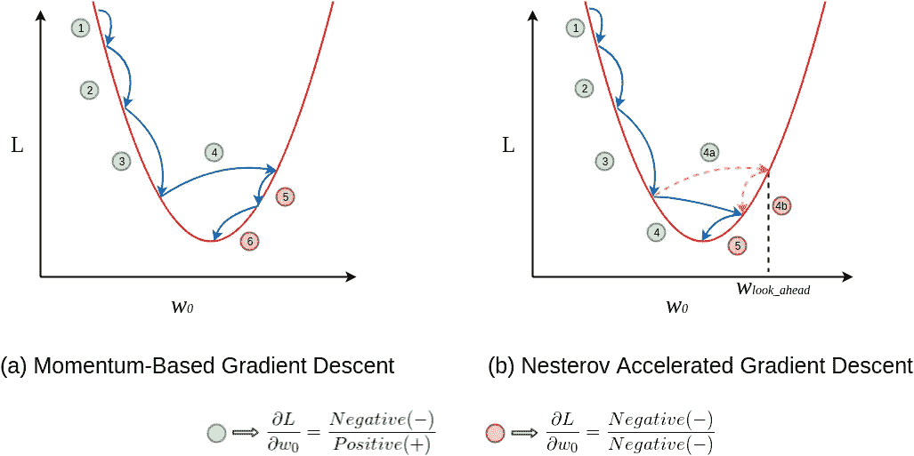

基于动量梯度下降 v/s 内斯特罗夫加速梯度下降，[来源](https://stats.stackexchange.com/questions/179915/whats-the-difference-between-momentum-based-gradient-descent-and-nesterovs-acc)

# 梯度下降策略。

## 随机梯度下降

在这里，学习发生在每个例子上:

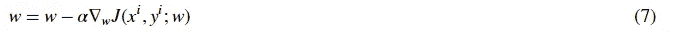

*   打乱训练数据集以避免预先存在的示例顺序。
*   将训练数据集划分成 *m* 个例子。

**优点:——**

a.易于安装在内存中
b .计算速度快
c .对大型数据集高效

**缺点:-**

a.由于频繁更新，朝着最小值采取的步骤非常嘈杂。
b .噪音会使等待时间变长。
c .频繁更新的计算开销很大。

## 批量梯度下降

这是一种贪婪的方法，我们必须对每次更新的所有例子求和。

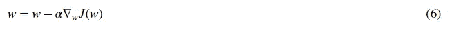

**优点:-**

a.噪音较小的步骤
b .产生稳定的 GD 收敛。c .计算效率高，因为所有资源不是用于单个样本，而是用于所有训练样本

**缺点:-**

a.可能需要额外的内存。处理大型数据库可能需要很长时间。
c .近似梯度

## 小批量梯度下降

小批量梯度下降法不是遍历所有样品，而是根据批量大小对少量样品进行汇总。

它是批梯度下降和随机梯度下降的和。

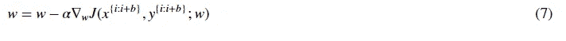

**优点:-**

a.易于记忆。b .计算效率高。
c .稳定误差 go 和收敛。


批量 v/s 随机 v/s 微型批量梯度下降，[来源](https://datascience.stackexchange.com/questions/52884/possible-for-batch-size-of-neural-network-to-be-too-small)

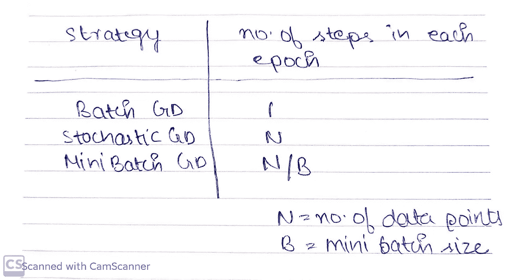

# 如果我们用梯度下降来处理稀疏数据会怎么样？

在稀疏数据的情况下，我们将经历稀疏的 ON(1)特征和更频繁的 OFF(0)特征，现在，大部分时间梯度更新将为零，因为在大多数情况下导数为零，当导数为零时，步长将太小而无法达到最小值。

对于频繁特征，我们要求低学习率，但是对于高特征，我们要求高学习率。

因此，为了提高我们的稀疏自然数据模型，我们需要选择自适应学习率。

**如果你喜欢这篇文章，请考虑订阅我的简讯:** [**达克什·特雷汉每周简讯**](https://mailchi.mp/b535943b5fff/daksh-trehan-weekly-newsletter) **。**

# 结论

希望这篇文章不仅增加了你对梯度下降的理解，还让你意识到机器学习并不难，并且已经在你的日常生活中发生了。

一如既往，非常感谢您的阅读，如果您觉得这篇文章有用，请分享！:)

要了解更多参数优化技术，请访问:-

[](/parameters-optimization-explained-876561853de0) [## 解释参数优化

### 梯度下降的简要描述指南，ADAM，ADAGRAD，RMSProp

towardsdatascience.com](/parameters-optimization-explained-876561853de0) 

## 参考资料:

【1】[梯度下降算法及其变体](/gradient-descent-algorithm-and-its-variants-10f652806a3)由 [Imad Dabbura](https://towardsdatascience.com/@ImadPhd?source=post_page-----10f652806a3----------------------)

[2] [学习参数，第 2 部分:基于动量的&内斯特罗夫加速梯度下降](/learning-parameters-part-2-a190bef2d12)作者阿克谢·L·钱德拉

[3][Sebastian Ruder 的梯度下降优化算法概述](https://ruder.io/optimizing-gradient-descent/index.html#momentum)

[4] [理解梯度下降背后的数学原理](/understanding-the-mathematics-behind-gradient-descent-dde5dc9be06e)Parul Pandey 著。

[5] [深度学习](https://padhai.onefourthlabs.in/courses/dl-feb-2019) (padhAI)作者 Mitesh Khapra 博士和 Pratyush Kumar 博士

封面模板是我在 canva.com 上设计的，来源在每张图片上都有提及，未提及的图片来自我的笔记本。

## 请随意连接:

> *加入我在【www.dakshtrehan.com】[*的*](http://www.dakshtrehan.com)*
> 
> *LinkedIN ~*[*https://www.linkedin.com/in/dakshtrehan/*](https://www.linkedin.com/in/dakshtrehan/)
> 
> *Instagram ~*[*https://www.instagram.com/_daksh_trehan_/*](https://www.instagram.com/_daksh_trehan_/)
> 
> *Github ~*[https://github.com/dakshtrehan](https://github.com/dakshtrehan)

查看我的其他文章:-

> [利用深度学习检测新冠肺炎。](/detecting-covid-19-using-deep-learning-262956b6f981)
> 
> [逻辑回归解释](/logistic-regression-explained-ef1d816ea85a)
> 
> [*线性回归解释*](https://medium.com/towards-artificial-intelligence/linear-regression-explained-f5cc85ae2c5c)
> 
> [确定最适合您的 ML 模型。](https://medium.com/datadriveninvestor/determining-perfect-fit-for-your-ml-model-339459eef670)
> 
> [为菜鸟服务数据科学。](https://medium.com/towards-artificial-intelligence/serving-data-science-to-a-rookie-b03af9ea99a2)
> 
> [将机器学习技术与现实生活联系起来。](https://levelup.gitconnected.com/relating-machine-learning-techniques-to-real-life-4dafd626fdff)

关注更多机器学习/深度学习博客。

> *干杯。*