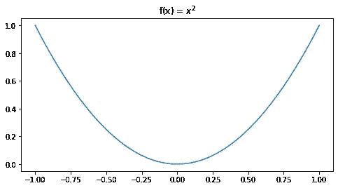
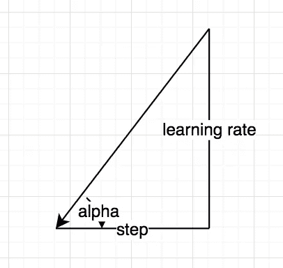
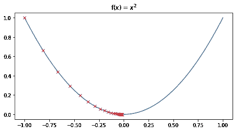
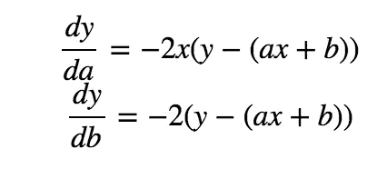
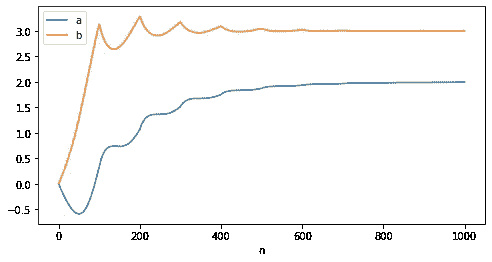
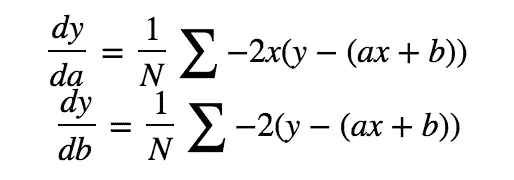
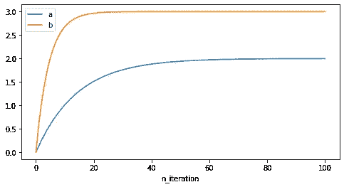

# 梯度下降解释和实施

> 原文：<https://towardsdatascience.com/gradient-descent-explanation-implementation-c74005ff7dd1?source=collection_archive---------15----------------------->

## 香草梯度下降算法分步指南

梯度下降可能是最著名的优化算法，在机器学习的世界中，你肯定已经直接或间接使用过梯度下降。你可能已经知道，通过向梯度的负方向移动微小的步长，可以帮助最小化损失函数。但是具体怎么做呢？除了直接使用包含在包中的梯度方法，我们如何实现我们自己的方法并更仔细地观察梯度下降呢？

# 理解渐变

在这篇文章中，让我们一点一点地打破梯度下降，并通过实现我们自己的来加深对它的理解。现在让我们从最简单的例子开始:

> 假设我们有函数`f(x) = x^2`，其中`x`的范围从-1 到 1，给定`x`在该范围内随机开始，如何求`f(x)`的最小值？

显然在这个例子中，最小值位于`x = 0`，我们希望

*   使`x`向右移动`if x < 0`
*   使`x`向左移动`if x > 0`

那么我们如何做到这一点呢？你可能还会注意到函数的梯度

*   `grad > 0`当`x > 0`
*   `grad < 0`当`x < 0`

与`x`的移动方向相反！梯度下降利用这一点，让`x`向其梯度的相反方向移动。在这种情况下，无论`x`在哪里，它都会移动到最小。

下一个问题是`x`应该移动多远，这导致了学习率，它是许多机器学习算法中的参数。

事实上，在上面的例子中，`tanα`是梯度，在每一步，我们使`x`以步长`tanα * learning_rate`移动，其中学习率成为控制下降速度的可调参数。

# 首次实施

记住上面的内容，我们可以让我们的第一个实现找到函数`x^2`的最小值。

在每次迭代中，`x -= lr*grad_fn(x)`使其总是向最小值移动，我们也可以绘制出`x`的轨迹:

`x`从-1 开始，逐渐下降到 0。还要注意，它在开始时移动得更快，当接近目标时变慢，这是因为绝对梯度在开始时更高。

# 优化参数

现在让我们来看一个优化参数的例子。假设我们试图用函数优化参数:

目标是最小化损失`(y — f(x))^2`，参数`a`和`b`的相应梯度为:

注意这里的`x`和`y`被认为是常数。

现在让我们实现函数优化:

这里，我们更新每个输入`x, y`对的参数，并得到结果:

您可以看到，更新过程是不稳定的，对于参数`a`，在它移动到最佳值之前，它首先下降(向相反的方向)。这是因为*我们更新了每个输入*的参数，因为每个单独的输入都可能在任意方向更新参数。我们能生成更平滑的线条吗？答案导致批量梯度下降。

# 批量梯度下降

在实际使用情况下，参数不是每次在单个数据点上更新，而是应用批量更新，其中在每次迭代(历元)中，基于一批数据点的平均值更新参数。在这种情况下，我们的更新公式是:

计算一批梯度的总和，取平均值作为要更新的梯度:

这里需要更高的迭代次数，因为每批只贡献 1 次更新(我们将所有数据点放入一批，可以有不同的组合)，这一次更新过程如下所示:

更加平滑和稳定，但是代价是需要更多的计算。

# 结论

希望到这里为止，你已经获得了对香草梯度下降稍微好一点的理解。传统的梯度下降法不能保证最优，事实上，当目标函数中有多个流域时，它很容易陷入局部极小，因为每次参数仅基于梯度轻微移动，不允许有随机性。如果你感兴趣，请在这里查看完整的实现。

接下来，我将介绍 [SGD & Momentum](/stochastic-gradient-descent-momentum-explanation-8548a1cd264e) ，它为普通梯度下降增加了一些变化，并解决了它的一些问题。

参考:

1.  [https://ml-cheat sheet . readthedocs . io/en/latest/gradient _ descent . html](https://ml-cheatsheet.readthedocs.io/en/latest/gradient_descent.html)
2.  [https://ruder . io/optimization-gradient-descent-descent/index . html # gradient descent optimizationalgorithms](https://ruder.io/optimizing-gradient-descent/index.html#gradientdescentoptimizationalgorithms)