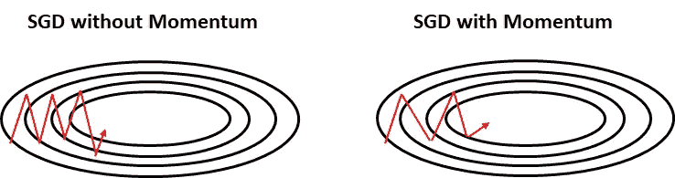
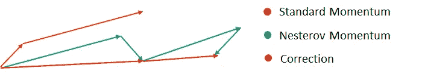
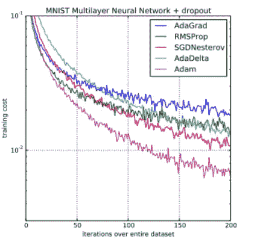

# 深度学习模型的梯度下降扩展

> 原文：<https://towardsdatascience.com/gradient-descent-extensions-to-your-deep-learning-models-32045ccfa644?source=collection_archive---------45----------------------->

了解不同的可用方法，并选择最适合的方法来解决您的问题。

来源: [Pixabay](https://pixabay.com/illustrations/artificial-intelligence-brain-think-3382507/)

# 介绍

本文的目的是探索不同的梯度下降扩展，如动量，Adagrad，RMSprop…

在[之前的文章](/neural-networks-from-hero-to-zero-afc30205df05)中，我们已经研究了在深度学习模型中实现反向传播的三种方法:

*   梯度下降
*   随机梯度下降
*   小批量随机梯度下降

在此基础上，我们保留小批量，因为它允许更高的速度，因为它不必计算整个数据集的梯度和误差，并且消除了随机梯度下降中存在的高可变性。

这些方法有所改进，比如动量法。此外，还有其他更复杂的算法，如 Adam、RMSProp 或 Adagrad。

让我们看看他们！

# 动力

想象自己又回到了童年，有一个穿上溜冰鞋，爬上最陡的街道，开始沿着它走下去的好主意。你完全是初学者，这是你第二次穿冰鞋。

我不知道你们中有没有人真的这么做过，但是我确实做过，所以让我来解释一下发生了什么:

*   你刚刚起步，速度很慢，你甚至似乎在控制之中，你随时都可能停下来。
*   但是你走得越低，你移动得越快:这叫做动量。
    所以你走的路越多，你背负的惯性就越大，你走的就越快。
*   好吧，对于那些好奇的人来说，故事的结尾是在陡峭街道的尽头有一个栅栏。剩下的你可以想象…

动量技巧正是这样。当我们沿着损失曲线计算梯度并进行更新时，我们会更加重视梯度最小化方向上的更新，而不太重视其他方向上的更新。

作者图

所以，结果是加快了网络的训练。

此外，多亏了这一时刻，我们本可以避开路上的小坑洼或小洞(由于速度，我们可以飞越它们)。

你可以在这篇伟大的文章中了解更多关于这种技术背后的数学基础:[http://cs231n.github.io/neural-networks-3/#sgd](http://cs231n.github.io/neural-networks-3/#sgd)

# 内斯特罗夫动量

回到之前的例子:我们正在全速前进(因为我们已经建立了很大的势头)，突然我们看到了它的尽头。我们希望能够刹车，减速以避免撞车。这正是内斯特罗夫所做的。

内斯特罗夫计算梯度，但不是在当前点，而是在我们知道我们的时刻将带我们去的点，然后应用一个修正。

按作者分列的数字

请注意，使用标准矩，我们计算梯度(小橙色向量)，然后在梯度方向上迈出一大步(大橙色向量)。

使用内斯特罗夫，我们将首先在我们先前的梯度(绿色向量)的方向上进行一次大的跳跃，测量梯度并进行适当的校正(红色向量)。

在实践中，它比单独使用动量要好得多。这就像计算未来的权重梯度(因为我们加入了之前计算的时刻)。

你可以在这篇伟大的文章中了解更多关于这种技术背后的数学基础:[http://cs231n.github.io/neural-networks-3/#sgd](http://cs231n.github.io/neural-networks-3/#sgd)

内斯特罗夫动量和标准动量都是 SGD 的延伸。

我们现在将要看到的方法是基于自适应学习速率的，允许我们加快或减慢更新权重的速度。例如，我们可以在开始时使用高速，在接近最小值时降低速度。

# 自适应梯度

它保存计算梯度的历史记录(特别是梯度平方和的历史记录),并对更新的“步骤”进行标准化。

其背后的直觉是，它识别具有非常高梯度的参数，这些参数的权重更新将非常突然，然后给它们分配较低的学习速率以减轻这种突然性。

同时，具有非常低的梯度的参数将被分配高的学习率。

这样，我们设法加速了算法的收敛。

你可以在它的原始论文中了解更多关于这种技术背后的理论:【http://jmlr.org/papers/v12/duchi11a.html

# RMSprop

AdaGrad 的问题是，在计算平方梯度的和时，我们使用的是单调递增函数，这会导致学习速率试图补偿直到变为零才停止增长的值，从而停止学习。

RMSprop 建议使用 decay_rate 来减少梯度的平方和。

论文尚未发表，但可以在这里阅读更多:[http://www . cs . Toronto . edu/~ tij men/CSC 321/slides/lecture _ slides _ le C6 . pdf](http://www.cs.toronto.edu/~tijmen/csc321/slides/lecture_slides_lec6.pdf)

# 圣经》和《古兰经》传统中）亚当（人类第一人的名字

最后，Adam 是最现代的算法之一，它通过向更新规则添加动量来改进 RMSprop。它引入了 2 个新参数，beta1 和 beta2，建议值为 0.9 和 0.999。

你可以在这里查看它的论文:[https://arxiv.org/abs/1412.6980](https://arxiv.org/abs/1412.6980)。

# 但是，我们应该使用哪一个呢？

来源:[原创亚当论文](https://arxiv.org/abs/1412.6980)

根据经验，建议从 Adam 开始。如果它不能很好地工作，那么你可以尝试和调整其余的技术。但大多数时候，亚当工作得很好。

您可以查看这些资源，以便更好地理解这些技术，以及如何和何时应用它们:

*   【https://deepnotes.io/sgd-momentum-adaptive 
*   [http://ruder . io/optimizing-gradient-descent-descent/index . html # gradient descent optimizationalgorithms](http://ruder.io/optimizing-gradient-descent/index.html#gradientdescentoptimizationalgorithms)

# 最后的话

一如既往，我希望你喜欢这个职位！

*如果你喜欢这篇文章，那么你可以看看我关于数据科学和机器学习的其他文章* [*这里*](https://medium.com/@rromanss23) *。*

*如果你想了解更多关于机器学习、数据科学和人工智能的知识* ***请在 Medium*** *上关注我，敬请关注我的下一篇帖子！*