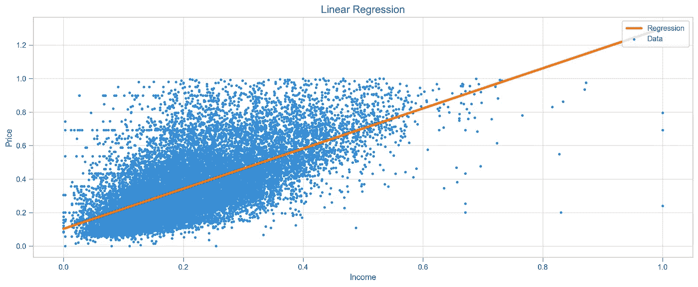
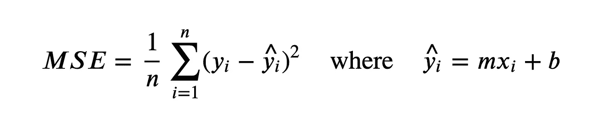
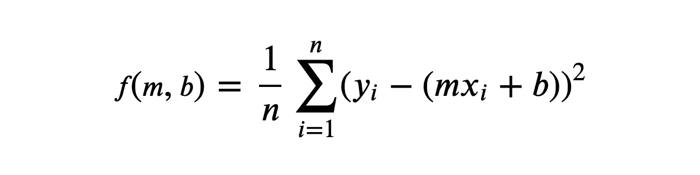
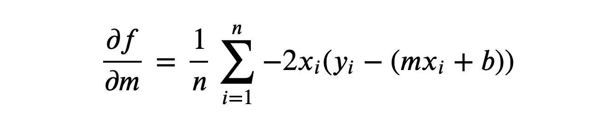
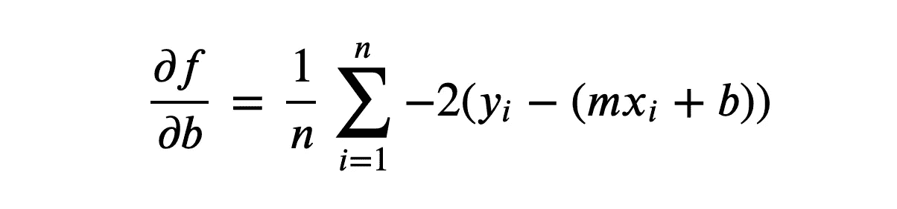
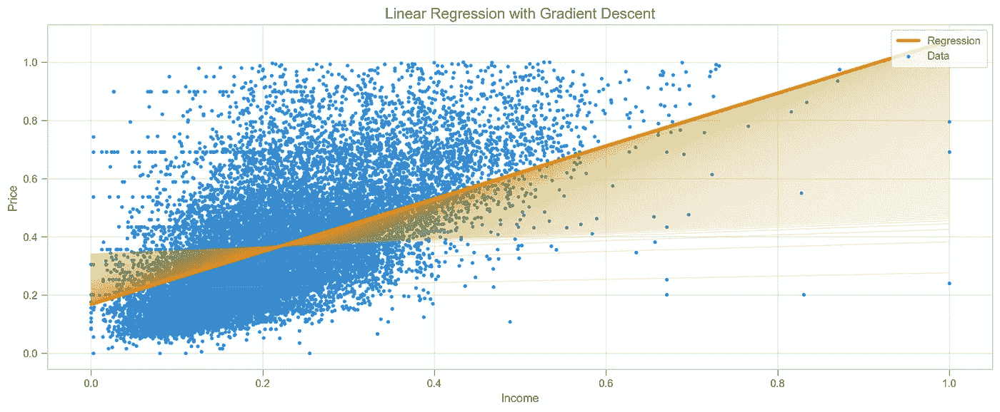
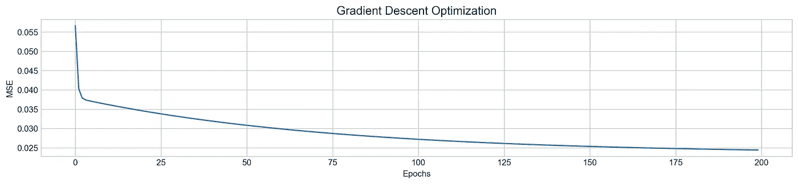
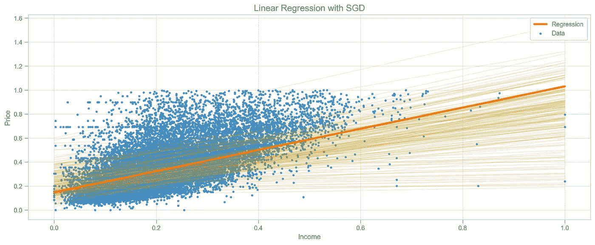
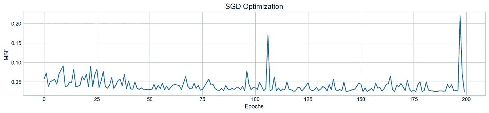

# 从零开始梯度下降

> 原文：<https://towardsdatascience.com/gradient-descent-from-scratch-e8b75fa986cc?source=collection_archive---------7----------------------->

在这篇文章中，我将解释什么是梯度下降，以及如何用 Python 从头开始实现它。为了理解它是如何工作的，你需要一些基本的数学和逻辑思维。虽然更强的数学背景更有利于理解导数，但我会尽可能简单地解释它们。

梯度下降可用于不同的机器学习算法，包括神经网络。对于本教程，我们将建立一个线性回归问题，因为它很容易理解和可视化。

我还创建了包含所有解释的 GitHub repo。让我们开始吧。

## 线性回归


线性回归

为了拟合回归线，我们调整了两个参数:斜率(`m`)和截距(`b`)。一旦找到最佳参数，我们通常用均方差(`MSE`)来评估结果。我们记得 MSE 越小越好。换句话说，我们正试图将其最小化。



函数的最小化是梯度下降算法的确切任务。它获取参数并调整它们，直到达到局部最小值。

让我们一步一步地分解这个过程，并解释一下实际发生了什么:

1.  首先，我们取一个我们想要最小化的函数，通常它是均方误差函数。
2.  我们确定参数，例如回归函数中的`m`和`b`，并对这些参数取 MSE 的偏导数。这是最关键也是最难的部分。每个派生的函数都可以告诉我们应该以哪种方式调整参数以及调整多少。
3.  我们通过迭代我们的派生函数并逐渐最小化 MSE 来更新参数。在这个过程中，我们使用一个额外的参数`learning rate`，它帮助我们定义在每次迭代中更新参数的步骤。通过设置一个较小的学习率，我们可以确保我们的模型不会跳过最小均方差点，并很好地收敛。



均方误差

## 派生物

我们使用偏导数来发现每个参数如何影响 MSE，所以这就是单词 *partial* 的来源。我们分别对`m`和`b`**求导。看看下面的公式。和 MSE 差不多，不过这次我们加了 f(m，b)进去。它本质上没有改变什么，除了现在我们可以把`m`和`b`数字插入其中并计算结果。**

****

**带输入参数的 MSE**

**关于`m`意味着我们导出参数`m`，基本上，忽略`b`的情况，或者我们可以说它为 0，反之亦然。为了求偏导数，我们将使用链式法则。当我们需要对包含另一个函数的函数求导时，我们会用到它。**

****

**链式法则说，我们应该对外部函数求导，保持内部函数不变，然后用内部函数的导数乘以所有东西。我们现在需要做的就是对下面函数的 **m** 和 **b** 求偏导数:**

****

**平方误差**

**如果你是新手，你会惊讶于`()²`是一个包含`y-(mx+b)`的外部函数。现在，让我们根据链式法则分解每个步骤:**

1.  **对外部函数求导:`()²`变成`2()`**
2.  **保持内部函数不变:`y-(mx+b)`**
3.  **对 m 求偏导数:`0-(x+0)`或`-x`。让我们详细说明一下我们是如何得到这个结果的:我们把任何不等于 m 的东西都视为常数。常数总是等于 0。`mx`的导数是`x`，因为`m`的导数是 1，附加在`m`上的任何数字或变量都留在原地，意思是`1*x`，或者只是`x`。**

**把所有的东西放在一起，我们得到了下面的:`2(y-(mx+b))*-x`。这个可以重写为`-2x(y-(mx+b))`。太好了！我们可以按照正确的符号重新编写:**

****

**关于 **m 的偏导数****

**为了相对于`b`进行推导，我们遵循相同的链式法则步骤:**

1.  **`()²`变为`2()`**
2.  **`y-(mx+b)`保持不变**
3.  **这里`y-(mx+b)`的导数变成了这个:`(0-(0+1))`或者`-1`。原因如下:我们再次把`y`和`mx`当作常数，所以它们变成了 0。`b`变成了 1。**

**把所有东西放在一起:`2(y-(mx+b))*-1`，或者- `2(y-(mx+b))`。同样，正确的符号应该是这样的:**

****

**关于 **b** 的偏导数**

**唷！最难的部分已经过去了，现在我们可以进入 Python 环境了。**

## **梯度下降**

**因为我们只有一个输入要素，所以 X 必须是一个 NumPy 向量，它是一个值列表。通过对权重`m1`、`m2`求导，我们可以很容易地将其扩展到多个特征..等等，但是这次我们做的是简单的线性回归。**

**看一下代码。我们从用随机值定义`m`和`b`开始，然后我们有一个 for 循环来迭代派生的函数，每一步都由一个学习速率(`lr`)来控制。我们使用`log`和`mse`列表来跟踪我们的进度。**

```
import numpy as np
from sklearn.metrics import mean_squared_errordef gradient_descent(X, y, lr=0.05, epoch=10):

    '''
    Gradient Descent for a single feature
    '''

    m, b = 0.33, 0.48 # parameters
    log, mse = [], [] # lists to store learning process
    N = len(X) # number of samples

    for _ in range(epoch):

        f = y - (m*X + b)

        # Updating m and b
        m -= lr * (-2 * X.dot(f).sum() / N)
        b -= lr * (-2 * f.sum() / N)

        log.append((m, b))
        mse.append(mean_squared_error(y, (m*X + b)))        

    return m, b, log, mse
```

**我们可以直观地跟踪算法如何接近局部最小值。肉眼看来，好像没有完全收敛。为了解决这个问题，我们可以增加历元和学习率参数。**

********

## **奖励:随机梯度下降**

**随机梯度下降仅使用一个样本来更新参数，这使得它更快。我们可以对之前的版本做一些小的修改，看看它的表现如何。**

```
def SGD(X, y, lr=0.05, epoch=10, batch_size=1):

    '''
    Stochastic Gradient Descent for a single feature
    '''

    m, b = 0.33, 0.48 # initial parameters
    log, mse = [], [] # lists to store learning process

    for _ in range(epoch):

        indexes = np.random.randint(0, len(X), batch_size) # random sample

        Xs = np.take(X, indexes)
        ys = np.take(y, indexes)
        N = len(Xs)

        f = ys - (m*Xs + b)

        # Updating parameters m and b
        m -= lr * (-2 * Xs.dot(f).sum() / N)
        b -= lr * (-2 * f.sum() / N)

        log.append((m, b))
        mse.append(mean_squared_error(y, m*X+b))        

    return m, b, log, mse
```

**我们可以观察到这个过程的随机性。回归线到处跳跃，试图根据一个样本找到最小值。可怜的东西。**

********

## **结论**

**我们已经从头开始学习了如何实现梯度下降和 SGD。当我们训练神经网络时，我们用同样的方法进行反向传播。如果你对从零开始实现深度神经网络感兴趣，请在评论中告诉我。感谢您的阅读！**

**阿瑟尼。**