# 梯度下降—一次一步

> 原文：<https://towardsdatascience.com/gradient-descent-one-step-at-a-time-3c39a3642333?source=collection_archive---------12----------------------->

## [入门](https://towardsdatascience.com/tagged/getting-started)

## 一个直观的，初学者的梯度下降，是用来尽量减少机器学习中的各种损失函数的基本机制指南


照片由 [Waranont (Joe)](https://unsplash.com/@tricell1991?utm_source=medium&utm_medium=referral) 在 [Unsplash](https://unsplash.com?utm_source=medium&utm_medium=referral) 上拍摄

梯度下降(GD)是一种优化算法，用于迭代地最小化任何给定的成本函数。但是什么是成本函数呢？它是一个衡量经过训练的机器学习模型在进行预测时的准确性的函数。常见的例子包括均方误差(MSE)和交叉熵(或对数损失)。

GD 在深度机器学习模型中被大量使用，作为更传统的方法的替代，以最小化成本函数。它更有效地处理深度学习中常见的海量数据。

我们将详细地浏览 GD 来模拟一个过于简化的线性回归问题，以便对其机制有一个直观而深刻的理解。我假设你在解决这个问题的时候对最小二乘法、微积分和线性回归有所了解。

# 问题设置

这是我们的玩具数据，由 3 个数据点组成:

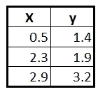

我们的目标是使用 GD 找到最佳拟合线，然后可以使用它根据一些新的`X`值预测`Y`值(也称为线性回归)。回想一下，直线可以完全用两个参数来描述:截距和斜率。因此，如果我们可以通过优化算法找到理想的截距和斜率参数，我们将获得最佳拟合线。

我们的最佳拟合线可以表示如下:

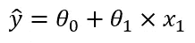

情商。一

其中:

*   `y` *hat* 是被预测的因变量
*   `x₁`是我们要预测`y` *帽子*的`X`值
*   `θ₀`是截距项，需要优化
*   `θ₁`是要优化的斜率

# 寻找最佳截距

为了简单起见，我们首先只找出`θ₀`的最佳值，同时假设`θ₁`等于 0.64(通过最小二乘法确定)。然后，一旦我们理解了 GD 是如何工作的，我们将使用它来求解最佳截距和斜率参数。所以我们修正后的直线方程变成了:

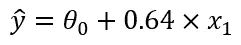

情商。2

我们首先为截距`θ₀`选择一个随机值，称为**随机初始化**。随机初始化是我们最初的猜测，实际上可以是 GD 用来改进的任何实数。

先说 0 代表`θ₀`(不是巧合，也是我最喜欢的数字！)，这给了我们下面一行:

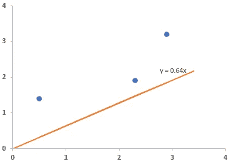

y = 0 + 0.64x

接下来，我们将使用[残差平方和](https://en.wikipedia.org/wiki/Residual_sum_of_squares) (RSS)损失函数来评估这条线与我们的数据的拟合程度:

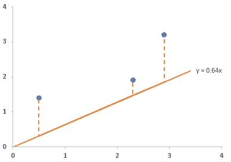

RSS 和截距= 0 的最佳拟合线

使用 Eq。2 利用`θ₀ = 0`，我们得到`y`，残差，残差平方，残差平方和的以下预测:

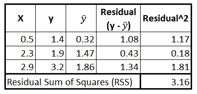

简易资讯聚合

随着截距`θ₀`值的增加，重复上述 RSS 计算，我们得到以下`θ₀`对 RSS 的散点图:

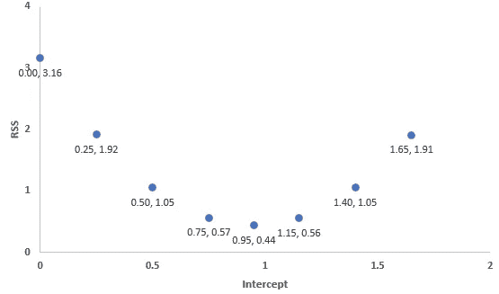

针对 RSS 的各种拦截的散点图

从图中可以明显看出，截距值为 0.95 时 RSS 最小。但是我们怎么知道它实际上是 0.95，而不是 0.75 到 1.15 之间的某个值呢？我们可以代入一堆不同的截距值，通过试错找到最优值。但是当我们拥有 GD 的时候为什么要这样做呢？

## 梯度下降法

当 GD 在随机初始化点计算 RSS 时，在 RSS 值较高的情况下，需要相对较大的步长来确定要评估的下一个截距。随着 RSS 在后续迭代中接近零，截距的变化(称为步长)变得更小。换句话说，GD 通过在远离最小 RSS 时采取大步，在接近最小 RSS 时采取小步来确定最佳参数值。

通过使用 RSS 和我们的等式，我们可以得到成本函数的等式，该等式绘出了针对 RSS 的所有可能的截距。2 如下(使用我们的三个原始数据点):

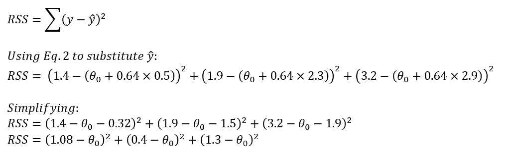

RSS 成本函数

该函数的曲线图看起来如下，基本上与上面的散点图相同，只是添加了一条多项式趋势线:

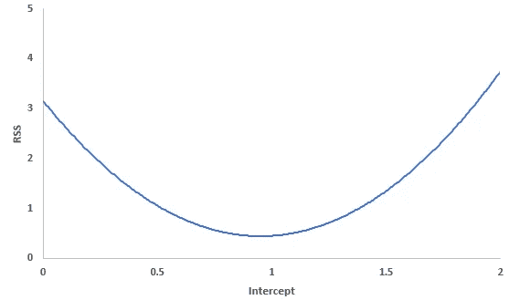

RSS 成本函数图

我们可以对该函数相对于`θ₀`求导，并确定截距`θ₀`的任意值处的斜率:

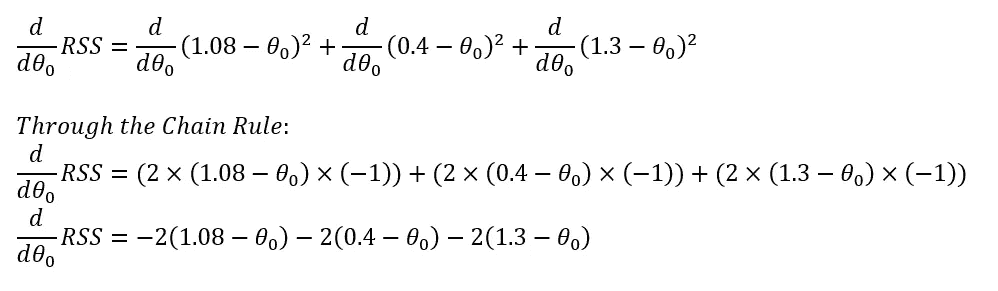

RSS 成本函数的导数—等式。3

现在我们有了导数，GD 将使用它来找到 RSS 的最低值。像之前一样，假设我们用初始值`θ₀ = 0`初始化 GD。

在上面的导数中插入`θ₀ = 0`给我们`-5.6`，这是 RSS 成本函数在`θ₀ = 0`的梯度或斜率。注意，`θ₀`的最佳值是在曲线上梯度为 0 的点处获得的，即在曲线的底部。还记得，当曲线的斜率远离 0 时，GD 采取相对较大的步骤，当曲线的斜率接近 0 时，则采取小步骤。因此，步长的大小应该与曲线的斜率相关，因为它告诉 GD 它应该采取小步还是大步。但是，步长不能太大，以免跳过曲线上的最小点，到达另一边。

步长由称为**学习率**的参数调节。步长决定了 GD 计算 RSS 时使用的新截距:

```
step size = slope * learning rate
new intercept = old intercept - step size
```

学习率被设置为一个很小的数字，通常在实践中为 0.2、0.1 或 0.01。

继续我们的例子，当`θ₀ = 0`和学习速率`0.1`时，步长为`-0.56`:

```
step size (at θ₀ = 0): -5.6 * 0.1
step size (at θ₀ = 0): -0.56new intercept = 0 - (-0.56)
new intercept = 0.56
```

到目前为止，评估了两个截距的成本函数图如下所示:

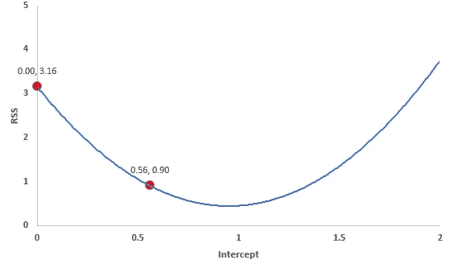

第一步后的 RSS 成本函数

上面的图清楚地表明，随着相对较大的第一步，我们已经非常接近 RSS 的最小值了！回到我们的最佳拟合线，我们可以看到`0.56`的新截距大大缩小了残差:

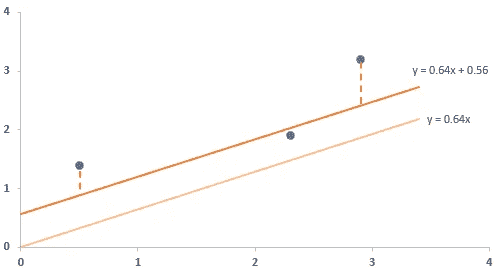

RSS 和截距= 0.56 的最佳拟合线

现在让我们进一步接近截距的最佳值。我们回到方程式中的导数。3，并插入新的截距值`0.56`，这给出了曲线在该截距值处的斜率为`-2.2`:

```
RSS slope (at θ₀ = 0.56): -2(1.08-0.56) - 2(0.4-0.56) - 2(1.3-0.56)
RSS slope (at θ₀ = 0.56): -2.2step size (at θ₀ = 0.56): -2.2 * 0.1
step size (at θ₀ = 0.56): -0.22new intercept = 0.56 - (-0.22)
new intercept = 0.78
```

我们的两个图如下所示:

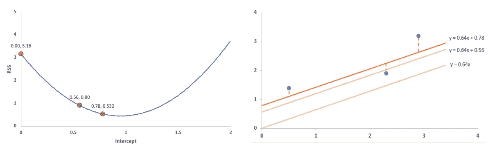

RSS 成本函数和第二步后的最佳拟合线

总的来说，RSS 变小了。另外，请注意，在 RSS 成本函数图中，第一步与第二步相比相对较大。

让我们也做第三步:

```
RSS slope (at θ₀ = 0.78): -2(1.08-0.78) - 2(0.4-0.78) - 2(1.3-0.78)
RSS slope (at θ₀ = 0.78): -0.88step size (at θ₀ = 0.78): -0.88 * 0.1
step size (at θ₀ = 0.78): -0.09new intercept = 0.78 - (-0.09)
new intercept = 0.87
```

我们的两个图如下所示:

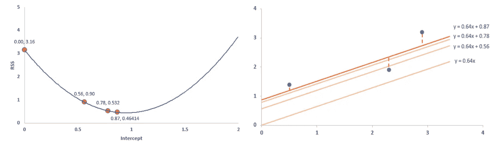

RSS 成本函数和第三步后的最佳拟合线

再继续三步，GD 对截距的估计结果是`0.95`，这与用最小二乘法计算的结果完全相同(你可以自己检查最小二乘法的计算结果！).

## 什么时候停止？

但是 GD 怎么知道什么时候停止做额外的计算呢？换句话说，它如何知道自己已经达到了最佳估计值？当步长变得非常接近 0 时，它会这样做，这将在梯度非常接近 0 时发生。实践者通常通过最小步长参数来控制这一点，该参数通常设置为 0.001 或更小。

也就是说，GD 还包括一个放弃前的步数限制，通常参数化为 1000 步或更多。因此，即使步长很大，如果 GD 已经执行了最大数量的步骤，它也会停止。

# 一起寻找最佳截距和斜率

既然我们已经理解了 GD 的基本原理，让我们一起来计算最佳截距和斜率。

这意味着我们将不会使用 0.64 的斜率，如等式。2.相反，我们将有两个独立的参数，`θ₀`和`θ₁`，我们需要一起优化它们。这需要多变量微积分，并对截距`θ₀`和斜率`θ₁`取偏导数。成本函数现在看起来像这样:

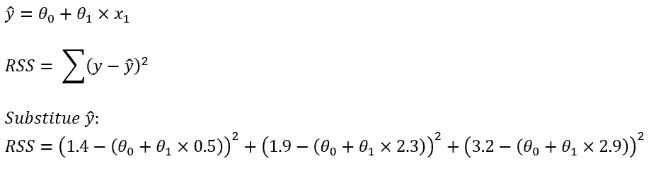

RSS 成本函数—等式。四

关于截距`θ₀`的偏导数如下:

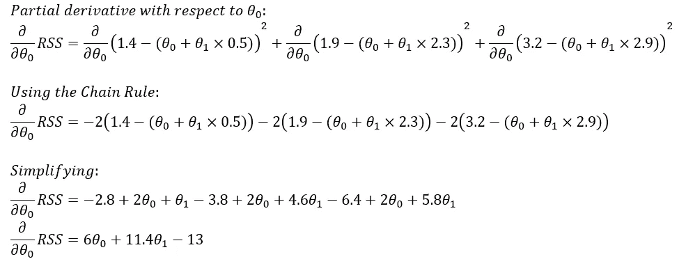

截距的偏导数——等式。5

关于截距`θ₁`的偏导数如下:

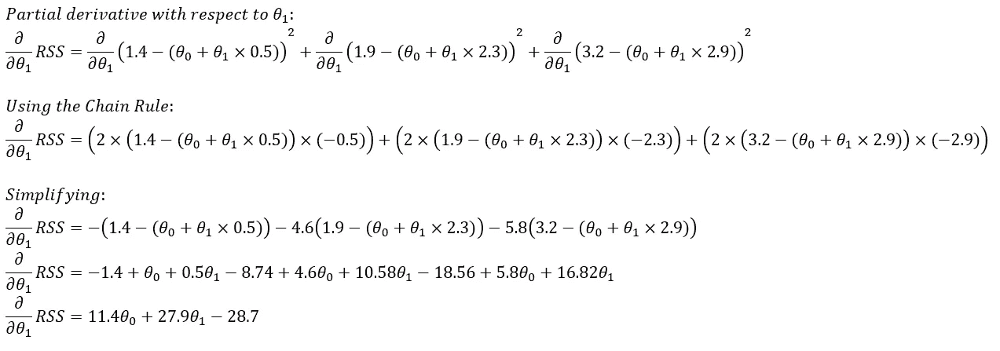

斜率的偏导数——等式。6

我们将使用这两个偏导数来寻找 RSS 成本函数(等式)中的最低点。4).就像之前一样，我们将开始为截距`θ₀`和斜率`θ₁`选择随机数。先说`θ₀ = 0`和`θ₁ = 1`。因此，GD 将从这条线开始:

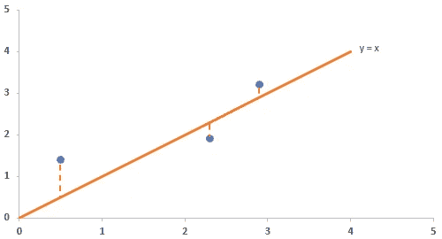

GD 随机初始化

现在让我们将`θ₀ = 0`和`θ₁ = 1`代入偏导数方程:

```
partial derivative wrt θ₀ (Eq. 5) = (6 * 0) + (11.4 * 1) - 13
partial derivative wrt θ₀ (Eq. 5) = -1.6partial derivative wrt θ₁ (Eq. 6) = (11.4 * 0) + (27.9 * 1) - 28.7
partial derivative wrt θ₁ (Eq. 6) = -0.8
```

计算学习率为 0.01 的步长以及截距和斜率的新值:

```
intercept step size = -1.6 * 0.01
intercept step size = -0.016
new intercept = 0 - (-0.016)
new intercept = 0.016slope step size = -0.8 * 0.01
slope step size = -0.008
new slope = 1 - (-0.008)
new slope = 1.008
```

我们更新后的最佳产品系列大致如下:

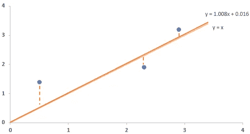

第一步后的最佳拟合线

这种差别似乎不是实质性的。然而，在计算步长和更新的参数的更多迭代之后(直到步长小于阈值或者达到最大迭代次数)，我们得到以下最佳拟合线:

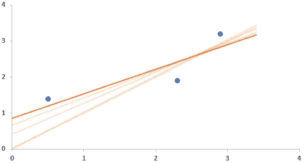

与 GD 最匹配的最终线

GD 找到的最佳参数将与最小二乘法找到的参数相同或非常接近，即`θ₀ = 0.95`和`θ₁ = 0.64`。

# 多参数 GD 和其他损失函数

我们刚刚完成了两个参数的 GD 计算。如果我们的数据有更多的特征(实际数据集通常如此)，我们只需要取更多的偏导数，其他一切都将保持不变。

这里要注意的一个关键点是，所有参数应该在每一步同时更新(而不是一个接一个地更新)。

在这个例子中，我们优化了 RSS 成本函数。但是，还有其他几个成本函数可以处理不同的数据类型、分布和预测问题。无论使用哪种成本函数，GD 的工作方式都是一样的。

# 批量与随机梯度下降

我们在这个问题中执行的操作被称为批量梯度下降，由此在计算成本函数的斜率时使用所有可用的数据点(训练数据)(上面的步骤 3)。当我们有大量数据点时，这会导致问题和效率低下。

另一种叫做随机梯度下降的动物很好地处理了这种低效率。随机梯度下降在每一步使用随机选择的观测值，而不是整个数据集。这减少了计算成本函数的斜率所花费的时间(步骤 3)。总体概念和方法仍然类似于批量梯度下降。

# 学习率

你会注意到我们使用了两种不同的学习率:当只找到最优截距时，学习率较高；当同时找到最优截距和斜率时，学习率较低。

GD 对学习率高度敏感。在实践中，通过**学习计划**，一个合理的学习率可以由大到小自动确定。在大多数机器学习算法中，学习速率和学习时间表可以作为参数使用。例如，在 scikit-learn 的 [SGDRegressor](https://scikit-learn.org/stable/modules/generated/sklearn.linear_model.SGDRegressor.html) 和 [SGDClassifier](https://scikit-learn.org/stable/modules/generated/sklearn.linear_model.SGDClassifier.html) 类中，学习速率和学习进度分别由`eta0`和`learning_rate`参数控制。

# 摘要

现在你有了，一个关于 GD 如何在后台工作的非常简单的解释。现在让我们总结一下 GD 在优化参数时采取的步骤:

1.  对成本函数中的每个参数求偏导数，从而得到与参数数量相等的多个偏导数
2.  为每个参数选择一些随机初始值——称为随机初始化
3.  将这些随机值代入步骤 1 中确定的每个偏导数中，以找到成本函数的斜率
4.  计算每个参数的步长:`step size = slope * learning rate`
5.  计算新的参数:`new parameter = old parameter — step size`
6.  从步骤 3 开始重复，直到步长非常小或达到最大步数

如果您想讨论任何与数据分析、机器学习、金融或信用分析相关的问题，请随时联系 [me](https://www.finlyticshub.com/) 。

下次见，摇滚起来！