# 梯度下降、学习率和特征缩放的重要性

> 原文：<https://towardsdatascience.com/gradient-descent-the-learning-rate-and-the-importance-of-feature-scaling-6c0b416596e1?source=collection_archive---------8----------------------->

史蒂夫·阿灵顿在 [Unsplash](https://unsplash.com?utm_source=medium&utm_medium=referral) 上拍摄的照片

> 这篇帖子的内容是书中一章的部分复制:**[**用 PyTorch 进行深度学习循序渐进:初学者指南**](https://leanpub.com/pytorch/) **。****

# **介绍**

****梯度下降**、**学习率**和**特征缩放**有什么共同点？让我想想…**

**每次我们训练深度学习模型或任何神经网络时，我们都在使用**梯度下降**(带反向传播)。我们用它来通过*更新模型的参数/权重*来*最小化损失*。**

**参数更新取决于两个值:梯度和**学习率**。学习率让你可以控制更新的大小。一个**更大的学习率**意味着**更大的更新**，并且有希望是一个**学习更快的模型**。**

**但是有一个圈套，一如既往…如果学习率**太大**，模型**什么都学不到**。这让我们想到了两个基本问题:**

*   ****多大才算“太大”？****
*   ****有什么办法可以用更大的学习率吗？****

**不幸的是，第一个问题没有明确的答案。它总是取决于许多因素。**

**但是**有一个**第二个**第一个**的答案:**特征缩放**！这是怎么回事？这就是我写这篇文章的原因:向你详细展示梯度下降、学习率和特征缩放之间的联系。**

**在本帖中，我们将:**

*   **定义一个**模型**并生成一个**合成数据集****
*   **随机地**初始化**参数**
*   **探索**损失面**和**可视化梯度****
*   **了解使用不同**学习率**的**效果****
*   **了解**特征缩放**的**效果****

# **模型**

**模型必须是**简单的**和**熟悉的**，这样你就可以专注于梯度下降的**内部运作**。因此，我将坚持使用一个尽可能简单的模型:一个具有单一特征的**线性回归 *x*** ！**

**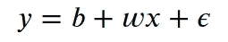**

**简单线性回归**

**在这个模型中，我们使用一个**特征** ( ***x*** )来尝试预测一个**标签** ( ***y*** )的值。我们的模型中有三个元素:**

*   ****参数 *b*****
*   ****参数 *w*****
*   **还有那个**上学期**(为什么*总是*必须是希腊字母？)，*ε*，这是为了说明固有的**噪声**，即我们无法消除的**误差****

# **数据生成**

**我们已经知道我们的模型了。为了给它生成**合成数据**，我们需要为它的**参数**取值。我选了***b*= 1****w = 2**。**

**先来生成我们的**特征** ( ***x*** ):我们使用 Numpy 的 [**rand**](https://numpy.org/doc/1.18/reference/random/generated/numpy.random.RandomState.rand.html#numpy.random.RandomState.rand) 方法，在 0 到 1 之间随机生成 100 ( *N* )个点。**

**然后，我们将我们的**特征** ( *x* )和我们的**参数 *b* 和 *w*** 代入我们的**方程**来计算我们的**标签** ( ***y*** )。但是我们需要添加一些 [**高斯噪声**](https://en.wikipedia.org/wiki/Gaussian_noise)(***ε***)为好；否则，我们的合成数据集将是一条完美的直线。**

**我们可以使用 *Numpy* 的 [**randn**](https://numpy.org/doc/1.18/reference/random/generated/numpy.random.RandomState.randn.html#numpy.random.RandomState.randn) 方法生成噪声，该方法从正态分布(均值为 0，方差为 1)中抽取样本，然后将其乘以**因子**以调整噪声的**水平**。由于我不想添加这么多噪声，所以我选择了 0.1 作为我的因子。**

**合成数据集**

## **训练-验证-测试分割**

**解释**训练-
验证-测试分割**背后的原因已经超出了本文的范围，但是我想提出两点:**

1.  **分割应该**总是**是你做的第一件事**——没有预处理，没有转换；**在分割**之前什么也没有发生——这就是为什么我们在合成数据生成**之后立即进行分割**
2.  ****在这篇文章中，我们将只使用**训练集**——所以我没有费心创建一个**测试集**，但是我还是对**高亮点#1** :-)进行了分割****

****训练-验证分割****

****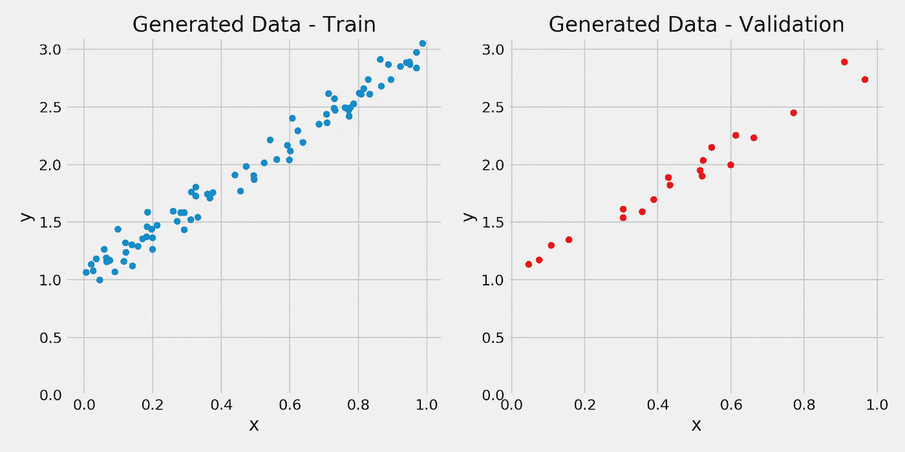****

****综合数据****

# ****随机初始化****

****在我们的例子中，我们已经**知道**参数的**真实值**，但是这在现实生活中显然永远不会发生:如果我们*知道*真实值，为什么还要费心训练一个模型来找到它们呢？！****

****好的，鉴于**我们永远不会知道**参数的**真值**，我们需要为它们设置**初始值**。我们如何选择他们？事实证明。一个**随机猜测**和其他的一样好。****

****所以，我们可以**随机初始化** **参数/权重**(我们只有两个， ***b*** 和 ***w*** )。****

****随机起点****

****我们随机初始化的参数是: ***b* = 0.49** 和 ***w* = -0.13** 。这些参数有用吗？****

****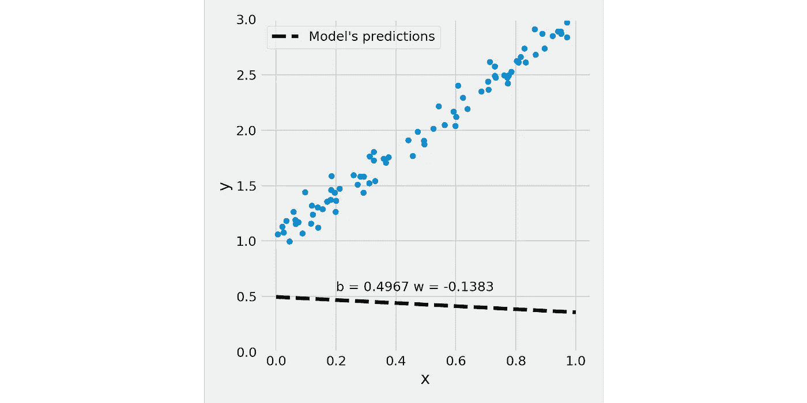****

****显然不是…但是，他们到底有多坏？这就是**损失**的原因。我们的目标将是**最小化**它。****

# ****损失面****

****在为我们的参数选择了一个随机起点后，我们用它们来*预测*，*计算相应的误差*，*将这些误差*汇总成一个**损失**。由于这是一个线性回归，我们使用**均方差(MSE)** 作为我们的损失。下面的代码执行这些步骤:****

****进行预测并计算损失****

****我们刚刚计算了对应于我们的**随机初始化参数** ( *b* = 0.49 和 *w* = -0.13)的**损失** (2.74)。现在，如果我们对 ***b*** 和 ***w*** 的所有可能值做同样的处理会怎么样？嗯，不是*所有*可能的值，而是*给定范围内的所有等间距值的组合*？****

****我们可以在 **-2** 和 **4** 之间改变 ***b*** ，同时在 **-1** 和 **5** 之间改变*，例如，每个范围包含 101 个均匀间隔的点。如果我们在这些范围内计算对应于**的参数 *b* 和 *w* 的每个不同组合的**损耗**，结果将是损耗**的**网格，形状(101，101)的矩阵。*******

***这些损耗就是我们的**损耗面**，它可以在 3D 图中可视化，其中纵轴( *z* )代表损耗值。如果我们**连接**产生**相同损失值**的 *b* 和 *w* 的组合，我们将得到一个**椭圆**。然后，我们可以在原来的 *b x w* 平面上画出这个椭圆(蓝色，损耗值为 3)。简而言之，这就是**等高线图**的作用。从现在开始，我们将总是使用等高线图，而不是相应的 3D 版本。***

***下图显示了建议的**参数范围**的损失面，使用我们的训练集来计算 *b* 和 *w* 的每个组合的损失。***

***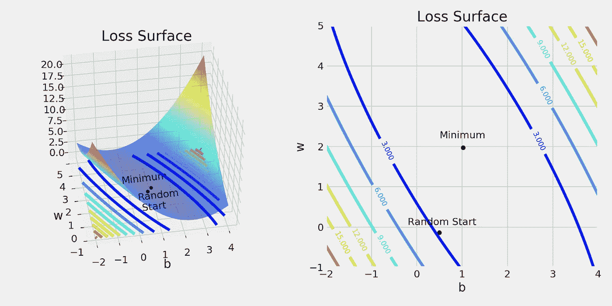***

***损失面***

***在图的中心，参数( *b，w* )的值接近(1，2)，损耗处于其最小值**。这就是我们试图用梯度下降达到的点。*****

*****在底部，稍微偏左的地方，是**随机开始**点，对应我们随机初始化的参数( *b* = 0.49、 *w* = -0.13)。*****

*****这是处理简单问题的一个好处，比如用单一特征进行线性
回归:我们只有**两个参数**，因此**我们可以计算并可视化损失面**。*****

## *****横截面*****

*****另一件好事是，我们可以在损失表面切割一个**横截面**来检查如果其他参数保持不变时**损失**看起来是什么样的。*****

*****让我们从使 ***b* =0.52** (来自我们的均匀间隔范围的值，最接近我们的初始随机值 *b* ，0.4967)开始——我们在我们的损失表面(左图)上垂直地(红色虚线)切割一个横截面*，我们得到右边的结果图:******

*****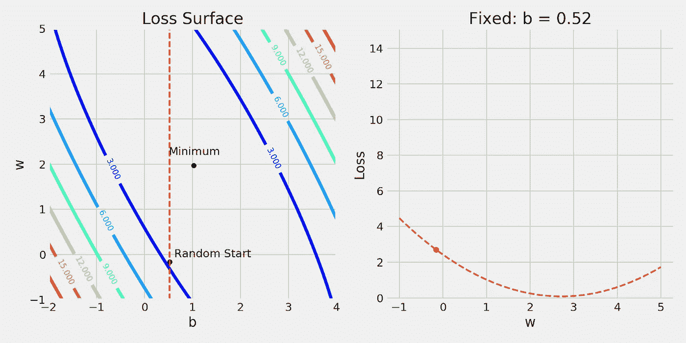*****

*****垂直横截面—参数 **b** 固定*****

*****这个横截面告诉我们什么？它告诉我们，**如果我们保持 *b* 不变**(在 0.52)，从参数 *w* 的**角度看，如果 ***w* 增加**(达到 2 和 3 之间的某个值)，则**损失**可以最小化。*******

***当然，**不同的*b*值会产生**不同的*w*截面损失曲线。这些曲线将取决于损失面的*形状(稍后将在“**学习率**”部分详细介绍)。********

*好的，到目前为止，一切顺利…那么*其他*截面呢？现在让我们水平切割它，使 ***w* = -0.16** (来自我们的均匀间隔范围的值，最接近我们的初始随机值 b，-0.1382)。结果图在右边:*

*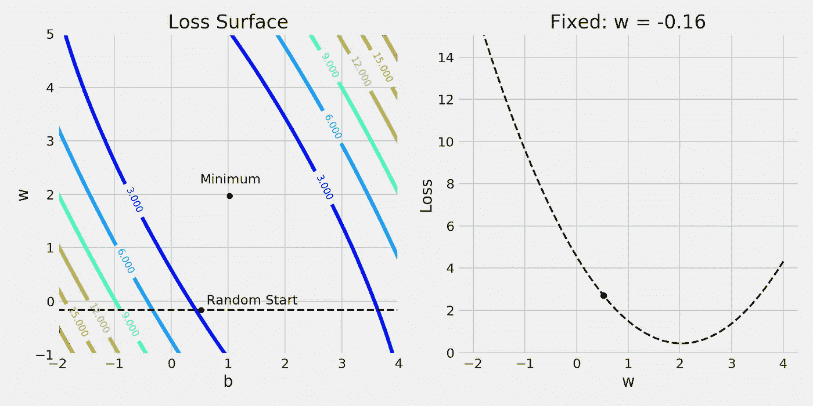*

*水平横截面—参数 **w** 固定*

*现在，**如果我们保持 *w* 恒定** (at -0.16)，从参数 *b* 的**角度看，如果 *b* 增加**(达到接近 2 的某个值)，则**损耗**可以最小化**。***

> *总的来说，该横截面的目的是获得**改变单个参数**对损失的影响，同时保持**其他一切不变**。简单地说，这是一个**渐变** :-)*

# *可视化渐变*

*从上一节我们已经知道，为了使*损失*最小化， *b* 和 *w* 都需要增加**。所以，保持使用渐变的精神，让我们**增加每个参数一个*小* *位*** (总是保持另一个固定！).顺便说一下，在这个例子中，一个*小点*等于 0.12(为了方便起见，所以它产生了一个更好的图)。***

***这些增加对损失有什么影响？让我们来看看:***

***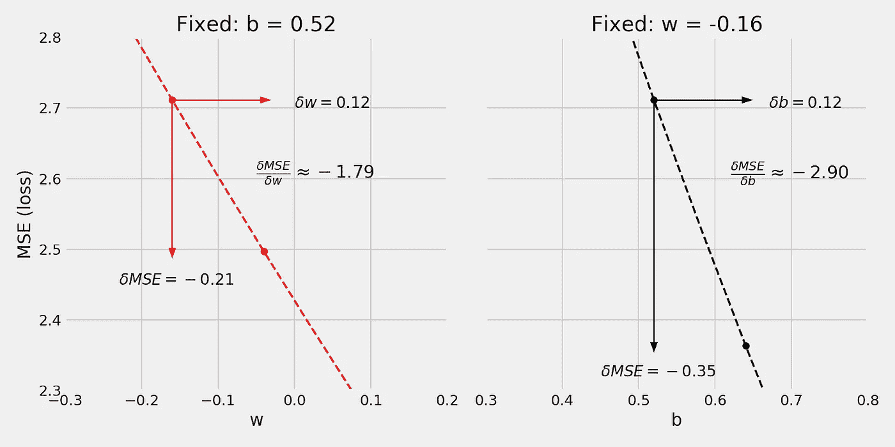***

***几何计算(近似)梯度***

***在左图中，**将 *w* 增加 0.12** 会导致**损失减少 0.21** 。几何计算和粗略近似的梯度由两个值之间的比率给出: **-1.79** 。该结果与梯度的*实际*值(-1.83)相比如何？对于粗略的近似来说，这实际上还不错……还能更好吗？当然，**如果我们使 *w* 的增量越来越小**(比如 0.01，而不是 0.12)，我们将得到越来越好的**近似值……在极限中，随着**增量接近零**，我们将达到**的**精确值。嗯，这就是导数的定义！*****

***同样的推理也适用于右边的图:**将 *b* 增加相同的 0.12** 会使**损失减少 0.35** 。更大的损耗减少、更大的比率、更大的梯度——以及更大的误差，因为几何近似值(-2.90)离实际值(-3.04)更远。***

# ***更新参数***

***最后，我们**使用渐变来更新**参数。因为我们试图**最小化我们的损失**，我们**反转梯度的符号**用于更新。***

***还有另一个(超)参数需要考虑:学习率**，用*希腊字母* ***eta*** (看起来像字母 **n** )表示，这是我们需要应用于梯度的**乘法因子**，用于参数更新。*****

*****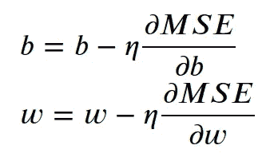*****

*****更新参数 **b** 和 **w*******

*****我们也可以稍微不同地解释这一点:**每个参数**将使其
值**被一个常数值 *eta*** (学习速率)更新，但是这个常数将通过该参数对最小化损失(其梯度)的贡献大小来**加权。*******

*****老实说，我相信这种思考参数更新的方式更有意义:首先，你决定一个*学习率*，它指定了你的**步长**，而*梯度*告诉你每走一步对每个参数的**相对影响**(对损失)。然后你采取一个给定的**步数**这是**比例**到那个**相对影响:更多的影响，更多的步数**。*****

> *****"如何**选择**一个学习率？"*****
> 
> *****不幸的是，这是一个独立的话题，超出了本文的范围。*****

## *****学习率*****

*******学习率**是最重要的超参数——关于如何选择学习率、如何在训练期间修改学习率以及错误的学习率如何完全破坏模型训练，有大量的
资料。*****

*****也许你已经看到了下面这张著名的图表(来自斯坦福大学的 CS231n 课程)，它显示了在训练过程中**太大**或**太小**的学习率如何影响**损失**。*****

**********

*****[来源](https://cs231n.github.io/neural-networks-3/#loss-function)*****

*****大部分人都会在某个时间点看到(或者已经看到)。这基本上是常识，但我认为需要**彻底解释和直观演示**才能让*真正理解。所以，我们开始吧！******

*****我给你讲个小故事(这里试图打个比方，请多包涵！):想象你正在从山里徒步旅行回来，你想尽快回家。在你前进的道路上，你可以选择*继续前进*或者*右转*。*****

*****前方的道路几乎是平坦的，而通往你右边的*的道路有些陡峭。
**陡度**就是**坡度**。如果你以这样或那样的方式迈出一步，就会导致不同的结果(如果你向右迈一步，而不是向前，你会下降得更多)。******

*****但是，事情是这样的:你知道通往你右边*的路*会让你更快地回到**的家**，所以你不会只走一步，而是在那个方向**走多步**:**路越陡，你走的步就越多**！记住，“*多点冲击，多点脚步*”！你就是无法抗拒走那么多步的冲动；你的行为似乎完全由风景决定。我知道这个类比越来越奇怪了…*****

*****但是，你还有**一个选择**:你**可以调整你的步长**。你可以选择任何大小的步伐，从小步到大步。那就是你的**学习率**。*****

*****好了，让我们看看这个小故事把我们带到了什么地方……简而言之，这就是你的行动方式:*****

*******更新位置=先前位置+步长*步数*******

*****现在，将它与我们对参数所做的比较:*****

*******更新值=先前值-学习率*梯度*******

*****你明白了，对吧？我希望如此，因为这个类比现在完全站不住脚了……在这一点上，在向一个方向移动之后(比如说，我们谈到的*右转*，你必须停下来向另一个方向移动(仅仅一小步，因为路径几乎是*平的*，记得吗？).诸如此类……嗯，我想没有人从这样一条正交的之字形路径徒步旅行回来过…*****

*****无论如何，让我们进一步探索你唯一的选择:你的步幅，我的意思是学习速度。*****

**********

## *****小学习率*****

*****从*婴儿步*开始是有道理的吧？这意味着使用**小学习率**。小学率 **safe(r)** ，不出所料。如果你在徒步旅行回家的路上迈着小步，你更有可能安全到达目的地——但是这需要很长时间。这同样适用于训练模型:小的学习率可能会让你达到(某个)最低点，**最终**。不幸的是，时间就是金钱，尤其是当你在云中支付 GPU 时间的时候……所以，有一个*激励*去尝试**更大的学习率**。*****

*****这个推理如何应用于我们的模型？通过计算我们的(几何)梯度，我们知道我们需要采取**给定的步数** : **1.79** (参数 *w* )和 **2.90** (参数 *b* )。让我们将**步长设置为 0.2** (小一点)。意思是我们**为*w*移动 0.36，为*b*移动 **0.58。*********

> ***重要提示:在现实生活中，0.2 的学习率通常被认为是很大的——但是在我们非常简单的线性回归例子中，它仍然是很小的。***

***这场运动将我们引向何方？正如你在下面的图中所看到的(如原始点右侧的新点所示)，在这两种情况下，移动使我们更接近最小值——在右侧更是如此，因为曲线更加陡峭。***

***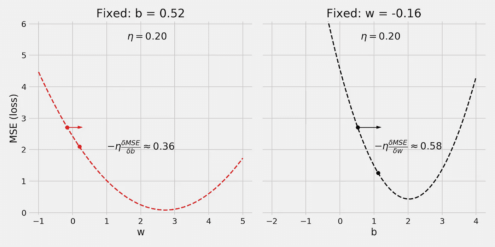***

***使用一个小的学习率***

## ***大学习率***

***如果我们使用一个大的学习率，比如说步长为 0.8 的学习率，会发生什么呢？正如我们在下面的图中看到的，我们开始真正地**遇到麻烦** …***

***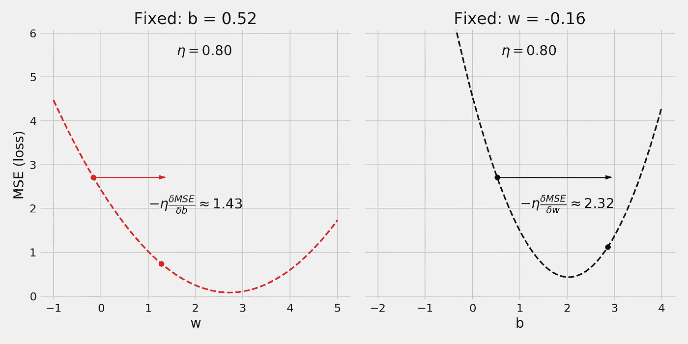***

***使用大的学习率***

***即使左边的图一切正常，右边的图给我们展示了一个完全不同的画面:**我们最终在曲线的另一边**。那是 ***而不是*** 好…你会来回**，交替地击打曲线的两边。*****

> *****“嗯，即便如此，我可能**还是**达到最低，为什么会这么差？”*****

*****在我们这个简单的例子中，是的，你最终会达到最小值，因为**曲线是漂亮和圆的**。*****

*****但是，在实际问题中，“曲线”有一些真正**奇怪的形状**，允许
**奇怪的结果**，例如来回**而从未接近最小值**。*****

*****我们打个比方，你**移动得太快**以至于你**摔倒**撞到**山谷另一边**，然后像一个 ***乒乓*** 一样一直往下。很难相信，我知道，但你肯定不想那样…*****

## *****非常大的学习率*****

*****等等，可能会比那更糟…让我们用一个真正大的学习率，比如说，1.1 的步长！*****

*****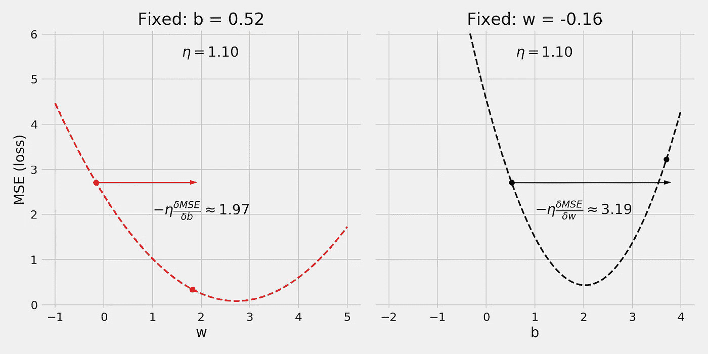*****

*****使用一个非常大的学习率*****

**********

*****好了，那个 ***是*** 坏了……在右边的剧情中，我们不仅再次在的*另一边结束了，而且我们居然**爬上了**。这意味着**我们的损失增加了**，而不是减少了！这怎么可能呢？*你下山的速度如此之快，以至于最后你不得不爬回来？！不幸的是，这个类比再也帮不了我们了。我们需要以不同的方式考虑这个特殊的案例…*******

*****首先，请注意左边图中的一切都很好。巨大的学习率***并没有引起任何问题**，因为左边的曲线**没有右边的曲线**那么陡。换句话说，左边的曲线**比右边的曲线能够获得更大的学习率**。******

******我们能从中学到什么？******

> ********太大**，对于一个**学习率**来说，是一个相对的概念:它取决于**曲线有多陡**，或者换句话说，它取决于**坡度有多大**。******
> 
> ******我们有许多曲线，**许多梯度**:每个参数一个。但是我们只有**一个单学率**可以选择(不好意思，就是这么回事！).******
> 
> ******这意味着学习率的**大小受到最陡曲线**的限制。所有其他曲线必须跟随，这意味着，鉴于它们的形状，它们将使用次优的学习率。******
> 
> ******合理的结论是:如果所有的**曲线都同样陡峭**，那么**学习率**对它们来说都更接近最优**最好**！******

## ******“坏”特征******

******我们如何实现同样的**陡峭的*曲线？我来了。首先，让我们看一个*稍微*修改过的例子，我称之为“坏”数据集:*******

*   ******我**把我们的特征( *x* )乘以 10** ，所以现在在范围【0，10】内，改名为 ***bad_x*********
*   ******但是由于我**不希望标签( *y* )改变**，所以我**将原来的 *true_w* 参数除以 10** 并将其重命名为***bad _ w***——这样，bad_w * *bad_x* 和******

******生成“坏”数据集******

******然后，我对两个数据集*原始的*和*坏的*执行了与之前相同的分割，并并排绘制了训练集，如下所示:******

******“坏”数据集的训练验证分割******

******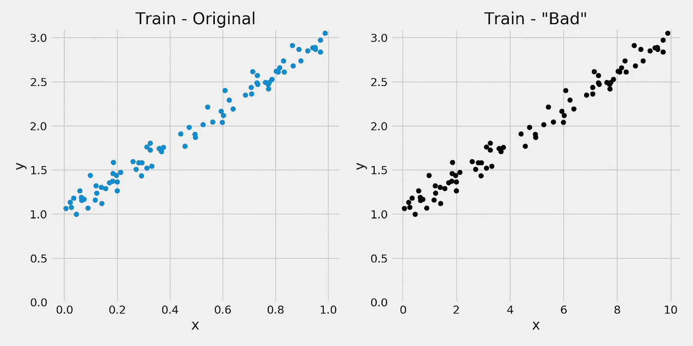******

******相同的数据，不同比例的特征 **x********

******两个图之间唯一的**差异是特征的**比例 *x*** 。它的范围是[0，1]，现在是[0，10]。标签 y 没变，我也没碰 ***true_b*** 。********

****这个简单的**缩放**对我们的梯度下降有任何有意义的影响吗？如果没有，我就不会问了，对吧？让我们计算一个新的**损失面**，并与之前的损失面进行比较:****

****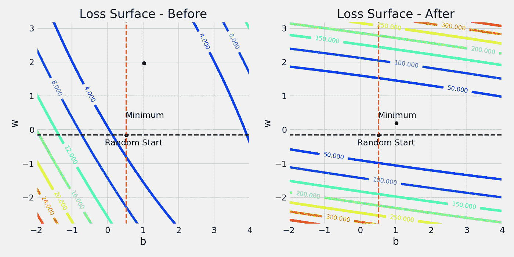****

****损失表面—缩放特征之前和之后 **x******

****再看上图的**等高线值**:原来*深蓝色*线是 **3.0** ，现在是 **50.0** ！对于相同范围的参数值，**的损失值要大得多**。****

****让我们看看将特征 *x* 乘以 10 前后的*横截面*:****

****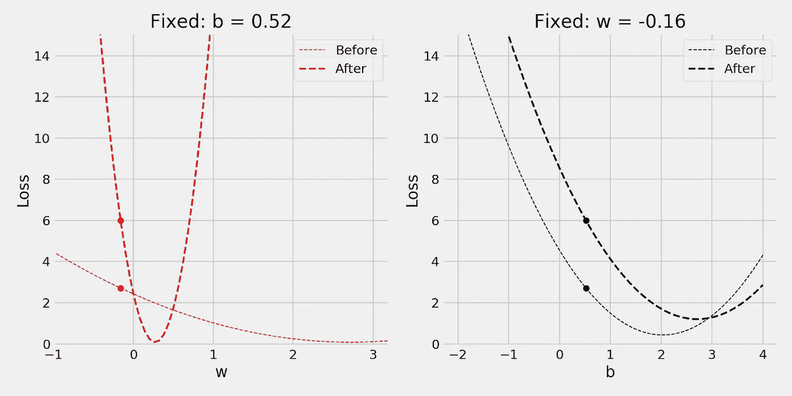****

****比较横截面:之前和之后****

****这里发生了什么？**红色曲线**变得更加**陡峭**(更大的坡度)，因此我们必须使用**较小的学习率**才能安全地沿着它下降。****

> ****更重要的是，红色和黑色曲线**之间的**差异**在**陡度**上增加**。****
> 
> ****这正是**我们需要避免的**！****
> 
> ****你记得为什么吗？****
> 
> ****因为**学习率的大小受到最陡曲线**的限制！****

****怎么才能修好？嗯，我们*把*放大了 10 倍 …也许我们可以让它变得更好，如果我们**以不同的方式放大**。****

## ****缩放/标准化/规范化****

****怎么不同？有个*漂亮的*东西叫做 [**标准定标器**](https://scikit-learn.org/stable/modules/generated/sklearn.preprocessing.StandardScaler.html) ，它把一个**特征**转换成最后的**零均值**和**单位标准差**。****

****它是如何实现的？首先，它使用训练集( ***N*** 点)计算给定**特征的*均值*和*标准差*:******

****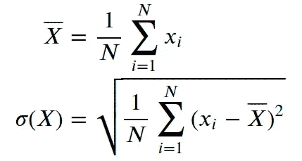****

****平均值和标准偏差，在标准定标器中计算****

****然后，它使用这两个值来**缩放**特征:****

****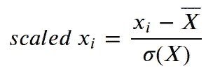****

****标准化****

****如果我们要重新计算缩放要素的平均值和标准差，我们将分别得到 0 和 1。这个预处理步骤通常被称为*标准化*，尽管从技术上来说，它应该总是被称为*标准化*。****

> ******零均值和单位标准差******
> 
> ****让我们从**单位标准差**开始，即缩放特征值，使其**标准差**等于**一个**。这是**最重要的预处理步骤**之一，不仅是为了提高**梯度下降**的性能，也是为了其他技术，如**主成分分析(PCA)** 。**的目标**是将**所有的数字特征**放在一个**相似的刻度**中，因此结果不受每个特征的原始**范围**的影响。****
> 
> ****想到一个模特身上的两个共同特征:**年龄**和**薪资**。虽然年龄通常在 0 到 110 之间变化，但薪水可以从几百(比如说 500)到几千(比如说 9000)。如果我们计算相应的标准
> 偏差，我们可能会分别得到 25 和 2000 这样的值。因此，我们需要
> 到**标准化**两个特性，使它们处于**的平等地位**。****
> 
> ****然后**零点表示**，即**在**零点**处对中**特征。**更深层次的神经网络**可能会遭受一种叫做**消失梯度**的非常严重的情况。由于梯度用于更新参数，越来越小(即消失)的梯度意味着越来越小的更新，直到停滞点:网络简单地停止学习。帮助网络对抗这种情况的一种方法是**将它的输入**即特征集中在零。关于渐变消失问题的更多细节，请查看我的[“超参数在起作用！第二部分—权重初始值设定项。](/hyper-parameters-in-action-part-ii-weight-initializers-35aee1a28404)****

> ******重要**:类似**标准定标器** **的预处理步骤必须在**列车验证测试分割后进行；否则，您将**从验证和/或测试集向您的模型泄露**信息！****
> 
> ****在使用**训练集仅**来适应**标准缩放器**之后，您应该使用其**转换**方法来将预处理步骤应用于**所有数据集**:训练、验证和测试。****

****下面的代码将很好地说明这一点:****

****标准化特征 **x******

****请注意，我们不是**重新生成数据，而是使用**原始特征 *x*** 作为**标准缩放器**的输入，并将其转换为**缩放的 *x*** 。标签( *y* )保持不变。******

****让我们把它们三个、*原*、*坏*和*缩小*并列起来，来说明区别:****

****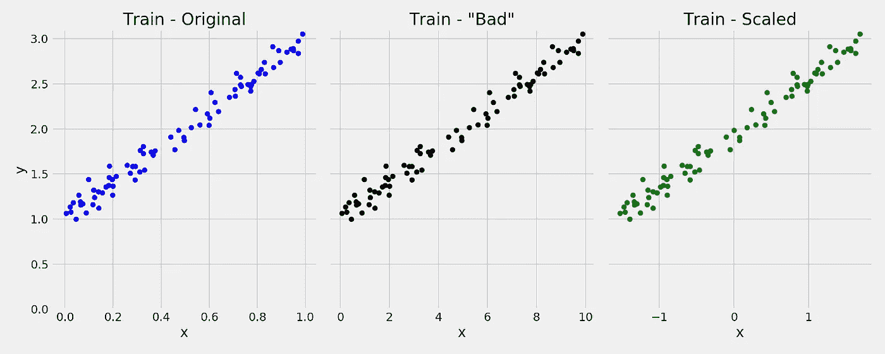****

****相同的数据，特征 **x** 的三种不同比例****

****同样，图与图之间唯一的**差异是特征的**比例 *x*** 。它的范围本来是[0，1]，后来我们把它做成[0，10]，现在**标准缩放器**把它做成[-1.5，1.5]。******

****好了，检查**损失面**的时间到了:为了说明差异，我将它们三个并排绘制:*原*、*坏*和*缩放*……看起来是这样的:****

****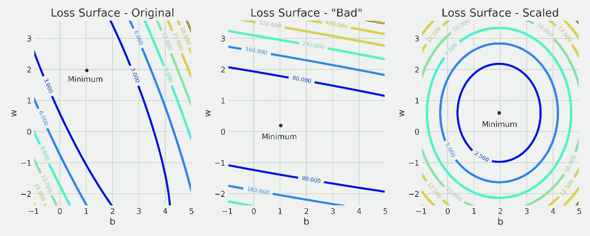****

****特征 **x** 不同比例的损失面****

******漂亮的**，不是吗？教科书上对**碗的定义** :-)****

****在实践中，这是人们可能希望的**最佳表面**:截面**将会是**同样陡峭的**，并且其中一个的**好的学习率**对另一个也是好的。******

****当然，在现实世界中，你永远也不会得到那样一个漂亮的碗。但是我们的结论仍然成立:****

1.  ****总是标准化(缩放)你的特征。****
2.  ******永远不要忘记第一条:-)******

# ****最后的想法****

****我希望这篇文章能帮助你发展**直觉**关于**特征缩放如何影响学习率**的选择，以及这两个元素如何在 **梯度下降**的**性能中发挥基本作用。******

*****如果你有什么想法、意见或问题，欢迎在下方留言评论或联系我* [*推特*](https://twitter.com/dvgodoy) *。*****