# 梯度下降被解开

> 原文：<https://towardsdatascience.com/gradient-descent-unraveled-3274c895d12d?source=collection_archive---------19----------------------->

## 从基础开始理解梯度下降优化的工作原理

在当前的深度学习时代，你可能以前听说过梯度下降这个术语。如果你不明白它是什么和它是如何工作的，这篇文章是给你的。在这篇文章中，我将解释它是什么以及它是如何工作的。

## 最大值对最小值和全局对局部

首先，让我们从最大值、最小值、全局和局部的概念开始。

我将为单变量函数解释这些概念，因为它们易于可视化。然而，他们延伸到多变量的情况。

让我们从几个定义开始。[1]

*   **全局最大值**:定义在域 *X* 上的实值函数 *f* 在*X*∫if*f*(*X*∫)≥*f*(*X*)对于*X*中的所有 *x*
*   **全局最小值**:一个定义在定义域 *X* 上的实值函数 *f* 在*X*∫处有一个全局(或绝对)最大值点，如果*f*(*X*∫)≤*f*(*X*)对于 *X.* 中的所有 *x*
*   **局部最大值**:如果域 *X* 是一个度量空间，那么就说 *f* 在点*X*∫处有一个局部(或相对)最大值点，如果存在一些 *ε* > 0 使得*f*(*X*∫)≥*f*(*X*
*   **局部最小值:**如果域 *X* 是一个度量空间，那么就说 *f* 在点*X*∫处有一个局部(或相对)最大值点，如果存在一些 *ε* > 0 使得*f*(*X*∫)≤【t8t

图形会使概念更容易理解。我在下图中总结了这四种类型的点。

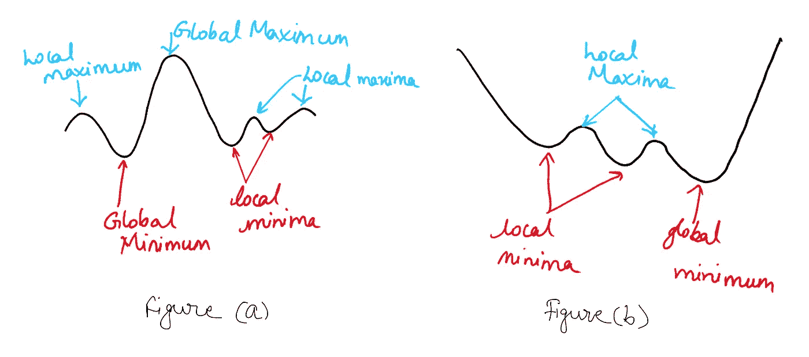

作者图片

顾名思义，最小值是集合中的最小值，最大值是最大值。全局意味着它对整个集合是正确的，而局部意味着它对某些邻近区域是正确的。一个函数可以有多个局部最大值和最小值。然而，只能有一个全局最大值和最小值。请注意，对于图(a)和(b ),功能域仅限于您看到的值。如果它是无穷大，那么图(a)中的图就没有全局最小值。

现在我们理解了这些概念，下一步就是如何找到这些极值点。

事实证明微积分中的导数对于寻找这些点是有用的。我不会深入衍生品的细节。不过，我会解释得足够明白下面的讨论。

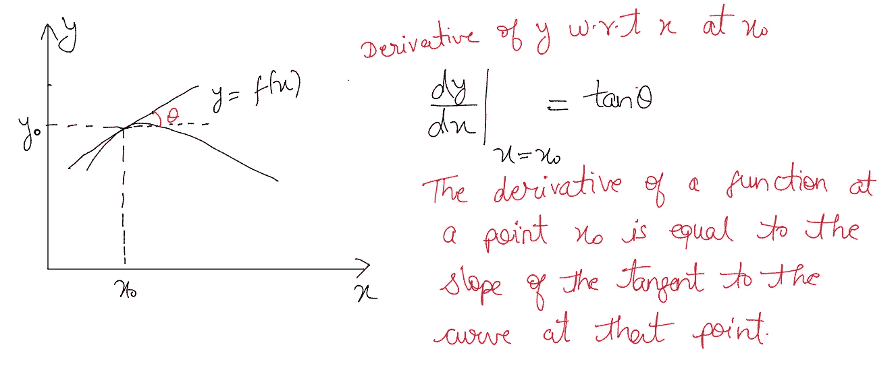

作者图片

导数给出了某物相对于某物的变化率。例如，一种药物被你的系统吸收的速度可以用微积分来建模和分析。

现在，让我们明白什么是临界点。

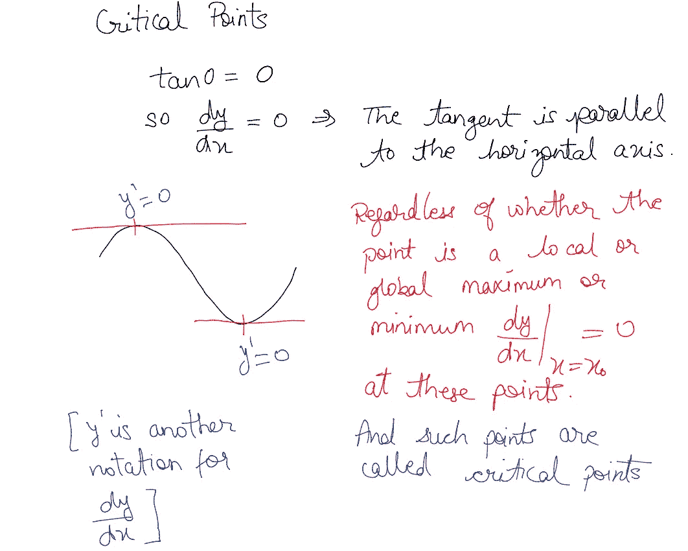

作者图片

所以我们知道，在这些临界点，会有一个局部或全局的最大值或最小值。下一步是确定它属于哪一类。

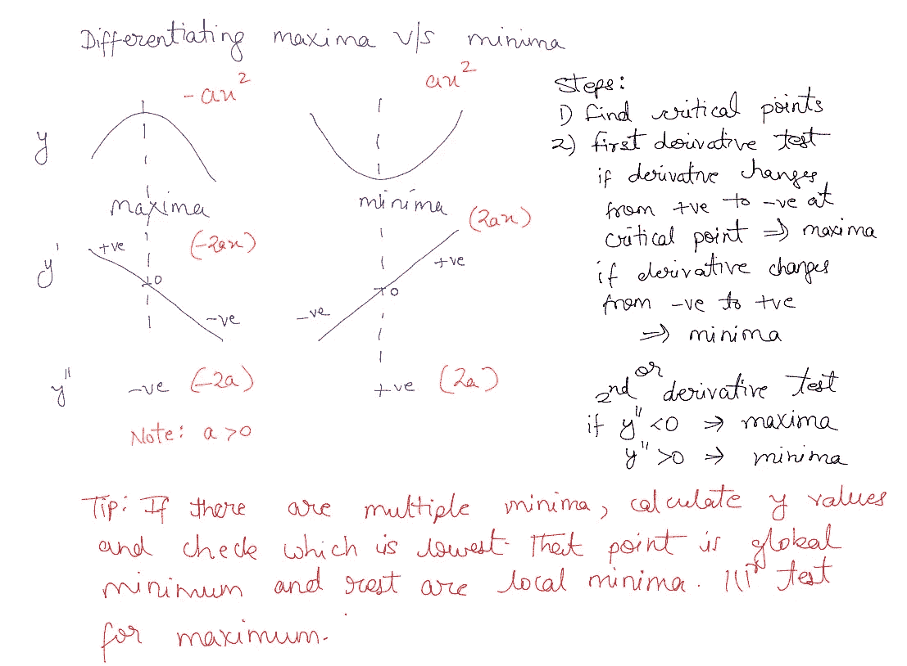

作者图片

您可以使用两种测试中的任何一种，即一阶和二阶导数测试来对最大值和最小值进行分类。当我在高中的时候，我发现二阶导数测试更快，因为我只计算一个值(不用计算器)。我将向你展示一个实际上是如何做的例子。

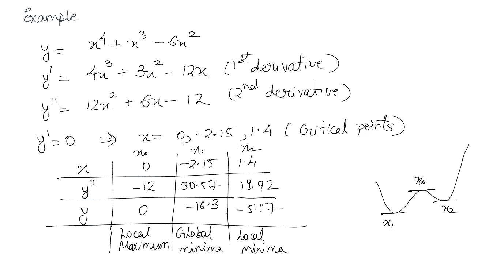

作者图片

为了发现这个点是否是全局的，你必须评估所有临界点的函数，看看哪个点是最低点。在我们的例子中，我们看到了一个多项式函数。它是光滑的，可微的。测试的点是有限的，如果你有方程，计算函数就很容易。

然而，现在让我们转向现实世界。我们永远不知道我们处理的现实生活过程的实际等式。此外，等式中还涉及到几个变量。这些测试在那些情况下不会有用。为了训练一个神经网络，你需要最小化网络参数的损失。这是一个多维面，多种因素在起作用。而且我上面讨论的测试也不会有效。因此，我们转向优化这项任务。

## 寻找函数最小值/最大值的优化

什么是优化？

相对于某个集合最大化或最小化某个函数，通常表示在某种情况下可用的选择范围。该函数允许比较不同的选择，以确定哪一个可能是“最好的”

常见应用:最小成本、最大利润、最小误差、最佳设计、最佳管理、变分原理。

在数学、计算机科学和运筹学中，数学优化或数学规划是从一组可用的备选方案中选择最佳元素(就某些标准而言)。

优化本身就是一片汪洋，极其有趣。在深度学习的背景下，优化目标是最小化关于模型参数的成本函数，即权重矩阵。

## 什么是渐变？

梯度:在向量微积分中，梯度是导数的多变量推广。标量函数的梯度 f(x₁，x₂，x₃，…，xₙ)【以下简称 **f** 用∇ **f** 表示，其中∇(纳布拉符号)被称为德尔算符。它把所有的偏导数信息打包成一个向量。

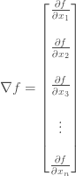

∇ **f** 是一个向量值函数，指向最陡上升的方向。想象一下，如果你站在 **f** 的输入空间中的某个点，梯度向量会告诉你应该向哪个方向移动，以快速增加 **f** 的值。

如果你有兴趣了解更多。可汗学院是一个学习渐变和数学的好地方。
[https://www . khanacademy . org/math/multivariable-calculus/multivariable-derivatives/gradient-and-direction-derivatives/v/gradient](https://www.khanacademy.org/math/multivariable-calculus/multivariable-derivatives/gradient-and-directional-derivatives/v/gradient)

## **梯度下降**

**这是一种优化技术，以迭代的方式向最小值移动。**

涉及的步骤如下:

1.  猜一个点(随机或通过某种技巧)。
2.  选择步长，在深度学习中称为学习速率ρ，也是深度学习中最重要的超参数之一。
3.  计算函数的梯度
4.  从最初的猜测中减去这个，向相反的方向移动。这是因为我们想下降，梯度给你最陡的上升方向。
5.  重复步骤 3 和 4n 次，或者直到达到停止标准

在深度学习应用的方程形式中，它可以写成:

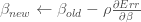

ρ是学习速率，它决定了在迈步时衰减梯度值的程度。

β是网络参数。

这里还要提到的一点是，除非函数是凸的，否则算法会陷入局部最小值，而不是收敛到全局最小值。

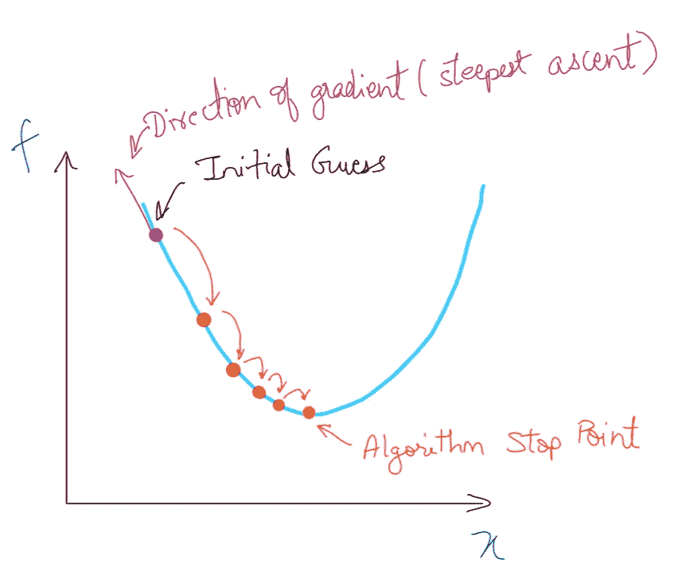

作者图片

在数学中，定义在一个 *n* 维区间上的实值函数，如果该函数的图上任意两点之间的线段位于图的上方或图上，则称为凸的(或向下凸的或向上凹的)。这意味着函数本身在严格凸的情况下有一个最小值。

**总之，梯度下降是一种优化方法，通过在函数梯度的负方向(最陡下降的方向)上递增地更新其参数来找到目标函数的最小值。**

## 梯度下降 1D 示例

让我们看几个例子。我们将从 1D 案例开始，因为它最容易想象。所用的等式与我之前在最大值和最小值部分使用的等式相同。

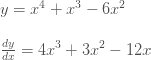

我将展示如何使用 numpy 和 matplotlib 在 python 中手动实现代码。

下图显示了起点和学习率的各种组合。

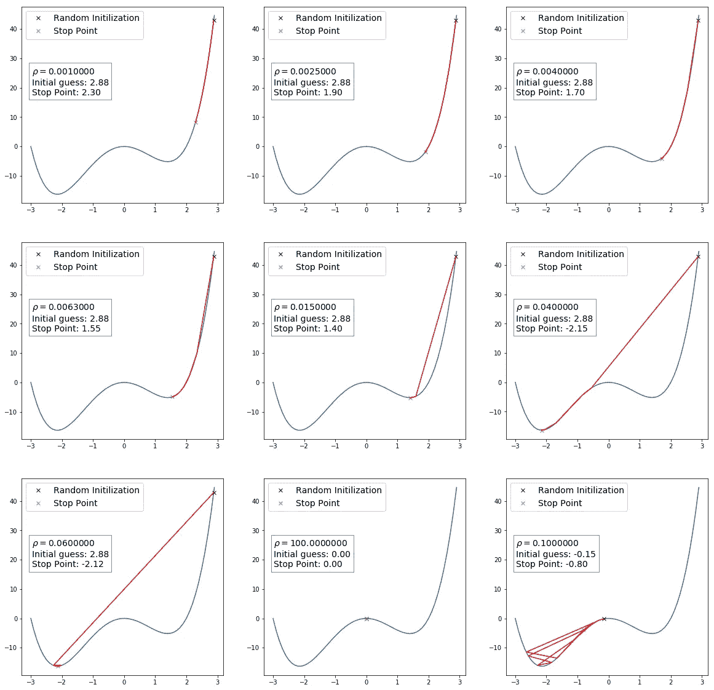

作者图片

## **少数观察结果**

考虑中的方程有两个最小值。我们想用梯度下降算法找到全局最小值。我将解释按行填充的数字。对于所有示例，迭代次数保持为 10。我改变了学习速率和初始起点，向你们展示它是如何影响算法的。前五幅图表明，如果起始点和迭代次数保持不变，学习速率越大，算法下降越快。但在这些情况下，算法会陷入局部最小值。在图 7 中，我们看到，由于大的学习速率加上起始点的陡峭斜率，该算法大幅度跳转到全局最小值。

尽管大的学习速率可以导致更快的收敛，但是由于大的有效步长，你的算法有可能偏离最小值。看一下最后一个图，起点使算法能够达到全局最小值，但是大的学习率导致算法发散。倒数第二张图显示了另一种情况。该点在临界点处初始化，该点的导数为零。无论你的学习速率有多大，或者你走了多少步，算法都不会从那个点移动。

从上面的例子中，我们看到必须选择学习速率，使得它不太低以至于梯度过阻尼，或者对于梯度太高以至于扩大步长。起始点的初始化是至关重要的，它能使你得到全局最小值或局部最小值。要采取的步骤数量也很重要。

## 梯度下降 2D 示例

现在让我们看几个 2D 的例子。

第一个例子是抛物面，它的方程式如下。

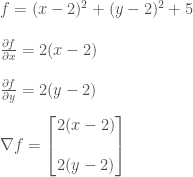

在本教程中，我将使用[症状](https://docs.sympy.org/latest/tutorial/basic_operations.html)。这允许你对方程进行符号计算。即使你不知道微积分，你也可以使用代码来尝试不同的方程和实验。

以下代码使用 sympy 的符号表示创建函数 f1，并计算 w.r.t. x 和 y 的偏导数来计算梯度。然后通过使用适当的分量更新 x 和 y 值来使用它执行梯度下降。

下图显示了 3D 绘图的两个视图。

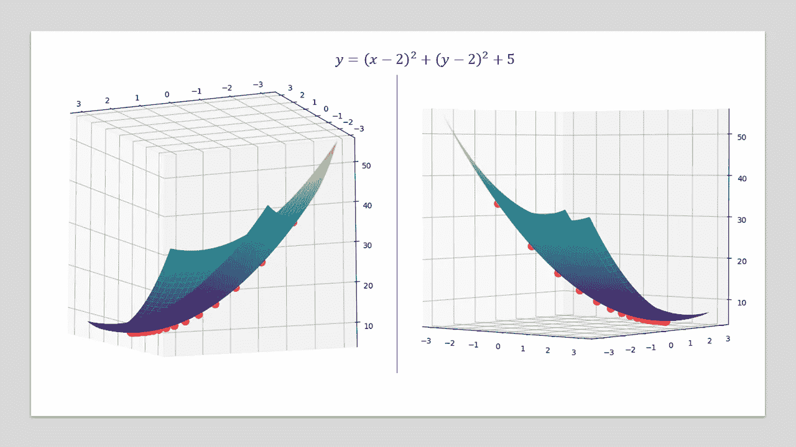

作者图片

从图中可以立即看出，当算法接近最小值时，梯度值减小，因此步长减小。正如我在文章开头提到的，这种技术对于 n 维的情况是一样的。我们在较低维度中得出的观察结果几乎总是可以在很少或没有修改的情况下扩展到更高维度的情况。

为了给你一个不同表面的味道，下面是两个 2D 梯度下降的例子。如前所述，初始化很重要，并将最终决定您的最终结果。

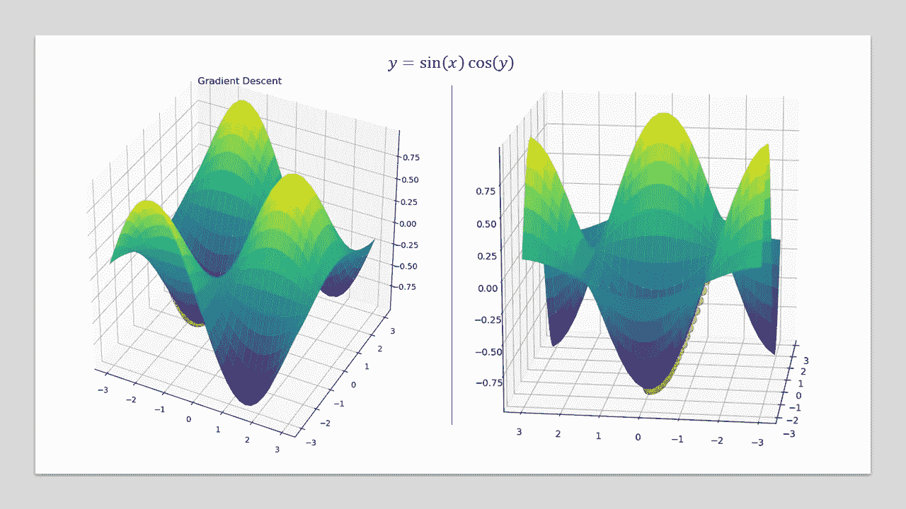

作者图片

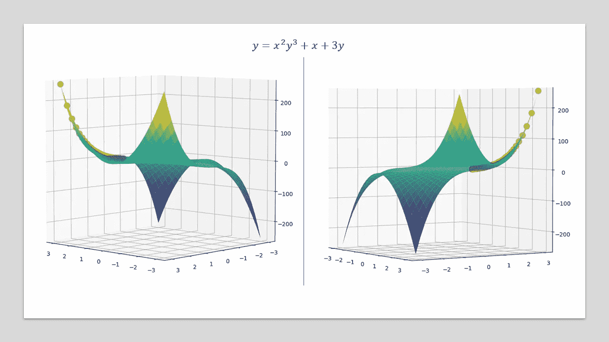

作者图片

## Python 实用程序以交互方式尝试不同的梯度下降参数

我制作了一个 python 工具，可以让你调整学习率、迭代次数和初始起点，看看这些如何影响 1D 例子的算法性能。关于这一点的代码，以及 2D 函数图，可以在下面的库中找到。
[https://github.com/msminhas93/GradientDescentTutorial](https://github.com/msminhas93/GradientDescentTutorial)

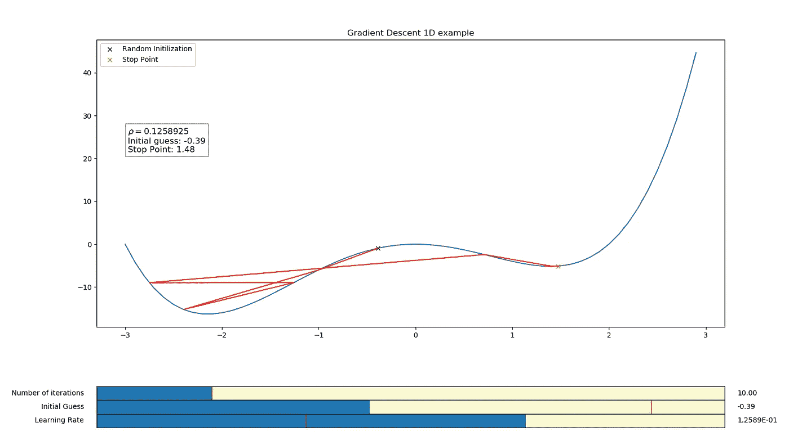

作者图片

到目前为止，我们已经看到了算法，并以 1D 和 2D 为例，分析他们的选择如何影响收敛。

## 深度学习中的梯度下降[2]

在深度学习的背景下，梯度下降可以分为以下几类。

*   随机梯度下降
*   小批量梯度下降
*   批量梯度下降

**随机梯度下降:**假设你想要最小化一个目标函数，这个目标函数被写成可微函数的和。

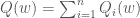

每个术语 Qᵢ通常与 iᵗʰ数据点相关联。

标准梯度下降(批量梯度下降)如下所示。

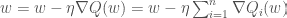

其中η是学习率(步长)。

随机梯度下降(SGD) 每次迭代只考虑被加数函数的子集。这对于大规模的问题可能是有效的。Q(w)的梯度由单个例子中的梯度近似:

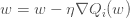

每个训练示例都需要进行这种更新。在算法收敛之前，可能需要对训练集进行多次遍历。

SGD 的伪代码:

*   选择 w 和η的初始值。
*   重复直到收敛。
*   随机打乱训练集中的数据点。
*   对于 i = 1，2，3，…，n，做:
*   w =∇qᵢ(w)

让我们考虑下面的等式:

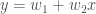

目标函数是:

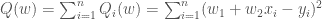

SGD 的更新规则如下。

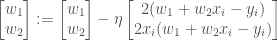

**小批量梯度下降:**

*   **批量梯度下降**在每次迭代中使用所有的 **n 个数据点**。
*   **随机梯度下降**在每次迭代中使用 **1 个数据点**。
*   **小批量梯度下降**在每次迭代中使用 **b 数据点**。 **b** 是一个称为小批量的参数。

小批量梯度下降的伪代码:

*   选择 w 和η的初始值。
*   例如，选择 b = 10
*   重复直到收敛。
*   随机打乱训练集中的数据点。
*   对于 i = 1，11，21，…，n-9，做:

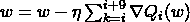

## 关于梯度下降的三种类型的讨论

关于三种变体的几点看法。

*   SGD 比其他两个变体更嘈杂，因为它是按示例更新的。
*   SGD 通常被称为在线机器学习算法，因为它为每个训练示例更新模型。
*   SGD 在计算上比其他变体更昂贵，因为它每个例子。
*   SGD 是抖动的，导致收敛到最小困难。
*   小批量梯度下降允许您利用 GPU 的优势，一次处理多个示例，从而减少训练时间。
*   批量梯度下降实际上是不可行的，除非你有一个小的数据集，可以放入可用的内存。

小批量参数 **b** 的选择取决于您的 GPU、数据集和型号。一个经验法则是选择 8 的倍数大小。一般来说，32 是一个好的开始数字。如果你选择的数字太高或太低，那么算法会变得更慢。在前一种情况下，计算可能会变得更慢，因为你给 GPU 增加了很多负载。而在后一种情况下，较小的小批量不能充分利用您的 GPU。为你的情况找到合适的平衡点是很重要的。

调整学习率η:

如果η太高，算法就会发散。如果η太低，会使算法收敛缓慢。

通常的做法是使ηₙ成为迭代次数 n 的减函数。下面是两个例子。

*   ηₙ = k/(n+c)，其中 k 和 c 是常数。
*   ηₙ = η₀ e⁻ᵏⁿ，其中η₀是初始学习率，k 决定指数衰减的陡度。

你也可以使用基于时间间隔的学习进度计划。例如:

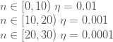

其中 n 是迭代次数。

第一次迭代引起 w 的较大变化，而后面的迭代只做微调。

有一种叫做周期学习率的东西，你可以用一个周期函数来安排时间。你可以在这里了解更多信息。

这就结束了对梯度下降的讨论。

总结一下:

*   梯度下降是一种优化算法，用于深度学习中，以最小化关于模型参数的成本函数。
*   它不能保证收敛到全局最小值。
*   收敛性取决于起始点、学习速率和迭代次数。
*   在实践中，小批量梯度下降与批量大小值 32 一起使用(这可能因您的应用而异)。

希望这有用。欢迎您的建议、反馈和评论。

参考资料:

[1][https://en.wikipedia.org/wiki/Maxima_and_minima](https://en.wikipedia.org/wiki/Maxima_and_minima)

[2]滑铁卢大学 STAT 946 深度学习课程【https://www.youtube.com/playlist? list = pleayksg 4 usq 0 madcjyskfeo 3 guptuuh 66