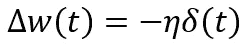
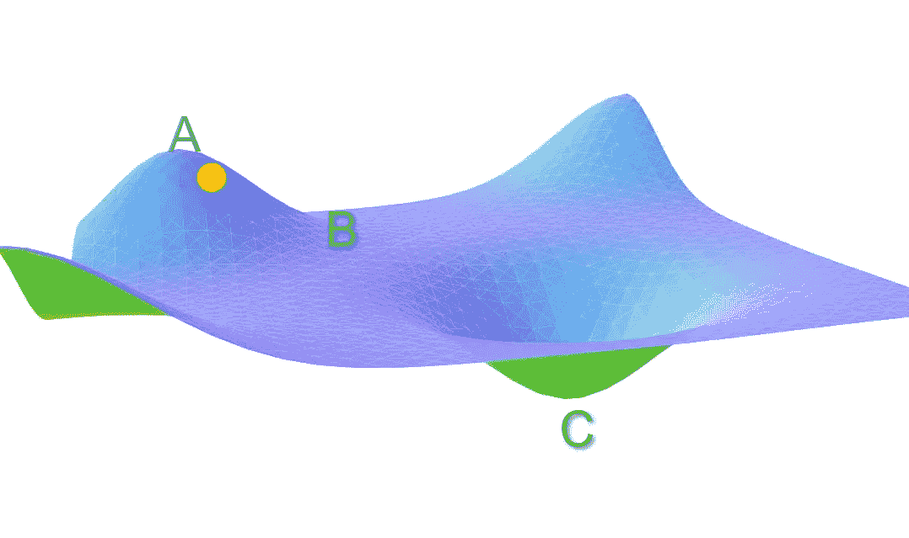
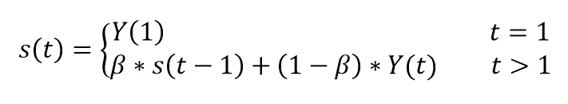
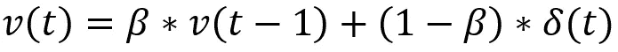
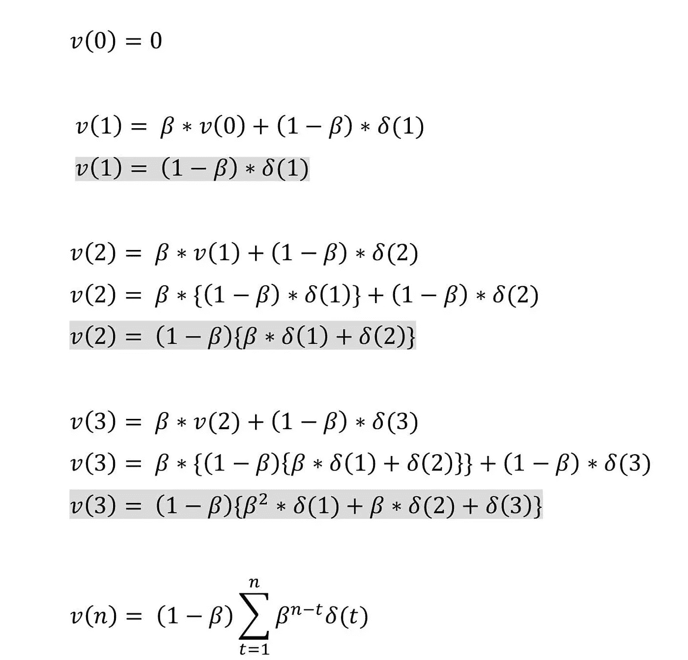
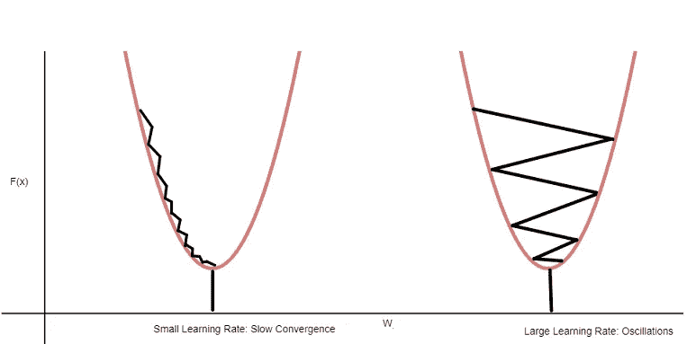

# 动量梯度下降

> 原文：<https://towardsdatascience.com/gradient-descent-with-momentum-59420f626c8f?source=collection_archive---------5----------------------->

梯度下降的问题在于，在时刻(t)的权重更新仅由该时刻的学习速率和梯度控制。它没有考虑遍历成本空间时所采取的过去步骤。

*作者图片*

会导致以下问题。

1.  成本函数在鞍点(平台)的梯度可以忽略或为零，这又导致很小的或没有权重更新。因此，网络变得停滞，学习停止
2.  即使在小批量模式下运行，梯度下降所遵循的路径也非常不稳定

考虑低于成本的表面。

*作者图片*

让我们假设所考虑的网络的初始权重对应于点 a。在梯度下降的情况下，损失函数沿着斜率 AB 迅速减小，因为沿着该斜率的梯度很高。但是一旦到达 B 点，梯度就变得非常低。B 附近的权重更新很小。即使在多次迭代之后，成本在停留在梯度最终变为零的点之前移动得非常慢。

在这种情况下，理想情况下，成本应该移动到全局最小值点 C，但是因为梯度在点 B 处消失，所以我们陷入了次优解。

**动量如何解决这个问题？**

现在，想象你有一个球从 a 点滚下。球开始慢慢滚下，并聚集了一些动量**越过斜坡 AB。当球到达点 B 时，它已经积累了足够的动量来推动自己穿过平台区域 B，并最终沿着斜率 BC 降落在全局最小值 c 处。**

**如何将此应用于梯度下降？**

为了说明**动量**，我们可以使用过去梯度的移动平均值。在像 AB 这样梯度高的区域中，权重更新将会很大。因此，在某种程度上，我们通过对这些梯度进行移动平均来收集**动量**。但是这种方法有一个问题，它以相等的权重考虑迭代中的所有梯度。t=0 处的梯度与当前迭代 t 处的梯度具有相等的权重。我们需要使用过去梯度的某种加权平均值，以便给予最近的梯度更多的权重。

这可以通过使用指数移动平均线(EMA)来实现。指数移动平均线是一种移动平均线，它对最近的值赋予更大的权重。

序列 *Y* 的均线可以递归计算

*作者图片*

在哪里

*   系数β表示权重增加的程度，是介于 0 和 1 之间的常数平滑因子。较低的β值会更快地忽略旧的观察值。
*   *Y(t)* 是周期 *t* 的值。
*   *S(t)* 是任意时段 *t* 的均线值。

在我们的梯度序列的情况下，迭代 t 处的新权重更新方程变成

*作者图片*

我们来分解一下。

𝓥 **(t)** :新的权重更新是在迭代 **t** 完成的吗

**β:** 动量常数

**𝛿(t):** 是迭代时的梯度 **t**

假设在第 0 次迭代 t=0 时的权重更新为零

*作者图片*

想想常数β，忽略上式中的(1-β)项。

**注**:在许多文本中，你可能会发现(1-β)被替换为学习率η。

如果β是 0.1 呢？

在 n=3 时；t =3 处的梯度将贡献其值的 100%，t=2 处的梯度将贡献其值的 10%，而 t=1 处的梯度仅贡献其值的 1%。

在这里，来自早期梯度的贡献迅速减少。

如果β是 0.9 呢？

在 n=3 时；t =3 处的梯度将贡献其值的 100%，t=2 处的梯度将贡献其值的 90%，t=1 处的梯度将贡献其值的 81%。

从上面我们可以推断，更高的β将容纳更多来自过去的梯度。因此，一般来说，在大多数情况下，β保持在 0.9 左右。

**注**:权重更新中每个梯度的实际贡献将进一步受制于学习率。

这解决了我们的第一点，当当前时刻的梯度可以忽略或为零时，学习变为零。使用**具有梯度下降的动量**，来自过去的梯度将推动成本进一步围绕鞍点移动。

在之前显示的成本面中，让我们放大 c 点。

对于梯度下降，如果学习率太小，权重将更新得非常慢，因此即使梯度很高，收敛也需要很多时间。如下图左侧所示。如果学习率太高，成本会在最小值附近波动，如下图右侧所示。

*作者图片*

动量是如何解决这个问题的？

我们再来看看**动量**的最后一个求和方程。

**情况 1** :当所有过去的梯度具有相同的符号时

求和项将变大，我们将在更新权重时采取大的步骤。沿着曲线 BC，即使学习率低，沿着曲线的所有梯度将具有相同的方向(符号),从而增加**动量**并加速下降。

**情况 2** :当一些梯度具有+ve 符号，而其他梯度具有-ve 符号时

求和项将变小，权重更新将变小。如果学习率很高，围绕谷 C 的每次迭代的梯度将在+ve 和-ve 之间改变其符号，并且在几次振荡之后，过去梯度的总和将变小。因此，从那里开始对权重进行小的更新，并抑制振荡。

这在一定程度上解决了我们的第二个问题。**梯度下降带动量**在梯度振荡的方向上迈小步，在过去的梯度具有相同方向(相同符号)的方向上迈大步。

# **结论**

通过在梯度下降中添加一个**动量**项，即使当前梯度可以忽略或为零，从过去迭代中积累的梯度也将推动成本进一步围绕鞍点移动。

即使梯度下降的**动量**收敛得更好更快，它仍然不能解决所有的问题。首先，超参数η(学习率)必须手动调整。第二，在某些情况下，即使学习率很低，动量项和电流梯度也能单独驱动并引起振荡。

首先，学习率问题可以通过使用梯度下降的其他变化来进一步解决，如**自适应梯度**和 **RMSprop。**其次，大**动量**问题可以通过使用基于**动量的梯度下降**的变体**内斯特罗夫加速梯度下降**来进一步解决。