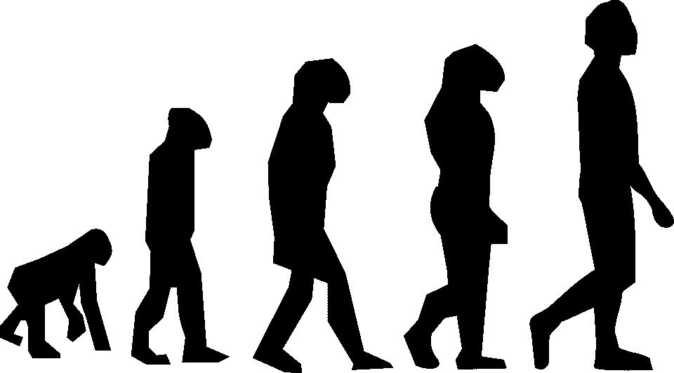
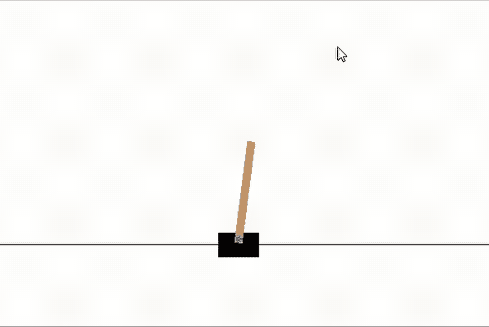
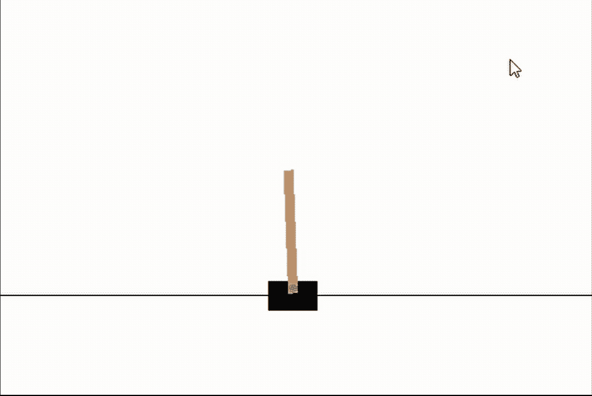

# 无梯度强化学习:使用 Numpy 的神经进化！

> 原文：<https://towardsdatascience.com/gradient-free-reinforcement-learning-neuroevolution-using-numpy-7377d6f6c3ea?source=collection_archive---------26----------------------->

## 我们能解决简单的没有后向通道的 RL 环境吗？



我们能训练只有向前传球的网络吗？[图像来源](https://pixabay.com/vectors/evolution-walking-charles-darwin-297234/)

# 介绍

如果我告诉你，你可以训练神经网络，而不必计算梯度，只使用前向传递，会怎么样？这就是**神经进化的魔力！**此外，我将展示仅使用 Numpy 就可以轻松完成所有这些工作！学习统计学你会学到很多基于梯度的方法，但不久前我读到了一篇非常有趣的文章，作者是优步人工智能的人，他表明在解决 Atari 游戏的挂钟时间方面，一个简单的遗传算法与最复杂的基于梯度的 RL 方法具有竞争力。我在下面链接了源代码，如果你对强化学习感兴趣，我强烈推荐你读一读。

# 什么是神经进化？

首先，对于那些还不知道的人来说，**神经进化**描述了进化和/或遗传算法的应用，以训练神经网络的结构和/或权重，作为一种无梯度的替代方案！我们将在这里使用一个极其简单的神经进化案例，只使用一个固定的拓扑网络，并且只关注优化权重和偏差。神经进化过程可以定义为四个基本步骤，从随机生成的网络池开始，重复这些步骤直到达到收敛。

1.评估人群的适应性
2。选择最合适的个体来繁殖
3。使用最合适网络的副本重新填充
4。将正态分布突变引入网络权重

哇，这似乎很简单！让我们稍微分解一些术语:

- **适应度**:这简单地描述了网络在某项任务中的表现，并允许我们决定繁殖哪些网络。注意，因为进化算法是非凸优化的一种形式，因此**可以与任何损失函数**一起使用，而不管其可微性(或缺乏可微性)

- **突变**:这个可能是最简单的！为了改进我们的子网络，我们必须对网络权重引入随机变化，这些变化通常来自均匀或正态分布。可能有许多不同形式的突变:移位突变(将参数乘以一个随机数)、交换突变(用一个随机数替换参数)、符号突变(改变参数的符号)等。我们将只使用简单的附加突变，但这里有很大的创造性空间！

# 神经进化的优势

我们还应该考虑神经进化模型的理论优势。首先，我们只需要使用网络的前向传递，因为我们只需要计算损失，以确定要繁殖哪些网络。这一点的含义是显而易见的，向后传球通常是最昂贵的！其次，给定足够的迭代次数，进化算法保证找到损失曲面的全局最小值，而基于凸梯度的方法可能陷入局部最小值。最后，更复杂的神经进化形式使我们不仅可以优化网络的权重，还可以优化结构本身！

# 为什么不总是使用神经进化呢？

嗯，这是一个复杂的问题，但它确实可以归结为当有足够的梯度信息时，精确的梯度下降方法更有效。这意味着损失面越凸，你就越想使用像 SGD 这样的分析方法，而不是遗传算法。因此，很少会在有监督的情况下使用遗传算法，因为通常有足够的梯度信息可用，传统的梯度下降方法将工作得很好。然而，如果你在 RL 环境中工作，或者在具有不规则损失表面或低凸性的情况下工作(像顺序 GAN)，那么神经进化提供了一个可行的替代方案！事实上，最近有很多研究发现，参数对参数的神经进化模型在这种情况下可以做得更好。

# 现在让我们开始吧！

## 加载库

正如介绍中所述，我们将尝试在这个项目中只使用**numpy，只定义我们需要的助手函数！是的，我知道，gym 也在被加载，但只是为了环境；)**

```
import numpy as np
import gym
```

## 关于数据

我们将使用 gym 中的经典 CartPole 环境来测试我们的网络。目标是观察网络通过左右移动能保持杆子直立多长时间。作为一个 RL 任务，神经进化的方法应该是很适合的！我们的网络将接受 4 个观察值作为输入，并将输出左或右作为动作。

## 助手功能

我们首先要定义几个助手函数来设置我们的网络。首先是 relu 激活函数，我们将使用它作为隐藏层的激活函数，并使用 softmax 函数作为网络输出，以获得网络输出的概率估计！最后，当我们需要计算分类交叉熵时，我们需要定义一个函数来生成我们的响应向量的一次性编码。

```
def relu(x):
    return np.where(x>0,x,0)def softmax(x):
    x = np.exp(x — np.max(x))
    x[x==0] = 1e-15
    return np.array(x / x.sum())
```

## 定义我们的网络类

现在有趣的事情来了！首先，我们将为群体中的个人网络定义一个类别。我们需要定义一个随机分配权重和偏差并将网络结构作为输入的初始化方法，一个在给定输入的情况下获得概率的预测方法，以及一个在给定输入和响应的情况下返回网络分类交叉熵的评估方法！同样，我们将只使用我们定义的函数或 numpy 中的函数。请注意，初始化方法也可以将另一个网络作为输入，这就是我们将如何执行世代之间的突变！

```
# Lets define a new neural network class that can interact with gym
class NeuralNet():

    def __init__(self, n_units=None, copy_network=None, var=0.02, episodes=50, max_episode_length=200): # Testing if we need to copy a network
        if copy_network is None:
            # Saving attributes
            self.n_units = n_units
            # Initializing empty lists to hold matrices
            weights = []
            biases = [] # Populating the lists
            for i in range(len(n_units)-1):
                weights.append(np.random.normal(loc=0,scale=1,size=(n_units[i],n_units[i+1])))
                biases.append(np.zeros(n_units[i+1]))
            # Creating dictionary of parameters
            self.params = {'weights':weights,'biases':biases} else:
            # Copying over elements
            self.n_units = copy_network.n_units
            self.params = {'weights':np.copy(copy_network.params['weights']),
                          'biases':np.copy(copy_network.params['biases'])}
            # Mutating the weights
            self.params['weights'] = [x+np.random.normal(loc=0,scale=var,size=x.shape) for x in self.params['weights']]
            self.params['biases'] = [x+np.random.normal(loc=0,scale=var,size=x.shape) for x in self.params['biases']]    def act(self, X):
        # Grabbing weights and biases
        weights = self.params['weights']
        biases = self.params['biases']
        # First propgating inputs
        a = relu((X@weights[0])+biases[0])
        # Now propogating through every other layer
        for i in range(1,len(weights)):
            a = relu((a@weights[i])+biases[i])
        # Getting probabilities by using the softmax function
        probs = softmax(a)
        return np.argmax(probs)

    # Defining the evaluation method
    def evaluate(self, episodes, max_episode_length, render_env, record):
        # Creating empty list for rewards
        rewards = [] # First we need to set up our gym environment
        env=gym.make('CartPole-v0') # Recording video if we need to 
        if record is True:
            env = gym.wrappers.Monitor(env, "recording") # Increasing max steps
        env._max_episode_steps=1e20
        for i_episode in range(episodes):
            observation = env.reset()
            for t in range(max_episode_length):
                if render_env is True:
                    env.render()
                observation, _, done, _ = env.step(self.act(np.array(observation)))
                if done:
                    rewards.append(t)
                    break
        # Closing our enviroment
        env.close()
        # Getting our final reward
        if len(rewards) == 0:
            return 0
        else:
            return np.array(rewards).mean()
```

## 定义我们的遗传算法类

最后，我们需要定义一个类来管理我们的种群，执行神经进化中的四个关键步骤！这里我们需要三种方法。首先，创建随机网络池并设置属性的初始化方法。接下来，我们需要一个 fit 方法，给定一个输入，重复执行上述步骤:首先评估网络，然后选择最适合的，创建子网络，最后变异子网络！最后，我们需要一种预测方法，以便我们可以使用由该类训练的最佳网络。让我们开始测试吧！

```
# Defining our class that handles populations of networks
class GeneticNetworks():

    # Defining our initialization method
    def __init__(self, architecture=(4,16,2),population_size=50, generations=500,render_env=True, record=False,
                 mutation_variance=0.02,verbose=False,print_every=1,episodes=10,max_episode_length=200):
        # Creating our list of networks
        self.networks = [NeuralNet(architecture) for _ in range(population_size)]
        self.population_size = population_size
        self.generations = generations
        self.mutation_variance = mutation_variance
        self.verbose = verbose
        self.print_every = print_every
        self.fitness = []
        self.episodes = episodes
        self.max_episode_length = max_episode_length
        self.render_env = render_env
        self.record = record

    # Defining our fiting method
    def fit(self):
        # Iterating over all generations
        for i in range(self.generations):
            # Doing our evaluations
            rewards = np.array([x.evaluate(self.episodes, self.max_episode_length, self.render_env, self.record) for x in self.networks])
            # Tracking best score per generation
            self.fitness.append(np.max(rewards))
            # Selecting the best network
            best_network = np.argmax(rewards)
            # Creating our child networks
            new_networks = [NeuralNet(copy_network=self.networks[best_network], var=self.mutation_variance, max_episode_length=self.max_episode_length) for _ in range(self.population_size-1)]
            # Setting our new networks
            self.networks = [self.networks[best_network]]+new_networks
            # Printing output if necessary
            if self.verbose is True and (i%self.print_every==0 or i==0):
                print('Generation:',i+1,'| Highest Reward:',rewards.max().round(1),'| Average Reward:',rewards.mean().round(1))

        # Returning the best network
        self.best_network = self.networks[best_network]
```

## 测试我们的算法！

如上所述，我们将在 CartPole 问题上测试我们的网络，仅使用 1 个具有 16 个节点的隐藏层，以及两个表示向左或向右运动的输出节点。我们还需要对许多集进行平均，这样我们就不会意外地为下一代选择一个糟糕的网络！我在反复试验后选择了这些参数，所以你的里程可能会有所不同！此外，我们将只引入方差为 0.05 的突变，以便不破坏网络的功能。

```
# Lets train a population of networks
from time import time
start_time = time()
genetic_pop = GeneticNetworks(architecture=(4,16,2),
                                population_size=64, 
                                generations=5,
                                episodes=15, 
                                mutation_variance=0.1,
                                max_episode_length=10000,
                                render_env=False,
                                verbose=True)
genetic_pop.fit()
print('Finished in',round(time()-start_time,3),'seconds')Generation: 1 | Highest Reward: 309.5 | Average Reward: 29.2
Generation: 2 | Highest Reward: 360.9 | Average Reward: 133.6
Generation: 3 | Highest Reward: 648.2 | Average Reward: 148.0
Generation: 4 | Highest Reward: 616.6 | Average Reward: 149.9
Generation: 5 | Highest Reward: 2060.1 | Average Reward: 368.3
Finished in 35.569 seconds
```

## 初始随机网络

首先，让我们看看一个随机初始化的网络如何执行任务。显然，这里没有策略，杆子几乎立刻就倒了。请忽略下面 gif 中的光标，在健身房录音在 Windows 上播放不太好！



图 1:一个随机的代理人试图解决 CartPole

```
random_network = NeuralNet(n_units=(4,16,2))
random_network.evaluate(episodes=1, max_episode_length=int(1e10), render_env=True, record=False)
```

## 五代之后…

仅仅 5 代之后，我们可以看到我们的网络几乎完全掌握了翻筋斗的艺术！而且只花了大约三十秒的火车时间！请注意，随着进一步的训练，网络学会在几乎 100%的时间里保持完全直立，但目前我们只对速度感兴趣，5 代相当短！我们应该认为这是神经进化力量的一个很好的例子。



图 2:一个训练有素的代理人正在解决横竿任务

```
# Lets observe our best network
genetic_pop.best_network.evaluate(episodes=3, max_episode_length=int(1e10), render_env=True, record=False)
```

# 下一步是什么？

显然，未来我们还可以增加很多东西来进一步检验神经进化的有效性。首先，研究不同变异算子(如交叉)的效果是很有趣的。

转移到 TensorFlow 或 PyTorch 等现代深度学习平台也是一个明智的想法。请注意，遗传算法是高度并行化的，因为我们所要做的就是在单个设备上运行每个网络，并向前传递一次。无需镜像权重或复杂的分配策略！因此，每增加一个处理单元，运行时间几乎呈线性减少。

最后，我们应该探索不同强化学习任务的神经进化，或者甚至是梯度难以评估的其他情况，例如在生成敌对网络或长序列 LSTM 网络中。

# 进一步阅读

如果你对神经进化及其应用感兴趣，优步有几篇论文展示了神经进化在强化学习中的现代优势:

[](https://eng.uber.com/tag/deep-neuroevolution/) [## 优步工程博客

### 推动世界发展的软件工程和技术

eng.uber.com](https://eng.uber.com/tag/deep-neuroevolution/) 

这个项目的源代码可以在我的公共 GitHub 资源库中找到:

[](https://github.com/gursky1/Numpy-Neuroevolution) [## gur sky 1/Numpy-神经进化

### 如果我告诉你，你可以训练神经网络，而不需要计算梯度，只需要…

github.com](https://github.com/gursky1/Numpy-Neuroevolution) 

如果你对这个项目有任何问题，或者只是想讨论深度学习，请随时发送电子邮件到[gurskyjacob@gmail.com](mailto:gurskyjacob@gmail.com)给我！