# 对咖啡分数的 Q 分数的有用性进行分级

> 原文：<https://towardsdatascience.com/grading-the-usefulness-of-q-scores-for-coffee-grading-8ff2e8439572?source=collection_archive---------30----------------------->

## 各年级之间有趣的相关性

在我寻求更好地理解咖啡分级的 Q 分数的过程中，我开始好奇构成 Q 分数的 10 个指标是如何相互关联的。我最终找到了一个跨越多年、国家和 Q 分数过程的数据库。有些人已经研究了一些初始数据，但我没有找到对基本问题的分析:Q 分数的子指标是独立变量吗？咖啡分级员有多擅长客观分级？

# 咖啡杯的 Q 分数或 Q 等级

Q 分数是在咖啡杯过程中记录的 10 个因素的顶点。我根据自己对 [SCA 杯状协议](https://sca.coffee/research/protocols-best-practices)的理解，总结了每个指标。他们定义了如何准备咖啡样品，如何品尝，以及如何评分。我相信网上有很多资源可以帮助你通过快速搜索了解如何拔罐。

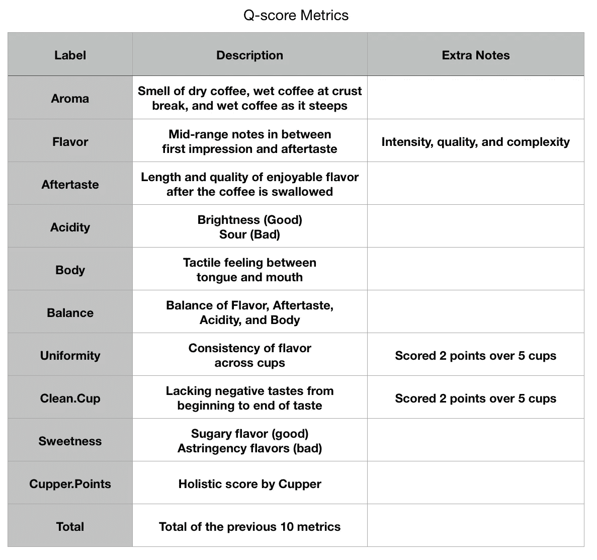

作者提供的图片与本文中的所有图片一样

由于补丁中的缺陷豆，最终分数也可能会丢分，因为允许有多少缺陷是有标准的。

根据这些描述，我制作了一个矩阵，说明我将如何假设不同的指标相互关联，因为它们中的许多指标在评分方式上有相似之处。它们是独立的指标，但根据定义，它们不是完全独立的变量。

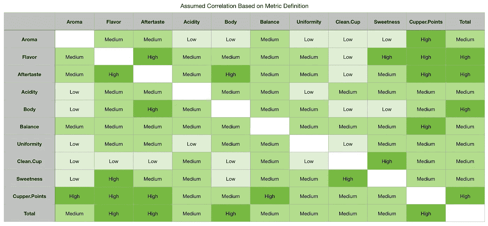

# 数据

2018 年，一个善良的灵魂做了一个脚本，从[咖啡品质院](https://www.coffeeinstitute.org) (CQI)网站拉了一堆 Q 分，建立了一个超过 1300 个咖啡等级的[数据库](https://github.com/jldbc/coffee-quality-database)。我拉了这个数据，我只做了一个补充:全球区域。对于每个国家，我加上该国的大洲或整个地区。

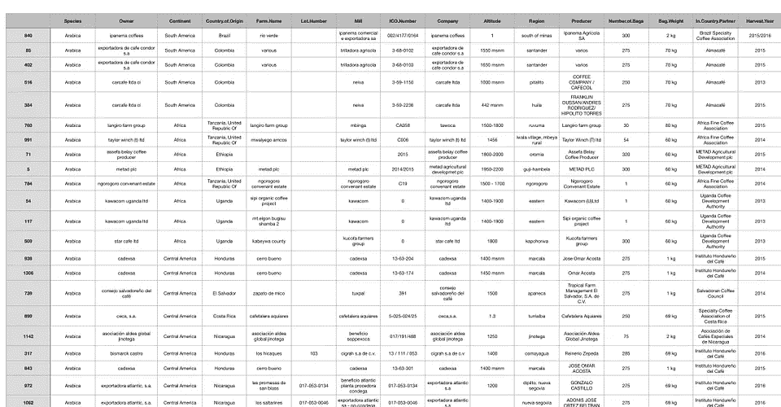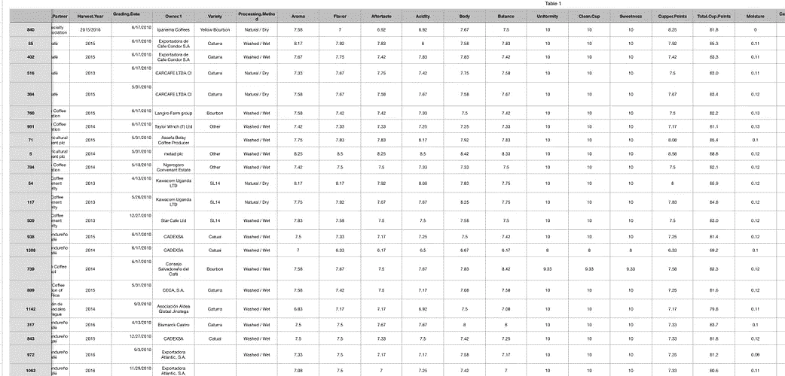

# q 分数分析

我用几种方法查看数据:箱线图、相关性和主成分分析(PCA)。每个人都从不同的角度来理解这个数据库。

## 箱线图

箱线图可以帮助人们理解分数分布通常是如何排列的，有时，趋势可以从那里出来。我看到了一些变化，但分布本身并没有引起我的注意。

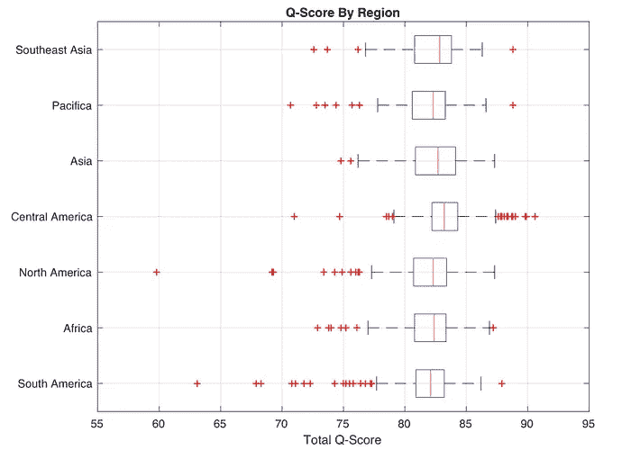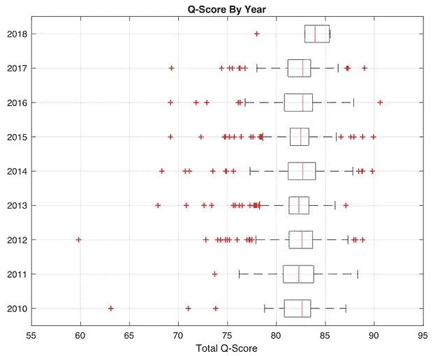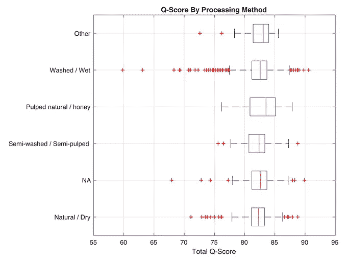

放大相同的箱线图:

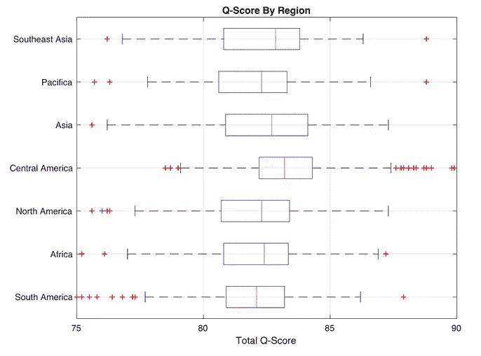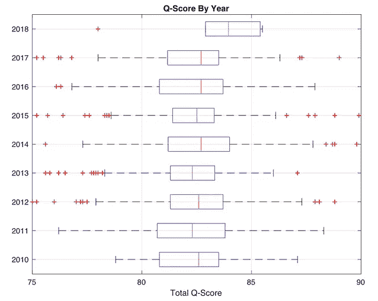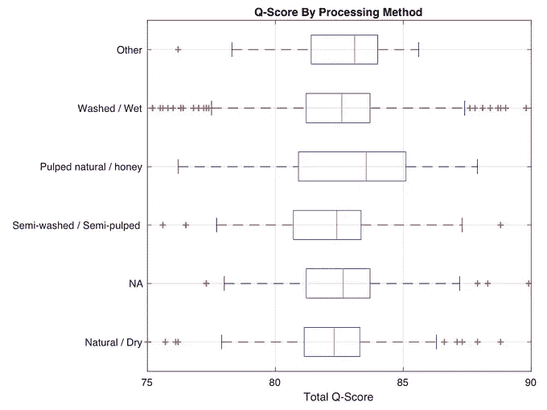

然后，我查看了各个指标，很快，我发现甜度、干净的杯子和均匀性大部分得分为 10(完美)。我不知道分数是怎么回事。这似乎很奇怪，这三个类别超过 90%的分数都在 10 分。这可能是一个数据导入问题(值得怀疑，因为我在 CQI 网站上查看了一些更新的数据),或者可能这些指标没有被普遍使用。这三个指标是十个指标中唯一量化的指标。

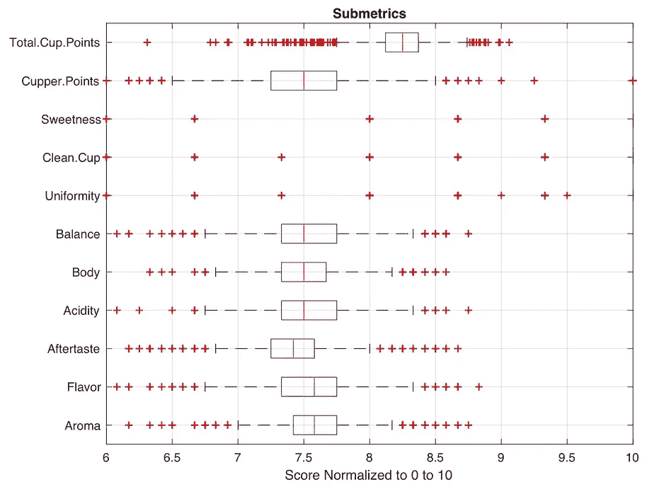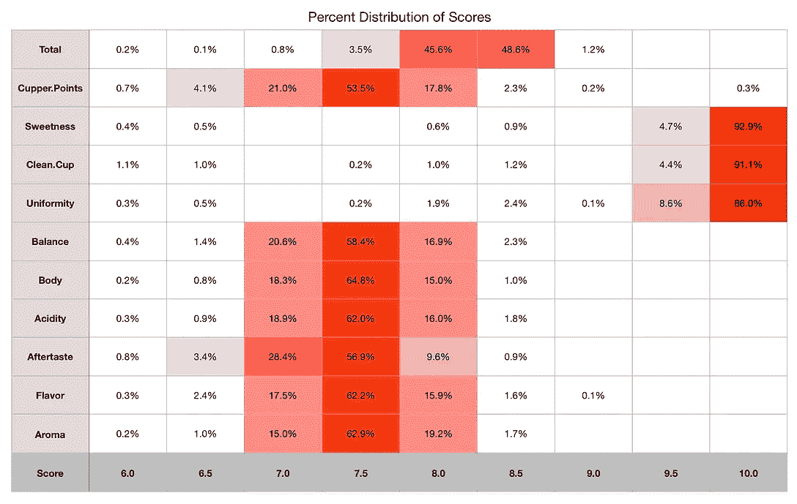

我没有其他关于 Q 分数的数据集，也没有一个解释。不过，我会继续分析，但我们不应该太看重这些。如果这些指标与最终分数紧密相关，那只是因为它们提高了分数。

## 相互关系

[相关性](https://en.wikipedia.org/wiki/Correlation_coefficient)是衡量两个变量彼此相似程度的指标。高相关性并不意味着一个变量会引起另一个变量，而是当情况发生变化时，两个变量的涨跌幅度相同。我从一开始就假设一些分级变量会有很高的相关性，因为它们是从不同的时间点来看味道的。

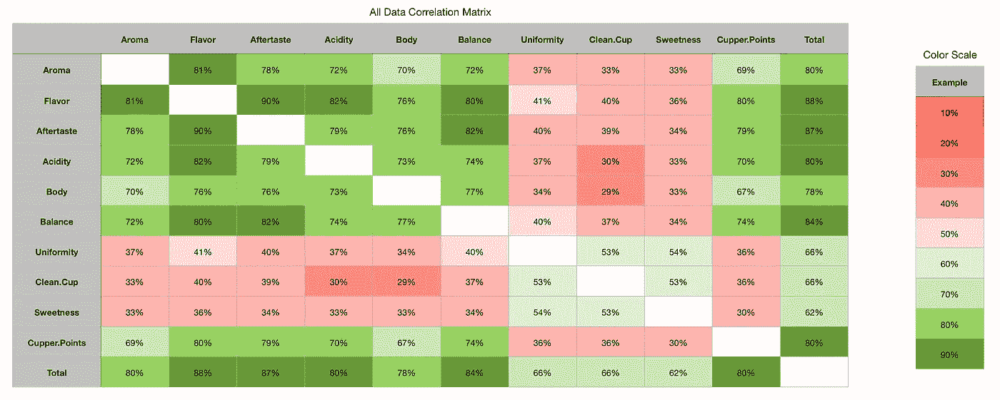

重新排序有助于显示七个指标之间的相互关系。

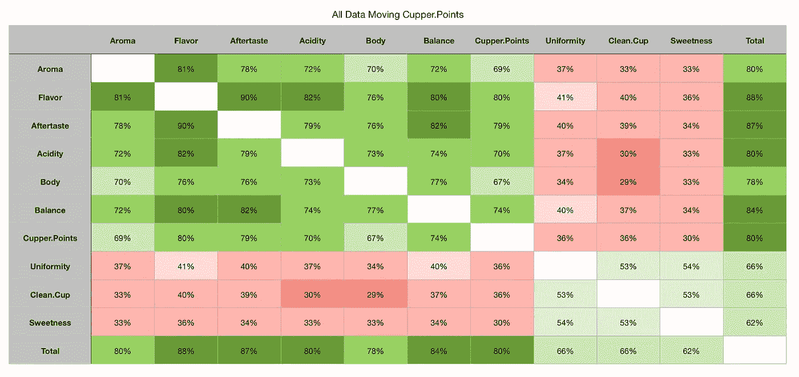

下面我举了两个散点图的例子。第一个结果显示味道和总分之间有很强的相关性。如果味道很好，并且与其他 6 个变量高度相关，那么总分应该是趋势。回味和风味也是如此。我认为好吃的东西会有很好的回味。这个关系更接近 y=x 线，但我不知道那是否有意义。总分趋势更高很可能是因为之前讨论的 3 个参数大部分等于 10，因为在大多数情况下总分和风味之间的偏差似乎约为 6(以 10 为标度)。

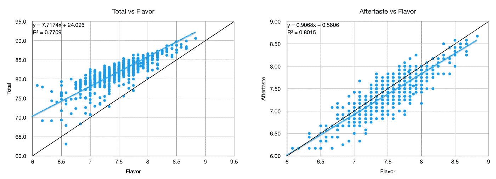

让我们更深入地了解 10 个变量，因为它们与总分相关，但在地区、年度和流程之间有所不同:

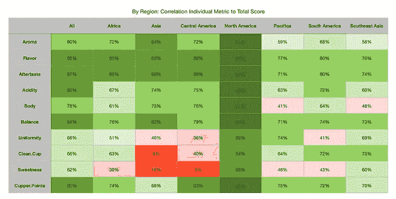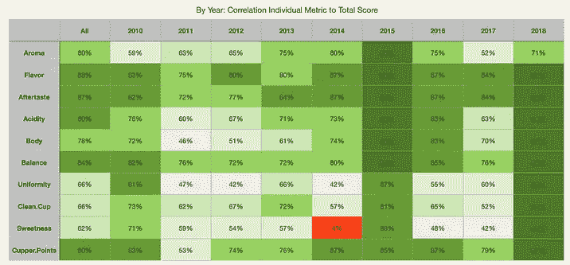

现在我们可以开始看到一些有趣的趋势，比如为什么北美咖啡豆的所有分数都有如此高的相关性？2015 年的豆子也一样？这里只有 8 个等级来自 2018 年的豆子，所以那些高相关性没有用。为什么 2011 年口味和期末成绩的相关性这么低？

让我们深入了解一些年份:

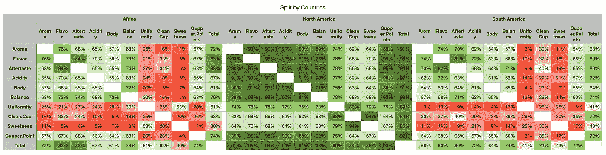

北美有奇怪的分数。每样东西都有很高的相关性，这在我看来没有一个指标是特别有趣的。这就引出了 Q-等级或分数对该地区的评分者或国家是否有用的问题。在这种情况下，北美只是墨西哥，因为中美洲分裂成了自己的一部分。

让我们在咖啡的味道中进行时间旅行:

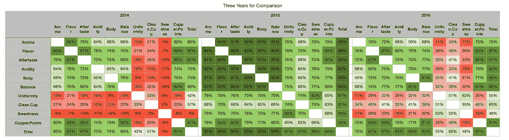

2015 年类似于北美，那里的一切都有非常高的相关性。这是一个奇怪的问题，需要在这项研究之外进一步调查。2015 年对咖啡来说是反常的一年吗？箱线图表明这很正常。

让我们比较处理，这是有趣的，因为它缺乏异常。

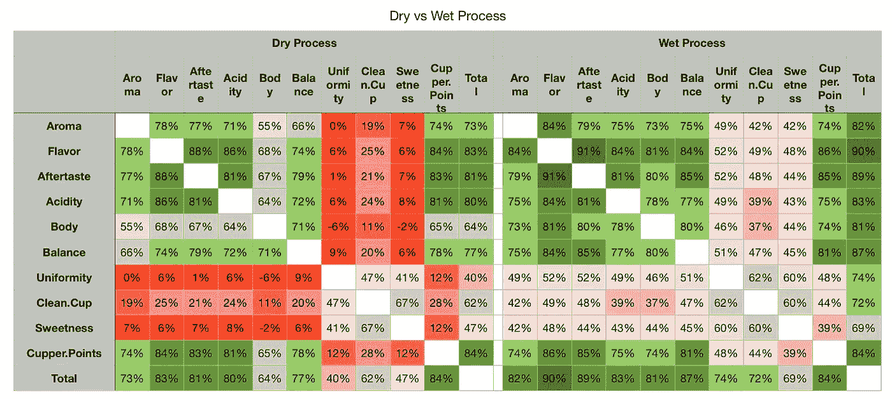

加工类型确实对味道的感觉有影响，虽然最终得分有相似的分布，但湿法加工的味道与最终得分有更高的相关性。

## 主成分分析

[PCA](https://en.wikipedia.org/wiki/Principal_component_analysis) 意在将一组变量转换到一个新的空间，其中新的维度按照它们组成原始维度的可变性排序。一个简单的数据集可以在不损失保真度的情况下减少维数；在这种情况下，每个 Q 分用 10 个维度来表示，但也许你不需要那么多来表示总分。

根据我们对均匀性、净杯和甜度的了解，让我们将它们从 PCA 分析中排除，因为它们没有有意义的信息。

让我们从查看所有数据开始。似乎这两个主成分(PC)代表了数据中所有变化的 80%。虽然前 6 个指标对每个指标的贡献似乎是相等的，但我们已经知道所有变量彼此高度相关。最大的影响是铜点。

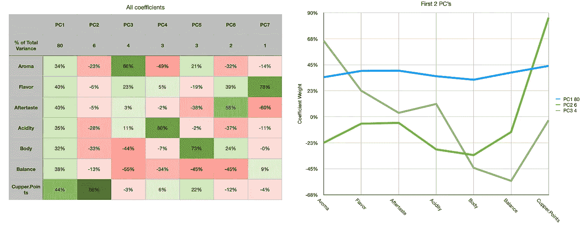

我们可以跨地区、跨年度、跨过程地观察，看看即使是个人电脑如何解释数据的可变性，也会有多大的差异。北美和 2015 年特别奇怪，因为我们已经从其他数据中看到，所有变异的 90%可以在第一台 PC 中得到解释。

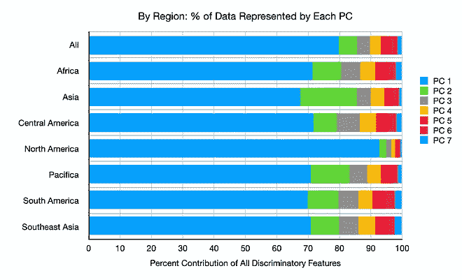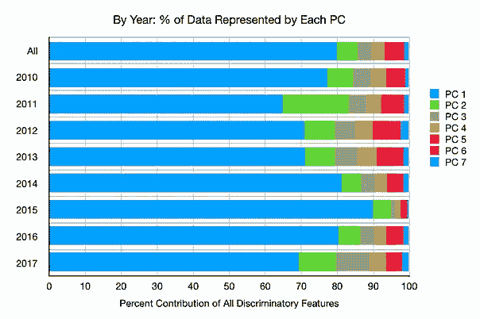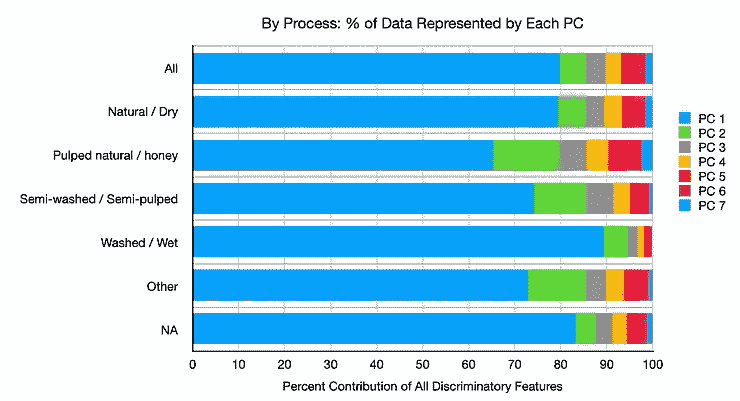

放大来看，2014 年和 2016 年也是奇数年。对于处理来说，湿法似乎是第一台 PC 的天下。

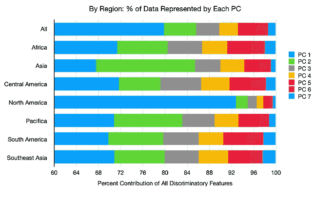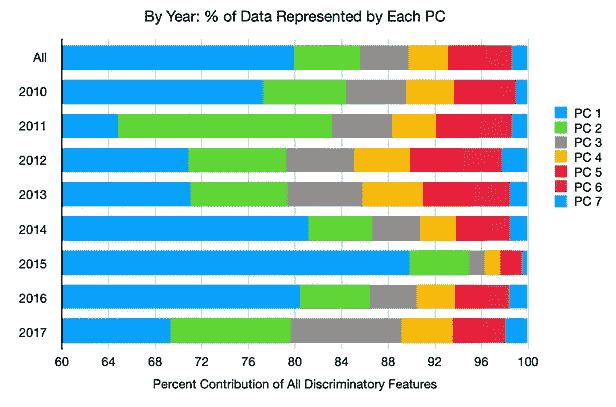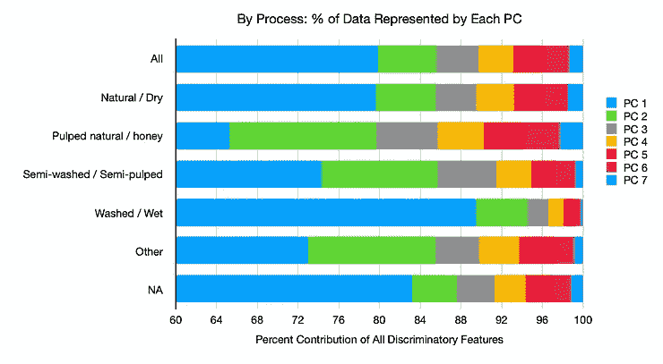

我们可以查看这些区域，以帮助理解哪些变量在使用 PC 时更突出。非洲咖啡豆的味道似乎比酸度或口感更有优势。他们有一个相似的趋势，就像南美豆一样。北美豆类在第一台个人电脑中有它们所有的可变性。

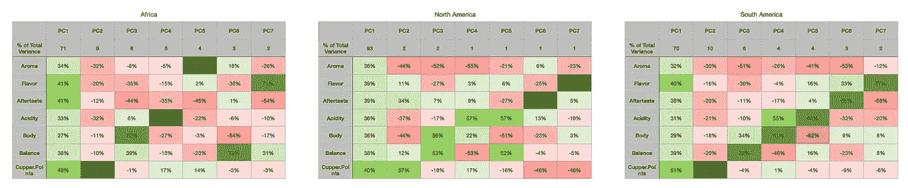

就年份而言，唯一奇怪的是所有 7 项指标在第一台电脑中的权重相似。考虑到 2015 年这些指标之间的高度相关性，这并不奇怪。

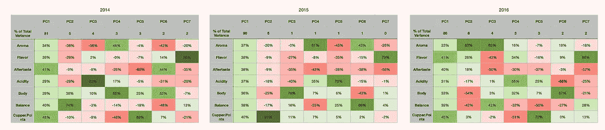

对于加工，湿加工由第一个 PC 控制，但是对于干加工，第一个 PC 包含较少的变化。对于这两者，第二台电脑主要是由铜点，这是一个整体指标。

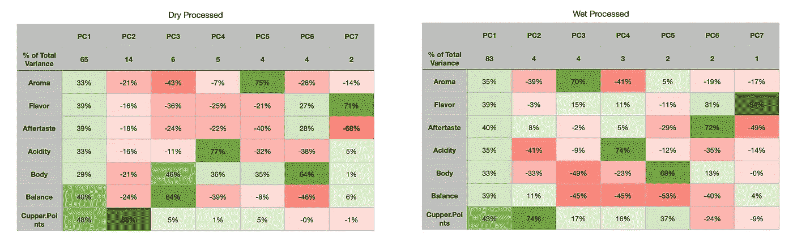

# 三个常数

当寻找有用的指标时，数据显示均匀性、干净的杯子和甜度并不那么有用。它们确实是更可量化的指标，因为它们超过 5 杯相同的咖啡，但显然，变量缺乏使它们成为有用指标所需的可变性。我只能希望在数据集中有一些问题，他们不是真的这么没用。

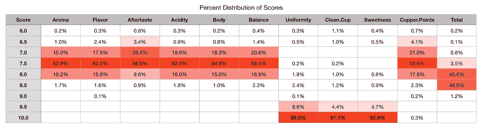

在查看 Cupper Points 时，它与总分的关系如此密切，以至于我不确定作为一个指标它是否非常有用，或者说它意味着总分可能不是非常有用。

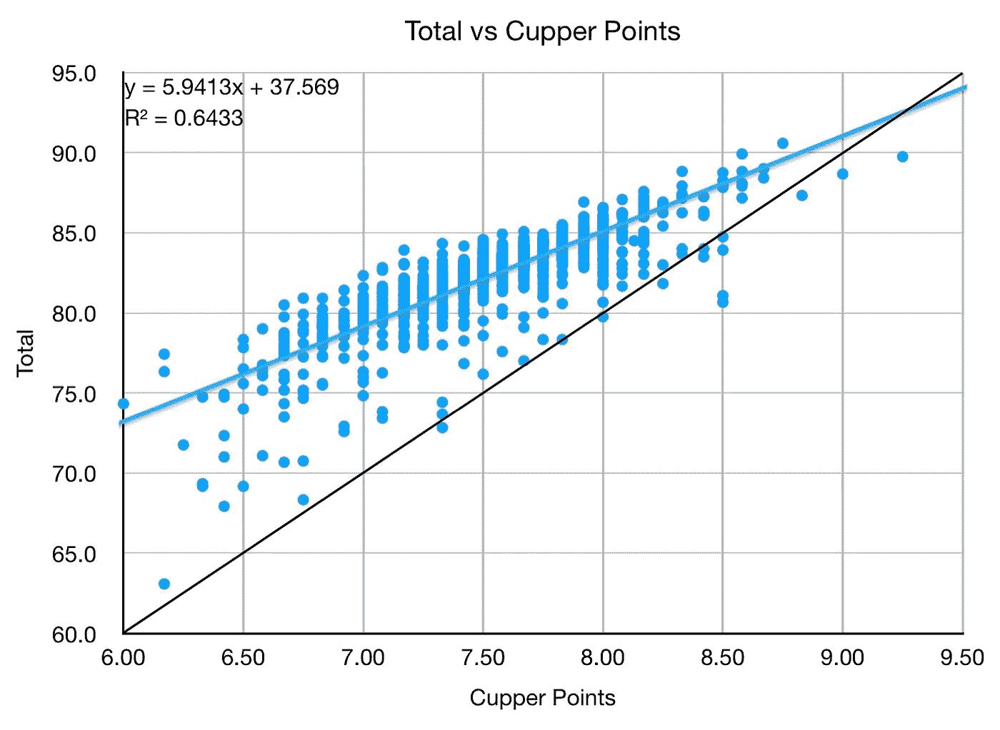

q-分级最初是为了帮助区分专业咖啡和其他咖啡，虽然我肯定它已经完成了这项工作，但我不认为这种方法可以很好地区分专业咖啡。我把这个建立在上述数据集的基础上，我承认也许有一个更好的数据集是我无法获得的。

我建议为特色咖啡制定一个新的等级，从 0 到 100。目前的标准实际上是典型值在 80 到 95 之间。一个 92 真的比一个 91 好很多吗？我不知道。我的经验是 92 分比 85 分好，但我希望改进后的量表可以消除这种模糊性。

# 附录

在发表这篇文章后，Keith Klein 总结了干净的杯子，均匀性和甜度，我认为这对于理解为什么它们大部分是 10 的和大部分是恒定的是有价值的。我觉得他们区分特色咖啡和非特色咖啡还是有价值的，而不是区分特色咖啡彼此。在他的许可下，以下是他对这三项指标以及得分的评论:

“这些分数与缺陷直接相关，并不像许多人认为的那样是对咖啡固有风味的评级。只有当其中一个杯子有污点或完全缺陷时，你才应该从这些杯子中扣分。

“甜味是其中最宽容的，因为偶尔一个受污染的杯子仍会显示一些甜味，不必进一步处罚。如果一杯咖啡真的没有甜味，那么它应该只有一点甜味。

“这个数据集来自合格的 Q 评分者，他们按照预期使用这些类别。这向你展示了 Q 系统对无缺陷咖啡的重视程度，因为对缺陷的处罚会迅速增加。一个完整的缺陷会降低 10 分。

“cupper points 和总分之间的高相关性是有意的。当你的评价接近尾声时，你的点数会奖励你特别喜欢的咖啡，惩罚你不喜欢的咖啡。”

如果你愿意，可以在 Twitter 和 YouTube 上关注我，我会在那里发布不同机器上的浓缩咖啡视频和浓缩咖啡相关的东西。你也可以在 [LinkedIn](https://www.linkedin.com/in/robert-mckeon-aloe-01581595?source=post_page---------------------------) 上找到我。

# 我的进一步阅读:

[咖啡豆脱气](/coffee-bean-degassing-d747c8a9d4c9)

[解构咖啡:分割烘焙、研磨和分层以获得更好的浓缩咖啡](/deconstructed-coffee-split-roasting-grinding-and-layering-for-better-espresso-fd408c1ac535)

[浓缩咖啡的预浸:更好的浓缩咖啡的视觉提示](/pre-infusion-for-espresso-visual-cues-for-better-espresso-c23b2542152e)

[咖啡的形状](/the-shape-of-coffee-fa87d3a67752)

[搅拌还是旋转:更好的浓缩咖啡体验](https://towardsdatascience.com/p/8cf623ea27ef)

[香辣浓缩咖啡:热磨，冷捣以获得更好的咖啡](/spicy-espresso-grind-hot-tamp-cold-36bb547211ef)

[断续浓缩咖啡:提升浓缩咖啡](https://medium.com/overthinking-life/staccato-espresso-leveling-up-espresso-70b68144f94)

[用纸质过滤器改进浓缩咖啡](/the-impact-of-paper-filters-on-espresso-cfaf6e047456)

[浓缩咖啡中咖啡的溶解度:初步研究](/coffee-solubility-in-espresso-an-initial-study-88f78a432e2c)

[断奏捣固:不用筛子改进浓缩咖啡](/staccato-tamping-improving-espresso-without-a-sifter-b22de5db28f6)

[浓缩咖啡模拟:计算机模型的第一步](https://towardsdatascience.com/@rmckeon/espresso-simulation-first-steps-in-computer-models-56e06fc9a13c)

[压力脉动带来更好的浓缩咖啡](/pressure-pulsing-for-better-espresso-62f09362211d)

[咖啡数据表](https://towardsdatascience.com/@rmckeon/coffee-data-sheet-d95fd241e7f6)

[被盗咖啡机的故事](https://towardsdatascience.com/overthinking-life/the-tale-of-a-stolen-espresso-machine-6cc24d2d21a3)

[浓缩咖啡过滤器分析](/espresso-filters-an-analysis-7672899ce4c0)

[便携式浓缩咖啡:指南](https://towardsdatascience.com/overthinking-life/portable-espresso-a-guide-5fb32185621)