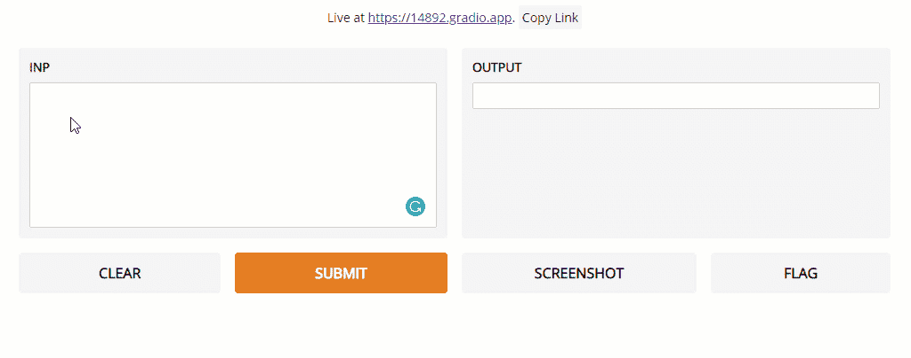
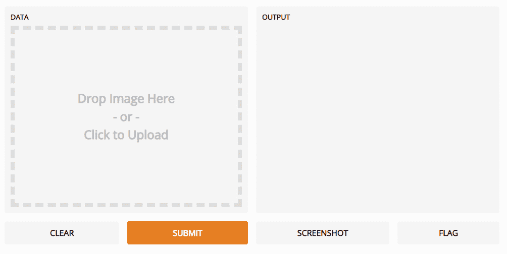
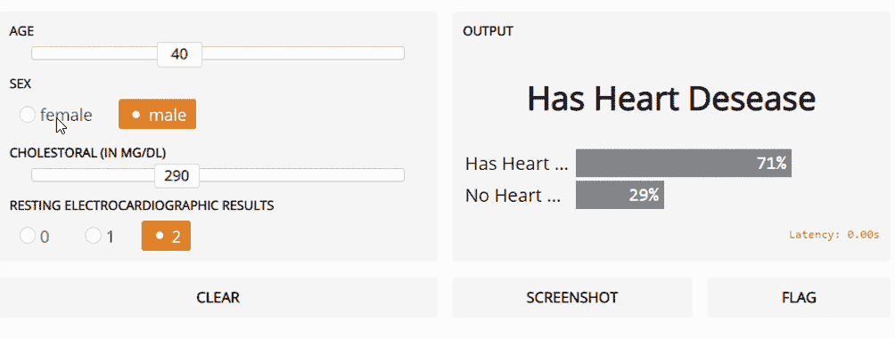

# Gradio:机器学习模型的图形界面

> 原文：<https://towardsdatascience.com/gradio-graphical-interfaces-for-machine-learning-models-fd4880964f8f?source=collection_archive---------27----------------------->

## 介绍 Gradio，一个用于创建机器学习模型用户界面的开源 Python 包。



# 介绍

由于许多开源和基于专利的服务(例如 Python、R、SAS)，现在创建机器学习模型变得越来越容易。尽管，实践者可能总是发现很难有效地创建接口来测试并与同事或涉众共享他们完成的模型。

这个问题的一个可能的解决方案是 [Gradio](https://www.gradio.app/) ，这是一个免费的开源 Python 包，可以帮助你创建模型用户界面，你可以毫不费力地通过链接分享给同事和朋友。

使用以下命令可以轻松安装 Gradio:

```
!pip install gradio
```

Gradio 与许多机器学习框架(例如 TensorFlow、PyTorch 等)完美兼容，甚至可以用于任意的通用 Python 脚本。

现在，我将向您介绍 Gradio 如何集成到您的机器学习工作流程中的不同示例。本文使用的所有代码都在这个 [Google Colab 笔记本](https://colab.research.google.com/drive/1VZ3FYpYdJYWIGZt0gJvDDxAbhl7EKu7X?usp=sharing)和我的 [GitHub 账户](https://github.com/pierpaolo28/Data-Visualization/tree/master/Gradio)中。

# 民众

## 图像分类

在本例中，我们将创建一个加载图像的界面来测试计算机视觉模型。在这种情况下，我们将使用 PyTorch 和 Alexnet 预训练模型，但这个实验可以为任何其他模型和框架重新创建。

为了创建 Gradio 接口，我们只需调用 ***接口函数*** 并传递三个参数:

*   **fn:** 通过与用户界面交互来自动调用的函数，以便为我们的模型创建预测，提供某种形式的输入。
*   **输入:**告知 Gradio 我们期望从用户界面获得何种类型的输入(例如，图像、文本、音频数据、数字数据)。
*   **输出:**通知 Gradio 我们的预测函数将返回什么类型的输出。通过这种方式，Gradio 可以了解如何在用户界面上最好地呈现输出。

一旦创建了我们的界面，我们只需要启动它(图 1)。当启动接口时，我们可以决定是否传递额外的参数，如**共享**或**调试**为真。事实上，这些参数不仅可以用于将 Gradio 界面嵌入我们的笔记本电脑，还可以作为一个可共享的网页，使我们在测试期间更容易调试系统。可共享的链接，虽然只有 6 个小时是活跃的。



图 1: Gradio 图像分类器

## 文本生成

为了预测句子的结论或生成叙述而生成文本是当前非常感兴趣的话题，尤其是由于自然语言处理(NLP)转换器的出现。在这个例子中，我将为我在[上一篇关于 NLP 的文章中介绍的 GTP2 HuggingFace 预训练模型创建一个用户界面。](/roadmap-to-natural-language-processing-nlp-38a81dcff3a6)


图 2: Gradio 文本分析

## 实时通用 ML 模型预测

最后，在这个例子中，我将展示 Gradio 如何用于涉及多种类型输入数据的经典机器学习问题。在这个例子中， [Kaggle 心脏病 UCI 数据集](https://www.kaggle.com/ronitf/heart-disease-uci)将被用作我们的数据集。所有的数据预处理步骤都在这个 [Google Colab 笔记本](https://colab.research.google.com/drive/1VZ3FYpYdJYWIGZt0gJvDDxAbhl7EKu7X?usp=sharing)和我的 [GitHub 账号](https://github.com/pierpaolo28/Data-Visualization/tree/master/Gradio)上。



图 3: Gradio Live 通用 ML 模型预测

# 结论

在创建和测试模型时，Gradio 无疑是为机器学习项目创建界面的绝佳工具，尽管为了将您的模型整合到生产和稳定的环境中，可能需要替代解决方案，例如:

*   [ONNX(开放式神经网络交换格式)](/onnx-easily-exchange-deep-learning-models-f3c42100fd77)
*   [烧瓶和 Heroku](/flask-and-heroku-for-online-machine-learning-deployment-425beb54a274)
*   [Tensorflow.js](/online-machine-learning-with-tensorflow-js-2ae232352901)
*   [阴谋地破折号](/interactive-dashboards-for-data-science-51aa038279e5)
*   特克因特

Gradio 提供的不同设施和 GUI 界面的完整列表可在[Gradio 官方文档页面上找到。](https://www.gradio.app/docs)如果您有任何问题，欢迎在下面的评论区留下您的评论。

*我希望你喜欢这篇文章，谢谢你的阅读！*

# 联系人

如果你想了解我最新的文章和项目[，请通过媒体](https://medium.com/@pierpaoloippolito28?source=post_page---------------------------)关注我，并订阅我的[邮件列表](http://eepurl.com/gwO-Dr?source=post_page---------------------------)。以下是我的一些联系人详细信息:

*   [领英](https://uk.linkedin.com/in/pier-paolo-ippolito-202917146?source=post_page---------------------------)
*   [个人博客](https://pierpaolo28.github.io/blog/?source=post_page---------------------------)
*   [个人网站](https://pierpaolo28.github.io/?source=post_page---------------------------)
*   [中等轮廓](https://towardsdatascience.com/@pierpaoloippolito28?source=post_page---------------------------)
*   [GitHub](https://github.com/pierpaolo28?source=post_page---------------------------)
*   [卡格尔](https://www.kaggle.com/pierpaolo28?source=post_page---------------------------)