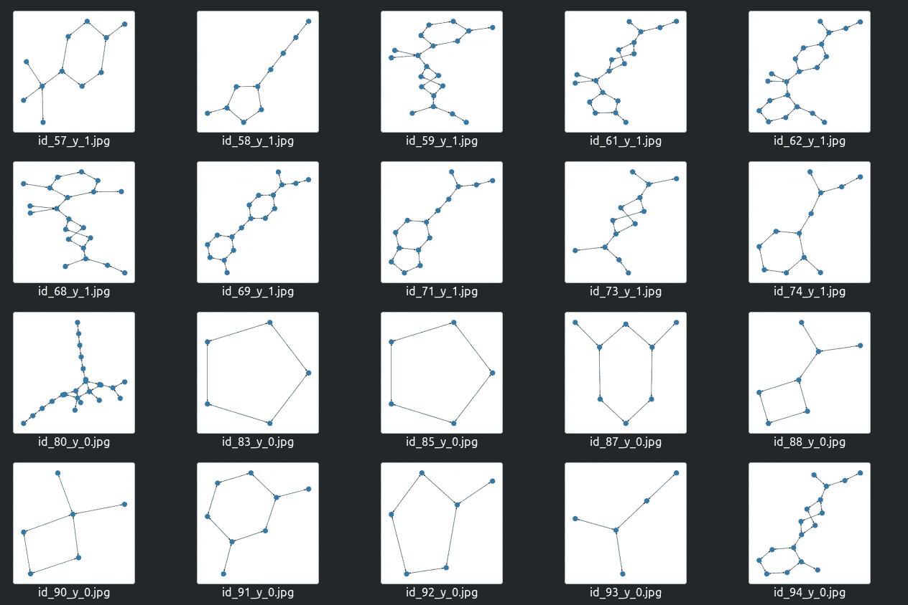

# 计算机视觉的图形分类

> 原文：<https://towardsdatascience.com/graph-classification-by-computer-vision-286572aaa750?source=collection_archive---------37----------------------->

如今，图形分析变得越来越流行，但是与计算机视觉方法相比，它的表现如何？我们将展示，虽然计算机视觉模型的训练速度慢得多，但与图论相比，它们的表现相当好。

*   Github 回购与所有代码，[链接](https://github.com/Diyago/Graph-clasification-by-computer-vision)

# 图形分析

一般来说，图论表示对象之间的成对关系。我们不会在这里留下太多的细节，但你可以考虑它的某种网络如下:


网络。照片由[阿丽娜·格鲁布尼亚](https://unsplash.com/@alinnnaaaa?utm_source=medium&utm_medium=referral)在 [Unsplash](https://unsplash.com?utm_source=medium&utm_medium=referral) 上拍摄

这里我们需要知道的要点是，通过用边连接对象，我们可以可视化图形。然后我们将能够使用经典的计算机视觉模型。不幸的是，我们可能会丢失一些初始信息。例如，图表可能包含不同类型的对象、连接，在 2D 也许不可能把它可视化。

## 图书馆

如果您愿意开始使用它们，您可以查看大量的库:

*   [networkx](https://networkx.org/) —经典算法，可视化
*   [pytorch _ geometric](https://github.com/rusty1s/pytorch_geometric)—SOTA 算法图，py torch 之上的一个框架
*   [图形工具](https://graph-tool.skewed.de/) —经典算法、可视化
*   [scikit-network](https://scikit-network.readthedocs.io/en/latest/index.html) —经典算法，sklearn like API
*   [TensorFlow Graphics](https://www.tensorflow.org/graphics)—SOTA 算法图，一个基于 tensor flow 的框架

都是针对自己的特定角色。这就是为什么它取决于你的任务使用哪一个。

**理论**

这篇文章更多的是针对实际应用，这就是为什么对于理论我将只留下一些链接:

*   [用 PyTorch 的手动图形神经网络& PyTorch 几何](http://Hands-on Graph Neural Networks with PyTorch & PyTorch Geometric)
*   [CS224W:带图的机器学习](http://web.stanford.edu/class/cs224w/)
*   图分类将基于图卷积网络(GCN)， [arxiv 链接](https://arxiv.org/abs/1609.02907)

## 模型架构

我们将使用以下架构作为基线:

```
* GCNConv - 6 blocks
* JumpingKnowledge for aggregation sconvolutions
* global_add_pool with relu
* Final layer is softmax
```

代码[链接](https://github.com/Diyago/Graph-clasification-by-computer-vision/tree/main/models)就是基于这个[教程](http://pages.di.unipi.it/citraro/files/slides/Landolfi_tutorial.pdf)。

# 计算机视觉

通过阅读本文，您将获得所有必需的理论和技术技能:

*   [2020 年指导如何学习和掌握计算机视觉](/guide-to-learn-computer-vision-in-2020-36f19d92c934)

此外，您应该熟悉以下主题:

*   效率网[https://arxiv.org/abs/1905.11946](https://arxiv.org/abs/1905.11946)
*   焦损失[https://arxiv.org/abs/1708.02002](https://arxiv.org/abs/1708.02002)
*   [白蛋白](https://github.com/albumentations-team/albumentations) —扩增库
*   [py torch-lightning](https://github.com/PyTorchLightning/pytorch-lightning)—py torch 框架

## 模型架构

我们将使用以下没有任何超参数调整的模型:

```
* efficientnet_b2b as encoder
* FocalLoss and average precision as early stopping criteria
* TTA with flip left right and up down
* Augmentation with albumentation
* Pytorch-lightning as training model framework
* 4 Folds Assembling
* mixup
```

代码[链接](https://github.com/Diyago/Graph-clasification-by-computer-vision/blob/main/fit_predict_graph.py#L48)。

# 实验

## 数据

我们将预测活动(针对 COVID？)的不同分子。

数据集示例:

```
smiles, activity
OC=1C=CC=CC1CNC2=NC=3C=CC=CC3N2, 1
CC(=O)NCCC1=CNC=2C=CC(F)=CC12, 1
O=C([C@@H]1[C@H](C2=CSC=C2)CCC1)N, 1
```

为了生成用于计算机视觉方法的图像，我们首先将图形转换为 *networkx* 格式，然后通过调用 *draw_kamada_kawai* 函数获得所需的图像:



不同的分子可视化将用于计算机视觉方法。图片由 Insaf Ashrapov 提供

链接到[数据集](https://github.com/yangkevin2/coronavirus_data/raw/master/data/mpro_xchem.csv)。

## 实验结果

```
TESTComputer vision

**Test**
* ROC AUC 0.697
* MAP 0.183

Graph method

**Test**
* ROC AUC 0.702
* MAP 0.199
```

因为你可以得到几乎相似的结果。图表法得到的结果稍高一些。此外，训练 GNN 只需 1 分钟，CNN 只需 30 分钟。我不得不说:这只是一个概念验证项目，有许多简化。

换句话说，你可以可视化图形，训练著名的计算机视觉模型，而不是新奇的 GNN。

# 参考

1.  Github repo 与 Insaf Ashrapov 的所有代码[链接](https://github.com/Diyago/Graph-clasification-by-computer-vision)
2.  GNN 教程[http://pages . di . unipi . it/citraro/files/slides/Lando lfi _ tutorial . pdf](http://pages.di.unipi.it/citraro/files/slides/Landolfi_tutorial.pdf)