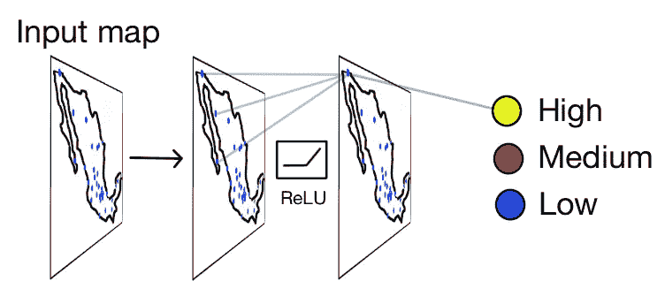
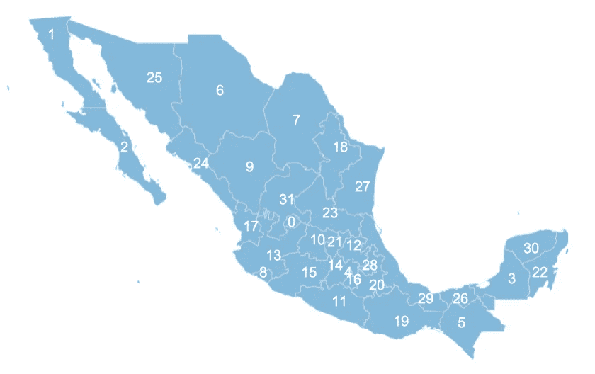
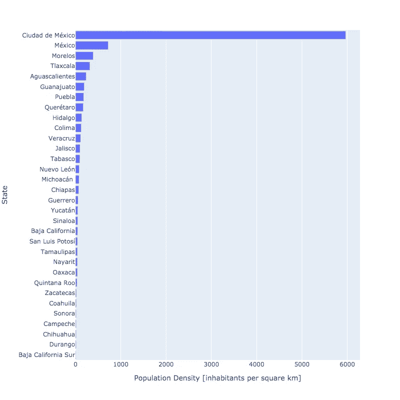

# 用于状态新冠肺炎关联分类的图卷积网

> 原文：<https://towardsdatascience.com/graph-convolutional-nets-for-classifying-covid-19-incidence-on-states-3a8c20ebac2b?source=collection_archive---------30----------------------->

## 如何将地图映射到图卷积网络。

墨西哥州图的简单图卷积神经网络示意图。

***编者注:*** [*走向数据科学*](http://towardsdatascience.com/) *是一份以研究数据科学和机器学习为主的中型刊物。我们不是健康专家或流行病学家，本文的观点不应被解释为专业建议。想了解更多关于疫情冠状病毒的信息，可以点击* [*这里*](https://www.who.int/emergencies/diseases/novel-coronavirus-2019/situation-reports) *。*

首先，我想说，在我看来，在线媒体提供了一个向世界展示科技界在我们当前所处的紧迫时代所做努力的机会，这一点非常重要。有必要以可以与由 SARS COV2 病毒引起的疫情的传播速度竞争的速度传播正在产生的信息，SARS cov 2 病毒引起了被称为新冠肺炎的疾病。病毒已经成为科学家的个人敌人，在许多情况下，它是一个未知的敌人，你必须发明一种方法来对抗它，因为我们真的不知道如何对抗(如果你不是流行病学家或相关人员)。当然，最好的工具是保持物理距离和卫生措施已经说了这么多，重复这么多。但是，作为科学家，我们有各种各样的工具可以用来抗击这种流行病，我们必须努力做出我们的贡献，不管这些贡献有多小。这就是我所相信的，也是为什么我提出这个小作品，更多的是邀请大家回顾所谓的图形卷积神经网络(GCNN 的)在新冠肺炎行为研究中的有用性。但我必须澄清，我提出的结果不应被视为预测，因为这是一个非常初步的计划，当然，除了这里使用的因素以外，还必须考虑其他因素。也就是说，让我们开始工作吧！！

1.  安装补充库。

进入 GCNN 世界的一个相对简单的方法是使用 DGL 图书馆，它除了有不同的实现之外，还有很好的文档(我鼓励你回顾一下关于“Zachary 的空手道俱乐部”[1]问题的教程，我在我们的例子中提到了它。)，所以我将在接下来的文章中构建这个库。我非常喜欢 Google Colaboratory 或“Colab ”,因为它允许快速测试 Python 中的原型项目，这是非常便携的，所以我提供的代码适用于 Colab 笔记本(参见本文末尾的笔记本链接)。

首先我们需要安装带有 pip 的 dgl，我们将使用 pandas 和 numpy，所以我们继续导入它们，

可选地，我们也可以安装 chart_studio 并调用 Plotly 来制作交互式图表，正如我在上一篇文章[2]中展示的那样。

2.**建立图表。**

图是由一组节点和定义连通性的边组成的。例如，如果它是一个分子，节点将是组成它的原子，而它们之间的键将是边[3]。但是，如果我们想把这个想法转移到地理地图上，我们必须决定什么是节点，什么是边。一种方法是将节点作为一个国家的州，但边可以是几个东西。这里，我决定将边定义为两个给定状态之间的公共边界。为了做到这一点，我已经采取了墨西哥共和国的 31 个州+墨西哥城的地图，我列出了他们之间的联系。下图显示了墨西哥的地图，并在此项工作中进行了编号:

带有用于图形定义的编号的墨西哥地图。

在这一点上，我希望有一个邻接矩阵与每个国家相关联，这将使我刚才描述的过程更容易。总之，我确定的连接最终形成了编码为源点(src)和目的点(dst)的邻接矩阵。通过提供源点和目的地点，确保信息是双向的，就可以将信息传递到 DGL。
这是通过以下函数实现的:

具有此定义的图 G 由 32 个节点和 264 条边组成，我们可以使用 networkx:

给出这个图表:

墨西哥各州之间的边界连通性图。

生成的图可以在视觉上识别出来，并且(用一点想象力)与墨西哥地图一起识别，注意节点 1 和 2 形成了下加利福尼亚半岛，而节点 30、22 和 3 形成了尤卡坦半岛。因此，目前看来一切进展顺利。

3.**特征化。**

要使用 GCNN，我们必须特征化节点。为此，我将使用一次性编码方案。

一个热点向量乘以[4]中的人口密度，下图显示了 2015 年每个州的人口密度。

为了形成半监督方法，我根据[5]中的官方信息为三个级别(低、中、高)中的每一个级别取两个节点(状态)。这些信息存储在两个张量中，*标签 _ 节点*用于标识状态，*标签*用于指示三个事件等级(根据今天的情况定义，2020 年 4 月 17 日)，等级低的状态为“0”，等级中等的为“1”，等级高的为“2”:

以下是州名、州号和相关级别之间的对应关系:

3 →坎佩切(0)

17 →纳亚里特(0)

13 →哈利斯科(1)

18 →新莱昂州(1)

4 →墨西哥城(2)

1 →加州 BAJA(2)

这些节点是 GCNN 了解的节点，并将尝试预测与其余未标记节点对应的级别。

4.**图卷积神经网络。**

根据 Kipf [6]，多层 GCNN 从图𝒢=(𝒱,ℰ中学习)取输入 1)输入 *N× D* 特征矩阵 *X，*其中 *N* 是节点的数量， *D* 是每个节点的特征数量；以及 2)类似邻接矩阵 ***A*** 的图结构的矩阵表示。对于给定的神经网络层，GCNN 的一般形式具有以下传播规则:

其中 *f* 是非线性函数， *H⁰=X，*经过若干层 *l=L* 后，我们得到一个输出 *Z* 的 *N×F* 维特征矩阵，其中 *F* 是每个节点的特征数。关于 GCNN 的更多细节可以在[3，6]中找到。在我们的例子中，只需要记住我们想要输入一个特征向量 *N = 32* 并获得三个类别:低、中、高，因此 *F=3* 。以下是 GCNN 结构的代码:

5.**训练。**

最后一段代码是训练循环，其中我们使用了在 Pytorch 中实现的 Adam optimizer，学习率为 0.01。用六个标记节点的输入标签训练 GCNN，并且在每次迭代中应用 log_softmax 和 loss 函数以及反向传播，就像在任何神经网络中一样:

6.**可视化。**

我们可以用最后一个时期的 *all_logits* 数组制作一个数据帧。然后对于每个节点，我们得到三个标签中最大值的索引。这将指示每个节点的预测。

我发现使用 https://flourish.studio/可以用一种非常简单的方式绘制地图，而且效果非常好，所以这次我选择了使用这个工具。蓝色表示低水平(0)，红色表示中等水平(1)，黄色表示高水平(2):

这不应被视为预测，它只是第一种方法。

**下一步是什么？**
1)为新冠肺炎的传播找出更有代表性的描述词。例如，使用每 100，000 名居民的发病率作为疾病传播效率的指标可能是有意义的，也可能是每个州的市内交通站的流动性。不要为州与州之间的边界定义图表，而是为连接城市的道路定义图表，并为人口流入赋予一定的权重。
3)回顾对已经超过最大传染点的其他国家的预测，如中国或意大利。

**结论:**以州与州之间的边界为纽带，假设节点之间有通信，这可能代表不同州之间的人流没有被取消的事实。很明显，通过停止人口迁移，这种联系就被打破了，这将不得不修改像这里展示的神经网络的预测。由于一个州对它的邻居征收很高的税率，结果可能是一个小的影响。

**鸣谢:**要感谢 PhD。来自奇瓦瓦自治大学的 Jaime Raúl Adame Gallegos，感谢他在撰写本文件过程中的善意评论和建议。

上面显示的代码可以在这个链接中使用 Google Colaboratory 打开:[https://github . com/napoles-uach/covid 19 MX/blob/master/dgl _ map . ipynb](https://github.com/napoles-uach/covid19mx/blob/master/dgl_map.ipynb)

参考资料:

1.  [https://docs.dgl.ai/en/0.4.x/tutorials/basics/1_first.html](https://docs.dgl.ai/en/0.4.x/tutorials/basics/1_first.html)
2.  [https://medium . com/@ jna poles/tracking-covid 19-with-pandas-and-plotly-open-source-graphing-library-maps-d 24 BAF 31 AAC 4](https://medium.com/@jnapoles/tracking-covid19-with-pandas-and-plotly-open-source-graphing-library-maps-d24baf31aac4)
3.  [https://towards data science . com/practical-graph-neural-networks-for-molecular-machine-learning-5e 6 dee 7 DC 003](/practical-graph-neural-networks-for-molecular-machine-learning-5e6dee7dc003)
4.  [https://www.inegi.org.mx/app/tabulados/interactivos/?px = Poblacion _ 07&BD = Poblacion](https://www.inegi.org.mx/app/tabulados/interactivos/?px=Poblacion_07&bd=Poblacion)
5.  https://covid19.sinave.gob.mx/
6.  【http://tkipf.github.io/graph-convolutional-networks/ 