# 基于节点分类任务的训练图卷积网络

> 原文：<https://towardsdatascience.com/graph-convolutional-networks-on-node-classification-2b6bbec1d042?source=collection_archive---------4----------------------->

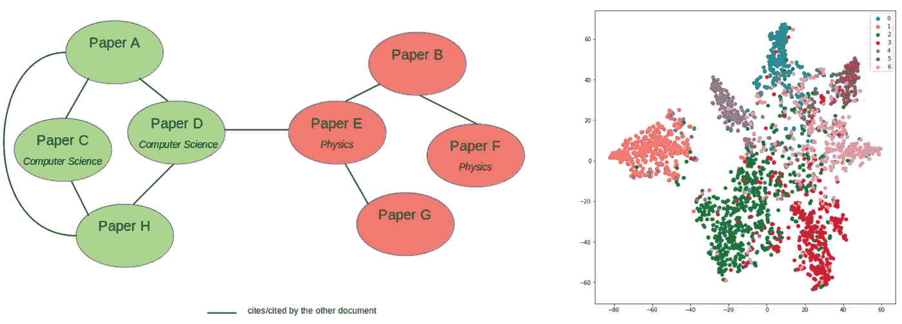

使用图卷积网络的引用网络节点分类图解(图片由作者提供)

*本文通过使用*[*spek tral*](https://graphneural.network/getting-started/)*API 实现图卷积网络(GCN)，这是一个基于 Tensorflow 2 的用于图深度学习的 Python 库。我们将使用 CORA 数据集执行半监督节点分类，类似于 GCN 原始论文中由* [*Thomas Kipf 和 Max Welling (2017)*](https://arxiv.org/pdf/1609.02907.pdf) *提出的工作。*

*如果你想对图卷积网络有基本的了解，建议先阅读本系列的* [*第一篇*](https://medium.com/analytics-vidhya/getting-the-intuition-of-graph-neural-networks-a30a2c34280d) *和* [*第二篇*](/understanding-graph-convolutional-networks-for-node-classification-a2bfdb7aba7b) *部分。*

# 数据集概述

CORA 引文网络数据集由 **2708 个节点组成，**其中每个节点代表一个文档或一篇技术论文。节点特征是指示文档中单词存在的单词包表示。词汇表——因此也是节点特性——包含了 1433 个单词。

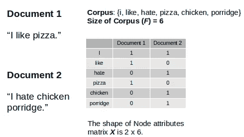

通过[来源](https://medium.com/analytics-vidhya/getting-the-intuition-of-graph-neural-networks-a30a2c34280d)将单词袋图解为节点特征

我们将数据集视为无向图**，其中边表示一个文档是否引用另一个文档，反之亦然。该数据集中没有边要素。这项任务的目标是将节点(或文档)分为 7 个不同的类别，这些类别与论文的研究领域相对应。这是一个[**单模**](https://graphneural.network/data/) 数据表示设置的单标签多类分类问题。**

**这种实现也是[直推式学习](/inductive-vs-transductive-learning-e608e786f7d)的一个例子，其中神经网络在训练期间看到所有数据，包括测试数据集。这与归纳学习形成对比，归纳学习是典型的监督学习，在训练过程中测试数据保持独立。**

# **文本分类问题**

**由于我们要根据文档的文本特征对文档进行分类，所以看待这个问题的一种常见的机器学习方法是将其视为有监督的文本分类问题。使用这种方法，机器学习模型将仅基于每个文档自身的特征来学习每个文档的隐藏表示。**

**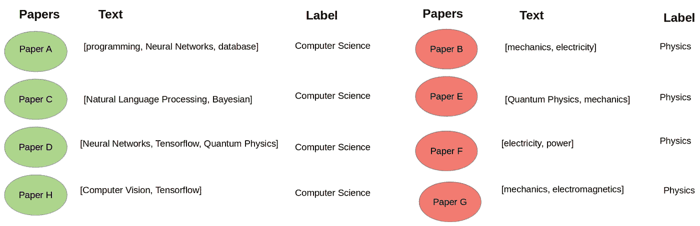**

**对文档分类问题的文本分类方法的说明(图片由作者提供)**

**如果每个类都有足够多的标记示例，这种方法可能会很有效。不幸的是，在现实世界中，标注数据可能非常昂贵。**

*****解决这个问题的另一种方法是什么？*****

**除了自己的文本内容，通常，一篇技术论文还会引用其他相关论文。直觉上，被引用的论文很可能属于相似的研究领域。**

**在这个引用网络数据集中，除了它自己的文本内容之外，我们想要利用来自每篇论文的引用信息。因此，数据集现在已经变成了一个论文网络。**

**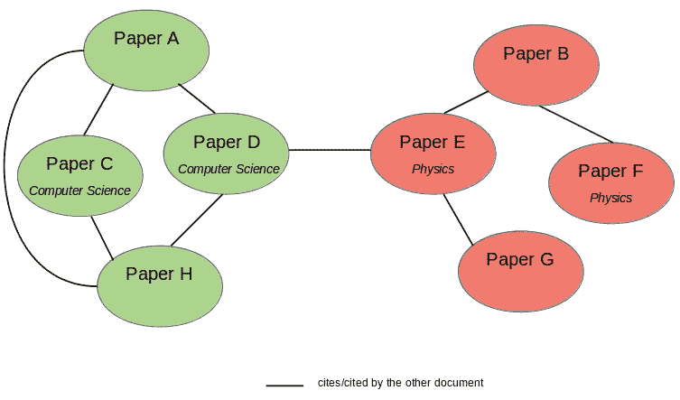**

**带有部分标注数据的引用网络数据集插图(图片由作者提供)**

**使用这种配置，我们可以利用图形神经网络，例如图形卷积网络(GCNs ),来建立一个模型，该模型除了学习文档自身的文本特征之外，还学习文档的互连。GCN 模型将不仅基于其自身的特征，而且基于其相邻节点的特征来学习节点(或文档)的隐藏表示。因此，我们可以减少必要的标记示例的数量，并利用[**【A】**](https://medium.com/analytics-vidhya/getting-the-intuition-of-graph-neural-networks-a30a2c34280d)**邻接矩阵或图中的节点连通性来实现半监督学习。****

****图形神经网络可能有用的另一种情况是当每个例子本身没有不同的特征，但是例子之间的关系可以丰富特征表示。****

# ****图形卷积网络的实现****

## ****加载和解析数据集****

****在这个实验中，我们将使用基于 Tensorflow 2 构建的 [Spektral](https://graphneural.network/getting-started/) API 来构建和训练一个 GCN 模型。虽然 Spektral 提供了内置函数来加载和预处理 CORA 数据集，但在本文中，我们将从[这里](https://linqs-data.soe.ucsc.edu/public/lbc/cora.tgz)下载原始数据集，以便更深入地了解数据预处理和配置。本文整个练习的完整代码可以在 [GitHub](https://github.com/imayachita/Graph_Convolutional_Networks_Node_Classification) 上找到。****

****我们在各自的数据目录中使用 **cora.content** 和 **cora.cites** 文件。加载文件后，我们将随机打乱数据。****

****在 **cora.content** 文件中，每一行都由几个元素组成:
第一个**元素表示文档(或节点)ID，
第二个**到最后一个**元素表示节点特征，
最后一个**元素表示该特定节点的标签。****

**在 **cora.cites** 文件中，每行包含一个文档元组(或节点)id。元组的**第一个元素**表示**被引用论文的 ID**，而**第二个元素**表示**包含引用的论文**。虽然这种配置代表一个有向图，但在这种方法中，我们将数据集视为一个**无向图**。**

**加载数据后，我们构建节点特征矩阵( **X** )和包含相邻节点元组的列表。这个边列表将被用来构建一个图，从这里我们可以获得邻接矩阵( **A** )。**

****输出:****

**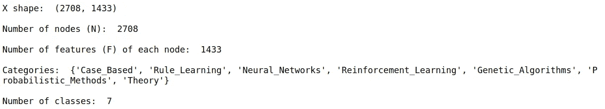**

## **设置训练、验证和测试掩码**

**我们将节点特征矩阵( **X** )和邻接矩阵( **A** )输入神经网络。我们还将为每个训练、验证和测试数据集设置长度为 **N** 的**布尔掩码**。当这些掩码的元素属于相应的训练、验证或测试数据集时，它们为*真*。例如，属于训练数据的训练掩码元素为*真*。**

**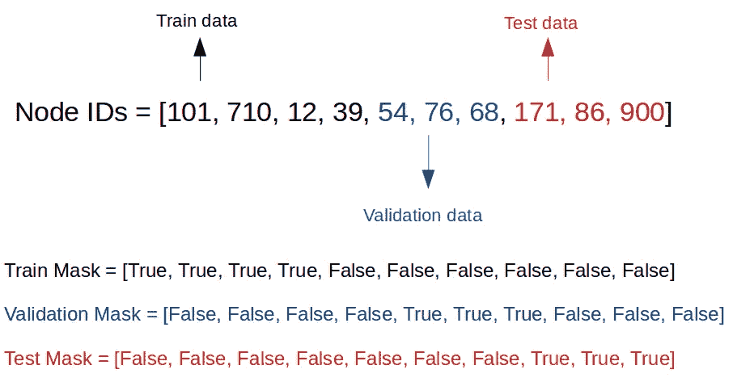**

**训练、验证和测试布尔掩码的示例**

**在论文中，他们为每个班级挑选了 20 个有标签的例子。因此，通过 7 个类，我们将总共有 140 个带标签的训练示例。我们还将使用 **500 个标记的验证示例**和 **1000 个标记的测试示例。****

## **获取邻接矩阵**

**下一步是获得图的邻接矩阵( **A** )。我们使用 [NetworkX](https://networkx.github.io/documentation/stable/index.html) 帮助我们做到这一点。我们将初始化一个图，然后将节点和边列表添加到图中。**

****输出:****

**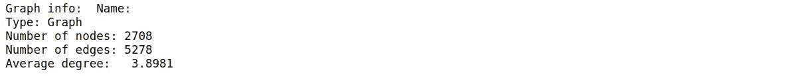**

## **将标签转换为一键编码**

**构建我们的 GCN 之前的最后一步是，就像任何其他机器学习模型一样，对标签进行编码，然后将其转换为一次性编码。**

***我们现在已经完成了数据预处理，准备好构建我们的 GCN 了！***

## **构建图形卷积网络**

**GCN 模型架构和超参数遵循 GCN 原始[论文](https://arxiv.org/abs/1609.02907)中的设计。GCN 模型将采用 2 个输入，节点特征矩阵( **X** )和邻接矩阵( **A** )。我们将实施**两层 GCN** **与** **辍学层和** **L2 正规化**。我们还将设置最大训练周期为 **200** 并实施**提前停止，耐心为 10** 。这意味着一旦确认损失连续 10 个时期没有减少，训练将停止。为了监控训练和验证的准确性和损失，我们还将在回调中调用 **TensorBoard** 。**

**在将邻接矩阵( **A** )输入到 GCN 之前，我们需要根据原文*执行*重正化技巧*来做额外的预处理。*你也可以在这里阅读*重正化技巧*如何影响 GCN 正向传播计算[。](/understanding-graph-convolutional-networks-for-node-classification-a2bfdb7aba7b)**

**下面训练 GCN 的代码最初是从 [Spektral GitHub 页面](https://github.com/danielegrattarola/spektral/blob/master/examples/node_prediction/citation_gcn.py)获得的。**

## **训练图卷积网络**

**我们正在实施直推式学习，这意味着我们将把整个图表用于训练和测试。我们使用之前构建的布尔掩码来分离训练、验证和测试数据。这些掩码将被传递给 **sample_weight** 参数。我们将 **batch_size** 设置为整个图形的大小，否则图形会被打乱。**

**为了更好地评估每个类的模型性能，我们使用 F1 分数而不是准确性和损失度量。**

****训练完成！****

**从分类报告中，我们获得了 74%的宏观平均 F1 值。**

**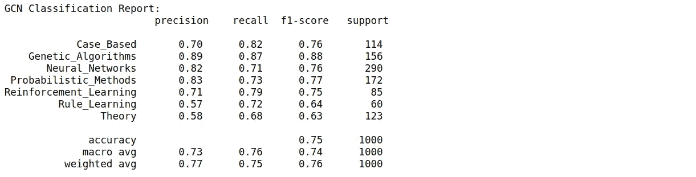**

## **使用 t-SNE 的隐藏层激活可视化**

**现在让我们使用 t-SNE 来可视化隐藏的图层表现。我们使用 t-SNE 将隐藏表示的维度降低到 2-D。图中的每个点代表每个节点(或文档)，而每个颜色代表每个类。**

****输出:****

**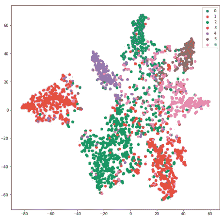**

**GCN 隐层的 T-SNE 表示。GCN 能够很好地学习由不同数据聚类显示的特征表示。**

## **与全连接神经网络的比较**

**作为基准，我还训练了一个 2 层完全连接的神经网络(FCNN ),并绘制了隐藏层表示的 t-SNE 可视化。结果如下所示:**

**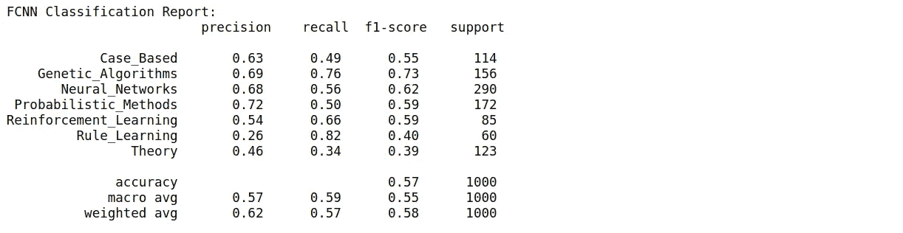**

**两层全连接神经网络的分类结果**

**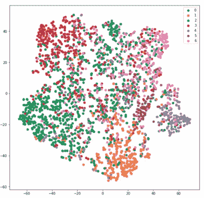**

**FCNN 隐层表示的 T-SNE 表示。FCNN 对文件的分类不如 GCN。**

**从上面的结果可以清楚地看出，GCN 明显优于 FCNN，宏观平均 F1 得分仅为 55%。FCNN 隐藏层表示的 t-SNE 可视化图是分散的，这意味着 FCNN 不能像 GCN 那样学习要素表示。**

# **结论**

**执行文档分类(例如 CORA 数据集)的传统机器学习方法是使用监督文本分类方法。图卷积网络(GCNs)是一种替代的半监督方法，通过将文档视为相关论文的网络来解决这个问题。每类仅使用 20 个标记的例子，GCNs 在这项任务上比全连接神经网络高出约 20%。**

***感谢阅读！我希望这篇文章能帮助你在自己的问题上实现图卷积网络(GCNs)。***

***有什么意见、反馈或想讨论的吗？请给我留言。你可以在*[*LinkedIn*](https://www.linkedin.com/in/inneke-mayachita-34023877/)*上联系到我。***

***你可以在* [*GitHub*](https://github.com/imayachita/Graph_Convolutional_Networks_Node_Classification) 上找到完整的代码。**

# **参考**

**[1] T. Kipf 和 M. Welling，[使用图卷积网络的半监督分类](https://arxiv.org/pdf/1609.02907.pdf) (2017)。arXiv 预印本 arXiv:1609.02907。ICLR 2017**

**[2][https://github . com/danielegrattarola/spek tral/blob/master/examples/node _ prediction/citation _ gcn . py](https://github.com/danielegrattarola/spektral/blob/master/examples/node_prediction/citation_gcn.py)**

**[https://linqs.soe.ucsc.edu/data](https://linqs.soe.ucsc.edu/data)**

**[4] [D. Grattarola](https://arxiv.org/search/cs?searchtype=author&query=Grattarola%2C+D) 和 [C. Alippi](https://arxiv.org/search/cs?searchtype=author&query=Alippi%2C+C) ，[tensor flow 和 Keras 中的图形神经网络与 Spektral](https://arxiv.org/abs/2006.12138) (2020)。arXiv:2006.12138。ICML 2020——GRL+研讨会**