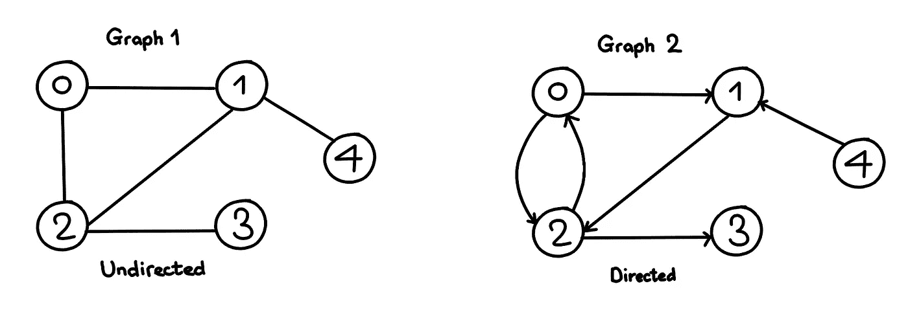
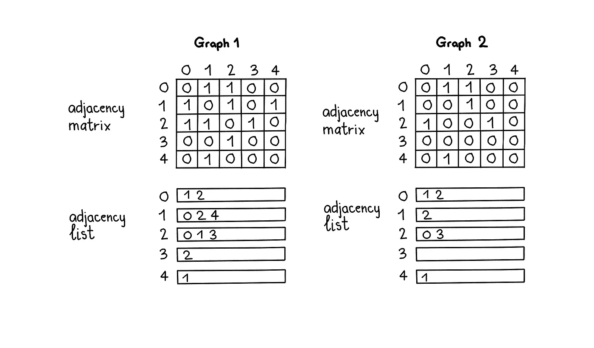
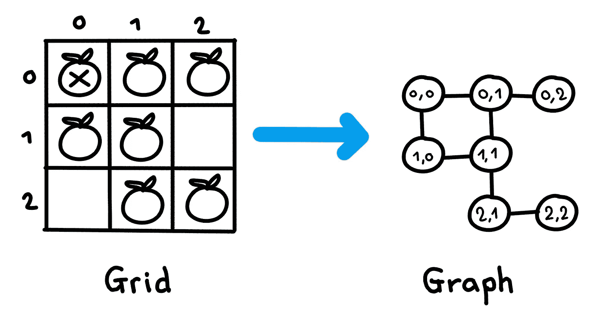
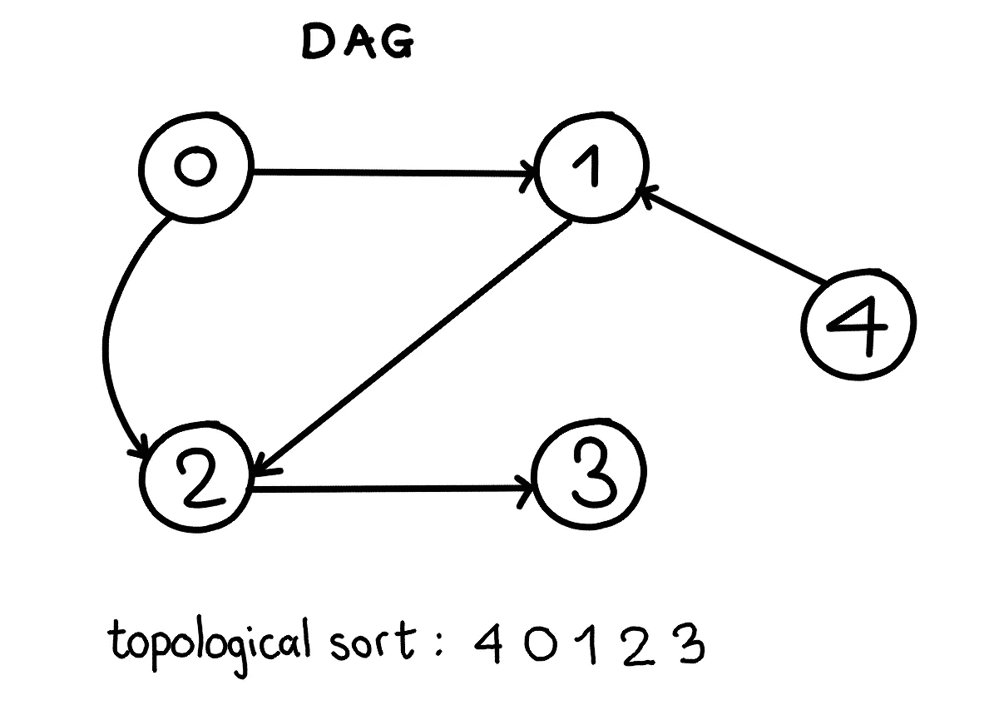
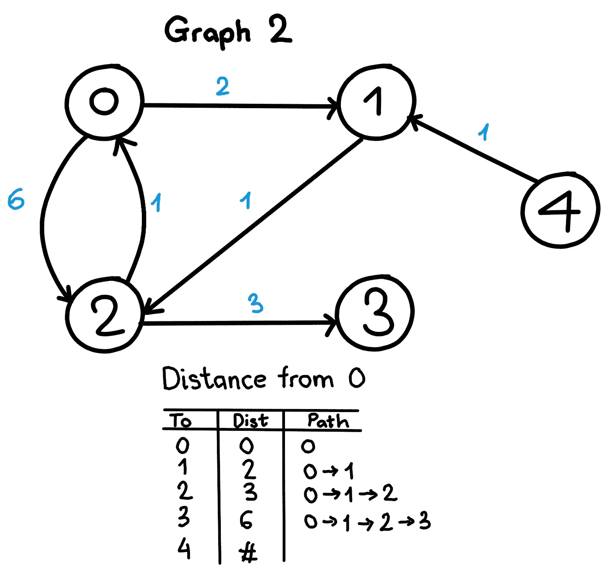

# 编码面试的图表数据结构备忘单。

> 原文：<https://towardsdatascience.com/graph-data-structure-cheat-sheet-for-coding-interviews-a38aadf8aa87?source=collection_archive---------3----------------------->

这篇博客是我的“[大型科技公司](https://medium.com/@nhudinhtuan/15-days-cheat-sheet-for-hacking-technical-interviews-at-big-tech-companies-d780717dcec1)黑客技术面试 15 天备忘单”的一部分。在这篇博客中，我不会详细介绍图形数据结构，但我会总结一些解决编码面试问题的必备图形算法。

# 图形数据结构

图是由顶点(V)和边(E)组成的非线性数据结构。



最常用的图的表示是邻接矩阵(大小为 V x V 的 2D 数组，其中 V 是图中顶点的数量)和邻接表(列表数组表示与每个顶点相邻的顶点的列表)。



在接下来的几节中，让我们来看看与图形数据结构相关的一些必须知道的算法。为简单起见，所有实现中都使用邻接表表示。

## 1.广度优先搜索(BFS)

```
Input (graph 1): graph = [[1,2], [0,2,4], [0,1,3], [2], [1]], s = 0
Output: **0 1 2 4 3**
```

图的广度优先搜索类似于[树的广度优先遍历](https://medium.com/@nhudinhtuan/binary-tree-traversals-cheat-sheet-for-coding-interviews-a71af9fe1dba)。但是，图可能包含圈，所以我们可能会一次又一次地访问同一个顶点。为了避免这种情况，我们可以使用布尔访问数组来标记访问过的顶点。

上面的代码只遍历从给定的源顶点可以到达的顶点。为了完成不连通图的 BFS 遍历，我们需要为每个顶点调用 BFS。

时间复杂度是 O(V+E ),其中 V 是图中顶点的数量，E 是图中边的数量。

## 2.深度优先搜索

```
Input (graph 1): graph = [[1,2], [0,2,4], [0,1,3], [2], [1]], s = 0
Output: **0 1 2 3 4 (or 0 2 3 1 4)**
```

类似于 BFS，我们也需要使用一个布尔数组来标记 DFS 的访问过的顶点。

递归实现:

使用堆栈的迭代实现。请注意，堆栈可能*包含同一个顶点两次，*，所以我们需要在打印前检查访问过的集合。

对于这两种实现方式，从给定的顶点可能无法到达所有的顶点(示例断开图)。为了完成 DFS 遍历，我们需要为每个顶点调用 DFS。

时间复杂度是 O(V+E ),其中 V 是图中顶点的数量，E 是图中边的数量。

## 3.检测有向图中的圈

```
Given a **directed** graph, return true if the given graph contains at least one cycle, else return false.Input (graph 2): graph = [[1,2], [2], [0,3], [], [1]]
Output: **True**
```

DFS 可用于检测图中的循环。只有当从一个顶点到它自己(自循环)或者到它在 DFS 栈树中的一个祖先有一个后沿时，图中才有一个循环。

时间复杂度和正常的 DFS 一样，都是 O(V+E)。

## 4.检测无向图中的圈

```
Given an **undirected** graph, return true if the given graph contains at least one cycle, else return false.Input (graph 1): graph = [[1,2], [0,2,4], [0,1,3], [2], [1]]
Output: **True**
```

对于无向图，我们不需要跟踪整个堆栈树(与有向图的情况相比)。对于每个顶点“v”，如果有一个相邻的“u”使得 u 已经被访问过，并且 u 不是 v 的父节点，那么图中有一个圈。

时间复杂度和正常的 DFS 一样，都是 O(V+E)。

## 5.多源 BFS

在某些问题中，您需要为多个顶点启动 BFS，并计算行进深度。我们来看一个典型问题。

```
Rotting Oranges: [https://leetcode.com/problems/rotting-oranges/](https://leetcode.com/problems/rotting-oranges/)
```



在这个问题中，我们使用 BFS 来模拟这个过程。网格被认为是一个图形(一个橙色的单元是一个顶点，有边到单元的邻居)。从“深度”为 0 的所有腐烂的橙子开始 BFS，然后旅行到其深度为 1 的邻居。最后，如果我们仍然有未访问的橙子，返回-1，因为这不可能腐烂所有的橙子。

时间复杂度为 O(V+E) = O(网格中的单元数)。

## 6.拓扑排序

拓扑排序是顶点的线性排序，使得对于每个有向边 uv，顶点 u 在排序中位于 v 之前。拓扑排序只可能用于[有向无环图(DAG)](https://en.wikipedia.org/wiki/Directed_acyclic_graph) 。



```
Given a **DAG**, return the topological sortingInput: graph = [[1,2], [2], [3], [], [1]]
Output: **4 0 1 2 3**
```

在普通的 DFS 中，我们在递归函数的开始打印顶点。为了找到拓扑排序，我们修改 DFS，使其首先递归调用所有相邻顶点，然后将其值推入堆栈。最后，我们打印出堆栈。

时间复杂度和正常的 DFS 一样，都是 O(V+E)。

## 7.未加权图中的最短路径

```
Given a unweighted graph, a source and a destination, we need to find shortest path from source to destination.Input (graph 1): graph = [[1,2], [0,2,4], [0,1,3], [2], [1]], s=4, d=0
Output: **4 1 0**Input (graph 2): graph = [[1,2], [2], [0, 3], [], [1]], s=1, d=0
Output: **1 2 0**
```

对于这个问题，我们使用 BFS，并在进行广度优先搜索时保存给定顶点的前任。最后，我们使用 predecessor 数组打印路径。

时间复杂度和普通 BFS 一样，都是 O(V+E)。

## 7.加权图中的最短路径

```
Given a graph and a source vertex in graph, find shortest distances from source to all vertices in the given graph.Input: graph = [[[1, 2], [2, 6]], [[2, 1]], [[0, 1], [3, 3]], [], [[1, 1]]], s=0
Output: **[0, 2, 3, 6, inf]**
```



在这个问题中，我们处理加权图(一个实数与图的每条边相关联)。该图被表示为一个邻接表，其项目是一对目标顶点&权重。Dijkstra 算法用于查找从一个起始顶点到其他顶点的最短路径。该算法适用于有向或无向图，只要它的*在一条边上没有负权重。*

你可以在[这里](https://en.wikipedia.org/wiki/Dijkstra%27s_algorithm)阅读更多关于 Dijkstra 算法的内容。下面是我使用优先级队列的实现。

上面的实现只返回距离。您可以添加一个前置数组(类似于未加权图中的最短路径)来打印出路径。时间复杂度是 O(V + VlogE)，其中 V 是图中顶点的数量，E 是图中边的数量。

# 推荐问题

您可以通过以下问题练习图形数据结构:

1.  [图是二分的吗？](https://leetcode.com/problems/is-graph-bipartite/)
2.  [克隆图形](https://leetcode.com/problems/clone-graph/)
3.  [课程表](https://leetcode.com/problems/course-schedule/)
4.  [课程表二](https://leetcode.com/problems/course-schedule-ii/)
5.  [岛屿数量](https://leetcode.com/problems/number-of-islands/)
6.  [无向图中连通分量的数量](https://leetcode.com/problems/number-of-connected-components-in-an-undirected-graph/)
7.  [图形有效树](https://leetcode.com/problems/graph-valid-tree/)
8.  [重建旅程](https://leetcode.com/problems/reconstruct-itinerary/)
9.  [K 站内最便宜的航班](https://leetcode.com/problems/cheapest-flights-within-k-stops/)(提示:Dijkstra 算法)
10.  [外星人字典](https://leetcode.com/problems/alien-dictionary/solution/)(提示:拓扑排序)