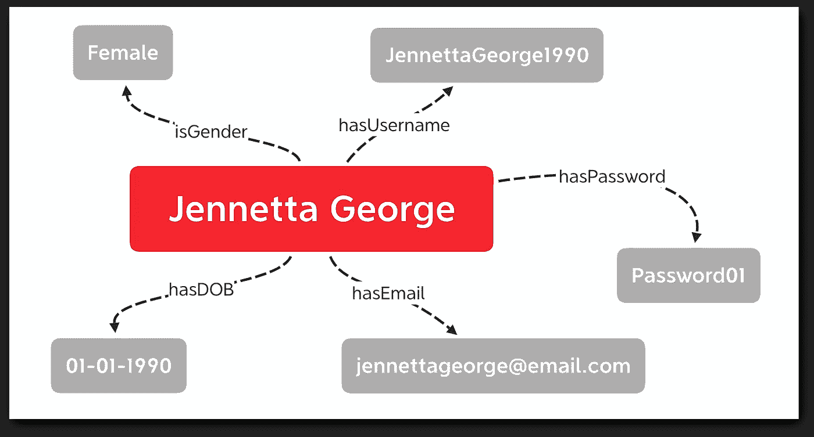
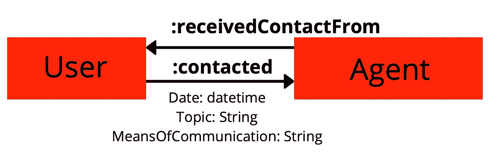
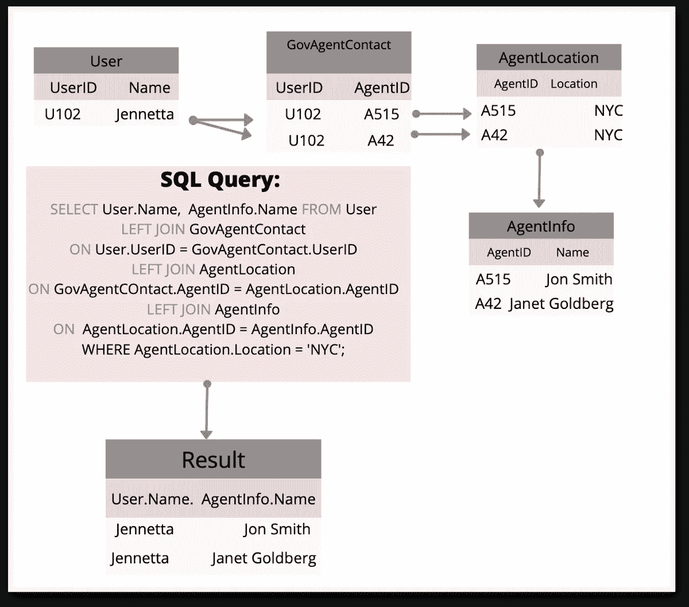
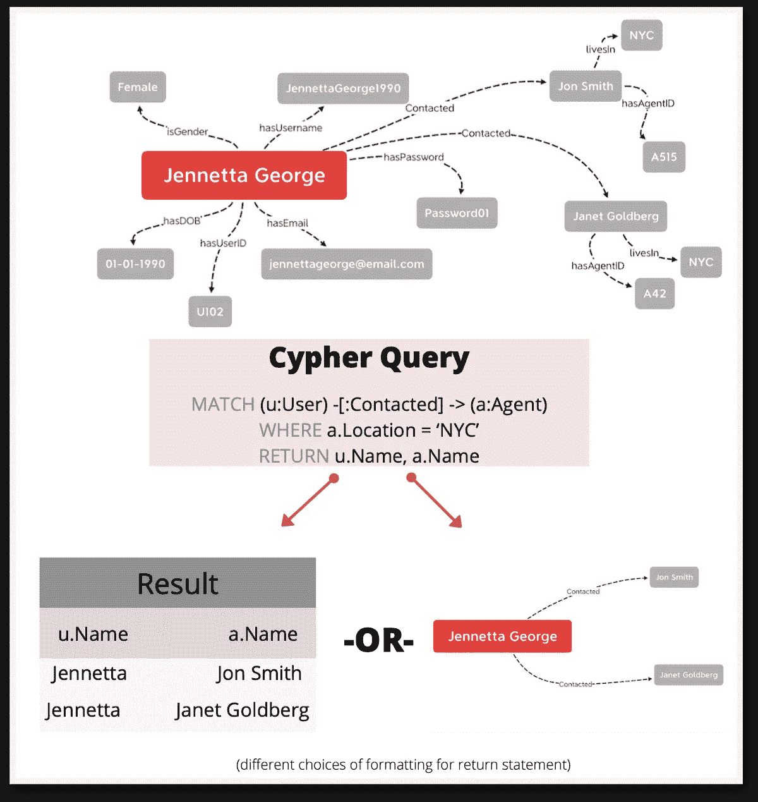
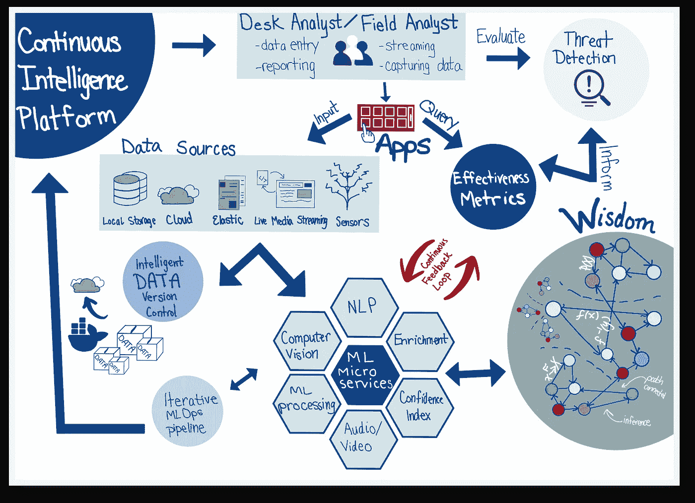

# 公共部门的图形数据库

> 原文：<https://towardsdatascience.com/graph-databases-for-the-public-sector-1a50d0563fff?source=collection_archive---------47----------------------->

## 利用图表技术进行公共部门数据管理和数据分析的使用案例和示例。

图形数据库是你的技术堆栈中(不那么)新的必备工具。在过去的几十年里，越来越多的科技巨头([脸书](https://medium.com/coinmonks/tao-facebooks-distributed-database-for-social-graph-c2b45f5346ea)，Twitter 和[谷歌](https://searchengineland.com/google-launches-knowledge-graph-121585)引领潮流)已经开始将数据迁移到图形数据库中，不仅以高度可扩展的方式存储和检索数据，还将模型整合到图形结构中，以产生高效的推荐。

是什么让图形数据库对这些拥有庞大数据的公司如此有吸引力？公共部门能以类似的方式从这项技术中受益吗？

# **知识图和 RDBMS 的区别是什么？**

## **RDBMS 基础知识**

关系数据库管理系统(RDBMS)是指以具有行和列的结构化格式存储数据的数据库，并且具有展示数据库内不同表之间的链接的模式。RDBMS 通常用 SQL(结构化查询语言)或类似的语言进行查询，对于相当静态(不变)和规范化的数据结构非常有用。

为了给出 RDBMS 的一个基本用例，让我们假设我们正在创办一家名为 **GovBook** 的公司，它相当于政府的脸书，允许用户注册一个帐户，提交政府文件，并在社交场合与政府官员互动。每个人都有数千个数据属性被捕获，每个属性都必须放入数据库中的特定表中。我们可以构建我们的数据库模式，使之具有一个**用户** **注册**表，其中包含注册期间给出的用户的所有信息，以及一个**文档**表，其中包含用户上传到系统的每个文档的 pdf 链接。将会有某种唯一的标识符，称为**主键**来区分**用户注册**表中的用户，这个键也将作为**外键**来将两个表相互链接。

这似乎是处理数据管理的一种非常好的逻辑方式，但是当然这种类型的结构化系统有优点也有缺点。在这个例子中，最大的缺点是所有输入的数据都能够适合预先指定的表列。但是，如果在业务开展一年后，GovBook 决定在注册期间获取额外的数据，该怎么办呢？开始时，他们获取姓名、用户名、密码、电子邮件和性别，但现在他们想添加一个出生日期字段。

## **NoSQL 图形数据库**

这个问题引出了 NoSQL(不仅仅是 SQL)数据库的概念，它允许这样的数据存储:

*   非结构化
*   高度可扩展
*   无模式

在过去的十年中，一种特殊类型的 NoSQL 数据库，即**图形数据库**，变得非常受欢迎。图形数据库使用主谓宾**三元组，而不是将数据解释为行和列。**因此，在上面的例子中，不是将一行数据**詹妮塔·乔治，詹妮塔·乔治 1990，密码 01，jennettageorge1990@email.com，女**插入注册表，而是将以下三元组添加到图中:

*   珍妮塔·乔治->哈斯用户名→珍妮塔·乔治 1990
*   jennetta George-> has password-> password 01
*   詹妮塔·乔治->哈斯梅尔->[jennettageorge1990@email.com](mailto:jennettageorge1990@email.com)
*   珍妮塔·乔治->哈斯性别->女性

三元组的主语和宾语是图的**节点**，谓语是**边**。

不要让 RDBMS 中的术语**关系**欺骗了你——在图数据库中，边(或节点之间的关系)被视为一等公民，这就是图数据库真正的魔力所在。边充当图中所有数据之间的连接，并且本身充当丰富的数据源。根据您选择的图表数据库，您可以选择标注、给出方向以及向边添加其他信息属性。例如，如果我们考虑三重 ***用户—:联系人—>代理人*** ，我们可以在关系 ***联系人*** *中构建许多属性和标签。*我们可以订阅一个逆关系， ***从*** 接收联系人，还可以分配标签，比如日期、主题、交流方式等。如果您停下来考虑如何在关系数据库中实现这一点，您会发现创建这种结构会变得多么困难。

标记边的示例

# **使用图形数据库的好处**

让我们深入了解这种不同的数据管理方式如何影响数据的生命周期。

查询速度更快

就像关系数据库依赖 SQL 语言来检索数据一样，图数据库也有自己专门的查询语言。 [Neo4J](https://neo4j.com) ，领先的图形数据库工具之一，使用一种叫做 Cypher 的语言。

使用图形数据库查询数据的一个好处可以在下面的例子中很容易地看到。考虑这样一个分析师，他想找到与居住在纽约市的政府代理有联系的所有用户。在关系数据库中，这个简单的查询可能会变得非常复杂，无论是在时间上还是在查询复杂度上。该查询将包括跨多个连接执行多个 select 语句，这取决于与该搜索相关的数据存储在多少个表中。

另一方面，在图形数据库中，这将涉及搜索居住在纽约地区的分析师，然后沿着用户和政府代理之间的路径反向遍历图形，以收集用户的信息。两次搜索的时间复杂度相差很大，当您处理数 Pb 的数据时，这一点不可轻视。

## **其他图形数据库优势:**

让我们考虑一下使用图形数据库比关系数据库更大的优势:

*   **同时更新和查询数据—** 图形数据库提供了实时更新数据的独特能力，同时允许同时对数据进行查询(即使是 Hadoop HDFS 等大数据流领域的大公司也很难提供这样的服务)。
*   **动态模式—** 与关系数据库不同，关系数据库要求数据符合在表开始时分配的一组模式，图形数据库允许您在数据生命周期的任何时间点添加或删除节点和边。
*   **整合 AI / ML 模型** —图形数据库从数据中提供丰富且可访问的信息，这些信息为 AI 模型增加了深度和意义，而这些从关系数据库中根本无法获得。⁴

## 图形数据库的缺点

当然，没有一种技术是没有缺陷的，所以让我们来探讨一下使用图形数据库的一些潜在缺点。

*   **教育的好时机—** 尽管图形数据库自 21 世纪初以来越来越受欢迎，但仍然只有一小部分技术人员能够熟练使用这一工具，更不用说是这方面的专家了。当一个公司决定迁移到图形数据库时，他们也决定在培训成本上投入大量的资源。
*   **数据的丰富程度取决于您自己—** 简单地将 RDBMS 数据迁移到图形数据库不会神奇地使其成为更丰富的数据集。数据工程师需要构建一个新的模式，通常是从头开始，并对数据进行逆向处理以适应这种新模式。这同样需要大量的时间和资源。我曾在几家公司工作过，我所在的团队致力于将数据从关系数据库迁移到图形数据库，每家公司都分配了至少 1 年的时间来完成这个项目。

# **对公共部门数据的影响**

公共部门与私营部门的数据管理和分析有许多重叠的需求，两者都旨在降低成本，同时提高运营效率，并从其数据讲述的故事中增加业务价值。虽然政府没有将利润商业化的迫切要求，但他们面临着使其数据和信息流程私有、透明和可信的巨大要求。政府组织使用数据分析来实现两个崇高的目标，一是保护和维护政府对公民安全和福祉的监管，二是为政府雇员和公民提供提高生活质量和优化流程的服务。由于有大量的数据需要筛选，这两个问题的答案都存在于数据中的某个地方，在数据中找到现有的关系将加快这些结果的产生。

图形数据库的另一个巨大优势是**删除冗余数据，仅这一项就可以在存储和数据标准化方面为组织节省无数的时间和金钱。图数据库不需要将 PK/FK 列存储在整个数据库的多个不同的表中，而是通过利用[无索引邻接](https://medium.com/@dmccreary/how-to-explain-index-free-adjacency-to-your-manager-1a8e68ec664a)来消除这种需要，这听起来就像是这样:图不依靠索引键来链接数据片段，而是依靠边来建立连接。这使得数据管理员可以创建非常直观、视觉上非常简单的复杂图形模式。**

# **政府用例**

Neo4J 汇编了一个来自不同组织的用例列表，这些用例说明了如何使用他们的技术来增强科学家的工作流程。以下是一些特定于公共部门的组织:

## **美国陆军——供应链、物料清单和维护成本管理**

美国陆军是我们武装力量中最大的分支，拥有超过 100 万名士兵和 20 万名文职人员，每个人都依赖于需要持续维护和更换的各种设备。传统上，陆军使用基于主机的系统来监控所有供应链管理，但很容易理解为什么这个过时的系统不太适合这个动态、庞大的数据集。

转换到图形数据库允许军队实现模型和查询:

*   根据环境因素预测更换、维护和平均无故障时间
*   执行多维成本比较和趋势分析
*   对陆军的后勤和预算需求过程进行分析
*   对围绕新战区部队部署的重要问题进行探索性数据分析

## **MITRE —打击和追踪网络安全威胁**

Mitre 是一家由联邦政府资助的非营利性公司，利用图形技术来打击美国的网络攻击。有了如此多的可用数据，找到这些数据之间的联系最终会导致发现和阻止网络攻击所需的模式识别。MITRE 已经通过创建一个名为 CyGraph 的工具做到了这一点，该工具将绝望的数据融合到一个统一的画面中，暴露出漏洞和威胁。⁵

## **我如何利用图形技术达到**

我的团队在 Attain 设计的持续智能平台

作为一家政府咨询公司的首席数据科学家，我一直在寻找改进数据管理的方法，以便在预测分析方面获得长期收益。我们与公司的其他技术领导者一起，致力于开发一个持续的智能平台，该平台整合了图形数据库，将主题专业知识和数据洞察融合为智慧。它最初的想法是帮助现场和桌面分析师自动化他们的数据分析，并建立复杂的模式识别和数据检索系统，以帮助打击对美国的威胁。通过利用尖端的 CICD 和 ML 微服务与我们的图形数据库，我们可以为政府节省无数的工时和美元，同时提供超出分析师自身能力的服务。

**参考文献**

*   (1):[https://en.wikipedia.org/wiki/Graph_database](https://en.wikipedia.org/wiki/Graph_database)
*   (2):[https://neo4j.com/developer/graph-db-vs-rdbms/](https://neo4j.com/developer/graph-db-vs-rdbms/)
*   (3):[https://riskspan.com/graphs-for-data-management/](https://riskspan.com/graphs-for-data-management/)
*   (4):[https://dzone . com/articles/what-is-the-pros-and-consensus-of-using-a-graph-databa](https://dzone.com/articles/what-are-the-pros-and-cons-of-using-a-graph-databa)
*   (5):[https://go . Neo4j . com/RS/710-RRC-335/images/Neo4j-Graphs-in-Government-white-paper . pdf？_ ga = 2.127300685.1592494695.1601320343-88543142.1601320343&_ GAC = 1.246995190.1601390652 . CJ 0 kcqwtsv 7 brcmarisanu-CQC l5 io-mjrlhmzeb 8 chmajiseekhbd 8 fjxdnkp-A](https://go.neo4j.com/rs/710-RRC-335/images/Neo4j-Graphs-in-Government-white-paper.pdf?_ga=2.127300685.1592494695.1601320343-88543142.1601320343&_gac=1.246995190.1601390652.Cj0KCQjwtsv7BRCmARIsANu-CQcl5io-mjrlHmZEb8mCHMajIsEeKhbD8fjXDNKP-A_iCB8vQe32q1waAkTVEALw_wcB)