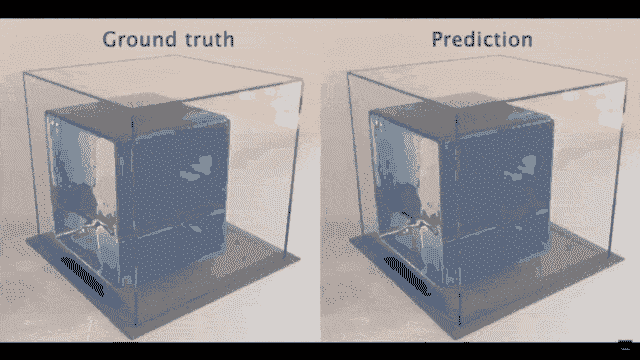
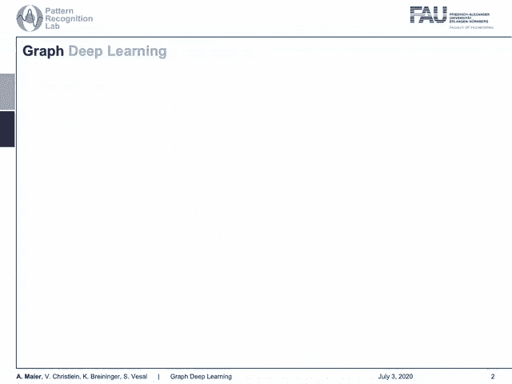
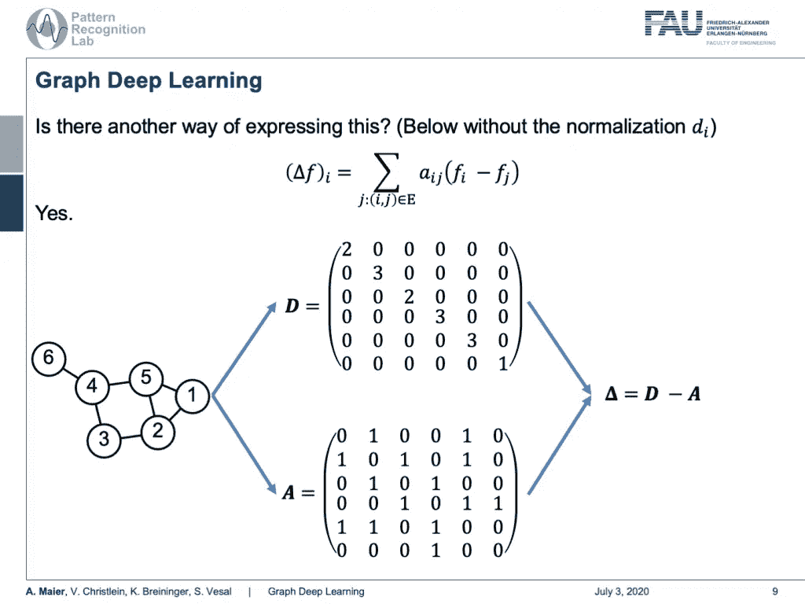

# 图形深度学习—第 1 部分

> 原文：<https://towardsdatascience.com/graph-deep-learning-part-1-e9652e5c4681?source=collection_archive---------49----------------------->

## [FAU 讲座笔记](https://towardsdatascience.com/tagged/fau-lecture-notes)关于深度学习

## 光谱卷积

FAU 大学的深度学习。下图 [CC BY 4.0](https://creativecommons.org/licenses/by/4.0/) 来自[深度学习讲座](https://www.youtube.com/watch?v=p-_Stl0t3kU&list=PLpOGQvPCDQzvgpD3S0vTy7bJe2pf_yJFj&index=1)

**这些是 FAU 的 YouTube 讲座** [**深度学习**](https://www.youtube.com/watch?v=p-_Stl0t3kU&list=PLpOGQvPCDQzvgpD3S0vTy7bJe2pf_yJFj&index=1) **的讲义。这是与幻灯片匹配的讲座视频&的完整抄本。我们希望，你喜欢这个视频一样多。当然，这份抄本是用深度学习技术在很大程度上自动创建的，只进行了少量的手动修改。** [**自己试试吧！如果您发现错误，请告诉我们！**](http://autoblog.tf.fau.de/)

# 航行

[**上一讲**](/weakly-and-self-supervised-learning-part-4-2fbfd10280b3) **/** [**观看本视频**](https://youtu.be/wcRFkJ5okt4) **/** [**顶级**](/all-you-want-to-know-about-deep-learning-8d68dcffc258) **/** [**下一讲**](/graph-deep-learning-part-2-c6110d49e63c)

图形深度学习正在成为学习模拟中的一项关键技术。使用 [gifify](https://github.com/vvo/gifify) 创建的图像。来源: [YouTube](https://youtu.be/2Bw5f4vYL98) 。

欢迎回到深度学习！所以今天，我们想研究一下如何处理图形，我们将讨论一下图形卷积。让我们看看我为你准备了什么。今天的主题是图形深度学习的介绍。

我们在说什么格拉夫？ [CC 下的图片来自](https://creativecommons.org/licenses/by/4.0/)[深度学习讲座](https://www.youtube.com/watch?v=p-_Stl0t3kU&list=PLpOGQvPCDQzvgpD3S0vTy7bJe2pf_yJFj&index=1)的 4.0 。

那么，什么是图形深度学习呢？你可以说这是一个图表，对吗？我们从数学中知道，我们可以绘制图表。但这不是我们今天要讨论的话题。你也可以说图表就像这样的图。但这些也不是我们今天要讲的情节。那是施特菲·格拉芙吗？不，我们也不是在谈论施特菲·格拉芙。所以我们实际上想看的是更多像这样的东西，比如可以用不同的节点和边连接起来的图。

图的定义。来自[深度学习讲座](https://www.youtube.com/watch?v=p-_Stl0t3kU&list=PLpOGQvPCDQzvgpD3S0vTy7bJe2pf_yJFj&index=1)的 [CC BY 4.0](https://creativecommons.org/licenses/by/4.0/) 下的图片。

一个计算机科学家认为一个图是一组节点，它们通过边连接在一起。这就是我们今天要讨论的图表。对数学家来说，图是流形，但却是离散的。

欧几里得空间上的卷积。 [CC 下的图片来自](https://creativecommons.org/licenses/by/4.0/)[深度学习讲座](https://www.youtube.com/watch?v=p-_Stl0t3kU&list=PLpOGQvPCDQzvgpD3S0vTy7bJe2pf_yJFj&index=1)的 4.0 。

现在，你如何定义卷积？在欧几里得空间，对计算机科学家和数学家来说，这太容易了。这是离散卷积，本质上是一个和。我们记得，当我们为卷积深度模型设置内核时，我们有许多这样的离散卷积。在连续形式中，它实际上有如下形式:它本质上是一个在整个空间上计算的积分，我在这里举了一个例子。因此，如果你想卷积两条高斯曲线，那么你实际上是把它们移动到彼此之上，在每一点上相乘，然后求和。当然，两个高斯函数的卷积也是高斯函数，所以这也很容易。

图形卷积怎么样？来自[深度学习讲座](https://www.youtube.com/watch?v=p-_Stl0t3kU&list=PLpOGQvPCDQzvgpD3S0vTy7bJe2pf_yJFj&index=1)的 4.0CC 下的图片。

你如何定义图上的卷积？现在，计算机科学家非常努力地思考，但是…管它呢！数学家知道，我们可以用拉普拉斯变换来描述卷积，因此我们研究拉普拉斯算子，这里给出的是梯度的散度。所以在数学上，我们可以更轻松地处理这些事情。

走向图形卷积的步骤。 [CC 下的图片来自](https://creativecommons.org/licenses/by/4.0/)[深度学习讲座](https://www.youtube.com/watch?v=p-_Stl0t3kU&list=PLpOGQvPCDQzvgpD3S0vTy7bJe2pf_yJFj&index=1)的 4.0 。

这就把我们带到了这个多方面的观点。我们知道如何卷积流形，我们可以离散卷积，这意味着我们知道如何卷积图形。

图形卷积的一个例子是热扩散。来自[深度学习讲座](https://www.youtube.com/watch?v=p-_Stl0t3kU&list=PLpOGQvPCDQzvgpD3S0vTy7bJe2pf_yJFj&index=1)的 [CC BY 4.0](https://creativecommons.org/licenses/by/4.0/) 下的图片。

所以，还是散点热吧！我们知道，我们可以将牛顿冷却定律描述为以下方程。我们还知道，随时间的发展可以用拉普拉斯来描述。所以，f(x，t)是时间 t 点 x 的热量，然后，你需要有一个初始的热量分布。所以，你需要知道热在初始状态下是怎样的。然后，您可以使用拉普拉斯算子来表示系统如何随时间变化。这里可以看到，这本质上是 f(x)和 f 在 x 周围的无限小数小球上的平均值之差。

怎样才能得到一个离散的拉普拉斯？ [CC 下的图片来自](https://creativecommons.org/licenses/by/4.0/)[深度学习讲座](https://www.youtube.com/watch?v=p-_Stl0t3kU&list=PLpOGQvPCDQzvgpD3S0vTy7bJe2pf_yJFj&index=1)的 4.0 。

现在，我们如何以离散形式表达拉普拉斯算子？这就是 f(x)和 f 在 x 周围无穷小的球上的平均值的差，所以，我们能做的最小的一步就是把当前节点和它的邻居连接起来。因此，我们可以将拉普拉斯表示为边权重 a 下标 I 和 j 的加权和，这是我们的中心节点 f 下标 I 减去 f 下标 j 的差，我们用实际传入 f 下标 I 的连接数来除，这将作为 d 下标 I 给出。

计算图的拉普拉斯算子的简单步骤。 [CC 下的图片来自](https://creativecommons.org/licenses/by/4.0/)[深度学习讲座](https://www.youtube.com/watch?v=p-_Stl0t3kU&list=PLpOGQvPCDQzvgpD3S0vTy7bJe2pf_yJFj&index=1)的 4.0 。

现在有没有另一种表达方式？嗯，是的。我们可以这样做，如果我们在这里看一个例子图。因此，我们有节点 1、2、3、4、5 和 6。我们现在可以使用矩阵 **D** 计算拉普拉斯矩阵。 **D** 现在仅仅是各个节点的输入连接数。我们可以看到，节点 1 有两个传入连接，节点 2 有三个，节点 3 有两个，节点 4 有三个，节点 5 也有三个，节点 6 只有一个传入连接。我们还需要矩阵 **A** 。那是邻接矩阵。这里，每个节点都有一个 1，它与不同的节点相连，你可以看到它可以用上面的矩阵来表示。我们可以取这两个并计算拉普拉斯算子为 **D** 减去 **A** 。我们简单地按元素减去这两个来得到我们的拉普拉斯矩阵。这很好。

即使对于有向图，也可以得到对称的拉普拉斯算子。来自[深度学习讲座](https://www.youtube.com/watch?v=p-_Stl0t3kU&list=PLpOGQvPCDQzvgpD3S0vTy7bJe2pf_yJFj&index=1)的 4.0CC 下的图片。

我们可以看到拉普拉斯是一个 N 乘 N 的矩阵，它描述了一个由 N 个节点组成的图或子图。 **D** 也是一个 N 乘 N 矩阵，它被称为度矩阵，描述了连接到每个节点的边的数量。 **A** 也是一个 N 乘 N 矩阵，它是描述图的连通性的邻接矩阵。所以对于一个有向图，我们的图拉普拉斯矩阵不是对称正定的。所以，为了得到对称的版本，我们需要把它标准化。这可以通过以下方式来实现:我们从原始的拉普拉斯矩阵开始。我们知道 **D** 只是一个对角矩阵。因此，我们可以计算平方根倒数，并从左侧和右侧将其相乘。然后，我们可以插入原来的定义，你会发现我们可以稍微重新排列一下。然后我们可以把对称化的版本写成单位矩阵减去 **D** 。这里，我们再一次在元素上应用相同矩阵的逆矩阵和平方根乘以**和**。这很有趣，对吧？即使对于有向图，我们也总能得到这个矩阵的对称化版本。

拉普拉斯算子的特征向量和特征值决定了它的傅立叶变换。 [CC 下的图片来自](https://creativecommons.org/licenses/by/4.0/)[深度学习讲座](https://www.youtube.com/watch?v=p-_Stl0t3kU&list=PLpOGQvPCDQzvgpD3S0vTy7bJe2pf_yJFj&index=1)的 4.0 。

现在，我们感兴趣的是如何实际使用它。我们可以做一些魔术，现在的魔术是，如果我们的矩阵是对称正定的，那么矩阵可以分解为特征向量和特征值。这里我们看到所有的特征向量都集合在 **U** 中，特征值在这个对角矩阵**λ**上。现在，这些特征向量被称为图形傅立叶模式。特征值被称为频谱频率。这意味着我们可以使用 **U** 和 **U** 转置来对图形进行傅里叶变换，我们的**λ**是光谱滤波器系数。因此，我们可以将一个图形转换成一个光谱表示，并观察它的光谱特性。

我们去傅立叶空间。 [CC 下的图片来自](https://creativecommons.org/licenses/by/4.0/)[深度学习讲座](https://www.youtube.com/watch?v=p-_Stl0t3kU&list=PLpOGQvPCDQzvgpD3S0vTy7bJe2pf_yJFj&index=1)的 4.0 。

让我们继续我们的矩阵。现在，让 **x** 是某个信号，每个节点的标量。然后，我们可以使用拉普拉斯的特征向量来定义其傅立叶变换。这便是简单的 **x** hat 和 **x** hat 可以表示为 **U** 转置次数 **x** 。当然，你也可以把这个倒过来。这可以简单地通过应用 **U** 来完成。因此，我们也可以为描述节点属性的任何系数集找到各自的谱表示。现在，我们也可以在谱域中用滤波器来描述卷积。因此，我们使用傅里叶表示来表示卷积，因此我们将 g 和 **x** 带入傅里叶域，将两者相乘并计算傅里叶逆变换。从信号处理中我们知道，我们也可以在传统信号中做到这一点。

我们可以使用多项式进行过滤。来自[深度学习讲座](https://www.youtube.com/watch?v=p-_Stl0t3kU&list=PLpOGQvPCDQzvgpD3S0vTy7bJe2pf_yJFj&index=1)的 4.0CC 下的图片。

现在，让我们构建一个过滤器。该滤波器由系数为 **θ** 下标 I 的拉普拉斯 k 阶多项式组成，它们只是实数。所以，我们现在可以找到这种多项式，它是关于谱系数的多项式，并且在系数 **θ** 中是线性的。这本质上只是多项式的和。现在，我们可以利用这个滤波器来执行卷积。我们必须像以前一样繁殖。我们有了信号，应用傅里叶变换，然后用多项式进行卷积，最后进行傅里叶逆变换。这就是我们将该滤波器应用于新信号的方式。现在呢？现在，我们可以使用拉普拉斯算子对 **x** 进行卷积，因为我们调整了滤波器系数 **θ** 。但是 **U** 其实真的很重。请记住，我们不能在这里使用快速傅立叶变换的技巧。所以，它总是一个完整的矩阵乘法，如果你想用这种格式来表达你的卷积，计算量可能会很大。但是如果我告诉你一个巧妙的多项式选择可以完全抵消掉 **U** 呢？

在这个深度学习讲座中，更多令人兴奋的事情即将到来。 [CC 下的图片来自](https://creativecommons.org/licenses/by/4.0/)[深度学习讲座](https://www.youtube.com/watch?v=p-_Stl0t3kU&list=PLpOGQvPCDQzvgpD3S0vTy7bJe2pf_yJFj&index=1)的 4.0 。

嗯，这就是我们下节课要讨论的关于深度学习的内容。非常感谢您的收听，下期视频再见。拜拜。

更多模拟例子。使用 [gifify](https://github.com/vvo/gifify) 创建的图像。来源: [YouTube](https://youtu.be/2Bw5f4vYL98) 。

如果你喜欢这篇文章，你可以在这里找到更多的文章，更多关于机器学习的教育材料，或者看看我们的深度学习讲座。如果你想在未来了解更多的文章、视频和研究，我也会很感激关注 [YouTube](https://www.youtube.com/c/AndreasMaierTV) 、 [Twitter](https://twitter.com/maier_ak) 、[脸书](https://www.facebook.com/andreas.maier.31337)或 [LinkedIn](https://www.linkedin.com/in/andreas-maier-a6870b1a6/) 。本文以 [Creative Commons 4.0 归属许可](https://creativecommons.org/licenses/by/4.0/deed.de)发布，如果引用，可以转载和修改。如果你有兴趣从视频讲座中生成文字记录，试试[自动博客](http://autoblog.tf.fau.de/)。

# 谢谢

非常感谢 [Michael Bronstein 对 2018 年小姐](https://www.youtube.com/watch?v=P4yTKhcQqOk&list=PL_VeUGLULXQux1dV4iA3XuMX6AueJmGGa&index=10&t=0s)的精彩介绍，特别感谢 Florian Thamm 准备了这组幻灯片。

# 参考

[1]基普夫，托马斯和马克斯韦林。"图卷积网络的半监督分类."arXiv 预印本 arXiv:1609.02907 (2016)。
[2]汉密尔顿、威尔、之桃·英和朱尔·莱斯科维奇。"大型图上的归纳表示学习."神经信息处理系统进展。2017.
[3]沃尔泰林克、杰尔默·m、蒂姆·莱纳和伊万娜·伊什古姆。"用于心脏 CT 血管造影中冠状动脉分割的图形卷积网络."医学成像图形学习国际研讨会。施普林格，查姆，2019。
[4]吴，，等.图神经网络综述 arXiv 预印本 arXiv:1901.00596 (2019)。
【5】布朗斯坦、迈克尔等在 SIAM Tutorial Portland (2018)举办的讲座《图形和流形上的几何深度学习》

# 图像参考

[a][https://de . serlo . org/mathe/functionen/funktionsbegriff/funktionen-graphen/graph-function](https://de.serlo.org/mathe/funktionen/funktionsbegriff/funktionen-graphen/graph-funktion)【b】[【https://www.nwrfc.noaa.gov/snow/plot_SWE.php?id=AFSW1](https://www.nwrfc.noaa.gov/snow/plot_SWE.php?id=AFSW1)
【c】[https://tennis Bei Olympia . WordPress . com/meilensteine/Steffi-graf/](https://tennisbeiolympia.wordpress.com/meilensteine/steffi-graf/)
【d】[https://www.pinterest.de/pin/624381935818627852/](https://www.pinterest.de/pin/624381935818627852/)
【e】[https://www . ui heregif](https://www.uihere.com/free-cliparts/the-pentagon-pentagram-symbol-regular-polygon-golden-five-pointed-star-2282605)
【I】https://www . researchgate . net/publication/306293638/figure/fig 1/AS:396934507450372 @ 1471647969381/Example-of-centline-extracted-left-and-coronal-artery-tree-mesh-construction . png
【j】[https://www . eurorad . org/sites/default/files/styles/stylesitok=hwX1sbCO](https://www.eurorad.org/sites/default/files/styles/figure_image_teaser_large/public/figure_image/2018-08/0000015888/000006.jpg?itok=hwX1sbCO)