# 社交媒体的图形嵌入:如何描述和聚类数百万用户

> 原文：<https://towardsdatascience.com/graph-embeddings-for-social-media-how-to-profile-and-cluster-millions-of-users-a34be8c216c3?source=collection_archive---------30----------------------->

## [实践教程](https://towardsdatascience.com/tagged/hands-on-tutorials)，营销

## 还记得寻找合适的影响者所花费的时间吗？


> *在这篇文章中，我想介绍一下在社交媒体挖掘领域的一些发现，描述一个 Word2Vec 模型的实现，该模型用于索引整个用户群，提供一个工具来查找社区中的相似用户。*

# 简介:

尽管许多不同的社交媒体平台已经提供了发现相似用户的方法，但这组功能主要是为最终用户构建的，这意味着目标是向他们展示他们想要看到的内容，而不是从商业角度来看实际上与他们相似的用户。

能够瞄准相似用户的算法被用于脸书广告等工具的背后，这使得广告商有可能瞄准与特定条件(如品牌、口味或其他人口统计数据)相似的用户。

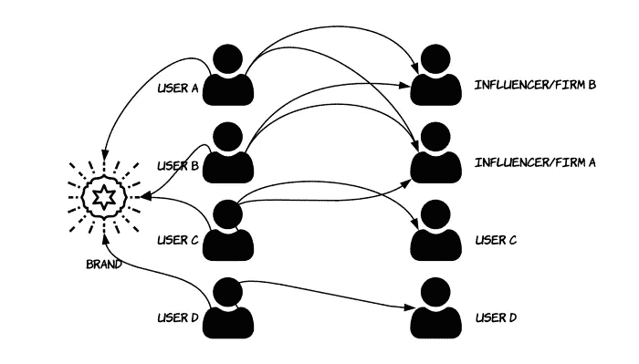

作者图片

让我们从一个例子开始:我们有一组`n`用户关注一个特定的品牌/档案。这些用户中的每一个都可以像`n`用户一样关注。通常，在追随特定品牌的一组用户中，这些用户之间存在关系。一些用户跟随彼此是因为他们只是彼此认识，一些其他用户跟随特定用户是因为后者是“影响者”，相同用户群中的一些其他用户可能跟随非常知名的品牌。

拥有用户群的“映射”表示可以帮助企业回答不同的问题，其中包括:

*   怎样才能找到类似`xyz`的影响者？
*   用户`xyz`和用户`zyx`有多相似？
*   我可以在没有任何关于用户的附加数据的情况下将我的用户群分组到特定的组中吗？
*   我的社区中最有影响力的人是谁？

# 战略:

本研究的主要目标是创建一个品牌社区中每个用户的数字表示，可用数据包括用户名列表和每个用户关注的个人资料列表:

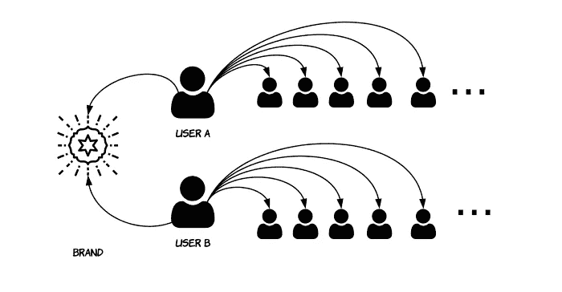

数据的图形表示。(图片由作者提供)

如果有可能用数字表示空间内的用户，也有可能计算用户之间的操作，例如计算相似性，发现社区中的聚类和趋势。

在思考如何应对这一挑战的阶段，我想到的主要想法是将每个用户视为不同的项目集，类似于何时在商店购物:我们有自己的购物篮(社交媒体档案)，我们将这个篮子装满我们想要的东西；不同的购物者对他们的购物篮做同样的事情，因此分析这些数据可以帮助了解顾客之间的模式。

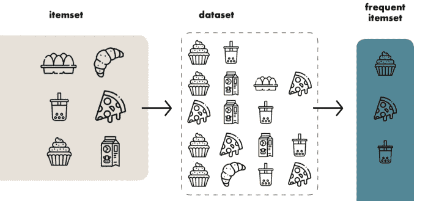

只需用社交媒体档案代替物品，神奇的事情就发生了……(图片由作者提供)

这类任务可以通过实现 [apriori](https://en.wikipedia.org/wiki/Apriori_algorithm) 这样的算法来完成。这类算法通常用于频繁项集挖掘，它不是一种机器学习方法，而是来自一组称为关联规则学习的算法。

这种方法的问题是，它不能度量实例之间的相似性，因为数据集中的每个实例都没有被转换成数学表示，而只是使用两个奇特的度量来表示:[置信度和](https://www.kdnuggets.com/2016/04/association-rules-apriori-algorithm-tutorial.html)。

然而，apriori 的酷之处在于它提供了用图表表示关联规则的可能性，这对于评估和报告非常有用。

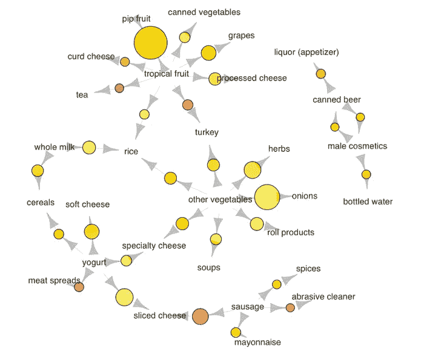

来源: [KDNuggets](https://www.kdnuggets.com/2016/04/association-rules-apriori-algorithm-tutorial.html)

在那一刻，有必要后退一步，专注于最终目标:我需要找到一种方法，让我以数学的方式编码用户，保留他们之间的关系。

当回过头来从宏观层面分析这种情况时，我意识到这其中的主要问题是将用户名“转换”成“数字”，因此问题很清楚:哪种算法、模型或任何东西可以将文本转换成数字？

同时，我意识到已经有一个非常强大的工具叫做 [Tensorflow 嵌入式投影仪](https://projector.tensorflow.org/)。它允许将高维数据投影到三维空间中，并自动执行 PCA(减少维数)等操作，并计算向量之间的距离，因此它可以显示一个词与另一个词的相似程度。

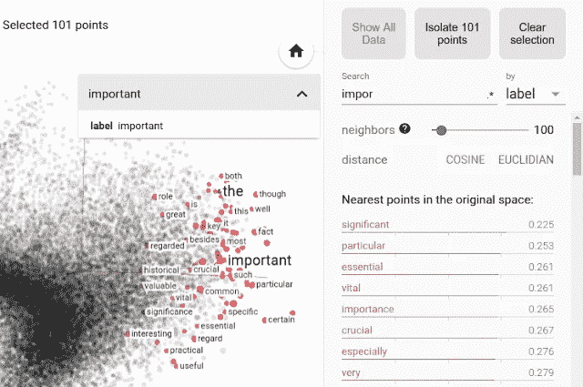

Tensorflow 嵌入式投影仪的一个例子。(图片由作者提供)

# 实施:

主要想法是试图根据用户追随者数据训练一个 Word2Vec 模型，以测试该模型是否能够学习用户之间的关系。

Word2Vec 是一个神经网络，能够生成单词的密集表示。这种算法，更具体地说是一种无监督学习算法，试图基于单词的邻居来预测单词，因此，在这种情况下，该算法将基于用户来预测追随者。

Word2Vec 可以主要使用两种不同的策略进行训练:Skip-gram 和 CBOW。

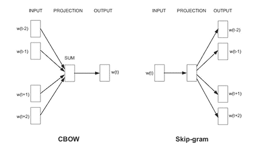

CBOW 与 Skip-gram 的图形表示。(图片由作者提供)

在 CBOW 中，组合一组周围的单词(用户)来预测中间的单词(用户)。相反，Skip-gram 将单词(用户)放在中间来预测周围的上下文。

为了实际实现这一点，我选择使用 Amazon SageMaker 及其 Word2Vec 实现，名为 [**BlazingText**](https://docs.aws.amazon.com/sagemaker/latest/dg/blazingtext.html) 。

# 输入数据:

输入数据由一个简单的`.txt`文件组成，该文件为每个用户包含一个逗号分隔的特定用户正在关注的配置文件列表。输入数据的总大小包括大约 520 万个条目。

# 培训阶段:

训练在`ml.c4.xlarge`机器上进行，使用接近默认的超参数，此外，由于预算原因，没有进行超参数优化。

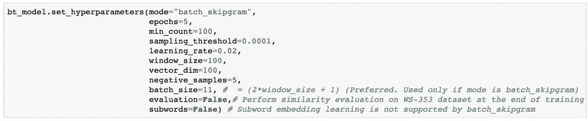

作者图片

由于选择了训练策略 skip-gram，所以训练进行了五个时期，使用 100 个用户的`min_count`来预测下一个时期(这是理解用户遵循哪种简档的合理数量。)，对于每个输出向量，我选择了 100 维的大小。其余的超参数保持默认。有关可用超参数的完整列表，请参考[官方文档](https://docs.aws.amazon.com/sagemaker/latest/dg/blazingtext_hyperparameters.html)。

培训阶段持续了大约 9 个小时。

# 评估:

理解评估该模型的正确方法超出了本文的范围，但是，出现了几个有趣的点:

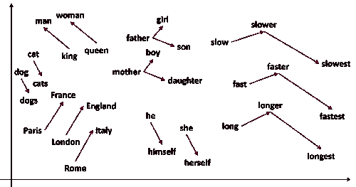

一个用二维空间表示的单词向量的例子。(图片由作者提供)

*   由于任务包括映射一个社区内的所有用户，没有这个应用程序的训练和测试集，矛盾的是，我在寻找一个完美的数据溢出。
*   从推荐系统中借用一些知识，是否有可能以类似于测试推荐者的方式来测试这个系统:隐藏实例之间的一些关系，并检查推荐者是否仍然能够找到模糊的关系。
*   Word2Vec 模型确实考虑了单词出现的顺序。这在该任务中是无用的，这就是为什么指定了 100 的`window_size`,以便给模型一个预上下文来帮助预测下一个追随者。

一旦训练完成，我最终得到了一个巨大的`.tar.gz`模型，解压缩后有两个文件:`vectors.txt`和`vectorz.bin`，它们完全兼容`gensim`提供的`[keyedvectors](https://radimrehurek.com/gensim/models/keyedvectors.html)` [格式](https://radimrehurek.com/gensim/models/keyedvectors.html)。

使用`gensim`读取向量和 followers 一样容易，此外，我们可以使用`most_similar`方法对模型进行一些手动测试:

```
from gensim.models import KeyedVectorsword_vectors = KeyedVectors.load_word2vec_format(‘vectors.txt’, binary=False)
```

为了了解模型对实体间差异的理解有多精确，有多好，特别是当差异非常细微时，我决定选择 Zara 和 Louis Vuitton 这两个知名品牌。

Zara 是一家快时尚零售商，而路易威登(仍然)被认为是一家法国时装和奢侈品公司。

这里是它们中最常见的实体:

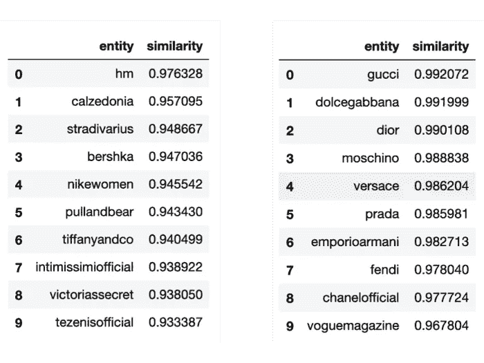

作者图片

从上面的结果来看，该模型似乎能够区分一些奢侈品和 Fas 时尚品牌，返回实际上有意义的结果。

让我们尝试一些不同的东西，这一次，两位音乐家属于两个完全不同的流派，Lady Gaga 和 Solomun:

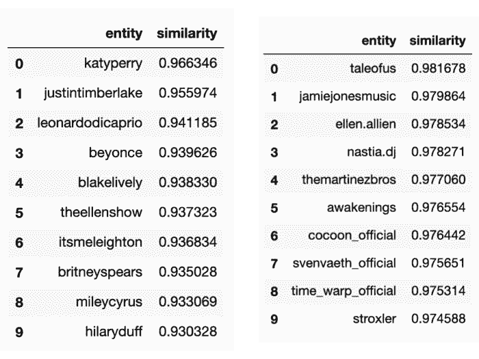

作者图片

令人惊讶的是，该模型还学习了不同音乐家的向量，能够为 Lady Gaga 返回不同的流行/商业艺术家，为 Solomun 返回更多的技术艺术家。

回到之前提到的有趣的图形可视化，现在也有可能做到这一点:模型为每个实体生成 100 维向量，为了在 2-D 空间上绘制它，有必要降低维度，实现这一点的一种方法是使用`scikit-learn` `[TSNE](https://scikit-learn.org/stable/modules/generated/sklearn.manifold.TSNE.html)`类，该类将数据点之间的相似性转换为连接概率。另一种方式可以是计算一个 [PCA](https://scikit-learn.org/stable/modules/generated/sklearn.decomposition.PCA.html) 。

下图由使用`TSNE`和`matplotlib`可视化的 300 个最常见向量组成:

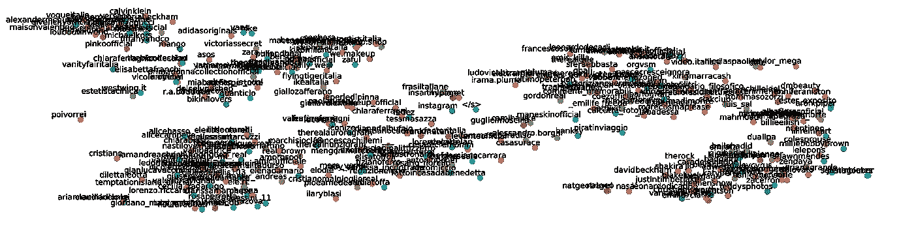

作者图片

很明显，存在一些数据聚类，这意味着该模型成功地学习了跨实体的相似性。例如，在左上角，我们可以看到一些零售品牌，而在右下角的名人和一些音乐人。

最后，我们还可以将计算出的向量和元数据导出为`.tsv`格式，使其对于前面提到的另一个工具来说是可读的:[Tensroflow Embedding Projector](https://projector.tensorflow.org/)。

这里的优点是，嵌入式投影仪可以计算不同类型的维度缩减，使用户有可能尝试一些算法。此外，将整个矢量和元数据从 Word2Vec 模型导出到嵌入的投影仪并加载这些文件也很简单。关于如何做的简单教程可以在[这里](https://www.tensorflow.org/tensorboard/tensorboard_projector_plugin)找到。

下图显示了通过嵌入投影仪计算的三维 PCA，突出显示的单词表示与标有“chanelofficial”的点最近的点。

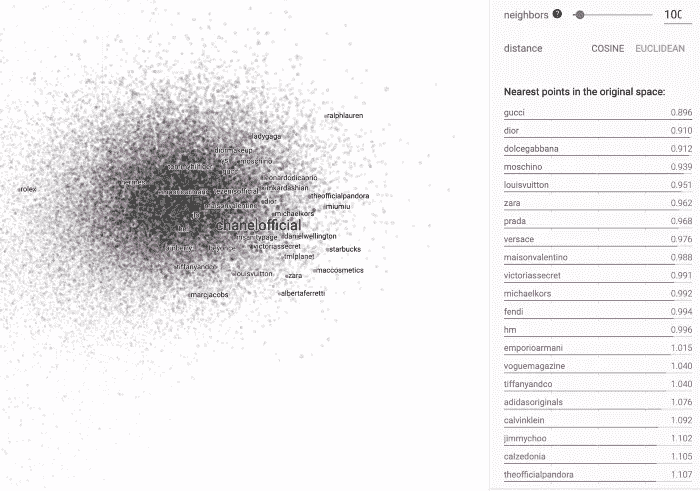

作者图片

另一个例子，使用“宝马”作为搜索查询和神话般的黑暗模式:

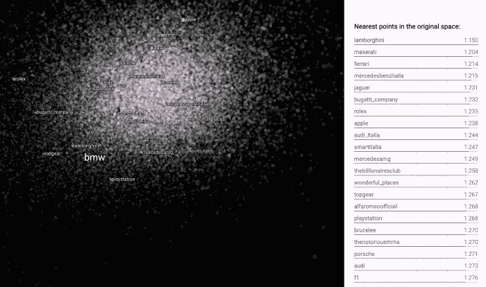

作者图片

可以看出在这两个例子中，搜索查询如何返回在上下文中有意义的值，此外，比较来自二维降维和由嵌入投影仪生成的三维的值，后者似乎不太“分类”和更具包容性，返回严格来说不属于同一类别的实体(例如 Zara 和 h&m)但对相似性的不同观点更开放(例如奔驰和劳力士)。

# 结论:

在本研究结束时，可以进行一些考虑:提供一个能够识别实体之间相似性的系统的最初目标似乎已经实现，但是，一个事物与另一个事物有多少相似性的想法仅仅是主观的或面向领域的，例如，同一领域中两个品牌之间的相似性可能会被在完全不同的领域中运营的其他品牌的存在所扭曲。类似于算术平均值如何误导样本中的许多异常值。

另一个需要考虑的问题是 Word2Vec 模型在这种情况下的使用方式:像本研究中这样对整个数据集进行矢量化有助于索引数据集中的实例，这意味着新实体(也称为词汇外标记)可以进行矢量化定位，并且只有在重复整个训练过程的情况下才能进行定位。

出于这些原因，我认为这个工具更像一个索引器，有助于品牌在用户群中发现相似的实例。一个例子是，当在社区中寻找有影响的人时，品牌经理可能有一个想法或认识一些用户，这可能是好的，但是，像这样的工具可以帮助经理在他们的社区中找到其他类似的用户，由于这种算法，这些用户已经被索引。

```
**I have a newsletter 📩.** Every week I’ll send you a brief findings of articles, links, tutorials, and cool things that caught my attention. If tis sounds cool to you subscribe. *That means* ***a lot*** *for me.*
```

 [## 5-bullet 数据科学与技术📡

### 编辑描述

无情-创造者-2481.ck.page](https://relentless-creator-2481.ck.page/68d9def351)