# 图拉普拉斯算子及其在机器学习中的应用

> 原文：<https://towardsdatascience.com/graph-laplacian-and-its-application-in-machine-learning-7d9aab021d16?source=collection_archive---------18----------------------->

## 图拉普拉斯在谱聚类中的应用


由 [Unsplash](https://unsplash.com?utm_source=medium&utm_medium=referral) 上的 [Pietro Jeng](https://unsplash.com/@pietrozj?utm_source=medium&utm_medium=referral) 拍摄

本文重点介绍了图形、其表示的属性及其在机器学习中执行谱聚类的应用。

# 介绍

图是一种数据结构，其中的节点通过有向或无向的边相互连接。例如，对于以城市为节点表示城市道路网络的图，边可以具有表示两个城市之间距离的权重。

# **内容**

*   加载数据
*   根据特征构建图形
*   导出它的拉普拉斯表示
*   探索图拉普拉斯的性质
*   机器学习中的应用—谱聚类

**加载数据**

我们将从 python 库 scikit-learn 中的玩具 make_moons 数据集开始。

```
import numpy as np
from scipy import sparsefrom sklearn.datasets import make_moons
from sklearn.neighbors import kneighbors_graph
from sklearn.cluster import KMeans
from sklearn.metrics import homogeneity_score, completeness_score,v_measure_scoreimport networkx as nx
import matplotlib.pyplot as pltrandom_state = 213
np.random.seed(random_state)data_size = 150features,y = make_moons(n_samples=data_size, noise=0.07, random_state=213)
```

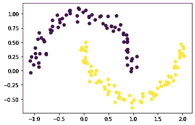

具有两个聚类的数据集

**构建 K-最近邻图**

k-最近邻图可以以两种模式构建——“距离”或“连通性”。

在“距离”模式下，边代表两个节点之间的距离，而在“连通性”模式下，图的边权重为 1 或 0，表示两个节点之间是否存在边。我们将选择欧几里德距离度量来计算距离。

```
n_neighbors = 10
knn_dist_graph = kneighbors_graph(X=features,
                                 n_neighbors=n_neighbors,
                                 mode='distance',
                                 metric='euclidean',
                                 n_jobs=6)
```

它返回一个稀疏图，图中的边表示数据点之间的距离。第一个数据点与其最近的 10 个邻居之间的距离如下所示。注意图的稀疏性，并且它将仅在矩阵中对应于其 k 个最近邻居的那些位置/索引处具有代表距离的连续值，其余的将为零。

```
knn_dist_graph.todense()[0]
```

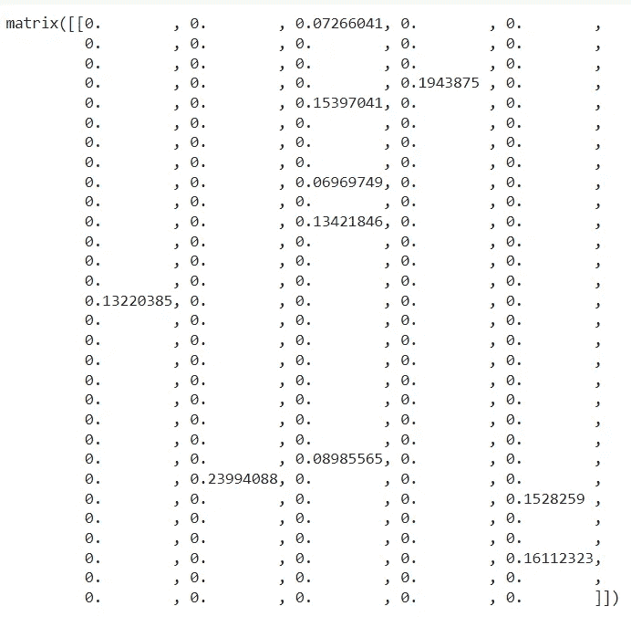

该数据通常用于在数据点中寻找组，其中相似的数据点位于相同的类或簇中。

类似地，在其他这种情况下，当您想要捕捉数据点内的相似性而不是距离时，我们可以使用宽度为(sigma = 1)的高斯核将该图转换为基于相似性，距离 d(x1，x2)是上面稀疏图中非零位置的欧几里德距离。

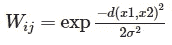

请注意，在上面的数组中，距离= 0 的位置意味着该距离超出了 k 个最近邻的最大距离。当输入高斯核时，该值可以解释为最高相似度。因此，我们将只把这个内核应用于包含距离的索引。

```
sigma = 1
similarity_graph = sparse.csr_matrix(knn_dist_graph.shape)
nonzeroindices = knn_dist_graph.nonzero()similarity_graph[nonzeroindices] = np.exp( -np.asarray(knn_dist_graph[nonzeroindices])**2 / 2.0 * sigma**2)similarity_graph = 0.5 * (similarity_graph + similarity_graph.T)
similarity_graph.todense()[0]
```

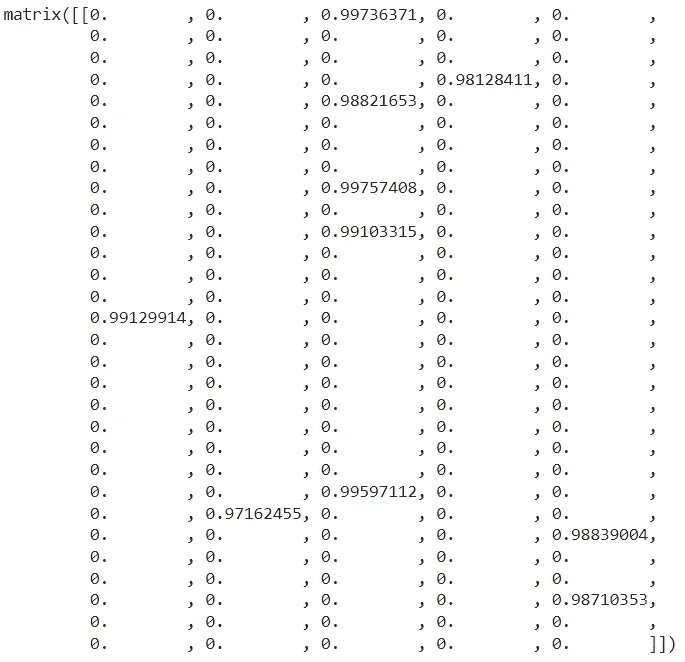

该图可能是不对称的，因为它是基于 k-最近邻的。我们需要使这个图对称，原因我们将在拉普拉斯的性质中了解。我们将它的图的转置加到它自身上，并将所有的值除以 2。

让我们看看这个图形可视化后的样子

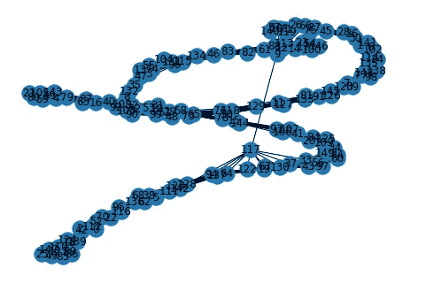

使用 networkx 实现可视化

**导出图的拉普拉斯表示法**

**L = D-W**

度矩阵

w:相似图(用加权邻接矩阵表示)

我们将创建一个图的度矩阵，它是一个对角线矩阵，对角线上有节点度 ***d*** 。

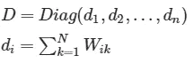

```
degree_matrix = similarity_graph.sum(axis=1)
diagonal_matrix =         
np.diag(np.asarray(degree_matrix).reshape(data_size,))L =  diagonal_matrix - similarity_graph
```

***注:*** 通过从度矩阵中减去相似度矩阵，图中的圈的影响被消除。最后，拉普拉斯算子包含对角线上的次数和矩阵其余部分中边权重的负值。

**图的拉普拉斯性质**

1.  ***实对称***

因为它是实的和对称的，所以它的特征值是实的，它的特征向量是正交的。

2. ***正半定***

拉普拉斯算子具有至少一个等于 0 的特征值。我们可以通过它的二次型来检验这一点。l 是实对称的，并且如果 ***x*** 是 n×1 列向量，则它的二次型 Q 由下式给出

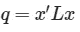

二次型是正半定的，如果-

*   ***Q≥0*** 为全部 x 而 ***Q = 0*** 为部分 ***x≠0***

我们将 x 设为 1 的列向量。

```
x = np.ones(shape=(data_size,1))
Q = np.dot(np.dot(x.T, L.todense()), x)
Q.round(10)
```

任何包含相同值的列向量 x 将导致等于 0 的二次型。

3. ***拉普拉斯零特征值的个数等于图中连通分量的个数***

```
# Finding eigen values and eigen vectors
e, evecs = np.linalg.eig(L.todense())
e.shape, evecs.shape# No. of eigen values equal to 0
e_rounded_off = e.round(5)
e_rounded_off[e_rounded_off == 0].shape# No. of connected components
nx.number_connected_components(nx_graph)
```

**4*。具有高边缘权重的两个相似数据点在所得特征向量*** 中的相应索引处具有相似的值

这些特征向量之一是菲德勒向量——对应于最小非零特征值的特征向量。在下图中，数据点被符号很好地分开。

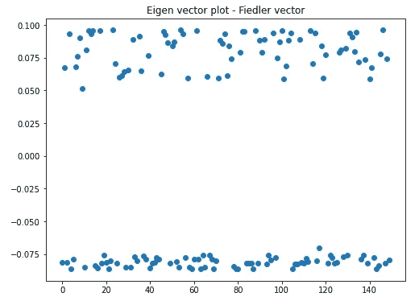

对应于最小非零特征值的特征向量图

## 图拉普拉斯算子的应用

通过扩展上述所有属性，以及本征向量将数据点分组的事实，本征向量被用于聚类。这种方法叫做**谱聚类**。

这是通过选择阈值将数据点从第一个最小的特征向量分成 2 个集群来执行的。对于 2 个以上的聚类，我们可以使用 Kmeans 算法直接从第一个最小的 K 个特征向量中获得 K 个聚类。

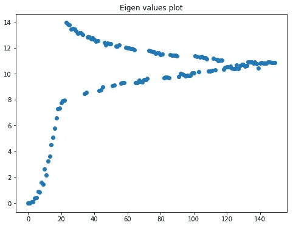

特征值对数据指数作图

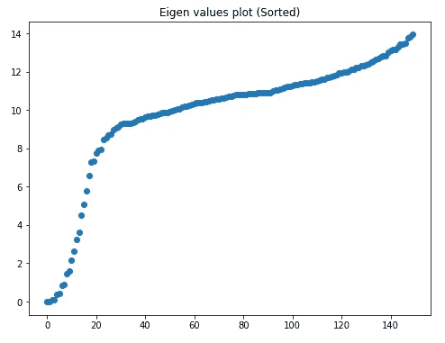

特征值(排序)相对于数据指数绘制

***使用菲德勒矢量来划分数据点***

[图形分割](https://en.wikipedia.org/wiki/Graph_partition#:~:text=In%20mathematics%2C%20a%20graph%20partition,edges%20in%20the%20partitioned%20graph.) —在这种情况下，顶点被分割成分离的集合。该图被划分，使得组内的边具有高权重(聚类内的点是相似的)，而组间的边具有小权重(不同聚类中的点彼此不相似)。

费德勒向量是对应于最小非零特征值的特征向量。低于 0 的值的索引被分配给聚类 1，其余值的索引被分配给聚类 2。

我们能够以这种方式使用这个向量，因为这个特征向量是指示向量的缩放版本。指示向量与矩阵的每个非零特征值相关联。每个指示符向量也是彼此正交的，并且理想地包含二进制值 0 或 1 来指示集群成员资格。

在这种情况下，我们使用带符号的连续值，而不是包含 0 和 1 的指示向量。

```
# Get smallest non-zero eigen value's index for obtaining partition to cluster
fiedler_index = sorted_indices[1] # The eigen vector for smallest non-zero eigen value i.e plotting the Fiedler vector plt.figure(figsize=(8,6))
plt.scatter(np.arange(data_size), evecs[:,fiedler_index].tolist())
plt.title("Eigen (Fiedler) vector plot")
plt.show()fiedler_vector = evecs[:,fiedler_index].copy() # Thresholding the values in this eigen vector at 0
fiedler_vector[fiedler_vector < 0.0] = 0
fiedler_vector[fiedler_vector > 0.0] = 1
new_labels = np.asarray(fiedler_vector)[:,0]# Plot cluster result
plt.scatter(features[:,0], features[:,1],         
                          c=new_labels.astype(float))
plt.title("Clusters plot")
plt.show()
```

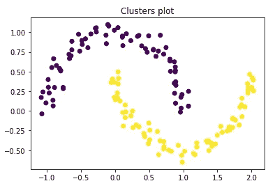

从谱聚类中获得的聚类

**基于熵的外部聚类评价方法评价**

[同质性&完整性评分和 v-measure](https://scikit-learn.org/stable/modules/clustering.html#homogeneity-completeness) 根据基本事实评估聚类结果，并考虑类和聚类标签的分布，以测量所获得的聚类的一致性。每项措施的最高分为 1.0。对于上述过程，我们每个指标的得分为 1.0。

```
# Evaluation of clustering result of the above procedure
homogeneity_score(y, new_labels), completeness_score(y, new_labels), v_measure_score(y, new_labels)
```

**与 Kmeans 的比较**

```
num_clusters = 2
kmean_labels = KMeans(n_clusters=num_clusters, random_state=random_state, n_jobs=6).fit_predict(features)plt.scatter(features[:,0], features[:,1],                                                                           c=kmean_labels.astype(float))
plt.show()
```

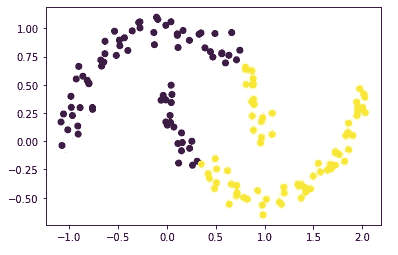

从 KMeans 聚类中获得的聚类

```
# Evaluation of clustering result of KMeans
homogeneity_score(y, kmean_labels), completeness_score(y, kmean_labels), v_measure_score(y, kmean_labels)# Scores
# (0.1836464702880451, 0.1837407327840609, 0.18369358944333708)
```

假设存在球状星团，Kmeans 不能很好地区分这两个星团。

回顾拉普拉斯表示和求解特征值系统以获得聚类，一个问题是— **为什么是特征值系统？**

这是因为特征值系统近似于图割。

对于 ***割(V1，* )** 获得 2 个分区的 V1 & V2 表示为——

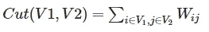

在上述方法中，特征值近似一个[归一化图割](https://people.eecs.berkeley.edu/~malik/papers/SM-ncut.pdf) — ***NCut(V1，V2)*** 。

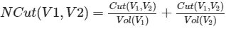

## ***怎么会这样？***

NCut 的上述方程可以重新表示为[瑞利商](https://en.wikipedia.org/wiki/Rayleigh_quotient#:~:text=The%20Rayleigh%20quotient%20is%20used,approximation%20from%20an%20eigenvector%20approximation.)，其最小值由一个广义特征值问题的最小特征值得到。设 x 为 N 维指示向量其中 ***xi*** =1，若图节点 ***i*** 在 V1，否则为 0，则 Ncut 的最小化表示为如下瑞利商

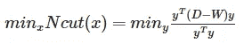

在满足其中一个条件的情况下，

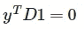

其中 ***y*** 也像我们的指示向量 x 一样受到约束。

这样，图划分问题就转化成了聚类问题。

# 结论

我们从数据的特征开始，构建它的图和拉普拉斯算子，并使用它的谱嵌入(本征向量)，我们找到最佳分割以获得聚类。谱理论是处理图表示的特征值和特征向量的概念的来源，也用于机器学习的其他领域，如图像分割、谱图卷积神经网络以及工业和研究社区中的许多其他领域。

本文旨在总结机器学习和线性代数中的概念和应用，并希望它也能引发探索和了解更多的好奇心。

希望有帮助。

请分享您的反馈，或者如果您在其他领域遇到这些概念的应用。

你可以在 GitHub 上找到代码。

[](https://github.com/Taaniya/graph-analytics/blob/master/Graph_Laplacian_and_Spectral_Clustering.ipynb) [## taaniya/图形分析

### permalink dissolve GitHub 是超过 5000 万开发人员的家园，他们一起工作来托管和审查代码，管理…

github.com](https://github.com/Taaniya/graph-analytics/blob/master/Graph_Laplacian_and_Spectral_Clustering.ipynb) 

## 参考

*   Ulrike von Luxburg，关于谱聚类的教程，2006 年。
*   [时剑波和吉滕德拉·马利克，](https://people.eecs.berkeley.edu/~malik/papers/SM-ncut.pdf)标准化切割和图像分割，2000 年
*   吉尔伯特·斯特朗教授，图中聚类，麻省理工学院开放式课程。
*   [二次型和正定矩阵](http://www2.econ.iastate.edu/classes/econ501/Hallam/documents/Quad_Forms_000.pdf)