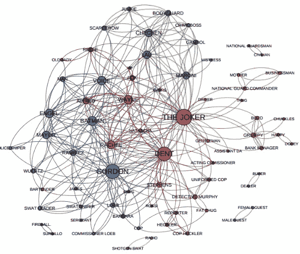
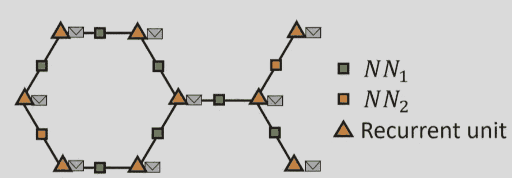

# 图形神经网络:综述

> 原文：<https://towardsdatascience.com/graph-neural-networks-an-overview-dfd363b6ef87?source=collection_archive---------21----------------------->

## 图形神经网络导论

[https://mapr.com/blog/driving-insights-network-graphs/](https://mapr.com/blog/driving-insights-network-graphs/)

在过去的十年中，我们已经看到神经网络可以在图像和文本等结构化数据中表现得非常好。大多数流行的模型，如卷积网络、递归、自动编码器，对于具有表格格式(如矩阵或向量)的数据工作得非常好。

但是非结构化数据呢？图形数据呢？有没有一种模式可以向他们高效学习？大概你从题目就猜到了。答案是图形神经网络。

图形神经网络早在 2005 年就被引入(像所有其他好主意一样)，但它们在最近 5 年才开始流行。gnn 能够模拟图中节点之间的关系，并生成其数字表示。

GNNs 的重要性非常显著，因为有如此多的真实世界数据可以用图形来表示。社交网络、化合物、地图、交通系统等等。

因此，让我们找出 GNNs 背后的基本原理以及它们工作的原因。

让我们首先定义我们的基本问题:我们想要将一个给定的图映射到一个标签，这个标签可以是一个数值、一个类或者其他任何东西。换句话说:

*F(图)=嵌入*

我们想找到函数 f，例如，想象每一个图是一个化合物或一个分子，标签是这个分子被用来生产某种药物的可能性。如果我们有办法从每张图中提取标签，我们基本上找到了一种方法来预测哪些分子更有可能用于药物。很酷，对吧？

我们该怎么做？我们已经知道了一种可以(在某种程度上)用于图形的神经网络。如果你考虑一下，递归神经网络可以在一种特殊类型的图上操作。链式图(基本上是一条线的图)。时间序列实际上是链式图，其中每个时间戳是一个节点，后面跟着下一个时间戳。

因此，事实上，我们可以建立一个网络，其中每个图节点都是一个循环单元(LSTM 或其他东西)，节点的信息是一个嵌入，将通过链进行传输(像消息一样)。因为单元都是循环的，所以当嵌入穿过图时，信息不会丢失。这是我们熟悉的递归神经网络。与语言翻译和其他自然语言处理应用程序中使用的方法完全相同。

当然，我们可以将这个想法扩展到适当的图，我们得到这个:

[*图形神经网络:变异与应用*](https://www.youtube.com/watch?v=cWIeTMklzNg)

这张幻灯片摘自微软研究院关于 GNNs 的精彩演讲。让我们来看看这里发生了什么。

每个橙色三角形曾经是图形节点，现在被一个循环单元取代。包络表示将穿过图的节点的嵌入。每个图的边也被一个神经网络代替，以捕捉边的信息(它的权重)。

现在是学习的部分。在单个时间步骤中，每个节点从其所有邻居提取嵌入，计算它们的总和，并将它们与其嵌入一起传递给递归单元，这将产生新的嵌入。

这个新的嵌入包含节点的信息加上所有邻居的信息。在下一个时间步中，它还将包含其二阶邻居的信息。诸如此类。这个过程一直持续到每个节点都知道图中的所有其他节点。每个嵌入现在都有来自所有其他节点的信息。

最后一步是收集所有的嵌入并添加它们，这将为我们提供整个图的单个嵌入。

[T3【https://tkipf.github.io/graph-convolutional-networks/】T5](https://tkipf.github.io/graph-convolutional-networks/)

就是这样。我们做到了。我们设法在一次嵌入中捕获整个图形。这种嵌入现在可以用在一些其他模型中，以执行一些分类、预测、聚类等操作。让你的想象力漫游。

如果你想试验图形神经网络，我会帮你搞定:

*   [deepmind/graph_nets:在 Tensorflow 中构建图形网络](https://github.com/deepmind/graph_nets)
*   [rusty 1s/py torch _ Geometric:py torch 的几何深度学习扩展库](https://github.com/rusty1s/pytorch_geometric)
*   [深度图库](https://www.dgl.ai/)

我个人会选择第三种，因为它有更好的文档，但这是你的选择。

给你。鉴于 gnn 能够有效地建模图形结构，我猜测它们将在深度学习的未来发挥重要作用。通过将 GNN 加入他们的军械库，人工智能研究人员现在可以将一种全新类型的数据加入到他们的模型和架构中。老实说，天空才是极限。

太棒了。

> 如果你有兴趣阅读更多关于人工智能和机器学习的帖子，请不要不看我们的博客就离开

*原载于 2020 年 2 月 1 日*[*【https://theaisummer.com】*](https://theaisummer.com/Graph_Neural_Networks/)*。*