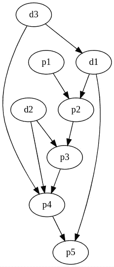
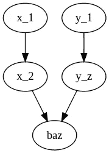
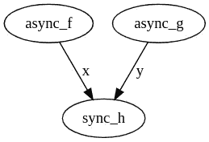

# 图形编程

> 原文：<https://towardsdatascience.com/graph-programming-d1c52fea5ce9?source=collection_archive---------29----------------------->

命令式编程的特点是迭代嵌套。一个函数嵌入了对其他函数的调用。我所说的嵌入是指这些调用在函数体中，因此函数和它的组成部分之间有紧密的耦合。这有许多缺点，通常通过函数组合来解决。

构图就像把两个东西连在一起。没有一个事物是在另一个事物之上的、嵌入的或优越的，它们只是相互补充。因此，所涉及的功能彼此之间是不相干的，这很好，因为你可以混合和匹配，分别测试和调试它们。

大多数组合实用程序或库会生成一个新的函数或对象，表示其组成部分的组合，但不再可能引用这些组成部分。你得到了一个新的不可穿透的盒子(再次嵌套)。

在典型的构图中，你可以继续在这个盒子里或盒子外构图，只要构图是在边上完成的，而不是单个的成分。然而，如果你有非一元函数，你需要开始使用 currying，事情可能会变得复杂。

作为人类，我们不会这样思考或说话，我们可以任意引用概念，以非一元的方式自由写作。

这项工作提出了图编程的概念，这是一种通过以非封闭方式连接函数对来构建函数图的编程方法，旨在取代典型的函数组合。

## 先决条件

我将使用 python 来说明我的例子。我也将使用函数式编程风格。

你应该熟悉`compose_left`、`pipe`和`curry`才能跟上。

如果您不是，下面是前两者的可行实现:

```
def compose_left(*funcs):
    def composition(input):
        for f in funcs:
            input = f(input)
        return input

    return compositiondef pipe(input, funcs*):
    return compose_left(*funcs)(input)
```

至于`curry`,由于它的实现有点复杂，您可以使用这个使用示例来了解它的功能:

```
@curry
def add(x, y):
    return x + y# I can give a single argument, getting back a function that
# expects the remaining argument.
add_5 = add(5)
add_5(7)  # Will give 12.
```

## 非线性程序

考虑以下情况，其中您有以下管道:

`foo = compose_left(x_1, x_2, ..., x_n)`

`foo`是一些函数的组合。太好了。

现在想象一下`x_n`得到两个参数而不是一个的情况。所以我们不能再单独使用这个组合，我们需要使用 currying 和一个额外的`def`,就像这样:

```
@curry
def x_n(arg1, arg2):
    ...def make_foo(head_input, side_input):
    return pipe(
        head_input,
        x_1,
        x_2,
        ...,
        x_n(side_input)
    )
```

Currying 很棒，因为我们不需要复杂的`x_n`来表达它将在代码中的两个不同位置获得它的两个依赖项。`side_input`将作为`arg2`进入`x_n`。

这里仍然有一些渗漏。我们不必要地将剩余的合成代码暴露给`side_input`。如果我有很多依赖项，并且我想在不同的时间给它们，这会变得非常混乱。

考虑这样的情况，其中`x_n`是两个独立管道的成员，每个管道给它不同的输入。

我们可以试着这样编程(这显然是行不通的):

```
def baz(arg1, arg2):
    ...# incoming argument on position 2
foo = compose_left(x_1, x_2, ..., baz)# incoming argument on position 2
bar = compose_left(y_1, y_2, ..., baz)
```

调用`foo`或`bar`会给我们一个熟悉的例外，即`baz`期望两个参数，但只得到一个。

我们可以用一些命令式的风格来克服这个问题:

```
def everything(head_arg1, head_arg2):
    return baz(
        pipe(head_arg1, ...),
        pipe(head_arg2, ...),
    )
```

虽然这适用于简单的情况，但不适用于一般情况。如果我在不同的阶段连接了几个函数，那么我将不得不放弃组合符号，并以命令式风格结束，或者简单地拥有一个大函数，其中所有的东西都暴露给所有的东西。



复杂的依赖结构(*作者图片*)

想象一下，必须编写单个签名来支持上述结构。那就必须是`d3`、`d1`、`p1`、`d2`的结合。函数体本身会全局暴露变量，理解依赖结构会非常困难。

作为人类，如何表达是很明显的。我们只是画出来。让我们回到上面这个简单的例子。



当你能画的时候不需要涂抹(*作者的图片*

我们也可以“编码”它，例如这是我用来生成上面图像的代码:

```
digraph G {
  x_1 -> x_2 -> baz
  y_1 -> y_z -> baz
}
```

所以我编程的时候应该也能做到。

## 编写者

“图”这个词本身就来源于素描或绘画，这才是真正正确的意义。我们希望能够画出程序，因为我们对它们的心理模型是非线性结构。

*编程这个词本身来自更早的希腊语“prographein”。我们其实都只是程序员。

[https://github.com/hyroai/computation-graph](https://github.com/hyroai/computation-graph)用 python 实现了第一个图形编程框架。

它允许使用用普通 python 编写的纯函数，并显式声明它们的依赖关系，而不需要它们知道彼此。这类似于任何功能组合框架。除此之外，cg 还有其他一些技巧。

## 非线性合成

第一个技巧是将合成推广到非一元函数，将管道推广到有向无环图(Dag)。依赖不仅仅是“线”，所以我们应该能够，例如，将两条线连接成一个二元函数。我只需要说出我正在编写的关键字就可以完成这个例子。

一个例子:

```
everything = to_callable([
    *compose_left(x1, ..., x_n-1),
    *compose_left(x_n-1, baz, keyword="arg1"),
    *compose_left(y1, ..., y_n-1),
    *compose_left(y_n-1, baz, keyword="arg2"),
])...
# usage:
everything(input_to_x_chain, input_to_y_chain)
```

每个组合本质上都是边的集合，带有一些语法糖，允许您轻松地创建子结构。

## 记忆

纯函数和组合很容易处理。它们易于测试和推理，并且不会暴露在令人讨厌的状态中。但是现实仍然需要有记忆的程序，或者运行几次并保留一些上下文的程序，所以我们需要在纯函数中引入状态或记忆。流行的 UI 框架 React 已经使用钩子解决了这个问题(例如`useState`)。我们希望对我们使用的函数的纯度有更严格的要求，不要在函数中引入任何神奇的调用。换句话说，我们希望在函数的参数中完整地描述输入，并将输出完整地定义为函数的输出。

我们首先实现了一种特殊的节点，称为缩减器。reducer 返回两个元素，一个输出和它的内存，计算图框架将在下一次“转向”时在一个名为`state`(类似于 python 中的`self`)的特殊参数中为函数提供内存。

然后我们意识到，这种模式可以用更简单的方式实现，不需要任何特殊的关键字参数或构造。我们意识到记忆是对未来的依赖。这里的未来指的是下一次运行计算图。因此，我们改变了实现，使之具有我们称之为“未来边缘”的东西。未来边缘描述时间轴上的函数组合。所以一个函数可以被组合(即有一个边)到它自己或者其他函数上(甚至是它应该依赖的函数！)，而没有真正产生循环。这是因为当前回合所需的值来自前一回合。

当我们引入这个概念时，我们讨论的不再是 Dag，而是一般的图，这些图可能有“圈”(只要这个圈至少有一条未来的边可以打破它)。

请注意，当我们引入内存时，整个计算图的签名变成了两个元素，其中一个是输出，另一个是状态，当我们再次运行它时，我们确保给它前一轮的状态。因此当缩小时，整个计算图具有缩减函数的特征。

## 记录

日志记录是编程中的一个经典问题。我们写一些代码来做一些事情，然后我们想观察它并记录它在做什么。作为例子，考虑流水线`compose_left(x, y, z_1, ..., z_n)`。

并且说我们想看`y`的输出。所以我们可能会这样做:

```
def y(some_input):
    ...
    return output, log
```

但是唉，`z_1`期望得到`y`的输出。这意味着我们将不得不复杂化`z_i`来处理一对元素。我们想要避免它。对于图形编程来说，这很容易做到。简单地将`y`连接成两个面:

```
(
    *compose_left(x, y, z_1, ..., z_n),
    *compose_left(y, logger),
    *compose_left(logger, final_output, key="log"),
    *compose_left(z_n, final_output, key="real_output"),
)
```

## 异步编程

python 中的 Async 真的很难搞对。同步函数不能调用异步函数，所以至少可以说混合使用这两种函数是很重要的。此外，你必须仔细选择何时在两行中使用`await`，以及何时使用类似`asyncio.gather`的东西。但是这个信息，什么需要首先发生，已经在你的程序中了。比如下面这个例子效率不高。

```
async def my_async_program():
    x = await async_f()
    y = await async_g()
    return sync_h(x=x, y=y)
```

这是因为我们可以将`x`上的`await`与`y`并行。但是为什么我们作为人类应该注意到它，而不是去推断它呢？

如果我们画出来，就很明显了。



(*作者图片*)

因此，计算图形库允许您混合异步和同步功能，甚至使用拓扑排序为您推断哪些功能可以并行运行。这将被写成如下。

```
(
    *compose_left(async_f, sync_h, key="x"),
    *compose_left(async_g, sync_h, key="y"),
)
```

## 含糊

另一个很酷的特性是，你实际上可以在一个函数中组合多个选项，使得图形有点像一个不确定的模型。这意味着输入可以来自任一边。为了使结果可预测，这些边具有优先级，因此计算图将首先尝试优先级更高的边，并且只有当计算路径不成功(即引发特定异常)时，图运行器才会尝试不同的路径。

```
(
    make_edge(f1, g, key="some_kwarg", priority=0),
    make_edge(f2, g, key="some_kwarg", priority=1),
)
```

在上面的代码中，`g`可能从`f1`获得输入，或者如果不成功，从`f2`获得输入。注意，我们在这里使用较低级别的 API，但这与`compose_left`非常相似。

## TODO:循环

计算图尚不支持循环。当需要时，它们也可能被实现为一个特殊的边缘。这仍处于早期规划阶段，欢迎对此(或 PRs)提出意见。

## 小注意:计算图和单子

上面讨论的一些问题传统上是由函数式编程语言中的单子解决的。因为我自己没有使用单子的经验，所以我选择让读者来决定图形编程和单子之间的关系，以后可能会再次讨论这一部分。