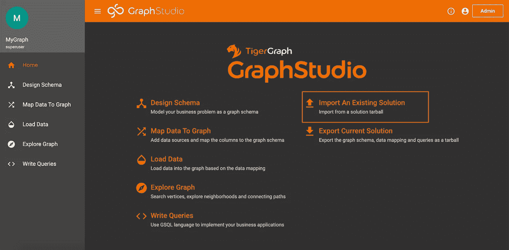
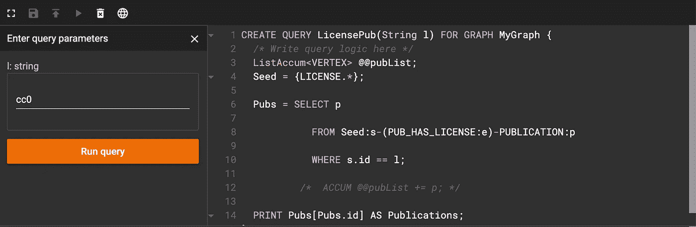
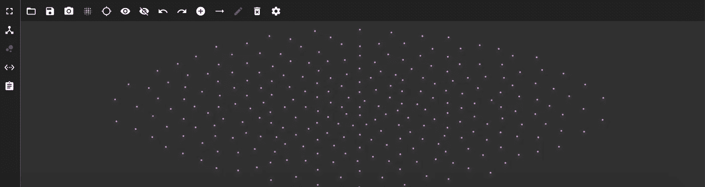
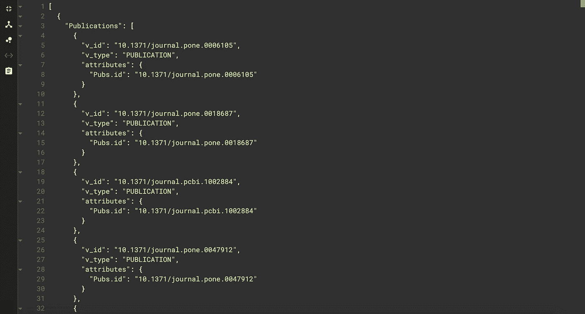
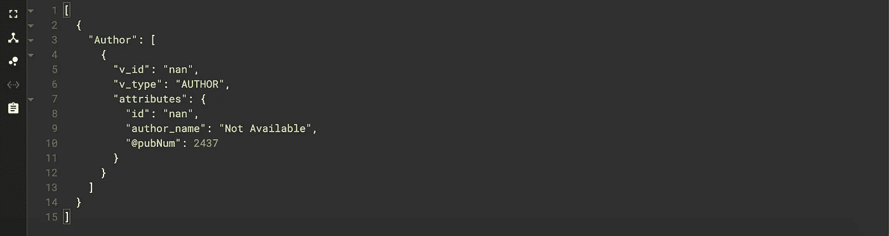
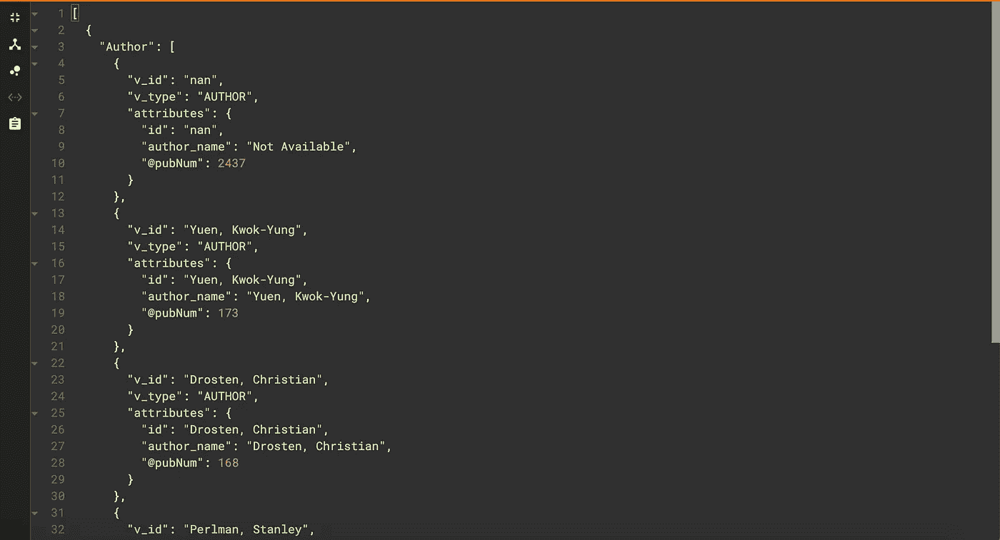
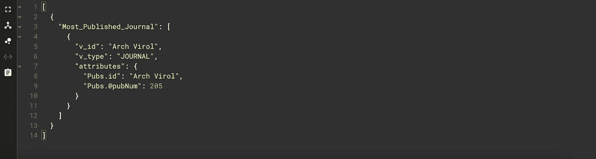
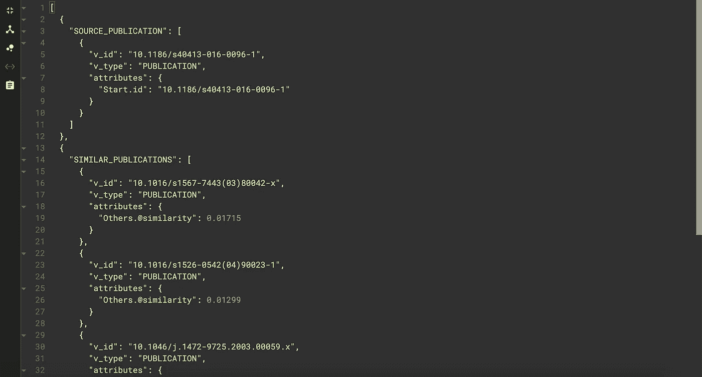

# 图形查询搜索(第 3 部分)

> 原文：<https://towardsdatascience.com/graph-query-searches-part-3-a8bff845c3f1?source=collection_archive---------53----------------------->

## 使用 TigerGragh 云编写 GSQL 查询


[安德鲁·尼尔](https://unsplash.com/@andrewtneel?utm_source=unsplash&utm_medium=referral&utm_content=creditCopyText)在 [Unsplash](https://unsplash.com/s/photos/search?utm_source=unsplash&utm_medium=referral&utm_content=creditCopyText) 上拍照

# 议程

1.  在图表中建模发布数据
2.  什么是图形查询
3.  编写图形查询
4.  结论

# 1.在图表中建模发布数据

这是探索数据提取和建模系列文章的第 3 部分。如果到目前为止您已经了解了这个系列，欢迎回来！。如果你是新来的，我会简单介绍一下我们到目前为止所做的工作。在[第一部分](/using-scispacy-for-named-entity-recognition-785389e7918d)中，我们探索了在与新冠肺炎相关的生物医学文献上使用自然语言处理和实体抽取。在第 2 部分的[中，我们学习了如何使用 TigerGraph Cloud 获取数据并建模。查看这些文章，深入了解我们到目前为止所做的一切。](/linking-documents-in-a-semantic-graph-732ab511a01e)

现在，在第 3 部分中，我们将研究如何编写图形搜索查询来轻松分析图形中的数据。你需要一个完整的图形来编写查询。你可以按照[第二部分](/linking-documents-in-a-semantic-graph-732ab511a01e)中的步骤从头创建一个图，或者你可以将我们创建的图导入到 TigerGraph Cloud 中。该图表以及我们使用的所有数据可以在[这里](https://gofile.io/d/fyijVS)找到。

为了导入图表，按照这些步骤创建一个空白溶液[。在您的解决方案主页上，单击**导入现有解决方案**。](https://www.youtube.com/watch?v=JARd9ULRP_I)



在主页上导入解决方案

不幸的是，您仍然需要手动映射和加载数据。但是，在议程项目 4 和 5 下的第 2 部分[中，我将带您了解如何做到这一点。](/linking-documents-in-a-semantic-graph-732ab511a01e)

# 2.什么是图查询？

在我们开始编写查询之前，我们可能应该了解它们是什么。图形查询本质上是搜索图形并执行某些操作的命令。查询可以用来查找某些顶点或边，进行计算，甚至更新图形。由于图形也有可视化表示，所有这些也可以通过 UI 来完成，如 TigerGraph Cloud 提供的 UI。但是，当处理大量数据或试图创建微调的图形搜索时，使用可视化界面是非常低效的。因此，我们可以编写查询来快速遍历一个图，并提取或插入我们想要的任何数据。

# 3.查询结构

GSQL 提供了许多不同的查询方法。我们将专注于搜索。图搜索的核心是一个叫做 **SELECT** 语句的东西。顾名思义，select 语句用于选择一组顶点或边。 **SELECT** 语句带有几个参数来缩小搜索范围。

来自子句的**指定了你选择的边或顶点的类型。**

**WHERE** 子句允许您声明顶点或边的特定条件。

**ACCUM** 和 **POST-ACCUM** 子句让您处理 [*累加器*](https://docs.tigergraph.com/dev/gsql-ref/querying/accumulators) ，它们是特殊的 GSQL 变量，在您搜索时收集信息(信息可以是数字、顶点集或边集等。).

**有**子句，类似于 **WHERE** 子句，让你提供附加条件；但是，这些将在前面的条款之后应用。

通过 **ORDER BY** 子句，您可以根据某个属性值对聚集的边或顶点进行排序。

最后， **LIMIT** 子句限制了搜索结果的数量。

您可以在 [TigerGraph 文档页面](https://docs.tigergraph.com/dev/gsql-ref/querying/select-statement#select-statement-data-flow)上找到所有这些细节，以及其他参数和查询方法。

# 3.编写图形查询

几乎任何你能想到的对图的搜索都可以用 **SELECT** 语句及其相应的子句来处理。为了证明这一事实，让我们练习编写一些查询。

以下所有的疑问都可以在我的 [GitHub 页面](https://github.com/akash-kaul/GSQL-Query-Searches.git)找到。

这些查询按照从最简单到最复杂的顺序排列。

## 具有给定许可证的出版物

**目标:**找到属于给定许可类型的所有出版物。

**代码:**

```
CREATE QUERY LicensePub(String l) FOR GRAPH MyGraph {/* Finds all publications with a given license type   
   Sample Inputs: cc0, cc-by, green-oa, cc-by-nc, no-cc  */Seed = {LICENSE.*};Pubs = SELECT p FROM Seed:s-(PUB_HAS_LICENSE:e)-PUBLICATION:p WHERE s.id == l;PRINT Pubs[Pubs.id] AS Publications;
}
```

**解释:**我们来分解一下我们的代码在做什么。我们要选择连接到特定许可证顶点的所有发布顶点。因此，我们从所有的**许可证**顶点遍历到所有的**发布**顶点，条件是许可证 **id** 是我们指定的(即 cc0、no-cc 等)。).然后，我们只打印我们的结果。在我们的打印声明中有两件事需要注意。

1.  如果我们简单地写`PRINT Pubs`，我们的输出将打印出版物及其所有相关数据(标题、摘要等)。因此，为了过滤输出数据，我们可以使用括号指定我们想要的属性。在我们的例子中，我们只通过写`PRINT Pubs[Pubs.id]`打印出 id。
2.  将**用作**语句纯粹是装饰性的，它只是改变了打印出的结果列表的名称。这在您提取要在其他上下文中使用的数据时很有用，但对于编写查询来说不是必需的。

现在，让我们保存并安装我们的代码。当我们运行它时，我们得到一个类似这样的输入框:



运行许可证查询后的界面

例如，我输入“cc0”作为许可证代码。当我单击“运行查询”时，我会看到如下所示的图像:



运行许可查询后产生的发布顶点

这显示了拥有我们指定的许可证的每个发布顶点。但是，这种观点相当混乱。我们可以点击左侧的 **< … >** 图标来查看 JSON 输出。JSON 输出应该是这样的。



许可证查询的 JSON 输出

这个看起来干净多了！我们还可以看到打印报表调整的效果。结果列表的名称是“Publications”，打印的唯一顶点属性是 id。

对于下面的查询，我将只显示 JSON 输出。

## 大多数出版物的作者

**目标:**找到发表文章次数最多的作者。

**代码:**

```
CREATE QUERY AuthorMostPubs() FOR GRAPH MyGraph {/* This query finds the author with the most publications   
Change the limit to see top 'x' authors */SumAccum<INT> @pubNum;Seed={AUTHOR.*};Author = SELECT a FROM Seed:a-()-:t ACCUM a.@pubNum +=1 ORDER BY a.@pubNum DESC LIMIT 1;  

PRINT Author;
}
```

**解释:**我们从选择**作者**顶点开始。注意这里的 **SELECT** 语句看起来有所不同。这是因为我们没有指定边或目标顶点。因为我们知道**作者**顶点只连接到**出版物**顶点，所以我们可以使用这种“懒惰”语法来避免指定边名和目标顶点。

我们也第一次看到累加器(在这里参考文档)。在这种情况下，我们使用一个名为 pubNum 的本地累加器。一个局部累加器作为每个顶点的唯一变量，一个 **SumAccum** 是一种存储累加和的累加器。

那么这个累加器是怎么工作的呢？当我们从每个**作者**顶点遍历到其连接的**出版物**顶点时，我们添加到我们的累加器中。因此，在 **ACCUM** 子句中，累加器将连接数(也是发布数)作为变量存储在每个 **AUTHOR** 顶点中。

下一步使用的是 **ORDER BY** 子句。我们用它来按照累加器值的降序排列结果作者。因此，拥有最多出版物的作者将会在列表的顶端

最后，我们使用 **LIMIT** 子句将输出限制为 1 个作者(列表中的第一个作者)。

当我们运行该函数时，我们的输出如下所示:



作者查询的输出

注意作者 **id** 是“南”。这是出版物没有作者时使用的 **id** 。所以，我们可以看到 2437 篇文章没有列出作者。这是很好的信息，但不完全是我们想要的。若要查看更多结果，请更改限制。作为一个例子，我将把限制改为 5。



作者搜索的 JSON 输出，限制 5

现在我们可以看到出版最多的作者有 173 本出版物(哇，太多了！)

## 出版物最多的期刊

我们可以运行一个类似于作者搜索的查询，但是要搜索发表文章最多的期刊。

目标:找到发表文章最多的期刊

**代码:**

```
CREATE QUERY JournalMostPubs() FOR GRAPH MyGraph {/* This query finds the journal with the most publications     Change the limit to find the top 'x' journals  */SumAccum<INT> @pubNum;Seed = {PUBLICATION.*};Pubs = SELECT t FROM Seed:s-(PUB_HAS_JOURNAL) -:t          

           ACCUM t.@pubNum +=1 ORDER BY t.@pubNum DESC LIMIT 1;PRINT Pubs[Pubs.id, Pubs.@pubNum] AS Most_Published_Journal;
}
```

**解释:**代码本质上和以前一样，但是我们改为搜索期刊而不是作者。我们还使用前面描述的打印过滤器来使我们的输出更好。



日记帐查询的 JSON 输出

我们看到有 205 篇出版物的“Arch Virol”是我们搜索的顶级期刊。

## 对某一类类型引用最多的出版物

**目标:**给定一个类别类型，找出该类别中医学术语最多的出版物。

示例类别类型:DNA、疾病、癌症、有机体、分类单元。

完整的名单可以在这里找到[。](https://allenai.github.io/scispacy/)

**代码:**

```
CREATE QUERY ClassPub(String c, Int k) FOR GRAPH MyGraph{
/* This query finds the top articles related to a class     
   Sample Input: CANCER, 5 */SumAccum<INT> @entNum;Seed = {CLASS.*};Ents = SELECT e        

          FROM Seed:s-(ENTITY_HAS_CLASS)-ENTITY:e       

          WHERE s.id == c;Pubs = SELECT p FROM Ents:e -(PUB_HAS_ENTITY)-PUBLICATION:p       

           ACCUM p.@entNum += 1 ORDER BY p.@entNum DESC LIMIT k;PRINT Pubs[Pubs.id, Pubs.@entNum];
 }
```

解释:这是我们第一次看到两跳搜索。第一跳选择与给定类别类型相关的所有实体或关键字，第二跳查找包含这些实体的所有出版物，并对它们进行排名。作为一个例子，让我们给我们的查询分类为**癌症**，并选择顶部的 **5** 。我们的输出看起来像这样。


类搜索的 JSON 输出

我们现在可以看到哪些出版物对癌症的引用最多，以及每个出版物的引用数量。

## 类似出版物

**目标:**给定一篇论文，根据它们共享的关键词找到相似的论文。

我们将使用 Jaccard 相似度来确定两篇论文的相关程度。这种算法本质上是计算两篇论文在关键词总数上的共同关键词数。你可以在这里阅读更多关于算法[的内容。你可以在](https://en.wikipedia.org/wiki/Jaccard_index) [TigerGraph GitHub](https://github.com/tigergraph/gsql-graph-algorithms/blob/master/algorithms/schema-free/jaccard_nbor_ap_json.gsql) 上看到这个公式的一个例子，以及许多其他很酷的图形公式。

**代码:**

```
CREATE QUERY SimilarEnt(STRING doi, INT top) FOR GRAPH MyGraph {/* Use Jaccard Similarity to find top similar articles of a given article based on the key medical terms used   
Sample Input: 10.1186/1471-2164-7-117, 5 */SumAccum<INT> @intersection_size, @@set_sizeA, @set_sizeB;SumAccum<FLOAT> @similarity;VERTEX check;Seed = {PUBLICATION.*};Start = SELECT p FROM Seed:p WHERE p.id == doi ACCUM check = p,    
                         @@set_sizeA+=p.outdegree("PUB_HAS_ENTITY");Subjects = SELECT t FROM Start:s-(PUB_HAS_ENTITY)-:t;Others = SELECT t FROM Subjects:s -(PUB_HAS_ENTITY) - :t WHERE t!= check ACCUM t.@intersection_size +=1,                  
                  t.@set_sizeB = t.outdegree("PUB_HAS_ENTITY")                            

            POST-ACCUM t.@similarity = t.@intersection_size  
                       *1.0/(@@set_sizeA+t.@set_sizeB- 
                       t.@intersection_size) ORDER BY t.@similarity DESC LIMIT top;PRINT Start[Start.id] AS SOURCE_PUBLICATION;  
PRINT Others[Others.@similarity] AS SIMILAR_PUBLICATIONS;
}
```

**解释:**我们首先创建 4 个累加器。每一个都代表 Jaccard 公式中使用的一个值。对于我们的第一个 **SELECT** 语句，我们选择与输入 **doi** 匹配的发布，并将连接到该顶点的所有边收集到一个累加器中。对于第二条语句，我们选择该发布中的所有实体。对于我们的第三个语句，我们找到了具有我们刚刚收集的任意数量的实体的所有出版物，并找到了交集大小(与原始论文相同的实体的数量)。最后，我们计算 Jaccard 索引，并将相似度最高的出版物排在输出列表的顶部。

让我们看一个例子。我用了**doi**= 10.1186/s 40413–016–0096–1 和 **top** =5。



相似性查询的 JSON 输出

我们可以看到我们的起始出版物以及前 5 个类似的出版物，每个出版物都有各自的相似性得分。

# 4.结论

如果你跟随这篇文章，我为你鼓掌！这份材料并不容易，学习一门像 GSQL 这样的新语言可能会很棘手。我希望这个 GSQL 查询的演练对您有所启发。我强烈推荐阅读我的其他论文，以获得我们今天所讨论的所有内容的更好的背景。如果您想了解更多的查询算法和结构，请查阅 GSQL 的 [TigerGraph 文档。如果你正在寻找更多的内容，请继续关注！我将很快发布第 4 部分。在这个系列的最后一部分，我将介绍如何使用我们的图形数据库和查询来输出信息，我们可以使用 Plotly](https://docs.tigergraph.com/) 的 [UI 平台 Dash 来直观地表示这些信息。这样，如果您遵循了所有 4 个部分，您将完成一个完整的端到端应用程序！](https://plotly.com/dash/)

如果你喜欢这篇文章，一定要看看我的其他文章，并关注我的更多内容！

# 资源

1.  [https://towards data science . com/using-scispacy-for-named-entity-recognition-785389 e 7918d](/using-scispacy-for-named-entity-recognition-785389e7918d)
2.  [https://towards data science . com/linking-documents-in-a-semantic-graph-732 ab 511 a01e](/linking-documents-in-a-semantic-graph-732ab511a01e)
3.  [https://gofile.io/d/fyijVS](https://gofile.io/d/fyijVS)
4.  [https://www.youtube.com/watch?v=JARd9ULRP_I](https://www.youtube.com/watch?v=JARd9ULRP_I)
5.  [https://docs . tiger graph . com/dev/gsql-ref/query/accumulators](https://docs.tigergraph.com/dev/gsql-ref/querying/accumulators)
6.  [https://docs . tiger graph . com/dev/gsql-ref/query/select-statement # select-statement-data-flow](https://docs.tigergraph.com/dev/gsql-ref/querying/select-statement#select-statement-data-flow)
7.  [https://github.com/akash-kaul/GSQL-Query-Searches.git](https://github.com/akash-kaul/GSQL-Query-Searches.git)
8.  [https://allenai.github.io/scispacy/](https://allenai.github.io/scispacy/)
9.  [https://github . com/tiger graph/gsql-graph-algorithms/blob/master/algorithms/schema-free/JAC card _ nbor _ AP _ JSON . gsql](https://github.com/tigergraph/gsql-graph-algorithms/blob/master/algorithms/schema-free/jaccard_nbor_ap_json.gsql)
10.  [https://docs.tigergraph.com/](https://docs.tigergraph.com/)
11.  [https://plotly.com/dash/](https://plotly.com/dash/)