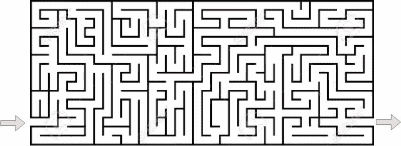
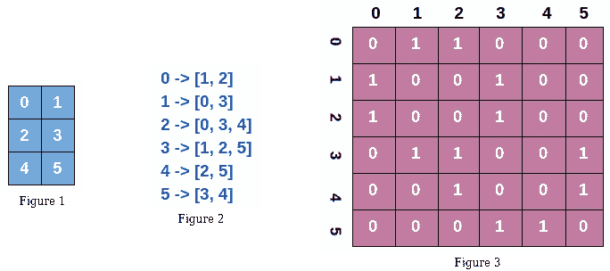
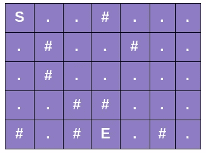
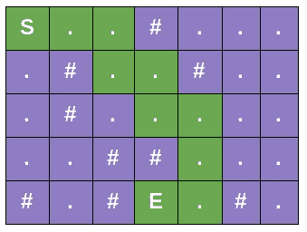
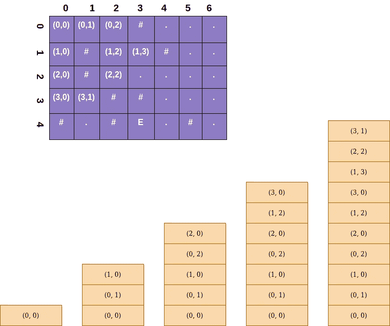
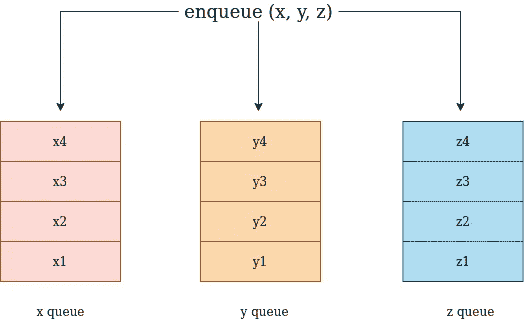
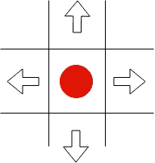

# 图论|网格上的 BFS 最短路径问题

> 原文：<https://towardsdatascience.com/graph-theory-bfs-shortest-path-problem-on-a-grid-1437d5cb4023?source=collection_archive---------14----------------------->

## [图论简化版](https://towardsdatascience.com/tagged/graph-theory-simplified)

> 大家好，欢迎回到我关于图论的全新系列的另一个帖子，名为 [**图论:Go 英雄**](https://medium.com/@kelvinjose/graph-theory-go-hero-1b5917da4fc1) 。如果你打算开始学习或者想要快速复习，我毫无疑问地推荐完整系列。我们将看到如何使用 [**广度优先搜索**](/graph-theory-breadth-first-search-d898e9f40fdd) ( **BFS** )来解决最短路径问题。我之前已经在 BFS[](/graph-theory-breadth-first-search-d898e9f40fdd)**做过另一个帖子。所以，让我们深入研究一下。**

**我希望你知道什么是 ***广度优先搜索***(*)以及它是如何工作的，因为我们会大量使用 BFS 的概念。***

## ***设置场景***

***图论中的许多问题可以用网格来表示，因为有趣的是网格是一种 ***隐式图的形式。*** 我们可以通过在网格内搜索来确定我们当前位置的邻居。在网格中寻找最短路径的一类问题是解决迷宫，如下所示。***

******

***作者照片***

***另一个例子是通过障碍物(如树木、河流、岩石等)到达一个位置。***

## ***网格上的图论***

***解决图问题的一种常见方法是首先将结构转换成一些表示格式，如邻接矩阵或列表。基本上，这些是存储图中邻域信息的数据结构。让我们来看一个更直观的版本。***

***假设我们有一个假想的图形。***

******

***作者照片***

***不，这不是图表。请看图 1，但这正是我要说的。假设图 1 中的每个单元格的左、右、下和上都有邻居。为了更清楚起见，单元格 0 有两个邻居，1 和 2。同样，小区 4 也有两个邻居 2 和 3。我们可以将这些单元格视为图中的顶点，其中 ***行*列*** 将是顶点的总数。图 2 是代表我们假想图的 ***邻接表*** ，现在你可以把它和第一张图联系起来了吧？最后一张图描绘了同一图的 ***邻接矩阵*** 。邻接矩阵的每个单元(I，j)都用 1 填充，其中节点 I 和 j 之间有一条边。我们在这里只使用 1 和 0，因为我们没有关于从顶点 I 到 j 的开销的信息。如果我们有，我们也可以使用这些信息。***

***一旦我们有了一个图的邻接表/矩阵表示，我们就可以在它上面运行多个图算法来解决不同的用例，比如找到最短路径和连接的组件。***

## ***地牢问题***

***这可能是我们在许多面试和编程竞赛中遇到的一个问题陈述，如下所示。***

> ***假设你被困在 2D 的地牢里，你必须找到最简单的出路。等等，我们也有一些障碍。地牢是由单位立方体组成的，里面可能会也可能不会填满石头。向东、向西、向南或向北移动只需要一分钟。你不能斜着走，因为迷宫里布满了坚硬的岩石。***

******

***作者照片***

***地下城的大小为 R x C，其中 R 是行数，C 是列数。我们必须从“S”室开始，在“E”室有出口。数字( ***#*** )符号描述了路线中的路障和时段(**)。**)显示一条开放的路线。***

******

***作者照片***

***在给定的设置中，一个解决方案可以在上面的绿色路线中绘制。我们的方法是从单元格**开始做 BFS，直到我们找到单元格*的出口******

**********

*****作者照片*****

*****如果您[还记得](/graph-theory-breadth-first-search-d898e9f40fdd?source=your_stories_page---------------------------)，我们使用了一个队列来存储图形中稍后要访问的点。我们这里也用同样的。我们从单元格(0，0)开始，并将其添加到我们的队列中。一旦它被访问，我们将被访问单元的所有邻居添加到队列中。单元格(0，0)有两个邻居，(0，1)和(1，0)。随着我们的访问，队列变得越来越大，并不断地向队列中添加更多的邻居。当我们满足退出条件时，我们停止这个过程，即我们访问退出单元 ***E*** (4，3)。然后我们可以通过回溯重新生成从出口到起点的路径。*****

## ****替代状态表示****

****到目前为止，我们一直使用单个队列来跟踪要访问的下一个节点，比如说一个 ***(i，j)*** 对。但是这不是最好的方法，因为它需要在队列中来回打包和解包。相反，让我们尝试另一种更好的方法，它可以很好地处理更高维的数据，并且具有更低的复杂度。****

****另一种方法是对每个维度使用单独的队列，因此在 3D 网格中，每个维度都有一个队列。****

********

****作者照片****

****一旦我们将一些潜在的信息放入队列，x、y 和 z 将进入各自的队列。同样，dequeue 一次检索一组 ***(x，y，z)*** 值。****

## ****伪代码解决地牢问题****

```
**# Global variables, I intentionally leave the values as **...** because # I don't have any meaningful values yet. But it won't affect how
# you understand the problem, I promise.R, C = ...
m = ...
sr, sc = ...
rq, cq = ...# Variables used to keep track of total number of steps to be taken
move_count = 0
nodes_left_in_layer = 0
nodes_in_next_layer = 1# Variable to see whether we already reached at the end or not
reached_end = false# Matrix to keep track of visited cells.
visited = ...# North, South, East and West direction vectors
dr = [-1, +1, 0, 0]
dc = [0, 0, +1, -1]**
```

****我们从初始化一些全局变量开始。 ***R*** 和 ***C*** 分别代表地牢的行数和列数。变量 ***m*** 是大小为 R x C 的输入字符矩阵。我们在变量 ***sr*** 和 ***sc*** 中存储我们的 BFS 的起点的地方存储初始行和列值。我们使用两个单独的队列 ***rq*** 和 ***cr*** 来存储要访问的下一个节点各自的行和列索引。此外，我们使用几个变量来跟踪到达终点的总步骤。***nodes _ left _ in _ layer***显示了在我们进行下一步操作之前有多少节点必须出列的计数，而***nodes _ in _ next _ layer***跟踪我们在 BFS 扩展中添加了多少节点，以便我们可以相应地更新***nodes _ left _ in _ layer******。*** 变量 ***到达 _ 结束*** 存储我们是否已经到达退出单元格 ***。*** 变量 ***访问过的*** 是一个大小为 R x C 的矩阵，用来标记访问过的单元格，因为我们不想再访问同一个单元格。变量 ***博士*** 和 ***dc*** 需要一些解释，我会很快覆盖。****

********

****作者照片****

****假设我们在 ***红色*** 单元格(I，j)。我们假设行索引只能在行之间移动，而列索引可以在列之间移动。因此，唯一可能的行操作是，要么我们可以通过从 I 中减去 1 来向北移动，要么通过将 I 加 1 到*来向南移动。同样，通过对列索引加 1 或减 1，即 ***j*** ，我们被限制向东或向西移动。我们使用不同的方向值组合在地牢中移动，这就是为什么之前把它定义为变量。我想你明白了。*****

****我们还没有解决这个问题。我们只定义了几个重要的变量。核心思想即将问世。****

```
**function solve():
    rq.enqueue(sr)
    cq.enqueue(sc)
    visited[sr][sc] = true

    while rq.size() > 0:
         r = rq.dequeue()
         c = cq.dequeue()
         if m[r][c] == 'E':
             reached_end = true
             break
         explore_neighbors(r, c)
         nodes_left_in_layer --
         if nodes_left_in_layer == 0:
              nodes_left_in_layer = nodes_in_next_layer
              nodes_in_next_layer = 0
              move_count ++
    if reached_end == true:
        return move_count
    return -1function explore_neighbors(r, c):
    for(i=0; i<4: i++):
        rr = r + dr[i]
        cc = c + dc[i]

        if rr < 0 or cc < 0:
            continue
        if rr >= R or cc >= C:
            continue

        if visited[r][c] == true:
            continue
        if m[r][c] == '#':
            continue

        rq.enqueue(rr)
        rc.enqueue(cc)
        visited[r][c] = true

        nodes_in_next_layer ++**
```

****这里我定义了两个函数分别是 ***solve()*** 和 ***explore_neighbors()。*** 我们从开始 BFS 过程的初始(I，j)位置开始排队，并将该单元标记为已访问。****

****然后，我们反复执行以下步骤，直到 rq 或 cq 变空。****

1.  ****将 rq 和 cq 中的每个元素出队。****
2.  ****我们检查当前位置是否是出口，如果是，我们退出循环。****
3.  ****如果当前位置不是出口点，那么我们必须通过调用***explore _ neighbors()***函数来探索它的邻居。****
4.  ****在***explore _ neighbors()***函数中，我们迭代地寻找所有可能的位置并检查几个条件。我认为条件是不言自明的。****

*   ****前两个条件检查我们是否在网格之外。这意味着，我们不能超过最小或最大的行数和列数。****
*   ****然后，我们检查当前位置之前是否已经被访问过。如果是真的，我们就不用再去参观了。****
*   ****此外，我们必须确保当前位置没有被阻止，所有被阻止的单元格都标有 ***#。*******

****5.我们将当前单元格的值排队，并将其标记为已访问。(别忘了，我们是在***explore _ neighbors()***函数调用里面)。这里发生的事情就像，我们试着移动到所有可能的位置，比如北、东、南、西。然后我们迭代地探索它的邻居。就是这样。****

****6.最后我们更新***nodes _ in _ next _ layer***的值，离开*。*****

> ****我们将再次回到 **solve()** 函数。****

****7.我们更新了几个参数来记录到目前为止我们走了多少步。****

****8.一旦我们找到出口，我们就出去。****

*******TADAAA！！！*******

****整个想法和算法相对来说超级简单，即使伪代码看起来很吓人。****

****我们开始研究迷宫是如何工作的，以及如何将同样的问题移植到一个更科学的问题中。我们看到了如何使用网格和邻接表来表示问题。我们了解了什么是地牢问题，以及如何使用 BFS 解决它。我的想法是展示我们如何使用 BFS 来解决网格上的最短路径问题。差不多就这些了。****

****在下一个帖子中，我们将有一个 ***介绍树算法*** 。在那之前，再见。****

********