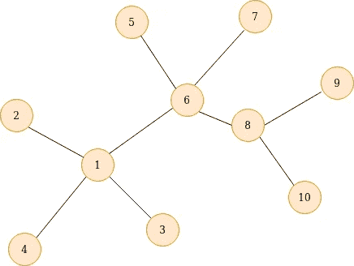
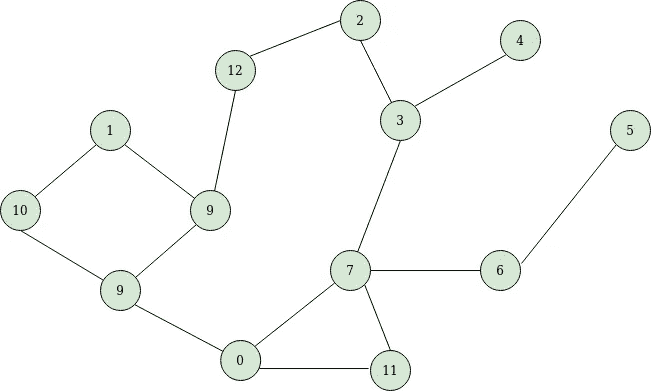
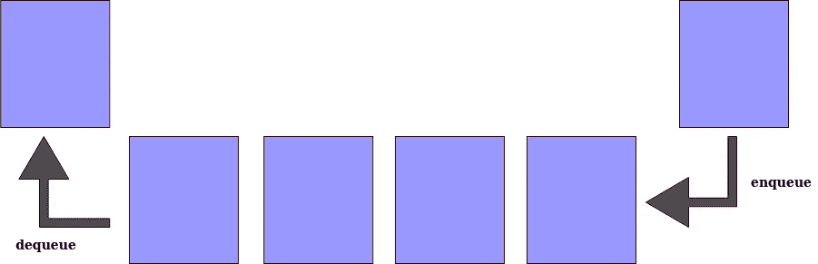

# 图论|广度优先搜索

> 原文：<https://towardsdatascience.com/graph-theory-breadth-first-search-d898e9f40fdd?source=collection_archive---------34----------------------->

## 简化的图论

> 欢迎大家回来。今天我们讨论的是**广度优先搜索**(**BFS**)——一种图探索算法。我们在之前的帖子中讨论了关于**深度优先搜索**。如果你不知道什么是图，或者想快速复习一下核心概念，我绝对推荐你看看我全新的关于图论的**系列**这里。

## 概观

***广度优先搜索*** 或简称为 ***BFS*** 是我们用来探索图的边和顶点的基本算法，它在许多现实世界的应用中起着关键作用。它运行的复杂度为**O**(**V**+**E**)其中 O、V、E 分别对应 ***大 O*** 、 ***顶点*** 和 ***边*** 。这种机制是许多应用程序的主要构件。我们可以通过实际遍历图的方式来区分 BFS 和 DFS。顾名思义，BFS 访问广度先于深度。这是把他们分开的基本事实。BFS 可以用于一个目的:在无向图中寻找最短路径*。*

## *基本 BFS*

*BFS 算法从某个任意节点开始，并在移动到下一个深度之前访问其所有邻居。简而言之，BFS 是分层工作的。*

**

*作者照片*

*如果我们从节点 1 开始 BFS，它将首先访问它的邻居，即 2、3 和 4。一旦我们完成了节点 1，我们最终会移动到下一个节点。在我们的例子中，节点 2、3 和 4 没有任何邻居，因此我们移动到下一个未访问的节点，即节点 6。节点 6 的直接邻居是 5、7 和 8。与前一个例子一样，节点 5 和 7 没有任何邻居，因此我们必须使用节点 8。游戏在这里发生了变化，节点 8 有两个邻居未被访问，所以我们访问它们并标记为已访问。这是一个非常基本的例子，但是相信我，这种图表只存在于纸上。*

*为了跟踪下一个要访问的节点，我们将顺序保存在一个**队列中。我将用一个更复杂的例子来解释它，这样我们会对它有更好的理解。***

**

*作者照片*

*我们从节点 0 开始，将其添加到队列中，如下所示。*

**

*作者照片*

*现在，我们必须检查是否有任何邻居未被访问，是的。0 的直接邻居是 9、7 和 11。首先，我们将 0 标记为已访问，并将 0 的所有邻居添加到队列中。*

**

*作者照片*

*如上所示，队列中有三个新的未访问节点。下一个要访问的节点是 9。因此，我们将其标记为已访问，并将所有直接邻居添加到队列中，如下所示。*

**

*作者照片*

*下一个要访问的节点是 7，所以我们考虑到它，并将其所有邻居添加到队列中。节点 7 有三个邻居，即 3、6 和 11。如果我们看一下队列，11 已经在那里了，所以我们省略它，把其余的添加到队列中，如下所示。*

**

*作者照片*

*我们重复这个过程，直到队列中的所有元素都被访问。这是 BFS 的整体工作流程。*

## *使用队列*

*BFS 算法使用队列来跟踪下一个要访问的节点。到达一个节点后，我们将所有邻居节点添加到同一个队列中，以便以后访问。*

**

*作者照片*

*队列数据结构的工作方式与真实世界的队列完全一样，对象被添加到队列的后面。首先进入队列的对象具有最高优先级。这意味着添加到队列中的第一个元素将得到服务，并首先离开队列。有两种与队列相关的基本操作，即在队列的后面插入一个元素和从前面移除一个元素，前者称为*，后者称为*。***

## ***伪码***

```
*****#** global variables **n = number_of_nodes_in_the_graph
g = adjacency_list
visited = [false] * n
q = Queue()

q.enqueue(initial node)

while q is not empty
   {
     x = q.dequeue();
     if x is not visited:
      {
        visited[x] = true
        neighbors = g[x] 
        for y in neighbors:
            if y is not visited:  
	       q.enqueue(y)
      }
   }*****
```

***我们将节点总数保存在一个名为 ***n*** 的变量中。我们将有一个 [***邻接表***](/get-started-with-graph-theory-2b4460eeafc)——一个用于在内存中存储图形的结构——它包括每个节点及其对应的相邻连接。这是节点到边列表的映射。我们用一个 list ***visited*** 来检查一个特定的节点是否被访问过，它用 n 个 false 值初始化，因为我们还没有访问过任何节点。正如我们前面讨论的，我们使用队列 ***q*** 来跟踪要访问的节点。我们向队列中插入或 ***入队*** 一个任意节点，以启动 BFS 过程。我们移除或 ***出队*** 队列中存在的元素，我们必须确保当前节点尚未被访问。如果否，我们将当前节点的已访问状态更改为真。最后，我们将把所有直接邻居排入我们使用的队列。这个过程将被重复，直到队列变空，即当所有节点都被访问时。***

## **BFS 还能做什么**

*   **对等网络**
*   **社交网站**
*   **路径寻找**
*   **碎片帐集**
*   **网络广播**

**这是一个关于**广度优先搜索**的简介。希望大家觉得有帮助。**

**在下一篇文章中，我们会看到如何使用 BFS 从图中找到最短路径。谢谢你的时间和努力。**

****