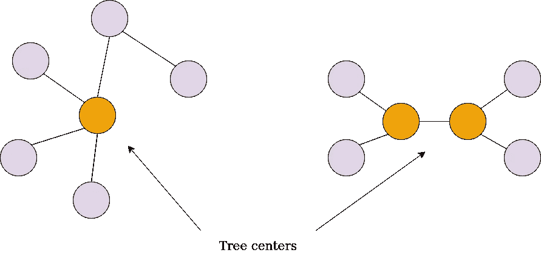
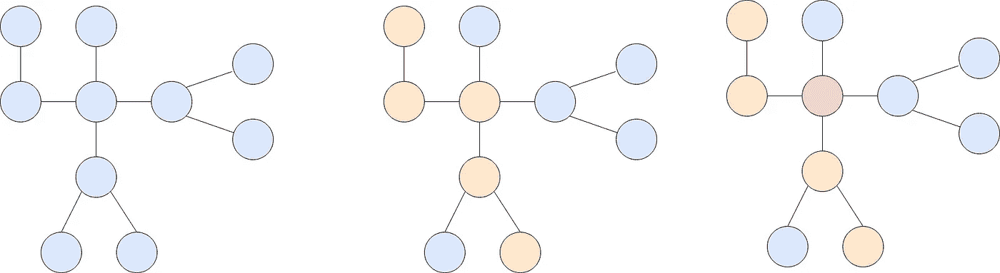
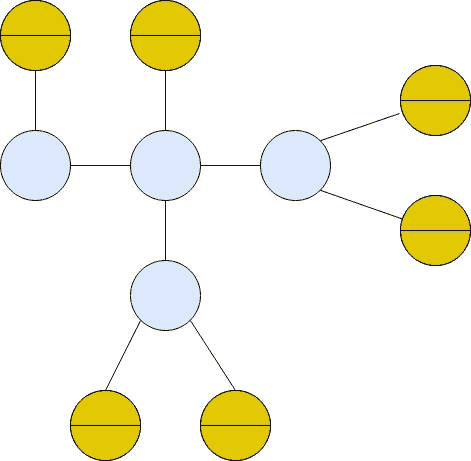
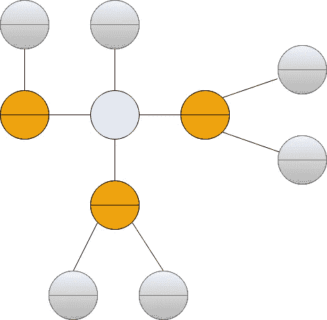

# 图论|树的中心

> 原文：<https://towardsdatascience.com/graph-theory-center-of-a-tree-a64b63f9415d?source=collection_archive---------28----------------------->

## [图论简化版](https://medium.com/tag/graph-theory-simplified)

> 欢迎大家回来。我们现在在这个叫做 [***图论:Go Hero***](https://medium.com/@kelvinjose/graph-theory-go-hero-1b5917da4fc1?source=---------2------------------) 系列的第 9 个帖子。去看看以前文章的索引页。我尽量每个周末更新。让我们看看如何找到树的中心。

## 介绍

寻找树的中心是一个需要了解的简便算法，因为我们经常在其他算法的子例程中看到它，而且当我们 [***为树***](/graph-theory-rooting-a-tree-fb2287b09779) 求根时，这也是一个选择根节点的有用方法。



作者照片

要记住的一点是，树可以有一个以上的中心，但不能超过两个。

## 计算中心

请注意，中心始终是树中每条最长路径的中间顶点或中间两个顶点。



作者照片

例如，上图中橙色的路径是最长的路径，红色节点被认为是其中的中心。如果我们重复这个过程，选择另一条可能的长路径，中心将保持不变。

另一种寻找中心的方法是像剥洋葱一样反复挑选每个叶子节点。


照片由 [C 在](https://unsplash.com/@cdrying?utm_source=unsplash&utm_medium=referral&utm_content=creditCopyText) [Unsplash](/photos/5oMpx91a9ks?utm_source=unsplash&utm_medium=referral&utm_content=creditCopyText) 上烘干

所以，我们从郊区开始，逐渐在中心结束。



作者照片

在我们的例子中，中间有一条水平线的节点是叶子。如果我们计算这些节点的 ***度*** ，

> 节点的度是它所连接的节点的数量。

肯定会是 1。因为所有这些叶节点都恰好连接到一个节点。当我们修剪树叶时，所有其他节点也会受到影响，即节点的度会开始降低。



作者照片

正如我们在上面的图像中看到的，我们的图形将开始反复松开它的叶子，直到我们找到它的中心。记住， ***我们可能会找到一个或多个中心*** 。

## 伪码

现在让我们看一些伪代码。

```
function **treeCenters**(g):
    n = g.numberOfNodes()
    degree = [0] * n
    leaves = []
    for(i=0; i<n; i++):
        if degree[i] == 0 or degree[i] == 1:
            leaves.add(i)
            degree[i] = 0
    count = leaves.size()

    while count < n:
        new_leaves = []
        for node in leaves:
            for neighbor in g[node]:
                degree[neighbor] = degree[neighbor] - 1
                if degree[neighbor] == 1:
                    new_leaves.add(neighbor)
        count += new_leaves.size()
        leaves = new_leaves
```

函数 ***的参数***g***tree centers()***是一个无向图。变量 n 表示我们的树中节点的数量。我们定义了两个数组，degree 和 leaves。前者的大小为 ***n*** 并存储树中每个节点的度，后者保留最近一层的叶节点。然后我们进入一个循环，我们计算图中每个节点的度，我们也检查我们是否考虑一个单节点树或者它是一个叶子节点。如果这两个条件中的任何一个为真，我们将条目添加到 leaves 数组中，并将其在 degrees 数组中的值标记为 0——因为我们不必再次访问该节点。变量 count 将记录到目前为止我们已经处理的节点数。然后，我们不断地检查树叶并修剪它们。最后，我们会得到树的中心。

这很简单，对吧？

我们将在下一篇文章中讨论 ***识别同构树*** 。敬请期待。

