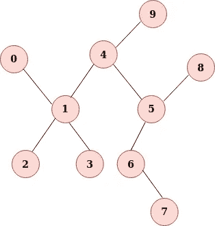
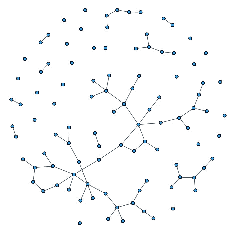
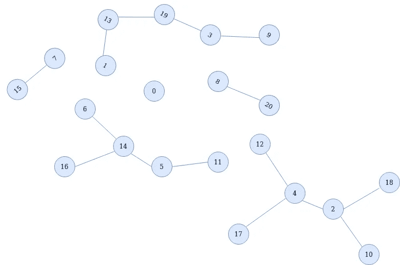
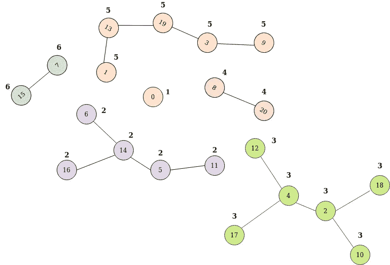

# 图论|深度优先搜索

> 原文：<https://towardsdatascience.com/graph-theory-depth-first-search-977c1ae386e1?source=collection_archive---------42----------------------->

## [图论简化版](https://towardsdatascience.com/tagged/graph-theory-simplified)

> 这是我系列文章的第三篇，[图论:Go 英雄](https://medium.com/@kelvinjose/graph-theory-go-hero-1b5917da4fc1)。我强烈推荐查看以前帖子的索引。
> 
> 在图论中，**深度优先搜索** ( **DFS** )是一种重要的算法，在一些包含图的应用中起着至关重要的作用。

## 概观

DFS 是我们可以用来探索图的节点和边的最基本的算法。这是一种遍历算法。关于 DFS 的首要事实是它的工程简单性和可理解性。DFS 运行的时间复杂度为 **O(V + E)** ，其中 **O** 代表**大 O** ， **V** 代表**顶点**， **E** 代表**边**。不过，它的一致性可以用于其他不同的应用，如检测桥梁和关节点，计算连接的组件和估计连通性。

## **基本 DFS**

顾名思义，DFS 算法访问 ***深度*** ，而不管当前节点或边之后是哪个节点或边，如果我们到达了一个死胡同——从那里我们不能再前进——我们 ***回溯*** 到未被访问的节点，并递归地继续这个过程*,直到我们访问了所有可能的节点和边。我们必须确保我们的 ***不会再*** 访问同一个节点*。**

****

**作者照片**

**对于给定的图形，有多种遍历选项可用。我在这里展示的是从节点 0 开始，然后像 1，2，3，…，9 这样继续下去。实际路径应该是 0-1-2-1-3-1-4-5-6-7-6-5-8-5-4-9。注意，我们再次回溯到几个节点，找出新的未访问路径。**

## **伪码**

```
**# global variables
**n = number_of_nodes_in_the_graph
g = adjacency_list
visited = [false] * n****function dfs(at):
    if visited[at]:
        return
    visited[at] = true** **neighbors = g[at]
    for node in neighbors:
        dfs(node)**# start DFS at node 0
**start_node = 0
dfs(start_node)**** 
```

**我们开始定义图中节点的总数(***【n】***)。我们将有一个 [***邻接表***](/get-started-with-graph-theory-2b4460eeafc)——一个用于在内存中存储图形的结构——它包括每个节点及其对应的相邻连接。这是节点到边列表的映射。我们定义一个大小为 ***n*** 的列表来表示该节点是否已经被访问过。在初始化时，列表将包含所有的 ***假*** 值，因为我们还没有访问任何节点。当我们访问每个节点时，相应的位置就会被替换为 ***真*** 。已经定义了一个名为 ***dfs()*** 的函数，并在伪代码末尾调用了该函数。我们将第一个要访问的节点设置为 0。当函数 *dfs()* 被调用时，它检查该节点是否已经被访问过，如果没有，我们将用标志着成功访问的 true 替换此时为 false 的 visited[node]。然后，我们检索刚刚访问过的节点的邻居，并对每个邻居递归地调用 *dfs()* 函数。**

## **连接的组件**

**让我们讨论一下 DFS 的一个主要用例，即在图中查找连接的组件。无向图的**连通分量**是节点的最大集合，使得每对节点通过路径连接。**

****

**作者照片**

**有时一个图可能被分成多个部分。连通分量形成了图顶点集合的一个 ***划分*** ，意味着连通分量是非空的，它们是成对不相交的，并且连通分量的并集形成了所有顶点的集合。没有关联边的顶点也是一个独立的组件。从图中识别组件的一种方法是给它们着色。因此，每个组件都有与之相关的独特颜色。给组件着色对人类很有吸引力，但相关的问题是——如何给机器着色，例如计算机。在机器的情况下，我们可以用相似的 id(可能是一些整数)来标记组件的每个节点。就像配色方案一样，每个组件都拥有一个唯一的 id。**

**我们来看看上面描述的标注是怎么做的。为了方便起见，我从上面的图表中提取了一组组件，如下所示。**

****

**作者照片**

**首先，我们必须从 ***0*** 到 ***n*** 对每个节点进行显式编号，其中 n 是节点的最大数量。其思想是在每个尚未访问的节点上启动 DFS，并将所有可到达的节点标记为同一组件的一部分。如果我们从节点 0 开始，它本身已经是一个组件，因为它没有传入或传出连接，我们用整数 1 标记它。现在，如果我们选择节点 6 作为下一个节点，我们按照 6 - 14 - 16 - 14 - 5 - 11 的顺序进行 DFS，并将该组件的所有节点标记为 2。我们对图中的每个其他组件重复相同的过程。最终的结果看起来会更加丰富多彩，如下图所示。**

****

**作者照片**

## **伪码**

```
**# global variables
**n = number_of_nodes_in_the_graph
g = adjacency_list
count = 0
component = []
visited = [false] * n****function find_components()
    for(i=0; i<n: i++):
        if !visited[i]:
            count ++
            dfs(i)
    return count****function dfs(at):
    visited[at] = true
    component[at] = count
    for next in g[at]:
        if !visited[next]:
            dfs(next)****
```

**我们首先定义了一些全局变量来存储列表中节点的数量，邻接表，一个存储组件数量的计数器，一个跟踪组件标签的列表和一个查看节点是否已经被访问过的列表。**

**我定义了两个名为***find _ components()***和 ***dfs()*** 的函数。第一个函数循环遍历我们拥有的每个节点，并确保它被访问。如果没有，计数器将增加 1，以标记新组件的存在，并调用 *dfs()* 函数对组件进行深度优先搜索。**

***dfs()* 函数采用一个参数，即每个节点的 id 作为自变量。函数 *dfs()* 做的第一件也是最重要的事情是，它标记当前访问的节点，并用计数器更新组件列表。计数器值表示组件的标签。同一组件中的所有节点将具有相同的标签。然后，该函数在邻接表中搜索任何可用的邻居，并递归调用相同的函数。**

## **DFS 还能做什么**

**我们可以将 DFS 算法扩展到:**

*   **计算最小生成树。**
*   **检测和查找图中的循环。**
*   **确定二分图。**
*   **寻找强连接的组件。**
*   **对节点进行排序。**
*   **找到桥梁和关节点。**

**这就是深度优先搜索。当然，下一个是关于**广度优先搜索**的细节。我绝对应该感谢你的时间，感谢你的努力。**

****