# 图论|树的介绍

> 原文：<https://towardsdatascience.com/graph-theory-introduction-to-trees-a34ab267fc28?source=collection_archive---------45----------------------->

## [图论简化版](https://towardsdatascience.com/tagged/graph-theory-simplified)

> 大家都怎么了？这是我的全新系列 [**图论的最新补充:Go Hero**](https://medium.com/@kelvinjose/graph-theory-go-hero-1b5917da4fc1) 在这里我们深入讨论图和相关算法。查看一下，快速浏览一下。这里我们将简单介绍一下树，它是一种图形。所以，我们开始吧。

**什么是树**？

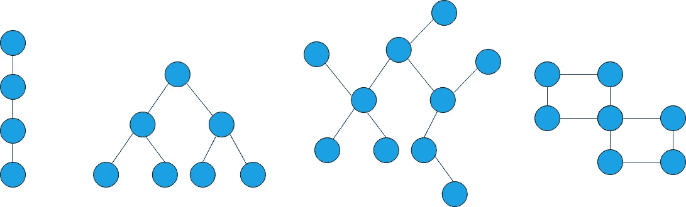

作者照片

我们上面有两张图表，你能找出不一样的吗？

正确，第四个脱颖而出。但是为什么呢？

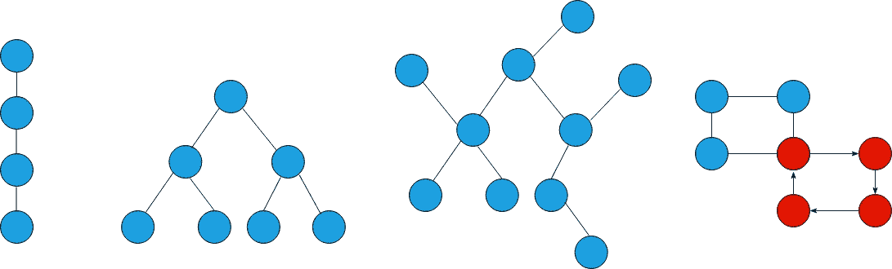

作者照片

因为**树是没有圈的无向图**。要记住的关键是树里面不允许有循环。你能找到一个打破规则的，对吗？干得好。

然而，还有另一种简单的方法，我们可以用它来判断给定的图是否是树。所有的树都有 **N - 1 条边，**其中 N 是节点的数量。

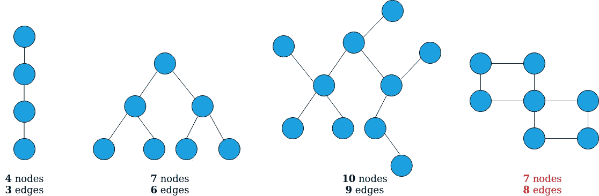

作者照片

我们的图表中有三个符合规则，对吗？但最后一个没有。

## 野外的树木

让我们来看几个我们遇到树的应用的场合。

*   **文件结构**

计算机文件系统包含目录、子目录和文件，它本质上是一棵树。

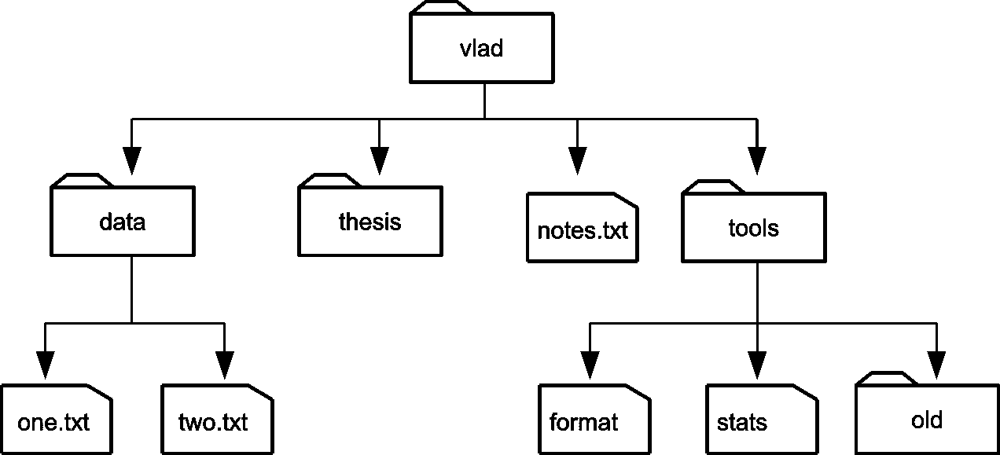

作者照片

*   **公司层级**

公司层级是指公司内部根据权力、地位和工作职能对个人进行的安排和组织。它划分了权力和责任，根据员工、部门、分部和其他管理人员在层级中的位置指定他们的领导。一个完整的公司应该有一个树状结构。

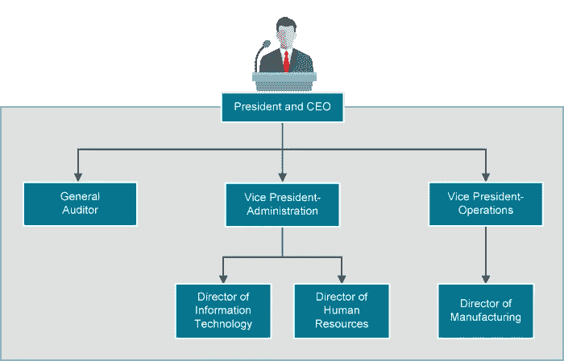

*   **评估数学表达式**

Tress 可用于将数学表达式和源代码分解成抽象格式，以便以正式的方式对它们进行评估。下面是一个表达式及其相应的树表示。

> **(a * b) + (c - d)**

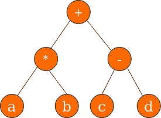

作者照片

*   **Web 文档对象模型(DOM)**

我们访问的每个网页都是由某些标签组成的，如、

# 、<title>等。DOM 是一种将 XML 或 HTML 文档视为树结构的接口，其中每个节点都是表示文档一部分的对象。下面给出了一个这样的树。</title>

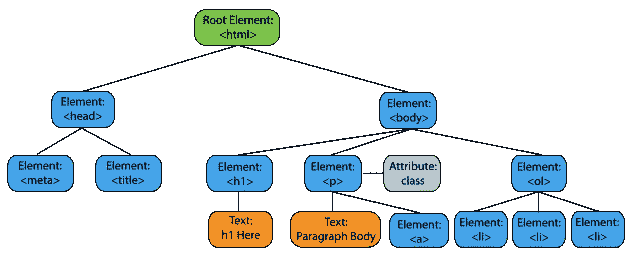

安东尼通过 [pixabay](https://pixabay.com) 拍摄的照片

树木还有更多应用，

*   决策树
*   家谱
*   分类学
*   图论树
*   文本分析树
*   社会等级
*   概率树

## 存储无向树

我们应该从给树中的每个节点分配编号开始，从 **0** 到 **n - 1** ，其中 n 是节点总数。

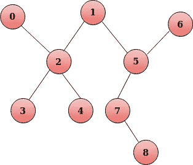

作者照片

存储这棵树最简单的方法是使用一个**边列表**，其中列表中的每一对表示两个节点之间的一条边。对于上面的树表示，相应的边列表将是，

> ***[(0，2)，(2，3)，(2，4)，(2，1)，(1，5)，(5，6)，(5，7)，(7，8)]***

迭代边对非常快速和容易，但不会存储任何邻域信息。由于这个缺点，我们宁愿使用另一种叫做**邻接表的表示法。**这是一张从一个节点到其邻居的地图。上面给定的相同的树可以转换成如下的邻接表，

> ***【0】→【2】***
> 
> ***【1】→【2，5】***
> 
> ***【2】→【0，1，3，4】***
> 
> ***【3】→【2】***
> 
> ***【4】→【2】***
> 
> ***【5】→【1，6，7】***
> 
> ***【6】→【5】***
> 
> ***【7】→【5，8】***
> 
> ***【8】→【7】***

除了这两种方法，我们还有另外一个解决这个问题的方法。我们可以使用**邻接矩阵**来显示两个节点之间是否存在边。

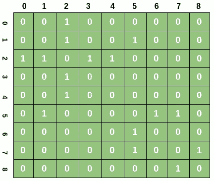

作者照片

如果存在从节点 **i** 到**j**else 0 的边，我们用 1 填充邻接矩阵的【T50(I，j)】单元。例如，如果在节点 5 和 7 之间存在边，那么(5，7)将是 1。

实际上，将树作为邻接矩阵很麻烦，因为大多数节点之间可能有边，也可能没有边，所以大多数单元会很稀疏，足以完全不占用内存。

## 有根的树

有根树会有一个特殊的节点被指定为**根节点**，因此命名为有根树。

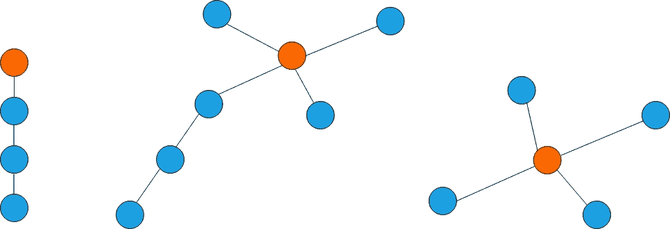

图片 bu 作者

这里，橙色的节点被指定为根。任一边缘都可能靠近根部或远离根部。每棵有根的树都只有一个根。一些递归算法使用有根树来跟踪执行流程。

## 二叉树

我们永远不能离开这个会议没有提到二叉树。我们称之为二叉树或简称为 B 树是因为树中的每个节点总共最多有 2 个子节点。

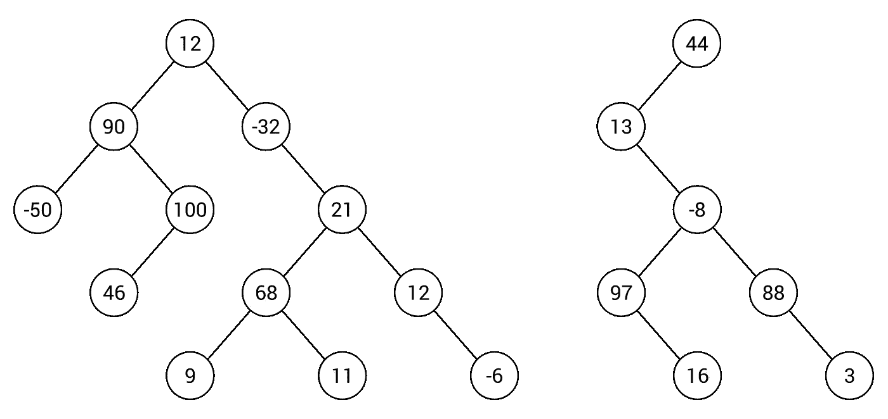

作者照片

在现实世界中，B 树很少存在。

## 二叉查找树

我们称一棵树为二叉查找树当且仅当它满足 BST 不变量，BST 不变量定义为，对于每个节点 x，左子树中的值严格小于 x 的值，右子树中的值大于 x 的值。二叉查找树在搜索问题时非常有用。

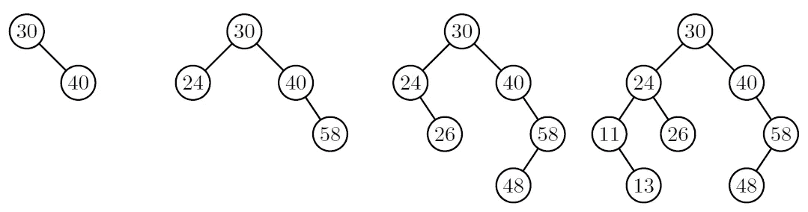

作者照片

上面的实现禁止我们的树有重复的条目。所以树中的每个节点都会感知到一个独特的元素。

## **存储有根的树**

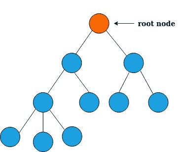

作者照片

有根树最自然地以自顶向下的方式递归定义。实际上，我们总是维护一个指向根节点的指针，这样我们就可以访问树及其内容。此外，每个节点都可以访问其子节点。

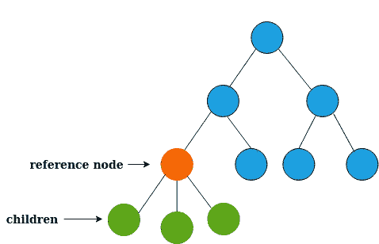

作者照片

这里，橙色的节点是当前引用节点，所有绿色的节点是子节点。注意，子节点是叶子，它们没有任何特定的子节点。

如果我们的树是一棵**二叉树**，我们可以将它存储在一个扁平数组中。在这种表示中，每个节点都有一个基于它在树中的位置而分配的索引位置。

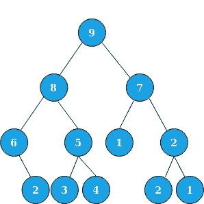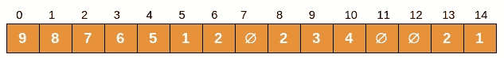

作者照片

我们从值为 9 的根节点开始，它存储在索引 0 中。接下来，我们有一个值为 8 的节点，它在索引 1 中，依此类推。如果你仔细观察数组，你可以看到一些位置用 **null、** why 填充，因为我们在树中没有任何特定位置的值。根节点将总是在索引 0 中，并且相对于位置 I 访问当前节点 I 的子节点。

例如，假设我是当前节点的索引，那么

> 左侧节点: **2 * i + 1**
> 
> 右节点: **2 * i + 2**

反过来，一个节点的父节点应该是，

> **楼层((i - 1)/2)**

## 结论

今天我们发现了什么是树和它的不同种类。这篇文章的核心思想是让你了解数据结构和它在现实世界中的应用。我们将在本系列的下一篇文章中讨论更多的算法。在那之前，敬请期待。

