# 图论|同构树

> 原文：<https://towardsdatascience.com/graph-theory-isomorphic-trees-7d48aa577e46?source=collection_archive---------15----------------------->

## [图论简化版](https://medium.com/tag/graph-theory-simplified/)

> 大家好。这是我关于图论的博客系列的第十篇文章，名为 [**图论:英雄**](https://medium.com/@kelvinjose/graph-theory-go-hero-1b5917da4fc1) 。今天，我们将深入探讨树中的**同构**。我强烈建议你阅读我最近发表的关于图论的文章，这些文章更多的是从计算机科学的角度出发。所以，让我们开始吧。

## 定义同构

同态是一个非常普遍的概念，出现在数学的几个领域。这个词来源于 ***希腊语*** *iso* ，意为“ ***等于*** ，”而 *morphosis* ，意为“ ***形成*** ”或“ ***形成*** ”它代表了两个相似系统之间的相互关系。维基百科 对它是什么以及它在数学中如何有用做了很好的解释。简而言之，它是两个对象之间的映射。例如，让我们举一个同构的例子。假设我们有两组数字。如果两个有限集有相同数量的元素，那么它们就是同构的。更详细地说，如果你能写下一个*函数，将一个集合中的每个元素分配给另一个集合中的一个唯一元素，那么两个(现在不一定是有限的)集合是同构的，这样函数就不会“遗漏”任何一个集合中的元素。*

## *图同构*

*问两个图 G1 和 G2 是否*同构的问题是问它们是否*结构相同。***

***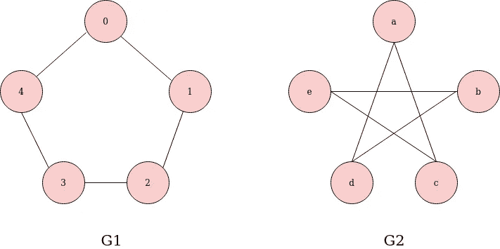***

***作者图片***

***我们可以看到上面的两张图。尽管图 G1 和 G2 的标签不同，可以被看作是不同的。但是，在结构上，它们是相同的图形。因此，反过来，存在一个同构，我们称之为图，同构图。如果我们打开第二个图，重新标记为相同的，我们将得到两个相似的图。***

***我们也可以用更严格的方式定义图同构的概念，因为说两个图在结构上是相同的并没有很好的定义。如果我们把一个图想象成顶点 V 和边 E 的集合，那么对于图 G1 和 G2，我们将分别有两个集合***【G1(V1，E1)*** 和 ***G2(V2，E2)*** 。我们称这两个图同构，如果在 V1 和 V2 之间存在一个双射，使得对于 G1 中的所有对，通过对所有边的节点应用函数 **φ** (phi)形成有效边的顶点导致出现在 G2 中的边。通俗地说，***

> **为了发生同构，需要有一个函数φ，它可以将 G1 中的所有节点/边映射到 G2，反之亦然。**

**判定两个图是否同构，不仅人眼显而易见，对计算机来说也是一个难题。**

**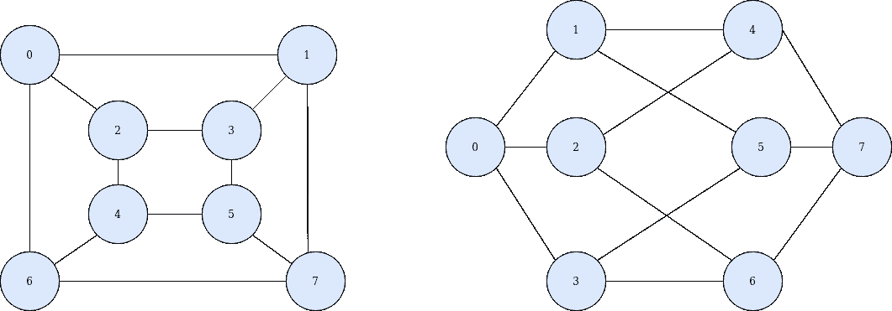**

**作者图片**

**图同构问题是否为 [***NP 完全***](https://en.wikipedia.org/wiki/NP-completeness) 还是一个未解决的问题。然而，许多多项式时间同构算法存在 fir 图子类，如树。**

**如果我让你找出同构的树，你能做到吗？是的，对吗？让我们试一试。**

**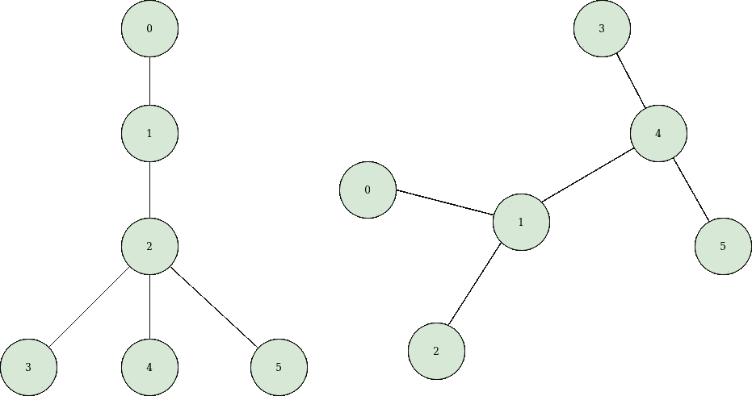**

**作者图片**

**如果你的答案是否定的，那你就对了。因为，它们在结构上是不一样的。**

**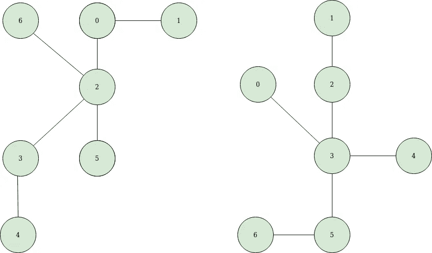**

**作者图片**

**这个怎么样？**

**答案是肯定的。因为存在一个标签映射**

> **6 - 0**
> 
> **1 - 1**
> 
> **0 - 2**
> 
> **2 - 3**
> 
> **5 - 4**
> 
> **3 - 5**
> 
> **4 - 6**

**有几种非常快速的 ***概率性*** (通常是 ***哈希*** 或 ***启发式*** 基础)算法来识别同构树。这些方法往往很快，但也容易出错，因为在有限的整数空间中会发生哈希冲突。**

**我们今天要学习的方法涉及到 ***将*** 树序列化为 ***unicode 编码*** 。这种唯一的编码只是代表一棵树的唯一字符串，如果另一棵树有相同的编码，那么它们就是同构的。**

**我们可以直接序列化一个没有根的树，但是实际上序列化一个有根的树在代码上更容易。然而，如果我们要对两棵树 T1 和 T2 进行根化以检查它们是否同构，需要注意的一点是，在序列化/编码树之前，要确保在两棵树中选择相同的根节点。**

**我们可以用来帮助自己的一个技巧是在两棵树之间找到一个公共节点。找到树的中心[也会做同样的事情。](https://medium.com/swlh/graph-convolutional-networks-in-action-bf80bb83cbe8)**

## **编码树**

**首先，我们取两棵树 T1 和 T2，它们可能同构，也可能不同构。**

**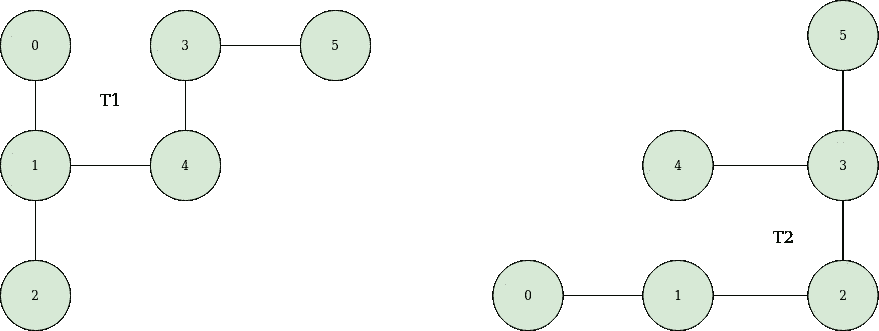**

**作者图片**

**我们必须找到树的中心。**

**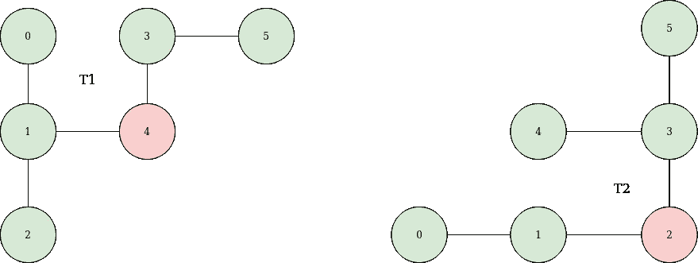**

**作者图片**

**我们要做的下一件事是[给一棵树](/graph-theory-rooting-a-tree-fb2287b09779)生根。**

**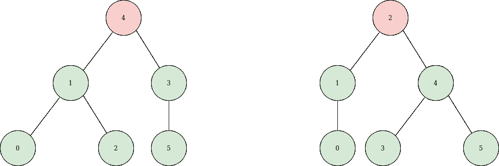**

**作者图片**

**现在我们必须为每棵树生成编码，并比较序列化的树是否相等。**

**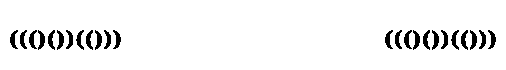**

**作者图片**

**树编码只是一系列左'('和右')'括号。然而，我们也可以把它们看作 1 和 0。同样的上述编码可以转换成建议的方法，**

**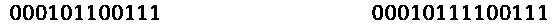**

**作者图片**

## **生成树编码**

****【AHU】**(***Aho***， ***Hopcroft*** ， ***Ullman*** )算法是一种将树表示为唯一字符串的巧妙的序列化技术。与许多树同构不变量和启发法不同，AHU 能够捕捉树的 ***度谱*** 和结构的 ***完整历史*** ，确保检查树同构的确定性方法。**

**让我们仔细看看。**

**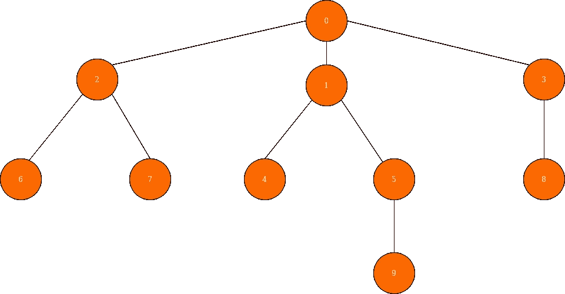**

**作者图片**

**我们首先要给树的每个叶子节点分配一个空括号( ***()*** )，如下所示。**

**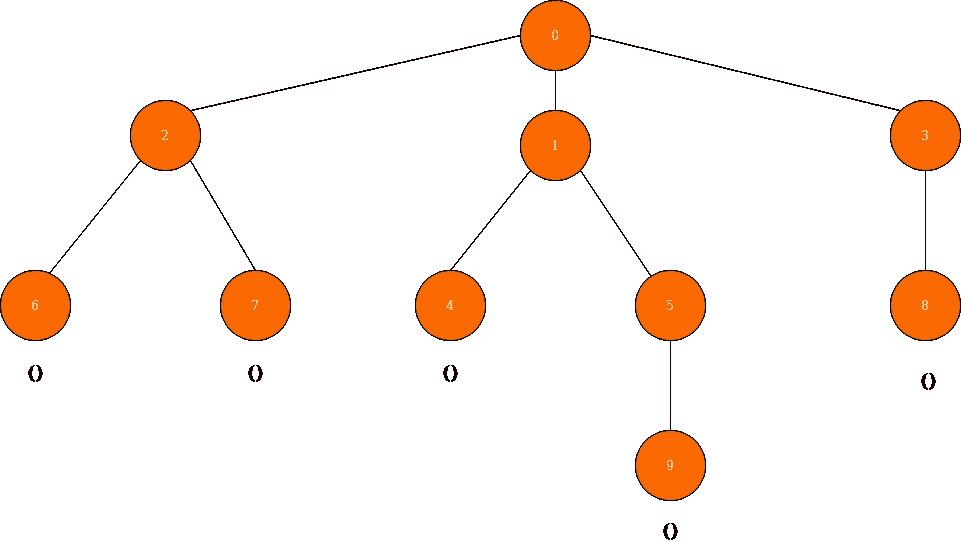**

**作者图片**

**现在我们必须向上移动(到叶子的父节点)并将叶子的括号组合在一起，并将其分配给父节点。当我们组合树叶的括号时，我们也应该将结果放在另一对括号中。例如，假设我们有一棵树，它有一个单亲和两片叶子。所以我们把()分配给树叶。当我们向父节点移动时，我们像()()一样将叶子的括号组合起来，并像(()())一样将其放在另一对括号中，并将其分配给父节点。这个过程不断重复，直到我们到达根节点。**

**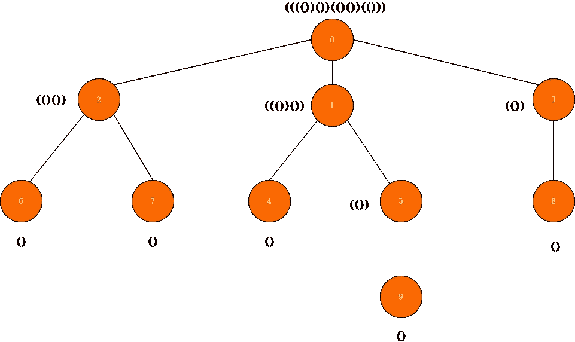**

**作者图片**

**如果你仔细按照上面的类比，我们会在树的末尾有这样的编码。**

> **不要忘记在组合括号之前对其进行排序。排序是按字典顺序进行的。**

## **编码摘要**

**总结一下我们为 AUH 所做的:**

*   **叶节点分配有()**
*   **每当我们向上移动时，组合、排序并包装括号。**
*   **在处理完一个节点的所有子节点之前，我们无法处理它。**

## **如果两棵树的表示相同，那么这两棵树就是同构的。**

**抓住你了。我希望这篇简介能对你未来的项目有所帮助。感谢你的时间和耐心。谢谢你。**

****