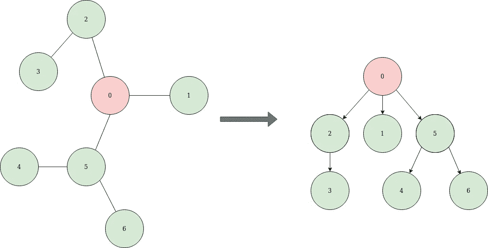
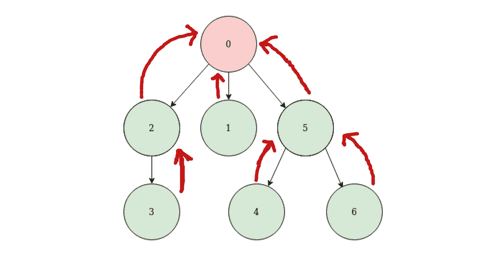
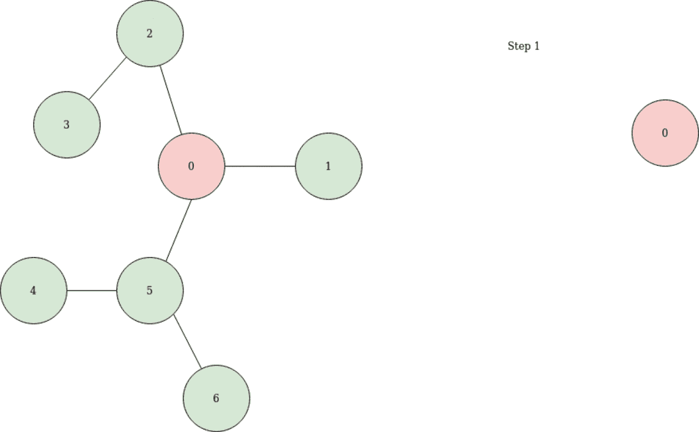

# 图论|为树生根

> 原文：<https://towardsdatascience.com/graph-theory-rooting-a-tree-fb2287b09779?source=collection_archive---------51----------------------->

## [图论简化版](https://towardsdatascience.com/tagged/graph-theory-simplified)

> 今天，我们要看看如何给一棵树扎根。这是我正在进行的系列 [***图论:围棋英雄***](https://medium.com/@kelvinjose/graph-theory-go-hero-1b5917da4fc1) ***的第 8 个帖子。你一定要查看索引页面，深入研究图表和相关问题。我通常会在每个周末尝试这个系列的新帖子。我们来看看生根是怎么做的。***

如果我们想处理有根的树，这是我们需要的最基本的转换之一。为一棵树生根的动机是，它通常可以帮助添加一个结构并简化问题。一棵有根的树可以把一棵无向树转换成一棵更容易操作的有向树。从概念上讲，给一棵树生根就像通过一个特定的节点捡起树，让所有的边都指向下。



作者照片

我们可以通过使用树的任何节点来确定树的根，但是，在选择节点时要小心，因为不是所有的节点都不能生成平衡的树。所以我们需要有所选择。

在某些情况下，拥有一条返回父节点的路由总是一个好主意，这样我们就可以往回走。我在下面用红线说明了到父节点的路由。



作者照片

让我们来看看如何给一棵树扎根。

## 生根溶液

用一个 [***深度优先搜索***](/graph-theory-depth-first-search-977c1ae386e1?source=your_stories_page---------------------------) ( **DFS** )很容易地完成一棵树的寻根。我已经创建了一个动画版本的结果 DFS 如下。你肯定会理解的，肯定。



作者创建的 GIF

简而言之，这就是扎根于一棵树。

## 伪码

```
class Treenode:

    int id;
    Treenode parent;
    Treenode [] children;function rootTree(g, rootId = 0):
    root = Treenode(rootId, null, [])
    return buildTree(g, root, null)function buildTree(g, node, parent):
    for child in g[node.id]:
        if parent != null and childId == parent.id:
            continue
        child = Treenode(childId, node, [])
        node.children.add(child)
        buildTree(g, child, node)
    return node
```

我们定义了一个名为 *Treenode 的类。*树中的每个节点都有一个唯一的 id，这就是我们存储在 id 占位符中的内容。正如我们前面所讨论的，保存父节点始终是一个最佳实践，因为这将有助于我们返回。此外，我们保存了一些对当前节点的子节点的引用。

然后我们定义一个名为 *rootTree* 的函数，它接受两个参数——一个图和节点的 id。图 *g* 将被表示为具有无向边的邻接表。 *rootTree* 方法的第一行创建了一个 *Treenode* 对象，带有给定的 *rootId* 、父引用和子对象列表。 *rootTree* 函数调用另一个名为 *buildTree* 的函数，带有参数 graph g、根节点和对父节点的引用。

*buildTree* 方法采用我们刚刚谈到的三个参数。当我们进入函数时，我们最终会进入一个遍历当前节点所有子节点的 for 循环。我们知道边是无向的，所以我们绝对需要管理添加指向同一个节点的有向边的情况。如果不满足上述条件，我们确定我们手里有一个确诊的孩子。然后我们为 *Treenode* 类创建一个对象，并将该子节点添加到当前节点的子节点列表中。之后，它使用新创建的节点将 ***DFS*** 更多地放入树中。当我们访问节点的所有邻居时，我们返回当前节点。

所以，这就是我们如何扎根一棵树。我们将在接下来的帖子中讨论 ***树中心*** 。让我们一起继续学习。

**干杯，全体。**

