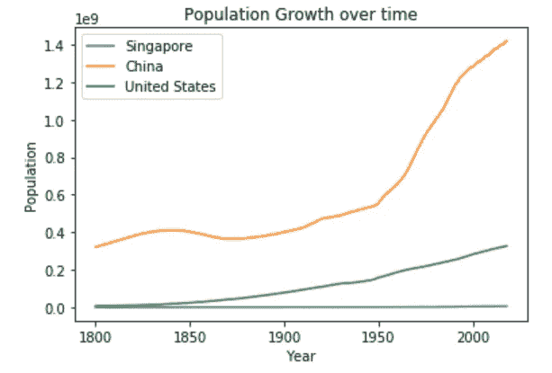
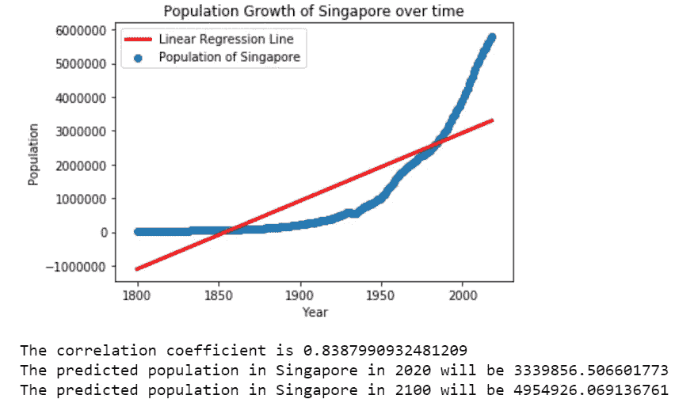
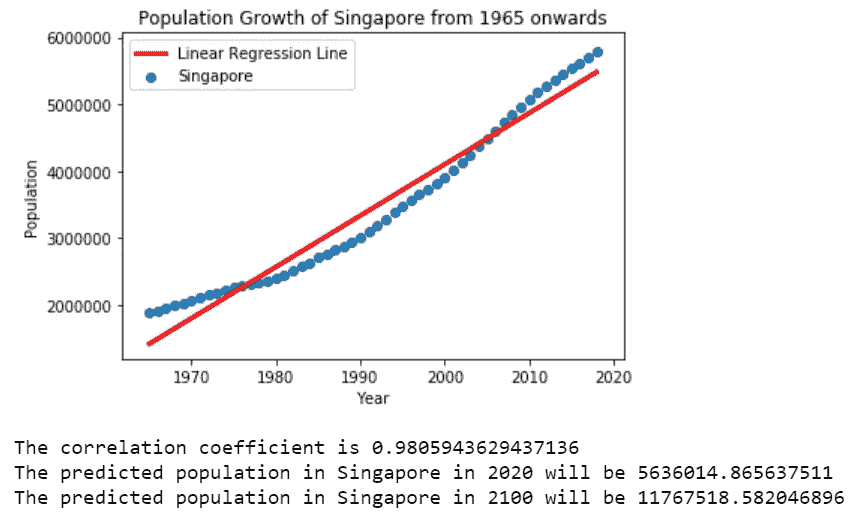
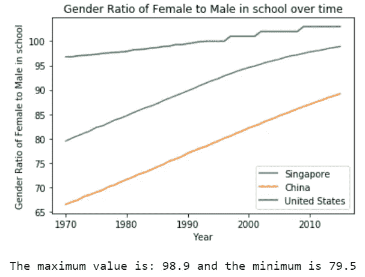
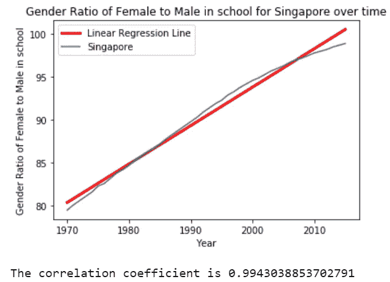
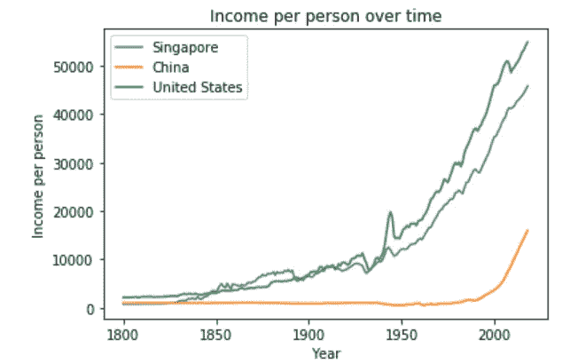
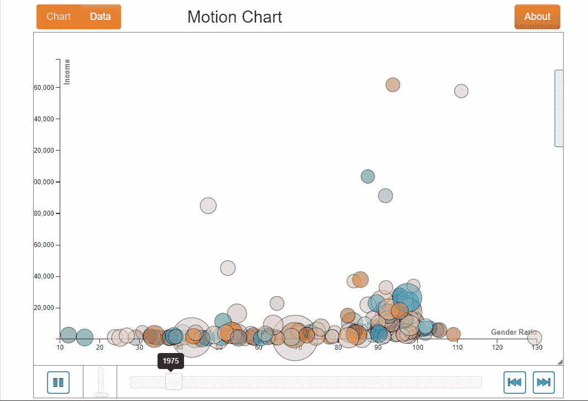
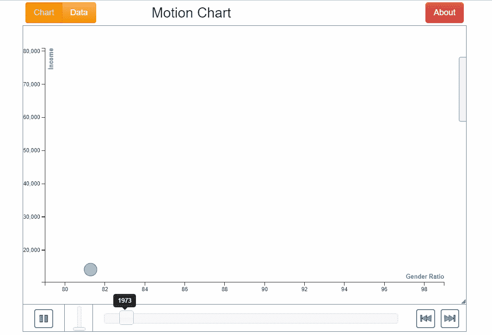

# Python 中探索性数据分析的图形化方法

> 原文：<https://towardsdatascience.com/graphical-approach-to-exploratory-data-analysis-in-python-be4fa005a57f?source=collection_archive---------32----------------------->

## 调查新加坡、美国和中国的人口、教育和收入方面的性别平等


[杰克·芬尼根](https://unsplash.com/@jackofallstreets?utm_source=medium&utm_medium=referral)在 [Unsplash](https://unsplash.com?utm_source=medium&utm_medium=referral) 上的照片

探索性数据分析(EDA)是每个数据科学或数据分析问题中最重要的方面之一。它让我们更好地理解我们的数据，并有可能揭示对我们来说不那么明显的隐藏见解。我在 Medium 上写的第一篇文章也是关于在 R 中执行 EDA 的，你可以在这里查看。本帖将更多关注 Python 中使用 matplotlib、回归线甚至运动图的图形化 EDA！

# 资料组

我们在本文中使用的数据集可以从 [Gapminder](https://www.gapminder.org/data/) 获得，并深入到*人口、教育中的性别平等*和*收入。*

*人口*数据包含 1800 年至 2018 年间按世界各国分组的估计常住人口的年度数据。

*教育中的性别平等*数据包含 1970 年至 2015 年期间 25 至 34 岁年龄段在校女生与男生比例的年度数据，其中包括不同国家的小学、中学和大学教育

*收入*数据包含 1800 年至 2018 年期间，根据全球不同国家的购买力差异(以国际美元计)进行调整后的人均年收入数据。

# EDA 人口

让我们首先绘制一段时间内的人口数据，主要集中在新加坡、美国和中国这三个国家。我们将使用`matplotlib` 库在同一个图上绘制 3 个不同的折线图。

```
import pandas as pd
import matplotlib.pylab as plt
%matplotlib inline# read in data
population = pd.read_csv('./population.csv')# plot for the 3 countries
plt.plot(population.Year,population.Singapore,label="Singapore")
plt.plot(population.Year,population.China,label="China")
plt.plot(population.Year,population["United States"],label="United States")# add legends, labels and title
plt.legend(loc='best')
plt.xlabel('Year')
plt.ylabel('Population')
plt.title('Population Growth over time')
plt.show()
```



按作者分类的图像-新加坡、中国和美国的 Python matplotlib 人口输出

如图所示，新加坡、中国和美国这三个国家的人口值随着时间的推移而增加，尽管新加坡并不明显，因为轴是以十亿为单位，而新加坡的人口只有几百万。

现在，让我们尝试使用`linregress`拟合新加坡人口数据的线性回归线，并绘制线性拟合图。我们甚至可以尝试预测 2020 年和 2100 年的新加坡人口。

```
from scipy.stats import linregress
# set up regression line
slope, intercept, r_value, p_value, std_err = linregress(population.Year,population.Singapore)
line = [slope*xi + intercept for xi in population.Year]# plot the regression line and the linear fit
plt.plot(population.Year,line,'r-', linewidth=3,label='Linear Regression Line')
plt.scatter(population.Year, population.Singapore,label='Population of Singapore')
plt.legend(loc='best')
plt.xlabel('Year')
plt.ylabel('Population')
plt.title('Population Growth of Singapore over time')
plt.show()# Calculate correlation coefficient to see how well is the linear fit
print("The correlation coefficient is " + str(r_value))
## Use the linear fit to predict the resident population in Singapore in 2020 and 2100.
# Using equation y=mx + c, i.e. population=slope*year + intercept
print("The predicted population in Singapore in 2020 will be " + str((slope*2020)+intercept))
print("The predicted population in Singapore in 2100 will be " + str((slope*2100)+intercept))
```



按作者分类的图像-新加坡人口线性回归线的 Python matplotlib 输出

从图中我们可以看出，线性拟合似乎不太适合新加坡的人口，尽管我们的相关系数接近 1。对人口的预测也很不错，因为 2020 年新加坡的现有人口约为 560 万，远远高于预测的 340 万。

注意，19 世纪 50 年代以前的人口是负数，这是绝对不可能的。因为新加坡是 1965 年建立的，所以让我们过滤一下，只使用 1965 年以后的数据。

```
from scipy.stats import linregress
# set up regression line
slope, intercept, r_value, p_value, std_err = linregress(population.Year[population.Year>=1965],population.Singapore[population.Year>=1965])
line = [slope*xi + intercept for xi in population.Year[population.Year>=1965]]plt.plot(population.Year[population.Year>=1965],line,'r-', linewidth=3,label='Linear Regression Line')
plt.scatter(population.Year[population.Year>=1965], population.Singapore[population.Year>=1965],label='Singapore')
plt.legend(loc='best')
plt.xlabel('Year')
plt.ylabel('Population')
plt.title('Population Growth of Singapore from 1965 onwards')
plt.show()# Calculate correlation coefficient to see how well is the linear fit
print("The correlation coefficient is " + str(r_value))
## Use the linear fit to predict the resident population in Singapore in 2020 and 2100.
# Using equation y=mx + c, i.e. population=slope*year + intercept
print("The predicted population in Singapore in 2020 will be " + str((slope*2020)+intercept))
print("The predicted population in Singapore in 2100 will be " + str((slope*2100)+intercept))
```



按作者分类的图像-1965 年以来新加坡人口线性回归线的 Python matplotlib 输出

如图所示，这条线性回归线与相关系数非常吻合。此外，预测的 2020 年人口正好是新加坡目前的人口，让我们希望 2100 年的人口不是真的，因为我们知道新加坡的土地面积相当小。

# EDA 关于教育中的性别平等

转到第二个数据集，让我们试着绘制一段时间内新加坡、中国和美国学校的性别比例(女性对男性)图。我们还可以看看新加坡的最高和最低性别比例百分比。

```
# reading in data
gender_equality = pd.read_csv('./GenderEquality.csv')
# plot the graphs
plt.plot(gender_equality.Year,gender_equality.Singapore,label="Singapore")
plt.plot(gender_equality.Year,gender_equality.China,label="China")
plt.plot(gender_equality.Year,gender_equality["United States"],label="United States")# set up legends, labels and title
plt.legend(loc='best')
plt.xlabel('Year')
plt.ylabel('Gender Ratio of Female to Male in school')
plt.title('Gender Ratio of Female to Male in school over time')
plt.show()# What are the maximum and minimum values for gender ratio in Singapore over the time period?
print("The maximum value is: " + str(max(gender_equality.Singapore)) + " and the minimum is " 
      + str(min(gender_equality.Singapore)))
```



按作者分类的图片-一段时间内新加坡、中国和美国的性别比例的 Python matplotlib 输出

从上面的产出可以看出，性别比率总体上是随着时间的推移而增加的。随着时间的推移，中国和新加坡的性别比例呈线性增长。就美国而言，在性别比率再次上升之前，有一段时间处于停滞状态。新加坡的最低性别比率为 79.5，最高性别比率为 98.9，这是意料之中的，因为过去新加坡的教育对男性比对女性重要得多。

让我们画出新加坡性别比例的线性回归线。

```
# plot the regression line
slope, intercept, r_value, p_value, std_err = linregress(gender_equality.Year,gender_equality["Singapore"])
line = [slope*xi + intercept for xi in gender_equality.Year]plt.plot(gender_equality.Year,line,'r-', linewidth=3,label='Linear Regression Line')
plt.plot(gender_equality.Year, gender_equality["Singapore"],label='Singapore')
plt.legend(loc='best')
plt.xlabel('Year')
plt.ylabel('Gender Ratio of Female to Male in school')
plt.title('Gender Ratio of Female to Male in school for Singapore over time')
plt.show()
print("The correlation coefficient is " + str(r_value))
```



按作者分类的图像-新加坡性别比例线性回归线的 Python matplotlib 输出

相关系数表明这是一个很好的匹配，性别比例在未来可能达到 100%。这是有可能的，因为在新加坡，教育不再是一种特权，男性和女性在接受正规教育方面有平等的机会。

# 收入 EDA

最后让我们转向收入数据，绘制新加坡、美国和中国的收入随时间变化的曲线图。

```
# read in data
income = pd.read_csv('./Income.csv')
# plot the graphs
plt.plot(income.Year,income.Australia,label="Singapore")
plt.plot(income.Year,income.China,label="China")
plt.plot(income.Year,income["United States"],label="United States")
# set up legends, labels, title
plt.legend(loc='best')
plt.xlabel('Year')
plt.ylabel('Income per person')
plt.title('Income per person over time')
plt.show()
```



按作者分类的图片-新加坡、中国和美国一段时间内的收入 Python matplotlib 输出

令人惊讶的是，新加坡的人均收入与美国相当，都在中国之上。

# 动作图——可视化随时间变化的关系

现在，让我们试着构建一个运动图，来可视化所有三个因素*人口*、*性别比例*和*收入*随时间的变化关系。为了用 Python 构建运动图，我们需要`motionchart`库。

在此之前，我们需要将所有三个数据集合并成一个单一的，以方便绘制我们的运动图表。可以使用常见的 pandas 命令来完成合并。

```
# Convert columns into rows for each data set based on country and population/gender ratio/income
population=pd.melt(population,id_vars=['Year'],var_name='Country',value_name='Population')
gender_equality=pd.melt(gender_equality,id_vars=['Year'],var_name='Country',value_name='Gender Ratio')# Merge the 3 datasets into one on common year and country
income=pd.melt(income,id_vars=['Year'],var_name='Country',value_name='Income')
overall=pd.merge(population,gender_equality,how="inner",on=["Year","Country"])
overall=pd.merge(overall,income,how="inner",on=["Year","Country"])
```

为了可视化随时间变化的关系，我们需要将 *Year* 属性设置为运动图中的关键字。我们的 x 轴将是*性别比例*，y 轴是*收入*，气泡大小为*人口*，最后是*国家*的气泡颜色。

```
from motionchart.motionchart import MotionChart# setting up the style
%%html
<style>
.output_wrapper, .output {
    height:auto !important;
    max-height:1000px; 
}
.output_scroll {
    box-shadow:none !important;
    webkit-box-shadow:none !important;
}
</style># plotting the motion chart
mChart = MotionChart(df = overall)
mChart = MotionChart(df = overall, key='Year', x='Gender Ratio', y='Income', xscale='linear'
                     , yscale='linear',size='Population', color='Country', category='Country')
mChart.to_notebook()
```



作者图片 Python 中运动图表的 GIF 输出

如果我们研究这个图表，我们知道阿富汗和也门的教育性别比例最低，分别为 23.7 和 30.1。南非的莱索托拥有最高的性别比例(注意右下角的粉红色小点)。

收入和教育中的性别比例之间通常没有明确的关系。在整个时期，由于所有国家的性别比率普遍上升，收入并没有随之增加，也没有减少。有停滞、增加和减少的组合，这与性别比率没有任何明显的关系。

让我们专注于为新加坡建立一个运动图表。

```
mChart = MotionChart(df = overall.loc[overall.Country.isin(['Singapore'])])
mChart = MotionChart(df = overall.loc[overall.Country.isin(['Singapore'])], key='Year', x='Gender Ratio', 
y='Income', xscale='linear', yscale='linear',size='Population', color='Country', category='Country')
mChart.to_notebook()
```



作者提供的图片 Python 中新加坡运动图表的 GIF 输出

对新加坡来说，有趣的是，除了人口随着时间的推移而增长，教育中的性别比例以及收入似乎也随着时间的推移而不断增长。1970 年收入 11400，2015 年大幅增长到 80900。

# 摘要

在本文中，我们利用 Python matplotlib、线性回归以及富于想象力的运动图表对三个数据集进行探索性数据分析，主要是人口、教育中的性别比例和收入。通过这些图形方法，我们可以发现一些关于数据的见解，并有可能让我们做出更好的预测。希望你们喜欢这种用 Python 进行探索性数据分析的图形化方法，并喜欢玩你们奇特的运动图表！

[](https://www.buymeacoffee.com/tankahwang)